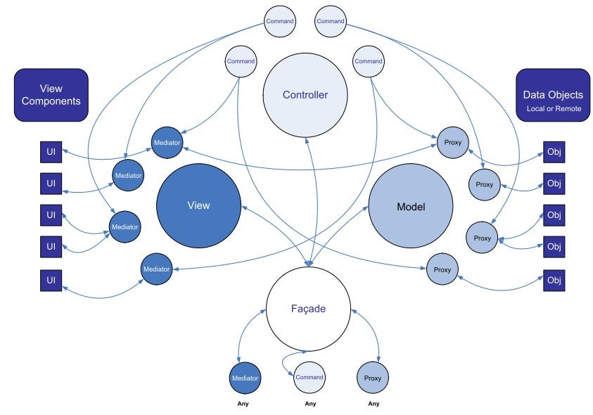

---

第一次聽到 PureMVC 的時候大概是兩年前，那時候就對這套 MVC Framework 很感興趣，不過當時對於它的架構是有看沒有懂，就一直拖到了現在。

最近因為工作需要用到的關係，所以又再次學習它，經過閱覽無數前輩分享的文章之後，終於初步了解它的運作模式了，因此分享這邊學習心得筆記。

**什麼是 MVC ?**

一個設計方法（Design pattern 也稱設計模式）。

想初步了解的朋友可以參考 [維基百科的說明](http://zh.wikipedia.org/wiki/MVC) 。

網路也有許多相關文章，大略內容就是將程式開發架構分為 Model、View 和 Controller 三個部份的開發方式，建議可以閱讀 [深入淺出設計模式](http://findbook.tw/book/9789867794529/basic) 這本書。

**什麼是 PureMVC ?**

一個跨多語言的 MVC Framework，其中我們要用到的是 Actionscript 3.0 版本，這是他們的 [官方網站](http://puremvc.org/) 。

下圖是他的架構圖，除了 MVC 外，它也用到不少其他 design pattern，第一次看可能會霧煞煞，沒關係，我們下面慢慢介紹。



Facade 可以看做是 MVC 之間的共同溝通管道，可以減少程式之間的耦合。

Command 就是扮演 Controller 的角色，PureMVC 寫出來的程式通常都會是以傳送(send)通知(Notification)的方式在進行動作，而 Command 就是負責執行它收到的通知所需要做的事情。

Proxy 從字面上看就是 Model 的代理者，不管是 C 還是 V 要取得使用資料，都必須經過它，這樣的好處是增加後端資料的可抽換性。

Mediator 可以看做是統一視覺元件的介面，透過它更新或取得視覺元件的狀態。

OK，大致上說明了 PureMVC 的概念之後，我們開始撰寫第一個程式吧，我參考了 [邦邦的部落格-初探pureMVC這篇文章](http://blog.ben.idv.tw/2009/08/puremvc.html) ，淺而易懂，是一個簡單的搜尋小程式。

**配置 PureMVC 環境** :

這裡我們使用 FlashDevelop 這套好用的免費軟體來開發， [下載FlashDevelop](http://www.flashdevelop.org/community/viewforum.php?f=11) 。

接下來到 PureMVC 的網站， [下載 PureMVC 的 library](http://puremvc.org/) 。

下載完可以看到 bin 資料夾裡面有個 swc 檔，待會要用的到它。

**建立 Project** :

安裝並開啟FlashDevelop，開啟新專案。

這裡我們選擇 AS3 Project 來開發。

專案建立完後的架構如下，之後新增的 as 檔都放在 src 資料夾下。

將剛剛下載的 swc 檔放到專案的 lib 資料夾底下。

然後右鍵加入 Library，這布記得要做唷，不然無法使用 PureMVC 的 API。

**開始 Coding** :

這個程式會有以下四種 Notification (通知) :

* STARTUP — 程式啟動
* INITED — 程式初始化結束
* SEARCH — 搜尋資料
* RESULT — 搜尋結果

還有三個視覺元件 :

* searchTxt — 搜尋字串的輸入欄位
* searchBtn — 送出搜尋字串的按鈕
* resultTxt — 顯示搜尋結果的欄位

一開始我們先寫把 Model 的部分，這個 class 主要負責提供搜尋所需的資料，為了簡化學習，我們只回傳一字串 “ XXX Hello PureMVC! “。

**DataProxy.as** :

```java
package puremvc.model
{
    import org.puremvc.as3.interfaces.IProxy;
    import org.puremvc.as3.patterns.proxy.Proxy;
    
    import puremvc.ApplicationFacade;
    
    /**
     * DataProxy
     * 
     * 儲存資料的 Model
     */
    public class DataProxy extends Proxy implements IProxy
    {
        static public const PROXY_NAME:String = "DataProxy";
        
        public function DataProxy() 
        {
            super(PROXY_NAME, "");
        }
        
        public function search(query:String):void {
            // 提供外部使用的搜尋 Method.
            // 此方法並未真正實作任何搜尋程式.
            // 暫時以 query + " Hello PureMVC!" 作為搜尋結果.
            
            var result:String = query + " Hello PureMVC!";
            
            var body:Object = { };
            body["result"] = result;
            
            // 將結果包裝成 body["result"] 後傳送 NOTIFICATION_RESULT 通知
            this.facade.sendNotification(ApplicationFacade.NOTIFICATION_RESULT, body);
        }
        
    }

}
```

再來我們寫 View 的部分，MainMediator 主要負責接收 INITED 跟 RESULT 這兩個通知。

INITED 代表程式初始化結束，當初始化結束的通知發出後，MainMediator 就會需要偵聽事件的視覺元件加入偵聽。

RESULT 代表搜尋結果，當這個通知發出後，MainMediator 會將搜尋結果顯示到 resultTxt 這個 TextField元件上。

**MainMediator.as** :

```java
package puremvc.view
{
    import flash.events.MouseEvent;
    
    import org.puremvc.as3.interfaces.IMediator;
    import org.puremvc.as3.interfaces.INotification;
    import org.puremvc.as3.patterns.mediator.Mediator;
    
    import puremvc.ApplicationFacade;
    
    /**
     * MainMediator
     * 
     * 主程式視覺介面
     */
    public class MainMediator extends Mediator implements IMediator
    {
        static private const MEDIATOR_NAME:String = "MainMediator";
        
        public function MainMediator(viewComponent:Object = null) 
        {
            super(MEDIATOR_NAME, viewComponent);
        }
        
        override public function listNotificationInterests():Array {
            // 此 Mediator 關注哪幾個 NOTIFICATION
            return [
                ApplicationFacade.NOTIFICATION_INITED,
                ApplicationFacade.NOTIFICATION_RESULT
            ];
        }
        
        override public function handleNotification(notification:INotification):void {
            // 當各 NOTIFICATION 產生通知時的動作
            switch(notification.getName())
            {
                case ApplicationFacade.NOTIFICATION_INITED:
                    onInitedNotify(notification);
                    break;
                case ApplicationFacade.NOTIFICATION_RESULT:
                    onResultNotify(notification);
                    break;
            }
        }
        
        private function onInitedNotify(notification:INotification):void {
            // 當主程式初始化結束的動作
            setListener(true);
        }
        
        private function get app():Main {
            return Main(this.viewComponent);
        }
        
        private function onResultNotify(notification:INotification):void {
            // 將取得的 body["result"] 值顯示在 resultTxt 上
            app.resultTxt.text = notification.getBody()["result"];
        }
        
        private function setListener(boolean:Boolean = false):void {
            // 設定是否偵聽 searchBtn Click 事件
            if (boolean)
            {
                app.searchBtn.addEventListener(MouseEvent.CLICK, onSearchBtnClick);
            }else {
                app.searchBtn.removeEventListener(MouseEvent.CLICK, onSearchBtnClick);
            }
        }
        
        private function onSearchBtnClick(e:MouseEvent):void {
            // 將 searchTxt 的值包裝成 body["keyword"] 後發送 NOTIFICATION_SEARCH 的通知
            var body:Object = { };
            body["keyword"] = app.searchTxt.text;
            
            this.facade.sendNotification(ApplicationFacade.NOTIFICATION_SEARCH, body);
        }
        
    }

}
```

接下來我們開始寫需要用到的 Command，這裡我們先寫負責處理 SEARCH 通知的 SearchCommand。

**SearchCommand.as** :

```java
package puremvc.controller
{
    import org.puremvc.as3.interfaces.ICommand;
    import org.puremvc.as3.interfaces.INotification;
    import org.puremvc.as3.patterns.command.SimpleCommand;
    
    import puremvc.model.DataProxy;
    
    /**
     * SearchCommand
     * 
     * 接到搜尋通知後要做的事.
     */
    public class SearchCommand extends SimpleCommand implements ICommand
    {
        
        public function SearchCommand() 
        {
            super();
        }
        
        override public function execute(notification:INotification):void {
            // 向 MainMediator 取得 body["keyword"] 對映的元件的值
            var query:String = notification.getBody()["keyword"];
            
            search(query);
        }
        
        private function search(query:String):void {
            // 將要搜尋的值傳給 DataProxy 提供的 search Method
            var dataProxy:DataProxy = DataProxy(this.facade.retrieveProxy(DataProxy.PROXY_NAME));
            dataProxy.search(query);
        }
        
    }

}
```

再來是程式啟動 STARTUP 的 StartupCommand。

**StartupCommand.as** :

```java
package puremvc.controller
{
    import org.puremvc.as3.interfaces.ICommand;
    import org.puremvc.as3.interfaces.INotification;
    import org.puremvc.as3.patterns.command.SimpleCommand;
    
    import puremvc.ApplicationFacade;
    import puremvc.model.DataProxy;
    import puremvc.view.MainMediator;
    
    /**
     * StartupCommand
     * 
     * 程式啟動時需要做的事情
     */
    public class StartupCommand extends SimpleCommand implements ICommand
    {
        
        public function StartupCommand() 
        {
            super();
        }
        
        override public function execute(notification:INotification):void {
            // 註冊 Model DataProxy
            this.facade.registerProxy(new DataProxy());
            
            // 註冊 View MainMediator
            var app:Main = Main(notification.getBody());
            this.facade.registerMediator(new MainMediator(app));
            
            // 註冊接下來會用到的 Controller Command 
            this.facade.registerCommand(ApplicationFacade.NOTIFICATION_SEARCH, SearchCommand);
            
            // 通知初始化結束
            this.facade.sendNotification(ApplicationFacade.NOTIFICATION_INITED);
        }
        
    }

}
```

快結束了! 再來把程式的核心，ApplicationFacade 給完成就差不多了。

**ApplicationFacade.as** :

```java
package puremvc
{
    import org.puremvc.as3.interfaces.IFacade;
    import org.puremvc.as3.patterns.facade.Facade;
    
    import puremvc.controller.StartupCommand;
    
    /**
     * ApplicationFacade
     * 
     * 所有程式之間唯一的溝通橋樑.
     * 使用到 Facade 和 Singleton 設計模式.
     */
    public class ApplicationFacade extends Facade implements IFacade
    {
        // 所有此程式會用到的列舉狀態
        // - NOTIFICATION_STARTUP 程式啟動
        // - NOTIFICATION_INITED  程式初始化結束
        // - NOTIFICATION_SEARCH  發出搜尋的請求
        // - NOTIFICATION_RESULT  產生結果的通知
        
        static public const NOTIFICATION_STARTUP:String = "NOTIFICATION_STARTUP";        
        static public const NOTIFICATION_INITED:String = "NOTIFICATION_INITED";        
        static public const NOTIFICATION_SEARCH:String = "NOTIFICATION_SEARCH";
        static public const NOTIFICATION_RESULT:String = "NOTIFICATION_RESULT";
        
        static public function getInstance():ApplicationFacade {
            if (instance == null) instance = new ApplicationFacade();
            return ApplicationFacade(instance);
        }
        
        override protected function initializeController():void {
            super.initializeController();
            
            // 當 ApplicationFacade 被第一次呼叫的時候
            // 會執行這個 initializeController()
            // 所以在這裡我們註冊 NOTIFICATION_STARTUP 這個啟動 Command
            
            this.registerCommand(NOTIFICATION_STARTUP, StartupCommand);
        }
        
        /**
         * startup
         * 
         * 程式啟動.
         * 
         * @param    app 主程式
         */
        public function startup(app:Main):void {            
            this.sendNotification(NOTIFICATION_STARTUP, app);
        }        
    }
}
```

最後，將用到的視覺元件加一加，然後寫上一行 `ApplicationFacade.getInstance().startup(this)` 就可以收工囉!!!

**Main.as** :

```java
package 
{
    import flash.display.SimpleButton;
    import flash.display.Sprite;
    import flash.text.TextField;
    import flash.text.TextFieldType;
    import flash.events.Event;
    
    import puremvc.ApplicationFacade;
    
    /**
     * Main
     * 
     * 使用 PureMVC 來實作一個簡單的搜尋小程式.
     */
    public class Main extends Sprite 
    {
        public function Main():void 
        {
            if (stage) init();
            else addEventListener(Event.ADDED_TO_STAGE, init);
        }
        
        private function init(e:Event = null):void 
        {
            removeEventListener(Event.ADDED_TO_STAGE, init);
            
            // entry point
            
            initComponents();
            
            // pureMVC 的進入點.
            // 使用唯一的 ApplicationFacade class 作為入口.
            // 之後所有的元件之間溝通都需要經過此 facade.
            ApplicationFacade.getInstance().startup(this);
        }
        
        public var searchTxt:TextField;
        public var searchBtn:SimpleButton;
        public var resultTxt:TextField;
        
        private function initComponents():void {
            // 初始化視覺元件(ViewCompoents)
            
            // searchTxt
            searchTxt = new TextField();
            searchTxt.type = TextFieldType.INPUT;
            searchTxt.border = true;
            searchTxt.x = 50;
            searchTxt.y = 50;
            searchTxt.width = 200;
            searchTxt.height = 20;
            this.addChild(searchTxt);
            
            // searchBtn
            var buttonStyle:Sprite = new Sprite();
            buttonStyle.graphics.beginFill(0xcccccc);
            buttonStyle.graphics.drawRect(0, 0, 100, 20);
            buttonStyle.graphics.endFill();
            
            var buttonTxt:TextField = new TextField();
            buttonTxt.text = "Search Button";
            buttonTxt.width = 100;
            buttonTxt.height = 20;            
            buttonStyle.addChild(buttonTxt);
            
            searchBtn = new SimpleButton(buttonStyle, buttonStyle, buttonStyle, buttonStyle);
            searchBtn.x = 260;
            searchBtn.y = 50;
            this.addChild(searchBtn);
            
            // resultTxt
            resultTxt = new TextField();
            resultTxt.type = TextFieldType.DYNAMIC;
            resultTxt.border = true;
            resultTxt.x = 50;
            resultTxt.y = 80;
            resultTxt.width = 200;
            resultTxt.height = 200;
            this.addChild(resultTxt);
            
        }
        
    }
    
}
```

以上是我初步學習 PureMVC 後的心得，更進階一點的介紹可以參考官方的 Best Practice 或更多相關文章。

範例原始檔：

* [MyFirstPureMVC.rar](https://sites.google.com/site/amo26site/download/MyFirstPureMVC.rar?attredirects=0&d=1)

參考文章：

* [邦邦的部落格 — 初探 pureMVC](http://blog.ben.idv.tw/2009/08/puremvc.html)
* [Erin’s Blog — PureMVC 我也會系列](http://erinylin.blogspot.com/2011_03_01_archive.html)
