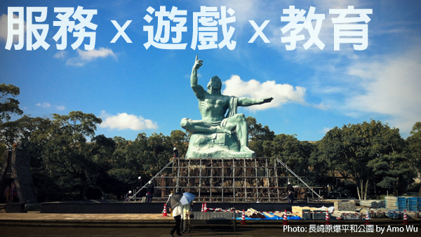
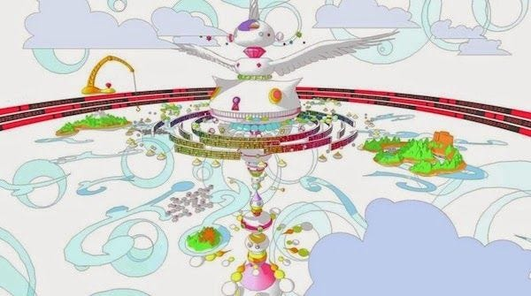
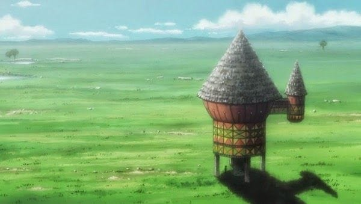
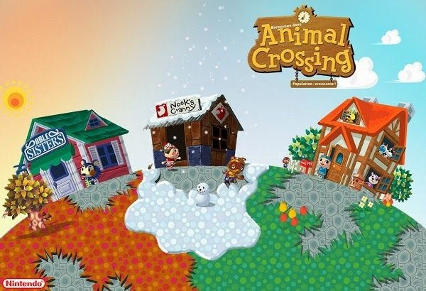
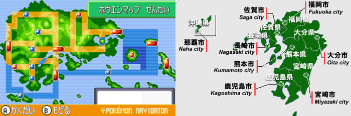
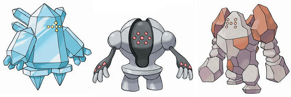

---

進入遊戲業兩年多了，但網誌上跟遊戲相關的文章卻很少，所以在截稿前夕，就來寫一篇跟遊戲有關的文章吧！

雖然這兩年間學到不少遊戲開發的相關知識，但這篇不寫技術，這篇純粹想聊聊「自己想做的遊戲」。

每位遊戲開發者一定都會有自己想做的遊戲，但絕對不會是目前你工作上的這款(笑)，雖然嚮往成為獨立遊戲開發者，但看過 [半路叛逃](https://blog.amowu.com/posts/2012-10-03-monkey-potion/) 的分享後瞭解，獨立開發遊戲並不容易，儘管如此，還是想分享自己心中的那一款**完美遊戲**。

簡單來講，有三個要素：

* 遊戲
* 生活服務
* 教育

遊戲？生活服務？教育？在仔細解釋前，先介紹幾款遊戲給大家認識：

* OZ
* Greed Island
* 動物之森
* 神奇寶貝

### OZ

OZ 是在日本動畫 [夏日大作戰](http://zh.wikipedia.org/wiki/%E5%A4%8F%E6%97%A5%E5%A4%A7%E4%BD%9C%E6%88%B0) （2009）中的一個虛擬世界社交網站。

> 「OZ」與[第二人生](http://zh.wikipedia.org/wiki/%E7%AC%AC%E4%BA%8C%E4%BA%BA%E7%94%9F)概念相似，但依照自己的經驗來講「OZ」應該更接近日本社交網站mixi的想法。

> 由於「OZ」系統與現實世界之間有著極高的整合度，來自世界各地的許多企業與政府組織都於此設有部門來進行互動，這使得在作為虛擬世界的「OZ」混亂也陸陸續續影響到真實世界的生活。

雖然是虛構的故事，但 OZ 中有幾個特色還蠻有趣的：

* OZ 世界中擁有 10 億人口（比 Facebook 多 1 億），幾乎是每個人都有一組帳號
* Client 端有 PC，手機，TV 等，與近年來跨平台特性一致
* 行政進駐，遊戲世界可以與**現實服務**做連結，例如：納稅，防災
* 企業進駐，直接在遊戲中的商城購物，也是一個與**現實服務**連結的商務平台
* 即時翻譯多國語言，這個感覺[快實現](http://www.techbang.com/posts/14214-general-translation-function-for-google-to-be-the-future-babel-fish)了

其中行政與企業這塊，就是我上面提到的**遊戲**結合**生活服務**，近年網路服務也逐漸往資料開放（API）的方向發展，要在遊戲世界中實現這些服務已經不是夢想。

### Greed Island

> [貪婪之島](http://zh.wikipedia.org/wiki/%E8%B2%AA%E5%A9%AA%E4%B9%8B%E5%B3%B6) 是日本漫畫《[Hunter × Hunter](http://zh.wikipedia.org/wiki/Hunter_%C3%97_Hunter)》中的一個虛擬遊戲。

這是一個把現實世界當作遊戲的一個概念，遊戲中的角色，道具，事件都是用漫畫中的「念」製作出來的，當然，我們不可能用念能力來製作遊戲（笑），不過其實也可以把它看作 [擴增實境(AR)](http://zh.wikipedia.org/wiki/%E6%93%B4%E5%A2%9E%E5%AF%A6%E5%A2%83) 的延伸應用，貪婪之島最令我著迷的概念就是，「只要照著遊戲循序漸進，玩家本身就會得到成長」，與我的座右銘「最有趣好玩的RPG，就是自己的人生」相呼應，是理想中的「充滿遊戲的現實世界」。

### 動物之森

這款就比較正常一點了，是由日本任天堂製作，我把它定義為治癒型輕鬆生活遊戲。

> 這是個沒有固定劇情的開放遊戲，玩家可以在裡面獨自生活，不受預設的劇情、任務限制，許多人（小孩子或成人）享受這樣與有趣動物角色”對話”的遊玩樂趣。透過使用電玩主機的內部時鐘，這個遊戲可與真實時間相對映，因此有著實際的事件發生。

這款遊戲最早從超任時代就有了，一直到現在的 Wii，3DS，都還是熱門保證的暢銷遊戲，我自己是從 NDS 版開始接觸，可以把它想像成自由度很高的「牧場物語」，基本上遊戲沒有你需要完成的任務，不用打怪升級，只需要跟村民聊聊天，佈置房間，種花草，抓蟲鳥，然後收藏在博物館，很悠閒的一款遊戲，跟大部分遊戲比較不同的，也是我很喜歡的一個系統，就是與**現實時間**同步，清晨到夜晚，春夏秋冬，都跟現實世界同步，特定日期還會有事件，例如聖誕節，所以每天都會滿懷期待的開啟遊戲，進入這個可愛的動物世界，雖然有下雨下雪這類天氣效果，但這個就不會跟現實世界同步了（雖然技術是做得到），總之，這是一款沒有壓力的遊戲，我很想做出這樣的遊戲！

### 神奇寶貝

上面才說到我想做輕鬆沒壓力的遊戲，結果這邊就要介紹這款要花大量時間培養寵物，練功破關的遊戲（笑）。

和一般人不同，這應該是我第一款接觸的 RPG 遊戲（國小六年級），讓我深深著迷，廣大的世界冒險，豐富的神奇寶貝，平衡的遊戲架構，與現實玩家的交流互動，都是這款遊戲迷人的特色。

不過，我提出這款遊戲想聊的不是上述這些，我想分享的是，這系列遊戲**背後設計的世界觀**。神奇寶貝的遊戲世界，其實都是參照現實某個地區的地圖來做參考的。

以上圖為例，右邊是日本九州的地圖，左邊是 [神奇寶貝紅寶石](http://zh.wikipedia.org/zh-tw/%E7%A5%9E%E5%A5%87%E5%AF%B6%E8%B2%9D_%E7%B4%85%E5%AF%B6%E7%9F%B3%C2%B7%E8%97%8D%E5%AF%B6%E7%9F%B3)的地圖，基本上就是把九州往左轉90°。 當然不純粹是只有地圖參考這樣而已，對應的地點也會根據現實該地方特色，埋一些伏筆在遊戲劇情裡面，以巴哈姆特玩家分享的 [這篇文章](http://forum.gamer.com.tw/Co.php?bsn=01647&sn=300144)來舉例，遊戲中有三隻神獸，長的很像原子彈，而且三隻神獸都能學習到「爆炸」這個絕技，然後呢？有趣的是，把這三隻神獸在遊戲中出現的地點與九州地圖做對照，可以發現分別出現在「長崎」，「宮崎」和「大分」，這三個地方是第二次世界大戰中，發生過大規模空襲的地點！這種**藉由從玩遊戲來學習知識**的概念我非常喜歡（好想以台灣為背景做一款遊戲啊）。

### 所以，我想要做怎樣的遊戲呢？

上面講的漏漏長，所以我到底想做怎樣的遊戲呢？老實講，我還沒有一個具體的架構和想法，但上面提到的遊戲中，都有我很欣賞，很想實現的概念在裡面：

* OZ：深度整合行政＋企業的服務在遊戲中
* 貪婪之島：玩遊戲的過程中，玩家本身也會得到成長
* 動物之森：與現實時間同步，沒有壓力的治愈系遊戲
* 神奇寶貝：藉由遊戲設計，讓玩家學習知識

再回到開頭提到的，我想做的遊戲三大元素「生活服務」，「遊戲」和「教育」：

### 生活服務

與其說我想做遊戲，不如說我比較想做服務，一款提供現實世界服務的遊戲，可以在遊戲世界中看YouTube（電視），在遊戲中收發mail（信箱），在遊戲中閱讀RSS（報紙），在遊戲中購買 amazon（購物）等，近年來越來越多的網路服務都走向多螢一雲，跨平台的方向，也都有提供 API 讓開發者應用，節省許多自行研發的成本，加入這些元素有助於玩遊戲同時，也能得到現實的回饋。

### 遊戲

[Gamification](https://www.blogger.com/blogger.g?blogID=696354394590316778) 這個詞最近很紅：

> Gamification（遊戲化），網站開發者認為遊戲化是現代的一個趨勢，遊戲化就是把遊戲的元素注入生活，是要讓生活更有趣，以及讓大家打破對遊戲的刻板想法，就像是以前玩遊戲比較偏向逃避現實，但是現在遊戲把虛擬的世界帶到現實，像是最近的電影阿凡達，LBS程式Foursquare，都是把我們跟以往認為是虛擬的東西跟現實連接。

乍看之下好像跟上面的生活服務是一樣的，差異是一個是「遊戲中結合服務應用」，一個是「服務中加入遊戲元素」。

而我真正想要表達的，是結合這兩者，一款可以讓你**得到現實成就與回饋的遊戲**，在遊戲中完成的每個事件，得到的每件獎勵，都是跟現實有連結的，不會只是一般打寶打怪升級這種一時的空虛快感。

### 教育

最後是教育，遊戲的開發在技術上來講絕對不會比其他領域來的輕鬆簡單，但是遊戲卻往往給人不務正業的觀念，尤其台灣大部份的遊戲就更別提了(看看那些電視上播的廣告)，想抬起胸膛跟親朋好友說我的工作是在製作遊戲都有點困難，加上近年來手機平板普及，開發遊戲門檻降低，雖然對我們來講是好事，但同時也降低遊戲品質，沒有內容的遊戲充斥市面，重點是還賺大錢，這樣還有誰會想專注在遊戲內涵的思考？所以我常常在想，如果我自己要做一款遊戲，我會想從給小朋友玩的遊戲開始做，想想童年那些美好的回憶，那是段最單純看待遊戲的時期，不論是在遊戲中也好，現實中也是，教育一直都是很重要的課題之一，如果一款遊戲能讓我們的孩子學習到有用的知識，不但小朋友們玩的快樂又有成就，父母親也肯掏錢投資在孩子的**教育競爭**上。

### 結語

以上，聊了一大串外加一些小抱怨，雖然看似過於理想，但相似概念的遊戲一直都陸陸續續出現，現階段的我當然不可能把這個目標實現，只有持續關注遊戲的發展，不斷充實自己，收集所需的相關資料，當機會來臨的那一刻，才有能力好好把握住，感謝看完這篇文章的您，在此共勉之，加油！

### 參考文章

* [Gamification：遊戲化的未來](http://www.inside.com.tw/2011/01/19/gamification-future)
