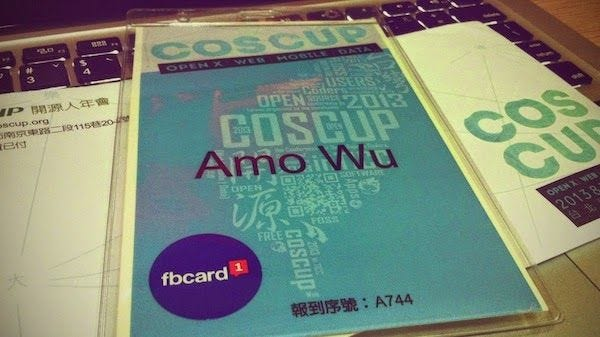
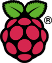

---

今年是第二次參加[開源人年度聚會 COSCUP](http://coscup.org/)，很幸運的在 47 秒內搶到限量 500 張的門票，和[去年](https://blog.amowu.com/2012/08/coscup-2012.html)比較不一樣的地方：

* 場地從[中研院](http://hssb.committee.sinica.edu.tw/)換到[國際會議中心](http://www.ticc.com.tw/)，應該是因為人數的關係，不過我猜 TICC 沒有下次了(笑)，期待明年的小巨蛋(誤)。
* 八軌議程，同個時段最多有八場演講可以選擇！

分享一些這兩天簡單的筆記。

### DAY 1

第一天有點小遲到，好險大會準備的 NFC 識別證快速通關，加上場地夠大，還很多位置可以坐。

### Open Data Initiatives for Taiwan

一開始開場是由 行政院政務委員 [張善政](http://zh.wikipedia.org/wiki/%E5%BC%B5%E5%96%84%E6%94%BF) 演講，主要是聊一些台灣政府目前 Open Data 的情況，認識了兩個網站：

* [data.gov.tw](http://data.gov.tw/)
* [g0v.tw](http://g0v.tw/)

前者是政府的資料開放平台，後者是最近很紅的「寫程式改造社會」零時政府。

### 座談會：Open Data 面面觀

> [莊庭瑞](http://www.iis.sinica.edu.tw/~trc/public/)：政府 open data 才有機會知道資料是錯的，如果不公開，永遠沒有人會發現資料有錯。

### Open Source Engine powering Big Data in the Cloud

完全聽不懂（失落），不過外國人念 Hadoop 聽起來好像在念 [ぱるる](https://www.google.com.tw/search?q=%E3%81%B1%E3%82%8B%E3%82%8B)。

### 開源硬體有什麼意義?

> Facebook 的 OCP (Open Compute Project) 讓很多人開始對 Open Source Hardware 抱有憧憬，認為可以像 Open Source Software 一樣，激盪出很多新的設計和發明。事實上是這樣的嗎？

Open Software VS Open Hardware

* 擴充成本，硬體比軟體還高很多。
* 軟體語言本質一樣，易學，硬體相反。
* 軟體易模組化

OCP (Open Compute Project)

* 只公開規格，沒開源。
* 規格只適合大用戶。

最後講者 [Ben](https://www.facebook.com/ben.jai) 介紹自家開發的服務 [Evdience Taiwan](http://evi.tw/)，主要是透過電話來錄音，適合報料蒐證。

### g0v.tw 零時政府：從開放源碼到開放政府

講者為零時政府創辦人 [clkao](https://twitter.com/clkao)，以 Open Source 比喻政府的觀點還蠻有趣的：

* 民主 = 接受 patch
* 立委 = committer
* 政府 = code in action
* 公民社會 = open source

在成果展示中，我最喜歡[失蹤兒少開放資料平台計畫](https://github.com/g0v/dev/wiki/Project-ChildNotFound.tw)這個點子，404 頁面與慈善公益結合。

### 當設計遇上 opensource，人人都可以是設計師

講者為 [Kamm](https://www.facebook.com/kaiyu.kamm)，主題跟設計相關，認識了一些網站跟專有名詞：

* [WikiHouse](http://www.wikihouse.cc/) — 建築設計的 open source，這超讚，離自己組小木屋的距離又更近了。
* [SketchUp](http://www.sketchup.com/) — Google 3d modding tool。
* [Rhinoceros](http://www.rhino3d.com/) — 3D modeling software。
* [Grasshopper](http://www.grasshopper3d.com/) — 搭配 Rhino 參數化建模的工具。
* [RepRap](http://zh.wikipedia.org/wiki/RepRap) — 開源的 3D 列印原型機。
* [Thingiverse](http://www.thingiverse.com/) — 3D 設計的社群。
* [CNC](https://zh.wikipedia.org/wiki/%E6%95%B0%E6%8E%A7%E6%9C%BA%E5%BA%8A) — 電腦數值控制工具機，這裡應該指大型的 3D 成型機吧。
* [Pure Data](http://zh.wikipedia.org/wiki/Pure_Data) — 不太確定，好像是 3D model 的一種格式。

### Yet another introduction to Git — from the bottom up

[ihower](http://ihower.tw/) 大大的演講，主要是講一些 Git 底層的運作原理，可是我聽不太懂 囧。

> 如果你能不用 `git add` 和 `git commit` 來 commit code，就可以不用聽這場演講了。

### App on Server: NAS 上的 App 開發與商業模式

後悔來聽這場，基本上就是在廣告 QNAP NAS 這台機器，應該去聽[騰訊的 HTML5 圖像引擎](http://alloyteam.github.io/AlloyPhoto/)或[萌典](https://www.moedict.tw/)才對。

### An intro of web scaffolding tool using yeoman generator

這場是介紹用 [Yeoman](http://yeoman.io/) 打造一個屬於自己網站的 scaffold。

### 一小時 RWD 就上手

這場的講者是最近很紅的裝置藝術師 [Even](https://www.facebook.com/evenwu) 大大，主要世界介紹一套不錯的 RWD column grid tool「[SUSY](http://susy.oddbird.net/)」。

### Build your own Trello within 200 Lines of Code

這場主要是用「[Meteor](http://www.meteor.com/)」快速開發出 [Trello](http://trello.com/) 的原型，Meteor 最大的特色應該就是 client 跟 server 都在同一份 code 裡面。
另外認識了一個很棒的共筆網站「[iCoding](http://www.icoding.co/)」。

### AngularJS 開發實戰

這場講者是 [保哥](https://www.facebook.com/will.fans)，主要是介紹 [AngularJS](http://angularjs.org/) 的核心架構，非常有幫助。

### DAY 2

前一天結束一回到家就睡死了，所以第二天比較早起，早上是一連串跟遊戲開發相關的議程，非常期待。

### 行動遊戲 App 開發與 Open Source：Kamigami 的雙平台經驗

主要是介紹講者 [笨笨的小B](https://twitter.com/littlebtc) 團隊自行開發的遊戲引擎 Kamigami 的經驗分享：

* [LibGDX](https://github.com/libgdx/libgdx) — 類似 XNA 的 Android game framework。
* [CocoaPods](http://cocoapods.org/) — iOS 套件管理。
* [Maven](http://maven.apache.org/) — Android 套件管理。
* [NuGet](http://nuget.codeplex.com/) — .Net 套件管理。
* 注意授權 License，建議只挑這幾個，BSD/MIT/Apache2/MS-PL。

### Asynchronous programming with Combinator

講者是來自神來也的女性 Server 程式設計師！ (受小弟一拜)。

> Memory leak 沒經驗的程式設計師容易漏掉，有經驗的程式設計師沒睡飽的話，也會漏掉。

### Modern Game Engine with Opens Source

講者 Owen 大大是 [Space Qube](http://acg.gamer.com.tw/acgDetail.php?s=60277) 的開發者！

主要是介紹自行研發的 LynxEngine 遊戲引擎用到哪些技術：

* Lua/LuaPlus/Mono (ScriptSystem)
* Box2D/Bullet/PhysX
* FreeImage
* Zlib
* wxWidgets
* bmFont
* FreeType

### Using Lua to Build a Component-based Architecture for Game Apps

上午場的壓軸，是 [半路](http://blog.monkeypotion.net/) 大大的演講！一大早出門忘記帶書來給他簽名了>”<。

主要是介紹用組件式開發來解決物件繼承會發生的「鑽石問題」。

* [LuaForge](http://luaforge.net/projects/)
* [LuaJIT](http://luajit.org/)
* [Corona SDK](http://www.coronalabs.com/products/corona-sdk/)

> 寫太多 magic code 的話，哪一天睡不好，就是維護你程式的人在詛咒你。

### Open Code: Why Linux’s openness enabled it to succeed where all others failed.

也是一場全英文的演講，請到 Linux kernal 開發者 Greg KH ，基本上完全聽不懂 (泣)。

與現實世界相反，程式設計的世界中，low-level 的 programmer，level 一點都不 low，low-level 不是沒人要做的事，而是能做這些事的人不多。

### DesignSpark 免費設計資源與 Raspberry Pi 新應用

講者是來自 RS Components 的香港小姐，中文講得好像有點吃力 XD，介紹了一個很棒的網站「[DesignSpark](http://www.designspark.com/)」。

### 前端工程師如何與團隊合作：以開發 Drupal 專案為例

雖然對 Drupal 沒有興趣，但想聽聽 F2E 的團隊合作心得：

* 常給 PM 建議，但決定權不在你。
* 協助 Prototype。
* 不斷溝通，持續調整
* [那些Mockup 沒告訴你的事](http://www.slideshare.net/adamp3wang/mockupwebconftw-2013)。
* F2E是良心事業。

### Raspberry PI and the future

最後一場，雖然對 RaspberryPI 有很興趣，但這場是英文。

### Lightning Talk

因為今年的閃電秀過程太精彩了，忘記筆記，所以只挑幾個我想的起來分享：

### [Registrano](http://registrano.com/)

由 hlb 大大創辦，負責本次 COSCUP 線上訂票的服務，創下 47 秒 500 張門票秒殺的紀錄。

> 「怎麼晚一分鐘就沒票了，報名網站在搞什麼」。

### [Logdown](http://logdown.com/)

最近很火的 markdown blog 服務。

### [Mr.Bus](http://mrbus.tw/)

Python 正妹。（喂 ￣▽￣)==O)￣#)3￣)☆

### 心得

今年議程非常豐富，大致上聽了：

* Game 4 場
* Open Data 3 場
* Web front-end 3 場
* Artist & Maker 3 場
* Cloud & Backend technology 2 場
* Tools & Utilities 2 場
* OS & Embedded System 1 場

本次心得：

* 最近政府議題夯，大玩黑畫面梗。
* 今年看到好多人跌倒 = =”。
* 開源精神遍及 Open Data，Open Hardware，Open Design！
* 遇上好多網路上 foloow 的大大 :D
* 可以聽到其他業界朋友談論自己公司的八卦（咦？

### 參考

* [COSCUP 2013 IRC Log](https://gist.github.com/denny0223/6150643)
* [COSCUP 2013 梗全集](https://hackpad.com/COSCUP-2013--evfJ0SJdCyQ)
* [COSCUP 2013 Wiki](http://wiki.coscup.org/mediabuzz-2013)
