---

團隊開發的網頁遊戲[《末日少女》](http://tw.new.beanfun.com/xd/www/index.html)已經上市快兩個月了，成績比當初想像中還好，相較於 [Gu Morning](http://www.gamania.com/mobilegame/gumorning/ch/index.html)，這次《末日少女》的開發學到很多寶貴的經驗，稍微鬆口氣之餘，也有許多需要檢討改善的地方，而《末日少女》Mobile 版其實也已經開發好一陣子了，最近這個專案只剩下我一個人交到我手上負責，趁這個機會導入一些新的開發方式，也 PO 上來分享心得。

### 這篇文章會講什麼？

1. HtpChat — 開發團隊的 Log 整合中心。
2. Trello — 團隊的專案管理小白板。
3. Git flow — 最佳程式開發流程。
4. Jenkins — CI(持續整合)建構工具。

### HipChat

[HipChat](https://www.hipchat.com/) 是一款跨平台團隊溝通工具，為了節省開會浪費的時間，通常會使用 [Lync](https://zh.wikipedia.org/wiki/Microsoft_Lync) 或 [Skype](https://zh.wikipedia.org/wiki/Skype) 這類通訊軟體，而 HipChat 除了該有的聊天功能，歷史查詢，附件上傳，@mentions 通知之外，最棒的是它可以整合許多服務，例如 [GitHub](https://github.com/)，[Heroku](https://www.heroku.com/)，[JIRA](https://www.atlassian.com/software/jira) 等，將所有開發上分散的訊息統一管理，方便團隊隨時瞭解狀況，而接下來這篇文章會講到如何整合 [Trello](https://www.blogger.com/blogger.g?blogID=696354394590316778)，[GitHub](https://www.blogger.com/blogger.g?blogID=696354394590316778) 和 [Jenkins](https://www.blogger.com/blogger.g?blogID=696354394590316778)。

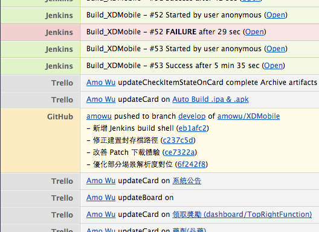

### Trello

不同於一般市面上複雜的專案管理軟體，[Trello](https://zh.wikipedia.org/wiki/Scrum) 是一個簡單易用的 [Scrum](https://zh.wikipedia.org/wiki/Scrum) board，之前 [Development Tools](https://blog.amowu.com/2012/08/development-tools.html)這篇文章有稍微介紹，而我目前就是使用它來管理新專案，試用兩個月下來，感覺還不錯。

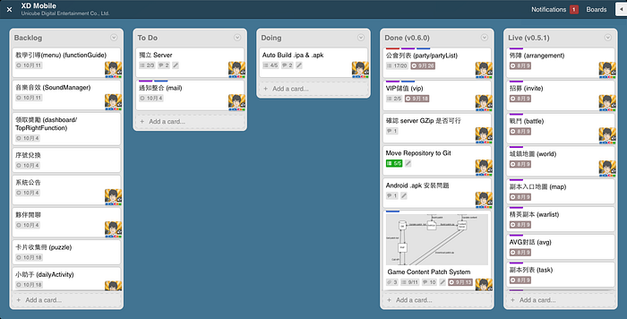

Trello 主要由 Board，List 和 Card 組成，如上圖所示，目前我將開發板分成五個 List：

* **Backlog** — 所有企劃開出來的功能會集中在這個 Backlog List，並按照預計完成日期排序。
* **To Do** — Backlog 中的功能如果已經準備好企劃文件和美術檔案，那卡片就會移到 To Do 待命。
* **Doing** — 正在實作中的功能會從 To Do 移至 Doing，建議每個人只留一張卡片在這。
* **Done (vX.X.X)** — 下一版要完成的功能，在 Doing 完成的卡片會移到 Done，待產品發佈後會從 Done 改為 Live。
* **Live (vX.X.X)** — 已經上線的功能 List，可以隨時使用封存，讓開發板保持乾淨。

> vX.X.X 為版號。
> 每張 Card 還可以根據屬性標上自訂 Label，例如 feature，bug 等。

### Zapier

由於 HipChat 沒有直接整合 Trello，所以需要透過第三方服務來支援，[Zapier](https://zapier.com/)。

Zapier 使用上跟 [IFTTT](https://ifttt.com/) 一樣，當某個服務被觸發時，另一個服務就執行某個動作，而這邊我們要使用的就是 Trello 和 HipChat，當 Trello 的 New Activity 被 trigger 的時候，HipChat 就 Create Message。

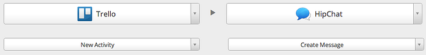

連結 Trello 和 HipChat 帳號：

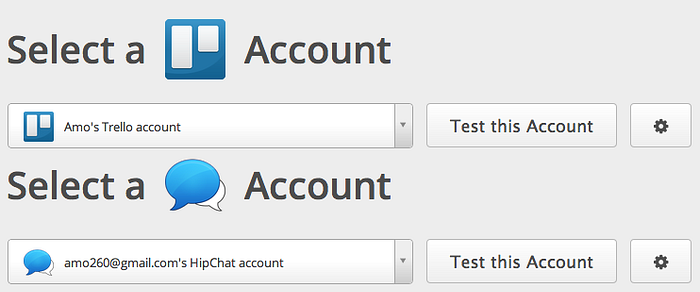

選擇 Trello Board：

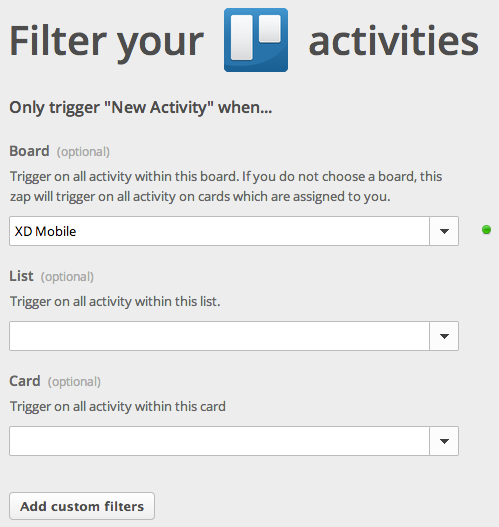

設定 HipChat 的通知格式：

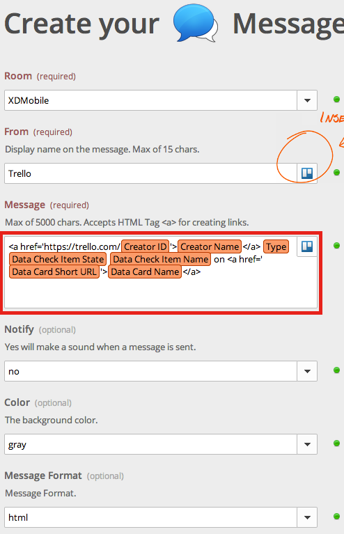

> 也可以直接套用其他人分享的[設定](https://zapier.com/app/explore?services=hipchat%2Ctrello)。

### Git flow

[Git flow](https://github.com/nvie/gitflow) 是一套 Git 流程管理工具，它會幫你在現有的 Git 開發環境上，建立五條 branch：

* **master** — 最穩定的產品版本。
* **develop** — 正在開發的版本，所有開發人員基本上都會在這條主線上。
* **feature** — 開發新功能都需要使用這條支線，會從 develop 分支出來，完成後自動 merge 回 develop。
* **release** — 準備發佈的新版本，從 develop 分支出來，完成後自動建立 tag 並 merge 回 master 和 develop。
* **hotfix** — release 之後發現有緊急 bug 必須修復時會使用，從 master 分支出來，完成後 merge 回 master 和 develop。

> 這篇 [git-flow cheatsheet](http://danielkummer.github.io/git-flow-cheatsheet/) 用圖解的方式解釋 git flow，會比較容易懂。

### 安裝

* OSX：`$ brew install git-flow`
* Linux：`$ apt-get install git-flow`

### 使用

初始化：`$ git flow init`

> 初始過程中會問你一些分支命名，建議直接使用預設。

#### New Feature

開始開發新功能：`$ git flow feature start <FEATURE_NAME>`
結束新功能開發：`$ git flow feature finish <FEATURE_NAME>`
將程式 push 到 remote 端：`$ git flow feature publish <FEATURE_NAME>`
Pull remote 端的程式：`$ git flow feature pull <FEATURE_NAME>`

#### New Release

準備 release：`$ git flow release start <VERSION>`
完成 release：`$ git flow release finish <VERSION>`

> VERSION 為版號。

#### New Hotfix

修復緊急 bug：`$ git flow hotfix start <VERSION>`
修復結束：`$ git flow hotfix finish <VERSION>`

> 如果想從 SVN 跳槽到 Git 的話，可以使用這個指令將整個 Repository 搬過來：
> `$ git svn clone <SVN_REPOSITORY>`

如果不習慣用命令列操作的話，推薦使用 [SourceTree](http://www.sourcetreeapp.com/) 這套軟體，裡面已經直接內建 git flow。

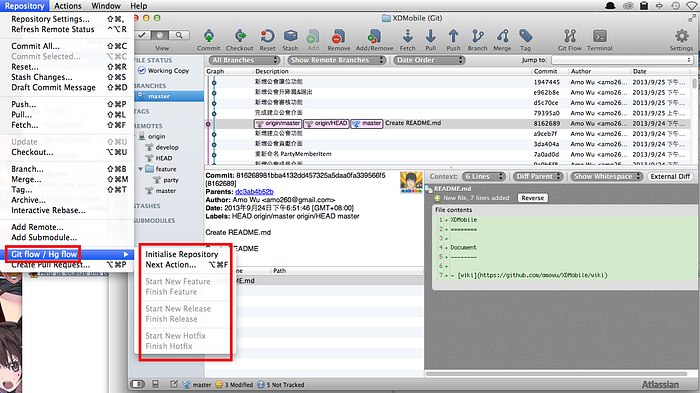

接著要整合 GitHub 和 HipChat，只需要幾個步驟就可以完成：

1. 前往 HipChat > Group admin > API > 建立一組新的 token。
2. 前往 GitHub > 你的 Repository > Settings > Service Hooks > HipChat > 將 auth token 跟 room ID 填上，Active 記得打勾，這樣就完成了，之後 GitHub 有任何動態都會在 HipChat 上通知。

### Jenkins

最後要介紹的是[持續整合](http://en.wikipedia.org/wiki/Continuous_integration)工具 [Jenkins](http://jenkins-ci.org/)，為了減少每次發佈版本浪費的時間，Jenkins 可以自動化這些鎖碎的步驟，而我目前專案的每日建置會處理的事項如下：

1. 定時輪詢 Git 是否有最新的版本。
2. 若是有最新版本則拉下來更新。
3. 編譯程式檢查是否有錯誤。
4. 封裝檔案 (.ipa & .apk)。
5. 通知 HipChat。
6. 將檔案 Email 給指定成員。

### 安裝

前往[官方網站](http://jenkins-ci.org/)下載對應版本。

### 設定

安裝完畢之後，預設直接使用瀏覽器開啟 `http://localhost:8080`，接下來需要安裝一些 Plugins：
前往 Manage Jenkins > Manage Plugins > Available > 右上角 Filter 搜尋可安裝的外掛。

* [Git Plugin](https://wiki.jenkins-ci.org/display/JENKINS/Git+Plugin) — 如果你是使用 Git 的話當然就必裝囉。
* [HipChat Plugin](https://wiki.jenkins-ci.org/display/JENKINS/HipChat+Plugin) — 整合 HipChat，安裝完之後 > Manage Jenkins > Configure System > Global HipChat Notifier Settings > 新增一組 HipCht API token，然後填上 Room 跟 Jenkins URL 就完成了。
* [Email-ext plugin](https://wiki.jenkins-ci.org/display/JENKINS/Email-ext+plugin) — 建置成功可以發送自訂格式的 Email。

安裝完外掛之後接下來點選 New Job 開啟一個新建置：
填寫 Job name，這裡我們選 Free-Style project。

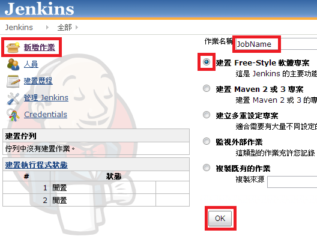

創建好一個 Job 後會進入 Configure 頁面。

首先先設定 HipChat 的一些參數 (如果有安裝 plugin 的話)。

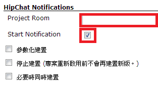

設定 Git，填上本機 Repository 位置，選擇 master branch (產品主線)，Remote 端 Repository 如果是用 GitHub 的話選擇 githubweb 然後填上 URL。

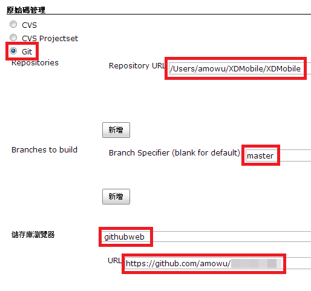

接下來設定排程，選擇 Poll SCM (輪詢)，並依照指定的日期時間格式設定，以 `H/5 6,7,8,9,20,21,22,23 * * *` 為例，無論何月何日星期幾，每天 6-9 點，20-23點，每隔 5 分鐘輪詢一次。

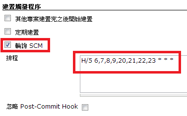

然後就是建置的部分，內容會依專案而異，以我的 AIR Mobile 專案為例，使用 Shell 指令，`mxmlc` 先編譯除錯程式，然後 `adt` 分別產出 .ipa 和 .apk 檔案。

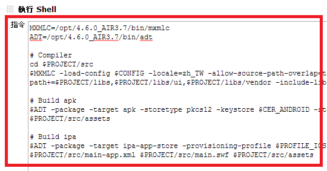

最後設定建置成功後需要作哪些事：

* Archive the artifacts — 封存指定檔案，注意檔案的路徑會是在 `$WORKSPACE` 底下。
* HipChat Notification — 發送通知給 HipChat。
* E-mail Notification — 發送信件給指定成員，如果需要自訂格式也可以使用前面介紹的 plugin。

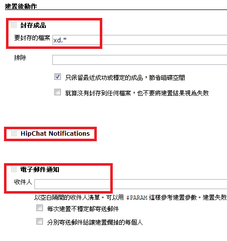

### 結語

上面講完了 HipChat，Trello，Git flow 和 Jenkins 四樣看似無關的服務，但結合起來運用會讓專案開發上的效率更佳提升，雖然前期的準備需要花點時間，但對專案是很值得的投資，Try it! :-)

#### 參考資料

* [Git flow 開發流程](http://ihower.tw/blog/archives/5140)
* [git-flow cheatsheet](http://danielkummer.github.io/git-flow-cheatsheet/)
* [Git-flow 讓 Dev Team 步上穩健開發之路](http://edwardinaction.blogspot.tw/2011/04/git-flow-dev-team.html)
* [Git-flow 使用笔记](http://fann.im/blog/2012/03/12/git-flow-notes/)
* [JenkinsでiOSアプリ開発の細々した作業を自動化する](http://dev.classmethod.jp/tool/jenkins_testflight_hipchat/)
* [Packaging AIR application for iOS devices with ADT command and ANT script](http://www.riaspace.com/2011/03/packaging-air-application-for-ios-devices-with-adt-command-and-ant-script/)
* [NodeJS App的持續整合（Continuous Integration）伺服器架設](http://rettamkrad.blogspot.tw/2013/01/NodeAppCI.html)
* [每日自動備份, 檔名如何加上日期 ?](http://jeffreylands.blogspot.tw/2010/03/blog-post.html)
* [【Jenkins常见问题解决】01. Mac上使用Jenkins持续集成报错Can’t connect to window server — not enough permissions.](http://blog.csdn.net/wirelessqa/article/details/8647771)
* [Jenkins配置基于角色的项目权限管理](http://www.cnblogs.com/gao241/archive/2013/03/20/2971416.html)
* [用MSBuild和Jenkins搭建持续集成环境（2）](http://www.infoq.com/cn/articles/MSBuild-2)
* [使用Jenkins打造Continuous Integration Server (1) — 安裝以及環境設定](http://www.dotblogs.com.tw/kirkchen/archive/2012/05/14/install_and_setting_jenkins_as_ci_server.aspx)
* [CI Server 28 — 發送每日建置結果報表](http://ithelp.ithome.com.tw/question/10109471)
* [使用email-ext替换Jenkins(Hudson)的默认邮件通知](http://www.juvenxu.com/2011/05/18/hudson-email-ext/)
* [Packaging and exporting](http://help.adobe.com/en_US/flashbuilder/using/WSe4e4b720da9dedb5-6caff02f136a645e895-7ffd.html) -[使用 Flex SDK 建立您的第一個 AIR for Android 應用程式](http://help.adobe.com/zh_TW/air/build/WS901d38e593cd1bac25d3d8c712b2d86751e-8000.html)
* [ADT package 命令](http://help.adobe.com/zh_TW/air/build/WS901d38e593cd1bac1e63e3d128cdca935b-8000.html)
* [Creating a self-signed certificate with ADT](http://help.adobe.com/en_US/AIR/1.5/devappshtml/WS5b3ccc516d4fbf351e63e3d118666ade46-7f74.html)
* [Why is FlexMojos “unable to resolve ‘assets/**/*.png’ for transcoding”?](http://stackoverflow.com/questions/6844650/why-is-flexmojos-unable-to-resolve-assets-png-for-transcoding)
* [An error occurred because there is no graphics environment available](http://stackoverflow.com/questions/5919138/an-error-occurred-because-there-is-no-graphics-environment-available)
