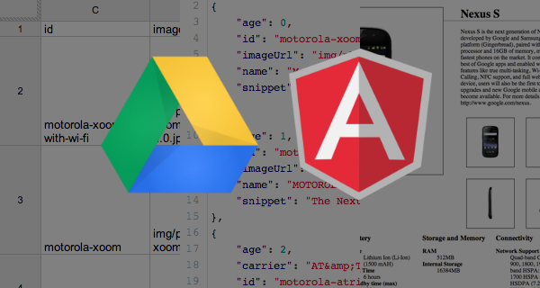
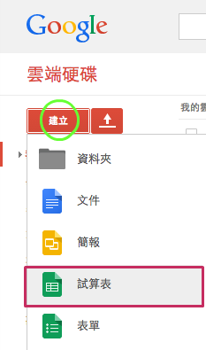
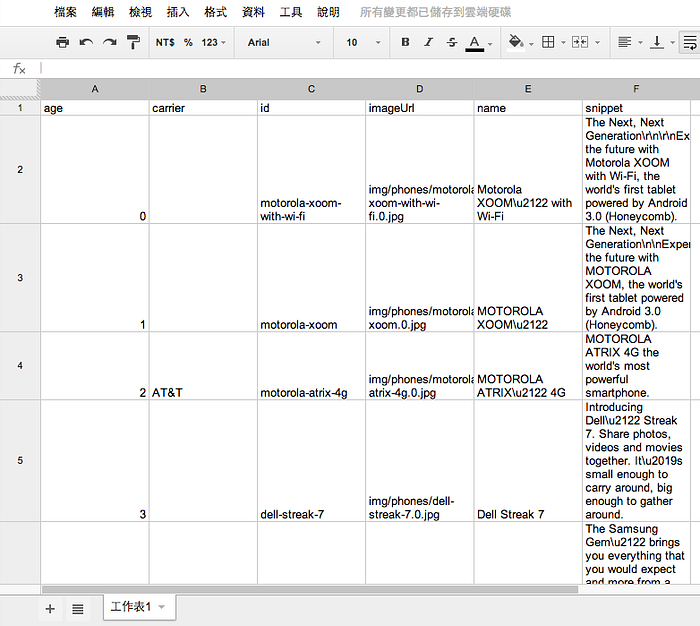
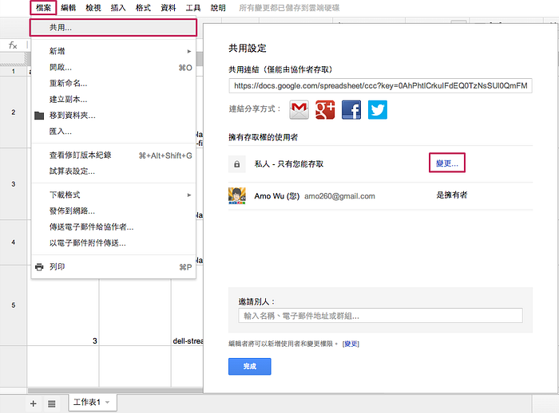
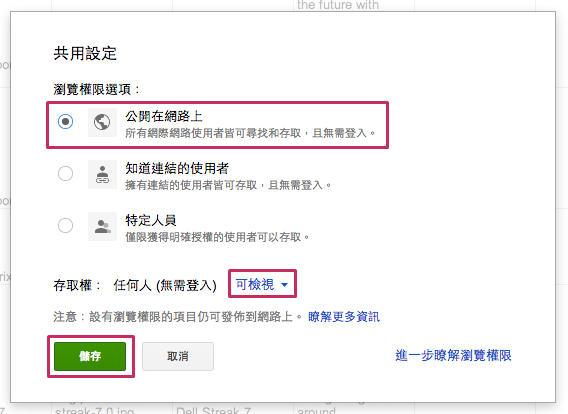
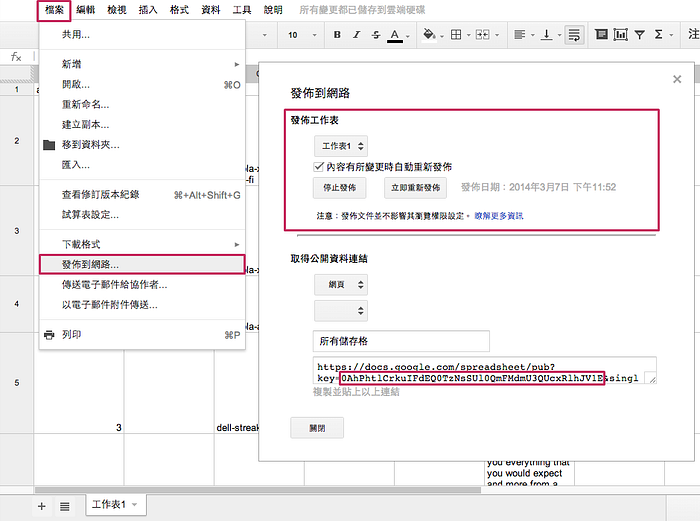

---



### 概要

這篇文章主要是說明如何寫 AngularJS 的 service，以類似 `[$resource](http://code.angularjs.org/1.2.6/docs/api/ngResource.%24resource)` REST 的方式來取得 Google 試算表的資料。

> 本文假設讀者已讀過 [AngularJS Tutorial](http://docs.angularjs.org/tutorial)，了解 AngularJS 基本概念。

### 目錄

1. 建立試算表
2. Template
3. App Module
4. Service
5. Controller
6. 注意事項
7. 參考

### 建立試算表

前往 [https://drive.google.com](https://drive.google.com/) 或是參考已經建立好的 [試算表](https://docs.google.com/spreadsheet/ccc?key=0AhPhtlCrkuIFdEQ0TzNsSUl0QmFMdmU3QUcxRlhJV1E&usp=drive_web) 。

先建立一份新的試算表： `建立` > `試算表` 。



填寫資料表，以 [AngularJS Tutorial](http://docs.angularjs.org/tutorial) 的 [phones.json](https://github.com/angular/angular-phonecat/blob/master/app/phones/phones.json) 為例。



將試算表權限公開： `檔案` > `共用` > `擁有存取權的使用者` > `變更` 。



`共用設定` > `公開在網路上` > `存取權` > `可檢視` > `儲存` 。



權限公開後，發佈到網路： `檔案` > `發佈到網路` > `內容有所變更時自動更新發佈` > `開始發佈` 。



發佈完成後，公開連結中會提供一組 key，可以前往 [Google Data APIs](https://developers.google.com/gdata/samples/spreadsheet_sample) 測試看看資料是否回傳正確。

接下來進入正式寫程式的階段，這裡我們會使用到 [Tabletop.js](https://github.com/jsoma/tabletop) 這個第三方的 library，提供 javascript 快速取得 json 格式的試算表資料。

這裡會以 [AngularJS Tutorial](http://docs.angularjs.org/tutorial) 的 [phonecatApp](https://github.com/angular/angular-phonecat) 為例子，說明如何實作 Tabletop.js 的 service。

### Template

建立 `index.html`，並加入 [angular.js](https://github.com/angular/angular.js/tree/v1.2.6)， [angular-route.js](https://github.com/angular/bower-angular-route/tree/v1.2.6) 和 [tabletop.js](https://github.com/jsoma/tabletop/tree/v1.3.3)。
`index.html`:

```xml
<!doctype html>
```

`phone-list.html` 綁定了 `name`， `snippet` 和 `imageurl` 三個變數，對應試算表的欄位名稱。

### App Module

接著使用 `angular-route.js` 提供的 `ngRoute` 來幫 app 設定路由，這裡先一律導向 `/phones` 。

`js/app.js`:

```javascript
var phonecatApp = angular.module('phonecatApp', [
  'ngRoute',
  'phonecatServices',
  'phonecatControllers'
]);

phonecatApp.config(['$routeProvider',
  function($routeProvider) {
    $routeProvider.
      when('/phones', {
        templateUrl: 'partials/phone-list.html',
        controller: 'PhoneListCtrl'
      }).
      otherwise({
        redirectTo: '/phones'
      });
  }]);
```

接下來要開始寫 `phonecatServices` 和 `phonecatControllers` 。

### Service

這裡將 tabletop.js 封裝成一個 `Phone` 的 [service](http://code.angularjs.org/1.2.6/docs/guide/dev_guide.services.creating_services)，並自訂一個 `query` 方法提供試算表查詢使用。

`js/services.js`:

```javascript
var phonecatServices = angular.module('phonecatServices', []);

phonecatServices.factory('Phone', ['$rootScope',
  function($rootScope) {
    return {
      query: function(callback) {
        Tabletop.init({
          key: 'YOUR_KEY',
          simpleSheet: true,
          parseNumbers: true,
          callback: function(data, tabletop) {
            if(callback && typeof(callback) === "function") {
              $rootScope.$apply(function() {
                callback(data);
              });
            }
          }
        });
      }
    }
  }]);
```

`key` 的部分記得填寫試算表提供的 key。

### Controller

最後剩下 `phonecatControllers`，使用 `Phone.query` 取得試算表的 json 格式資料。

`js/controllers.js`:

```javascript
var phonecatControllers = angular.module('phonecatControllers', []);

phonecatControllers.controller('PhoneListCtrl', ['$scope', 'Phone',
  function($scope, Phone) {
    Phone.query(function(data) {
      $scope.phones = data;
    });
  }]);
```

完成，完整範例程式碼請參考 GitHub [angular-spreadsheet-sample](https://github.com/amowu/angular-spreadsheet-sample) 。


### 注意事項

* 新版 Google 試算表不支援。
* 試算表欄位名稱只能小寫，例如：`imgUrl`，要改成 `imgurl`。

### 參考

* [AngularJS Tutorial](http://docs.angularjs.org/tutorial)
* [Spreadsheets Data API](https://developers.google.com/gdata/samples/spreadsheet_sample)
* [Tabletop.js](https://github.com/jsoma/tabletop)
* [Use a Google Spreadsheet as your JSON backend](https://coderwall.com/p/duapqq)
