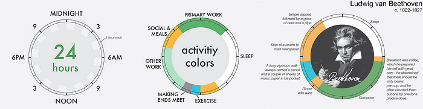
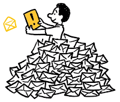
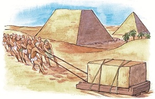
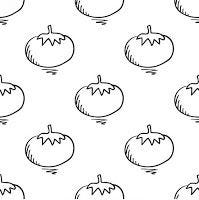
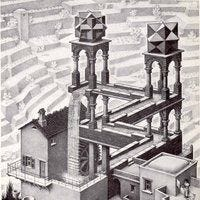

---

這是一篇勉勵我自己如何實行 GTD & Creative Routines 的一套方法。

前言

* 不知道該做什麼
* 什麼是 Creative Routines？
* 人生終極目標
* GTD

收集（Collect）

處理（Process）

* 二分鐘法則
* 四象限法則

整理（Organize）

* 目標金字塔
* 三隻青蛙理論

執行（Do）

* 番茄工作法

回顧（Plan）

* PDCA 循環
* 願望清單

結語

### 前言

> *你是否常常在夜晚帶着一絲傷感入睡呢？明明胸懷大志，卻總是因爲忙碌無爲而感到愧疚？時間總是在****不知道該做什麼****之中悄悄流失……*

> 節錄自「[我的时间管理与方法论](http://www.mifengtd.cn/articles/runningcheese-gtd-system.html)」

#### 不知道該做什麼

為了解決這類焦慮，我們需要有一套 [GTD](https://zh.wikipedia.org/wiki/GTD) 方法，讓自己在**正確的時間**（Time），有**正確的事**（Things）可以去**做**（Done）。

#### 什麼是 Creative Routines？

> 「世界上最恐怖的事情就是－比你優秀的人，比你更加努力。」

[優秀的人](http://thepolysh.com/blog/2014/04/03/creative-routines/)之所以能夠創造出令人矚目的成就，是因爲他們在日常作息、工作和學習之中，養成了**規律良好的習慣**。

> *「優秀是一種習慣」 — 亞里士多德*

幸福並非取決於天性，我們的一言一行都是日積月累下，養成的習慣。如果說懶惰是一種習慣，那麼優秀也是一種習慣。

#### 人生終極目標

我們每天生活所需要維繫的目標，不外乎五大主題：

* 健康
* 事業
* 社會責任
* 情感
* 愛好

若想長時間、規律地維持著良好的習慣，必須得有一個**基準**，用來判斷上述生活中會碰到的這些事情中，哪些對你而言才是最重要的、哪些才是你想做的、哪些是你該做的，而這個基準就是 GTD 的中心思想，也就是**人生終極目標**。比如：我的人生目標是**對社會做出貢獻**。那麼每當你完成一個經過篩選的目標時，也同時在實現人生的終極目標。

#### GTD

有了人生終極目標之後，接下來我們就可以開始探討如何實現 GTD（Getting Things Done）方法了。
GTD 的好處？

* 把複雜的事情簡單化
* 把簡單的事情可操作化
* 把可操作的事情度量化、數字化
* 把可度量、可數字化的事情可考評化
* 把可考評的事情流程化

*節錄自「什麼是科學管理」 — 《命好不如習慣好》*

GTD 的壞處？

* 會有人來留言對你說「你活得不累嗎？」

GTD 的核心流程，五大步驟：

1. 收集（Collect）
2. 處理（Process）
3. 整理（Organize）
4. 執行（Do）
5. 回顧（Plan）

### 收集（Collect）

**不要相信你的記憶能力**，身為一個專業的程序猿，我們有義務清空自己的記憶體，讓它隨時保持在足夠應付那些真正必要的思考工作上。

當你的腦中有任何雜音（Stuff）出現，不管大小，先將它往你的水桶（Inbox）裡收集，越簡單越快速的工具越好。（比如：便利貼、筆記本、待辦清單）

哪些東西讓它進你的水桶？

* 突然閃過的想法
* 想要達成的目標
* 需要你去完成的待辦事項

哪些東西**不**適合收集？

* 會議、約會：直接使用行事曆（Calendar）會更好
* 稍後閱讀：[Pocket](https://getpocket.com/)、[Instapaper](https://www.instapaper.com/) 這類工具會是你的好朋友
* 想收藏的媒體（網站、文章、圖片）：使用相對應的服務（[Delicious](https://delicious.com/)、[Evernote](https://evernote.com/)、[Pinterest](https://www.pinterest.com/)）
* 想養成的習慣：使用 [21天效應](http://wiki.mbalib.com/zh-tw/21%E5%A4%A9%E6%95%88%E5%BA%94) 搭配習慣清單（[微习惯](http://www.appving.com/)、[种子习惯](http://idothing.com/)）

盡量保持單一職責原則（SRP），若有更方便的工具可以處理這些事，那就交給專業的去完成吧，這樣除了能夠專注在該完成的任務上，也能夠隨時知道自己想找的資料存放在何處。

### 處理（Process）

遵循先進先出的順序，檢查那些積在水桶裡的待辦事項，使用下列方法，將它們轉化為可執行的任務（Task）：

1. 二分鐘法則
2. 四象限法則

#### 二分鐘法則

首先判斷這件事你是否可以在二分鐘左右之內完成？如果可以的話，就趕緊先將它解決了吧！

#### 四象限法則

如果是無法馬上完成、需要經過整理的任務，就先使用四象限法則來做歸類，依照**重要度**與**緊急度**來劃分出任務的**優先度**（Priority）：

* P1：**重要**＆**緊急**
* P2：**重要**＆不緊急
* P3：不重要＆**緊急**
* P4：不重要＆不緊急

**哪些屬於 P1？**

* 即將到達期限的工作或學業上的任務

會出現 P1 通常是因為：

* 外界因素：突然被安排
* 個人因素：P2 沒完成

因為 P1 會讓人產生壓力感，所以盡量越少越好。

**哪些屬於 P2？**

> 趁著在下雨之前，就先修補自己的家。 — 未雨綢繆《詩經》

* 工作或學業上的任務
* **個人想達成的目標**
* 會對個人的發展、以及周圍環境有重大影響的事項

根據 [80/20法則](http://wiki.mbalib.com/zh-tw/80/20%E6%B3%95%E5%88%99) ，我們應該盡量投資時間在 P2 的任務身上。

**哪些屬於 P3？**

* 感到忙碌且盲目的事
* 附和別人期望的事
* 臨時被安排的事
* 不必要的社交回覆（電話、LINE、Facebook）

P3 盡是些不重要的事，但往往因為它們緊急，所以是最容易佔據人們寶貴時間的主兇，應該盡量避免。

**哪些屬於 P4？**

P4 屬於可偶爾放鬆一下，但不可沈溺於此的事項。

如同這篇「 [绝地武士](http://blog.jobbole.com/84577/) 」之中提到，我們常常把時間浪費在那些不重要的雜魚身上，而忽略了自己真正想要的目標，拯救公主。

結論：走出 P3，專注 P2。

### 整理（Organize）

> *大事化小，小事化無。*

經過前面的檢查之後，我們已經安排了優先度給任務，接下來就是根據目標大小拆分成專案（Project），將大事化小，小事化無。

1. 目標金字塔
2. 三隻青蛙理論

#### 目標金字塔

> 每次馬拉松比賽之前，我都要乘車把比賽的線路仔細地看一遍，並把沿途比較醒目的標誌畫下來，比如：第一個標誌是銀行；第二個標誌是一棵大樹；第三個標誌是一棟紅房子，就這樣一直畫到賽程的終點。比賽開始後，我就以百米的速度奮力地向第一個目標衝去，等到達第一個目標之後，我又以同樣的速度向第二個目標衝去。四十多公里的賽程，就被我這麼分解成幾個小目標輕鬆地跑完了。 
> — 山田本一

我們可以推測任務可能所需的時間，將之歸類為長期目標、中期目標、短期目標、小目標：

* 長期目標：年度目標
* 中期目標：季目標、月目標
* 短期目標：周目標
* 小目標：每日目標

#### 三隻青蛙理論

> 如果你必須吃掉一隻青蛙，不要長時間盯着它看。如果你必須吃掉三隻青蛙，記得要先吃掉最大、最醜的那隻。 — 博恩崔西《吃掉那隻青蛙》

為自己的每一天、甚至每周、每個月、每一年，準備**最重要的三件事**。

### 執行（Do）

經過前面的整理之後，我們已經有了最重要的三隻青蛙，再來就是 GTD 最關鍵的一步，Do It！不把青蛙消化掉的話，前面講的都會是空談，讓我們把它完成吧！

#### 番茄工作法

[番茄工作法](http://wiki.mbalib.com/zh-tw/%E7%95%AA%E8%8C%84%E5%B7%A5%E4%BD%9C%E6%B3%95) 的基本原則：

1. 一次只做一件事情
2. 一次番茄時鐘二十五分鐘
3. 中途不可中斷，一旦中斷，必須重新計算該次番茄時鐘
4. 每完成一次番茄時鐘，休息五分鐘
5. 每完成四次番茄時鐘，休息二十五分鐘
6. 花費超過三個小時的任務，表示還切得不夠細

番茄工作法的目的：

* 提高集中力，專注在黃金工作時間
* 量化被打斷的次數、原因，做出相對應的調整
* 量化該任務所花費的番茄時鐘，完善預估流程
* 增進成就感，激勵持久動機

### 回顧（Plan）

到這裡我們已經將那些雜亂的待辦事項，整理成為確切可執行的目標，解決了最初的問題：**不知道該做什麼**！

#### PDCA 循環

儘管如此，我們規劃的目標並不會一開始就如此順遂，GTD 最困難的部份就是拆分任務，這件事就跟程序猿預估時程一樣困難，需要長時間的經驗累積，不斷地調整、修正、優化、迭代，最後才能讓 GTD 融入於自己的心流（Flow）。

[PDCA 循環](http://wiki.mbalib.com/zh-tw/%E6%88%B4%E6%98%8E%E5%BE%AA%E7%8E%AF) 的概念，讓專案保持在執行 → 回顧 → 處理 → 整理 → 執行的迭代循環之中。

回顧的場景（Context）：

* 每日目標：每天睡前準備好明天的三隻青蛙，讓自己隔天起床就知道今天該完成什麼
* 周目標：利用周一上班的收假症候群緩衝時間，回顧自己上周與本周的任務狀況
* 月目標：月底或月初，回顧任務並進行適當的調整
* 年目標：新年期間，回顧過去一年的成果，重新訂下新年目標

#### 願望清單

準備一份願望清單（Wish List），並依照自己可以負擔的值段，將願望分配成年獎勵、月獎勵、周獎勵、日獎勵。比如：今天完成這項任務的話，晚上就去吃好料的。完成這項困難的月目標的話，就買支新的 iPhone 犒賞自己。今年的目標達到的話，明年就給自己一趟出國旅行作為獎勵！

### 結語

其實我覺得需要 To-Do List 處理的事項會越來越減少，因為各式各樣手機 App 搭配通知系統會更高效，然後隨著人工智慧的發展，電子秘書也會越來越聰明，加上物聯網和大數據也成熟之後，人類真的只需要躺著等事情主動來讓你做就好了。

### 參考文章

* [時間總是不夠用？偉大創作者的日常作息一探](https://blog.evernote.com/zhtw/2015/02/27/tapping-daily-ritual-for-great-creative-minds/)
* [时间管理很简单，看看绝地武士的招数](http://blog.jobbole.com/84577/)
* [做一点事情就想放松，然后就开始拖延，怎么克服？](http://www.zhihu.com/question/26701102/answer/56136441)
* [我的时间管理与方法论](http://www.mifengtd.cn/articles/runningcheese-gtd-system.html)
* [《番茄工作法图解》作者亲身讲解：这些最佳实践可以帮你筛选出那个最重要的任务](http://www.infoq.com/cn/news/2015/10/pixalut-staffan)
