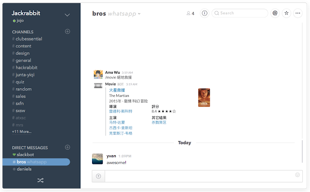
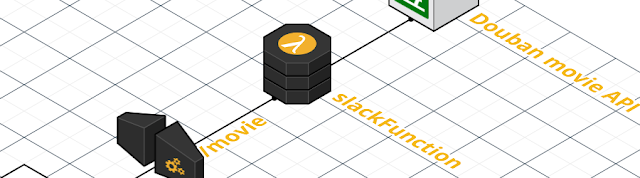

本文介紹如何使用 [AWS Lambda](https://aws.amazon.com/lambda/) & [AWS API Gateway](https://aws.amazon.com/api-gateway/) 搭建一個不需要伺服器的環境，提供 [Slack Slash Commands](https://api.slack.com/slash-commands) 查詢豆瓣電影。



這篇文章使用到的技術：

* [Slack Slash Commands](https://api.slack.com/slash-commands)
* [AWS Lambda](https://aws.amazon.com/lambda/)
* [AWS API Gateway](https://aws.amazon.com/api-gateway/)
* [豆瓣電影 API](https://developers.douban.com/wiki/?title=movie_v2)

閱讀這篇文章需要具備什麼能力：

* Node.js 的基本能力
* Amazon Web Services 的基本操作

接下來我會逐步講解這些東西：

* Slack Slash Commands 的運作機制
* 建立一個簡單的 AWS Lambda function
* 建立一個簡單的 AWS API Gateway 執行 Lambda function
* 使用 Lambda 呼叫豆瓣電影 API
* 測試 AWS API Gateway
* 將 API Gateway endpoint 加入至 Slack Slash Command

### Slack Slash Commands 的運作機制


當你在 Slack channel 輸入 `/movie 權力的遊戲`，Slack 會發出一個 `content-type` Header 設為 `application/x-www-form-urlencoded` 的 HTTP POST 請求，格式如下：

```ini
token=YOUR_SLASH_COMMAND_TOKEN
team_id=YOUR_TEAM_ID
team_domain=YOUR_TEAM_DOMAIN
channel_id=YOUR_CHANNEL_ID
channel_name=YOUR_CHANNEL_NAME
user_id=YOUR_USER_ID
user_name=YOUR_USER_NAME
command=/movie
text=權力的遊戲
response_url=YOUR_HOOK_URL
```

然後 Slack 需要收到的 JSON 回應格式如下（詳見 Attachments）：

```swift
{
  "response_type": "in_channel",
  "attachments": [
    {
      "title": "權力的遊戲 第五季",
      "title_link": "http://movie.douban.com/subject/25826612/",
      "text": "Game of Thrones\n2015年",
      "fields": [
        {
          "title": "導演",
          "value": "Michael Slovis\n...",
          "short": true
        }, ...
      ],
      "thumb_url": "https://img1.doubanio.com/view/movie_poster_cover/ipst/public/p2230256732.jpg"
    }
  ]
}
```

`responsetype: inchannel` 表示 channel 內的使用者都可以看見，若只想給使用命令的本人看的話可以改成 `ephemeral`

Slack Slash Commands 有 3000 ms 的 response timeout 限制

### 建立一個簡單的 AWS Lambda function


1. 前往 AWS Lambda
2. 點選 Create a Lambda function
3. 填寫 Configure function，例：slackFunction
4. Runtime 選擇 Node.js
5. Code entry type 選擇 Edit code inline，輸入簡單的測試程式碼：

```javascript
exports.handler = function(event, context) {
  context.succeed("你好世界!");
};
```

1. Role 使用 lambda*basic*execution
2. 點選 Next 完成建立
3. 點選 Test 測試結果：

```typescript
你好世界!
```

### 建立一個簡單的 AWS API Gateway 執行 Lambda function


1. 前往 AWS API Gateway
2. 點選 New API
3. 填寫 API name，例：Slack API
4. 點選 Create API 完成新增
5. 點選 Create Resource
6. 填寫 Resource Name & Resource Path，例：movie
7. 點選 /movie
8. 點選 Create Method
9. 選擇 POST
10. Integration type 選擇 Lambda Function
11. 選擇 Lambda Region
12. 填寫 Lambda Function，例：slackFunction
13. 點選 Save 完成建立
14. 點選 Test 測試結果：

```typescript
你好世界!
```

### 使用 Lambda 呼叫豆瓣電影 API


豆瓣電影搜索 API 的格式如下：

```bash
GET https://api.douban.com/v2/movie/search?q={text}
```

例：`https://api.douban.com/v2/movie/search?q=權力的遊戲`

```swift
{
  "count": 20,
  "start": 0,
  "total": 130,
  "subjects": [
    {
      "rating": {...},
      "genres": [...],
      "collect_count": 47770,
      "casts": [
        {...}, ...
      ],
      "title": "权力的游戏 第五季",
      "original_title": "Game of Thrones",
      "subtype": "tv",
      "directors": [
        {...}, ...
      ],
      "year": "2015",
      "images": {...},
      "alt": "http://movie.douban.com/subject/25826612/",
      "id": "25826612"
    }, ...
  ],
  "title": "搜索 \"權力的遊戲\" 的结果"
}
```

取代 Edit code inline，在本地建立一個 Node.js Lambda project：

```csharp
$ npm init
```

加入一個支持 promise 的 XMLHttpRequest 庫：

```cpp
$ npm install request-promise --save
```

新增 index.js：

```javascript
var rp = require('request-promise');
exports.handler = function(event, context) {
  // 從傳進來的參數之中提取要搜尋的字串
  var text = event.text ? event.text.trim() : null;
```

```
  // 向豆瓣 API 發出 HTTP GET 請求
  rp('https://api.douban.com/v2/movie/search?q=' + text)
    .then(function(data) {
      // 回傳成功的結果
      context.succeed(data);
    }).catch(function(error) {
      // 回傳失敗的結果
      context.fail(error);
    });
};
```

將檔案壓縮成 lambda.zip：

```bash
./index.js
```

1. 回到 AWS Lambda
2. 點選之前建立的 function，例：slackFunction
3. 將 Code entry type 從 Edit code inline 改為 Upload a .ZIP file
4. 上傳 lambda.zip
5. 點選 Actions > Configure test event，加入測試用的請求

```json
{
```

點選 Test 測試豆瓣回應的結果：

```swift
{
```

### 測試 AWS API Gateway


1. 回到 AWS API Gateway
2. 點選 /movie 的 POST method
3. 點選 Test，並在 Request Body 加入測試用的請求：

```json
{
  "text": "權力的遊戲"
}
```

點選 Test 測試 Lambda 回應的豆瓣結果：

```swift
{
  // ...
  "subjects": [
    {
      // ...
      "title": "权力的游戏 第五季",
      // ...
    }, ...
  ],
  "title": "搜索 \"權力的遊戲\" 的结果"
}
```

### 將 API Gateway endpoint 加入至 Slack Slash Command


因為 Slack 發送的請求 Header 格式是 `application/www-form-urlencoded`，所以需要在 AWS API Gateway 之中將它轉換成為 `application/json` 格式：

1. 點選 /movie 的 POST method
2. 點選 Method Execution
3. 點選 Integration Request
4. 點選 Mapping Templates
5. 點選 Add mapping template
6. Content-Type 填寫 application/www-form-urlencoded
7. 將 Input passthrough 改成 Mapping template
8. 貼上 Ryan Ray 提供的 template [gist](https://gist.github.com/ryanray/668022ad2432e38493df)
9. Save
10. 最後，一定要記得把 API Gateway 部署給外部使用：
11. 點選 Deploy API
12. Deployment stage 選擇 New Stage
13. 填寫 Stage name，例：development
14. 點選 Deploy 完成發佈
15. 然後會得到一個 Invoke URL 格式如下：

```bash
https://{hash}.execute-api.{region}.amazonaws.com/{stage}/movie
```

接下來的步驟，把 AWS API Gateway endpoint 整合進 Slack：

1. 前往 [https://YOUR*TEAM*DOMAIN.slack.com/apps/manage](https://YOURTEAMDOMAIN.slack.com/apps/manage)
2. 在 Search app directory 搜尋框輸入 Slash Commands 並進入
3. 點選 Add Configuration
4. 填寫 Choose a Command，例：/movie
5. 點選 Add Slash Command Integration
6. 填寫 URL，貼上 AWS API Gateway Invoke URL
7. Method 選擇 POST
8. 點選 Save Integration 完成新增



最後一個步驟，更新 Lambda function，讓它可以處理 Slack 的請求與回應：

```csharp
var rp = require('request-promise');
exports.handler = function(event, context) {
  /**
   * event 會收到來自 AWS API Gateway 轉換過的 Slack POST JOSN
   * {
   *   token=YOUR_SLASH_COMMAND_TOKEN
   *   team_id=YOUR_TEAM_ID
   *   team_domain=YOUR_TEAM_DOMAIN
   *   channel_id=YOUR_CHANNEL_ID
   *   channel_name=YOUR_CHANNEL_NAME
   *   user_id=YOUR_USER_ID
   *   user_name=YOUR_USER_NAME
   *   command=/movie
   *   text=權力的遊戲
   *   response_url=YOUR_HOOK_URL
   * }
   */
  if(event.token !== 'YOUR_SLASH_COMMAND_TOKEN') {
    return context.fail('未經授權的請求');
  }
  var text = event.text ? event.text.trim() : null;
```

```
  // 向豆瓣 API 發出 HTTP GET 請求
  rp('https://api.douban.com/v2/movie/search?q=' + text)
    .then(function(data) {
      // 提取第一筆電影的結果
      var subject = data.subjects[0];
      // 將豆瓣 API 返回的結果包裝成 Slack 支持的格式
      var result = {
        "response_type": "in_channel",
        "attachments": [{
          "title": subject.title,
          "title_link": subject.alt,
          "text": subject.original_title+"\n"+subject.year+"年",
          "fields": [
            {
              "title": "導演",
              "value": subject.directors[0].name,
              "short": true
            }
          ],
          "thumb_url": subject.images.small
        }]
      };
      // 回傳結果
      context.succeed(result);
    }).catch(function(error) {
      // 回傳失敗的結果
      context.fail(error);
    });
};
```

1. 重新壓縮 lambda.zip 然後上傳
2. 在 Slack channel 輸入 /movie 測試結果

### 總結

* 熟悉之後，稍微修改一下，把豆瓣 API 換成其它 API，又可以誕生出更多有趣的 Slash Commands！
* 2015/12/30: 更新範例 [GitHub repo Google 大神](https://github.com/amowu/slack-lambda-google)
* 因為 Slack 有 3 秒的回應限制，所以 API 不穩的話，常常容易發生 timeout，解決方法可以參考 Slack 提供的方式[Delayed responses and multiple responses](https://api.slack.com/slash-commands)，或是提高 Lambda 的 Memory（建議 512 以上），也可使用 AWS SNS 之類的服務處理非同步的 Lambda invoke。
* 特別感謝 Ryan Ray 寫的文章 [Serverless Slack Integrations with node.js, AWS Lambda, and AWS API Gateway](http://www.ryanray.me/serverless-slack-integrations)
