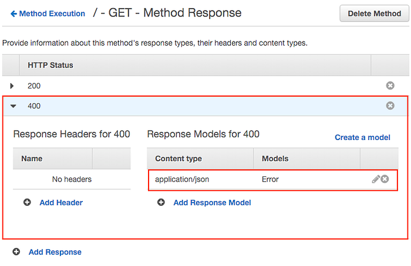
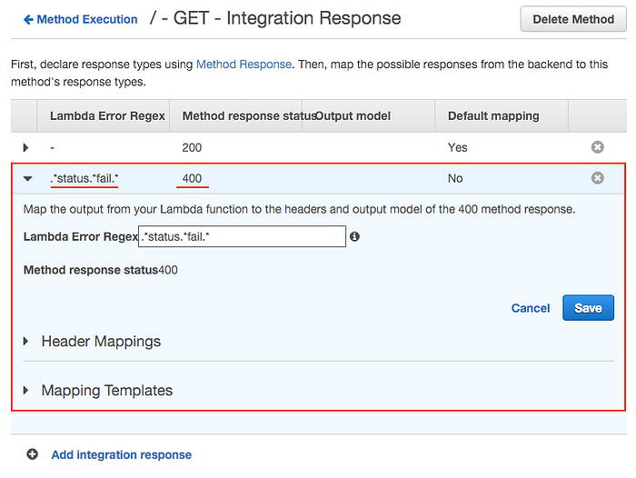
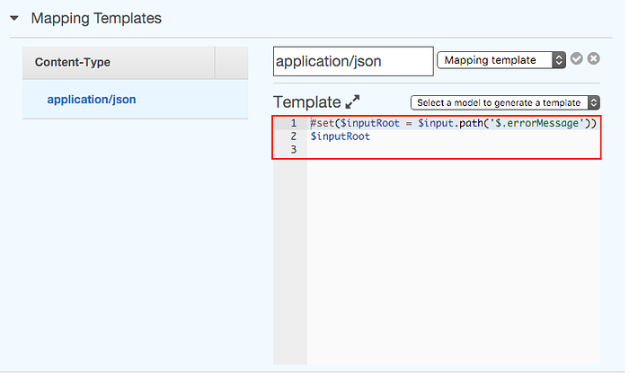

翻譯自原文 [Error handling in AWS API Gateway with Lambda](https://medium.com/@pahud/error-handling-in-aws-api-gateway-with-lambda-28fb86b3ea1e)

這篇文章會介紹如何設置 AWS API Gateway 正確處理 Lambda 返回的 HTTP 錯誤狀態碼。

> 更新：2016.03.12
> [claudia](https://github.com/claudiajs/claudia) 可以自動化解決這個問題，詳細可以參考 [這篇](http://www.infoq.com/cn/news/2016/03/microservices-lambda-claudiajs) 文章。

> 本文假設讀者已經知道如何利用 AWS API Gateway 和 Lambda 建立 REST API，詳細可參考 [Create API Gateway API for Lambda Functions](http://docs.aws.amazon.com/apigateway/latest/developerguide/getting-started.html)。

假設你的 Lambda function 錯誤處理如下：

```javascript
console.log('I am a AWS Lambda function');
```

```
exports.handler = function(event, context) {
    // 一般使用 context.fail 來返回 Lambda function 錯誤
    context.fail(JSON.stringify({status:'fail', reason:'some reason', foo:'bar'}));
};
```

但是 API Gateway 返回的結果會是 **HTTP 200**：

```python-repl
HTTP/1.1 200 OK
```

```
{
    "errorMessage": "{\"status\":\"fail\",\"reason\":\"some reason\",\"foo\":\"bar\"}"
}
```

我們希望的結果是：

1. HTTP Status **400** Bad request
2. 只顯示 errorMessage 的 JSON 值

### 1. 新增 HTTP Status 400 Method Response

1. 前往 API Gateway Console
2. 進入 Method Execution
3. 進入 Method Response
4. 點選 Add Response
5. 輸入 HTTP Status **400**
6. 點選 Add Response Model
7. 輸入 Content type **application/json**、Models **Error**



### 2. 新增 Lambda Error Regex Integration Response

1. 進入 Integration Response
2. 點選 Add integration response
3. 輸入 Lambda Error Regex `.*status.*fail.*`、Method response status **400**



### 3. 設置 Mapping Templates

1. 展開 Mapping Templates
2. 點選 Add mapping template
3. 輸入 Content-Type **application/json**
4. 點選 Output passthrough 並改成 Mapping Templates
5. 輸入以下程式碼：



### 4. 部署 API

記得點選 **Deploy API** 完成 API 的更新，然後測試返回結果是否為 **HTTP 400**。

```python-repl
HTTP/1.1 400 Bad Request
...
```

```
{
    "foo": "bar",
    "reason": "some reason",
    "status": "fail"
}
```
