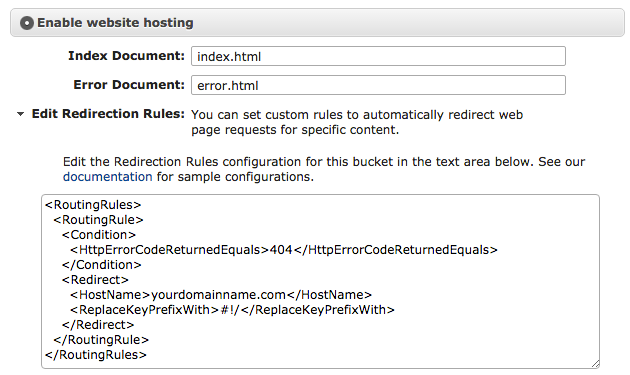
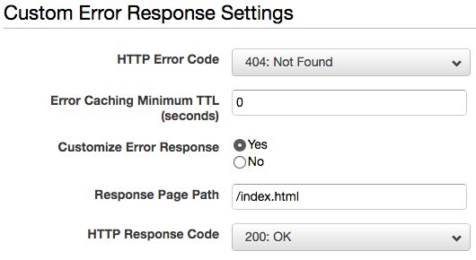

如果你是使用 Angular、React 或是 Vue 來開發 SPA（單頁面應用），並且放在 [Amazon S3 Static Website Hosting](http://docs.aws.amazon.com/AmazonS3/latest/dev/WebsiteHosting.html) 上的話，那麼你會碰到 URL routing 的問題。

一般 [react-router](https://github.com/reactjs/react-router) 或 [vue-router](https://github.com/vuejs/vue-router) 都預設使用 hash 的方式來處理 SPA 的路由：

```bash
http://domain.com/#!/paths
```

如果你不喜歡 `#!/` 的顯示方式，可以使用 HTML5 的 [History API](https://developer.mozilla.org/docs/Web/API/History)，這樣就能像一般網站那樣顯示 URL：

```bash
http://domain.com/paths
```

但是使用 HTML5 History API 時，通常必須搭配 server 端正確的 [路由配置](http://readystate4.com/2012/05/17/nginx-and-apache-rewrite-to-support-html5-pushstate/) 才能防止出現 404 Not Found 的情形。

遺憾的是，在 Amazon S3 Static Website Hosting 上，你無法更動 Apache 或 Nginx 的配置，所以需要靠其它方式來解決問題。

* 使用 S3 的 Redirection Rules
* 使用 CloudFront 的 Custom Error Response

### 使用 S3 的 Redirection Rules

Amazon S3 Static Website Hosting 提供了 **Edit Redirection Rules** 的選項，我們可以輕鬆使用這段程式碼將所有 `domain.com/#!/paths` 所產生的 404，全部重新導向至根路徑：

```xml
<RoutingRules>
  <RoutingRule>
    <Condition>
      <HttpErrorCodeReturnedEquals>404</HttpErrorCodeReturnedEquals>
    </Condition>
    <Redirect>
      <HostName>你的網域（例：domain.com）</HostName>
      <ReplaceKeyPrefixWith>#!/</ReplaceKeyPrefixWith>
    </Redirect>
  </RoutingRule>
</RoutingRules>
```



然後在你的 app 開始處，加入這段 JavaScript 來將 `/#!/paths` rewrite 成 `/paths`：

```xml
<!-- index.html -->
<script>
  history.pushState({}, "index.html", location.hash.substring(2));
</script>
```

*History API 在各個瀏覽器上的使用方式都不盡相同，這裡我們就省略了判斷的程式碼。*

### 使用 CloudFront 的 Custom Error Response

如果你有使用 Amazon CloudFront 來幫 [S3 Static Website Hosting 加入 CDN](http://docs.aws.amazon.com/gettingstarted/latest/swh/getting-started-create-cfdist.html) 的話，那解決方式就更簡單了：

1. 前往你的 CloudFront Distribution
2. 選擇 **Error Pages** 標籤，點選 **Create Custom Error Response** 建立自訂的錯誤回應
3. HTTP Error Code 選擇 **404: Not Found**
4. Error Caching Minimum TTL 輸入 **0**
5. Customize Error Response 選擇 **Yes**
6. Response Page Path 輸入 **/index.html**
7. HTTP Response Code 選擇 **200: OK**
8. 點選 Create 完成


