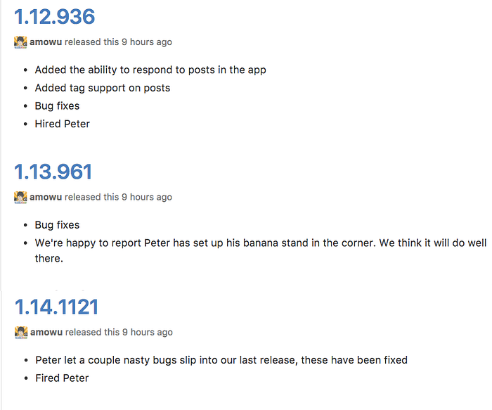

這篇文章會介紹如何使用 [semantic-release](https://github.com/semantic-release/semantic-release) 這個工具，自動化 Node.js (or JavaScript) 專案的版本號，以及 changelog 的 release 流程。

* 什麼是 semantic-release？
* 為什麼要用 semantic-release？
* 如何使用 semantic-release？

### 什麼是 semantic-release？

[semantic-release](https://github.com/semantic-release/semantic-release) 可以自動完成下列這些事：

1. 當 code 被 push 或 merge PR 回 production branch (ex: master) 的時候
2. CI build 被觸發，[semantic-release](https://github.com/semantic-release/semantic-release) 會收集此次更新的所有 commit messages（需遵循 [AngularJS Git Commit Message Conventions](https://docs.google.com/document/d/1QrDFcIiPjSLDn3EL15IJygNPiHORgU1_OOAqWjiDU5Y/edit) 的格式）
3. 自動根據 [semver](http://semver.org/) 的規則來更新 package.json 的 version，並建立 Git tag
4. 自動 publish 新版本的 package 到 [npm registry](https://www.npmjs.com/)（非必要）
5. 自動在 GitHub [releases](https://help.github.com/articles/about-releases/) 的頁面上，產生相對應的 changelog

所以簡單來講，[semantic-release](https://github.com/semantic-release/semantic-release) 指的就是遵循 [semver](http://semver.org/) 的 release 流程。

[semver](http://semver.org/) 的介紹和好處可以在網路上找到很多文章，這裡就不贅述了，它的概念主要就是將版本號分成：

**Major**.**Minor**.**Patch**

例如 React 的 0.11.2、Vue.js 的 2.0.10 等，這三個數字各自代表：

### Major

當你的 API 不兼容前一版本時（又稱 Breaking Change），major + 1，例如：1.x.x -> 2.0.0。

### Minor

當你增加新 feature 的時候，並且不影響前一版本的 API，minor + 1，例如：x.6.x -> x.7.0。

### Patch

當你修復 bug 的時候，並且不影響前一版本的 API，patch + 1，例如：x.x.9 -> x.x.10。

如果專案有在執行 [git-flow](http://danielkummer.github.io/git-flow-cheatsheet/) 的話，minor 配合的就是 feature 的 release flow，patch 則是 hotfix 的 release flow。

### 為什麼要用 semantic-release？

先來看看如果我們想要完成上面列出的目的，傳統的 release 作法會是怎樣？

首先，在你開發的過程中，無數次傳奇般的 code 被你給 commit 了上去：

```ruby
$ git commit -m "blablabla…"
```

在你準備好 release 這段即將改變世界的更新時，你必須先手動給 package.json 改版號，一般會用到 `npm version` 的指令：

```xml
$ npm version [<newversion> | major | minor | patch | ...]
```

再來，你會手動建立 Git tag，並且將這次的更新 push 到 production 分支（或是送 PR 給 reviewer merge）：

```lua
$ git push origin master --tags
```

接下來，如果你還想將新版本發佈到 npm 騙星星的話：

```ruby
$ npm publish
```

最後，為了更新 GitHub [releases](https://help.github.com/articles/about-releases/) 頁面來告知大家你更新了些什麼，你通常必須在 Git logs 的茫茫大海之中找出這次 commits 的內容，然後手動撰寫 changelog⋯⋯：



但是，如果我們用 [semantic-release](https://github.com/semantic-release/semantic-release) 的話，只需要：

```ruby
$ git commit -m "fix: blablabla..."
$ git push origin master
```

### 如何使用 semantic-release？

### 安裝 semantic-release

安裝 semantic-release-cli，並在你的專案底下執行 `semantic-release-cli setup`（注意：必須是 `npm init` 和 `git init` 過的專案）：

```shell
$ npm install -g semantic-release-cli
$ cd YOUR_PROJECT
$ semantic-release-cli setup
```

回答完問題之後，package.json 會加入下面這段程式：

```json
"scripts": {
    "semantic-release": "semantic-release pre && npm publish && semantic-release post"
},
```

如果你不打算發佈專案到 [npm registry](https://www.npmjs.com/) 的話，可以移除 `npm publish` 這段 code。

另外，[semantic-release](https://github.com/semantic-release/semantic-release) 也會幫你建立一份 .travis.yml 給 Travis CI 使用，如果你是用其它 CI 工具的話，可以參考這份配置來撰寫自己的腳本。

```python-repl
...
after_success:
  - npm run semantic-release
...
```

注意：記得在 CI 服務上新增 `NPM_TOKEN` 及 `GH_TOKEN` 兩個環境變數給 [semantic-release](https://github.com/semantic-release/semantic-release) 使用。

到這裡，基本上已經完成前置作業了，更詳細的設定可以參考 [semantic-release](https://github.com/semantic-release/semantic-release) 的 README。

### 使用 semantic-release 的流程

要讓 semantic-release 可以順利運作，其中最關鍵的是部份是團隊必須遵守 [AngularJS Commit Message Conventions](https://docs.google.com/document/d/1QrDFcIiPjSLDn3EL15IJygNPiHORgU1_OOAqWjiDU5Y/edit) 的 commit message 撰寫規範。

每一個 commit message 是由 header、body 和 footer 組成，其中 header 是由 type、scope 和 subject 組成：

```xml
<type>(<scope>): <subject>
<body>
<footer>
```

scope、body 和 footer 是可以根據情況省略的，例如只寫：

```xml
<type>: <subject>
```

這些關鍵字各自代表的作用在 [conventional-changelog-angular](https://github.com/conventional-changelog/conventional-changelog-angular/blob/master/convention.md) 有很詳細的介紹，這裡就不一一贅述了，推薦閱讀 [Commit message 和 Change log 编写指南](http://www.ruanyifeng.com/blog/2016/01/commit_message_change_log.html)。

有了 commit message conventions 之後，搭配一開始提到的 [semver](http://semver.org/)，我們就可以開始發揮 [semantic-release](https://github.com/semantic-release/semantic-release)**Changelog-driven Development** 的魔力了！

#### Patch Release

```ruby
$ git commit -m "fix(payment): 修正「大眾銀行」無法付款的問題"
```

當上面這段帶有 fix 關鍵字的 commit 被 merge 回 master 之後，[semantic-release](https://github.com/semantic-release/semantic-release) 就會自動更新 patch 版號（例如：x.x.9 -> x.x.10），並且自動出現在 GitHub [Releases](https://help.github.com/articles/about-releases/) 的 Bug Fixes 之中。

#### Minor (or Feature) Release

```ruby
$ git commit -m "feat(video): 影片播放器新增「字幕位置」的選項"
```

當上面這段帶有 feat 關鍵字的 commit 被 merge 回 master 之後，[semantic-release](https://github.com/semantic-release/semantic-release) 就會自動更新 minor 版號（例如：x.6.x -> x.7.0），並且自動出現在 GitHub [Releases](https://help.github.com/articles/about-releases/) 的 Features 之中

#### Major (or Breaking) Release

```bash
$ git commit -m "pref(...): blablabla...
BREAKING CHANGE: blablabla..."
```

當上面這段帶有 BREAKING CHANGE 關鍵字的 commit 被 merge 回 master 之後，[semantic-release](https://github.com/semantic-release/semantic-release) 就會自動更新 major 版號（例如：1.x.x -> 2.0.0）， 並且加入 GitHub [Releases](https://help.github.com/articles/about-releases/)。

### 結論

1. [semantic-release](https://github.com/semantic-release/semantic-release) 很巧妙地結合了 [semver](http://semver.org/) 和 [commit message conventions](https://github.com/conventional-changelog/conventional-changelog-angular/blob/master/convention.md) 來完成 Git tag、npm version 和 GitHub releases changelog 的自動化
2. 學習了 Changelog-driven Development 的思維方式
