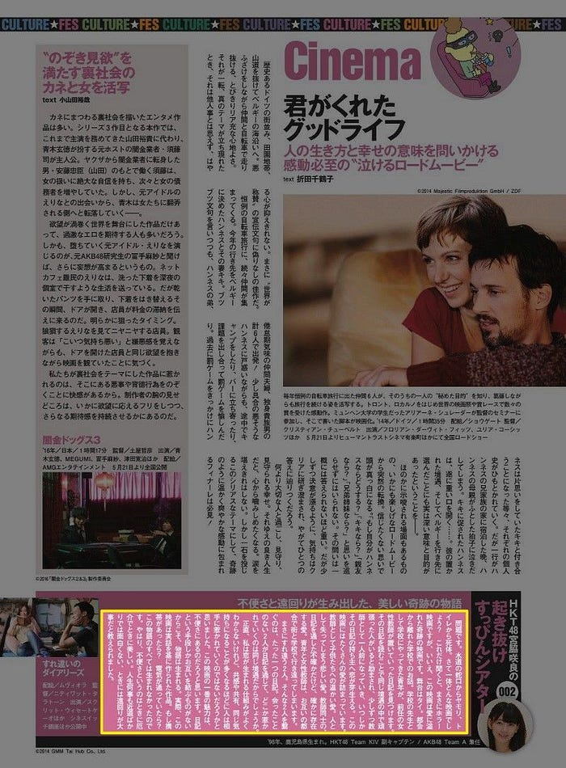
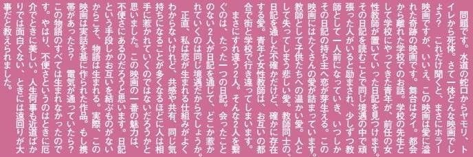
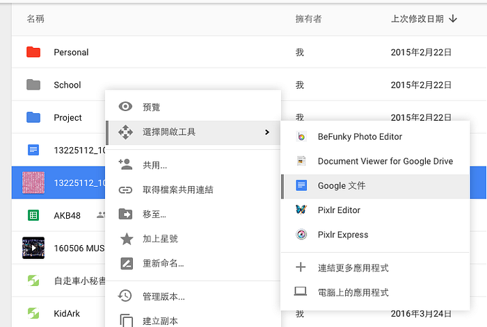
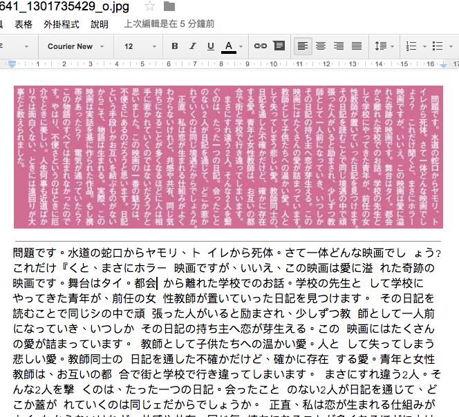

像我這種日文不好、需要靠翻譯工具作參考的人，有時候想翻譯雜誌這種長文會很麻煩。

以前會找一些網路上的 OCR 工具，最近才發現原來 Google Docs 就提供這樣的功能！而且還很強大！ヽ(●´∀`●)ﾉ

以下圖為例，假如我想要翻譯底下那塊專欄的話：

先將文字區塊裁剪成一張圖檔：

1. 上傳圖片到 Google 雲端硬碟
2. 點選右鍵 > 選擇開啟工具 > Google 文件

等待它轉換完成之後，就會產生一份帶有文字檔案的 Google 文件：

完成！Google Docs 提供的圖片轉文字功能有以下特色：

* 語言自動判斷，日文也沒問題 (*´艸`*)
* 橫書＆直書自動判斷，這個有點厲害 🌚
* 相較於其它的 OCR 服務，Google Docs 在內容上的判斷準確率很高！

從此翻譯雜誌的效率大幅提升 ｡:.ﾟヽ(*´∀`)ﾉﾟ.:｡
