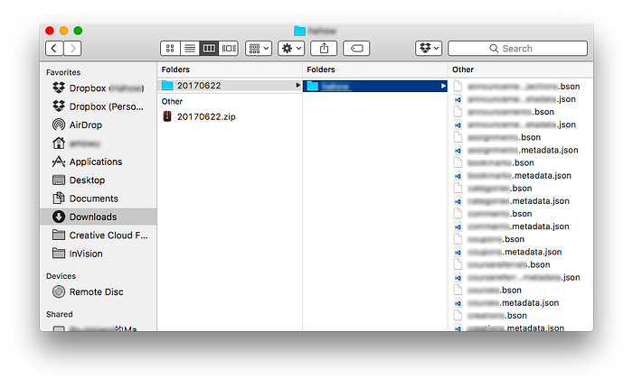
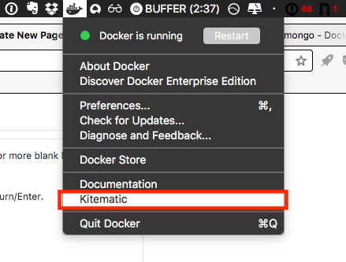

在開發前端的時候，常常會碰到想要回到 migration 之前的 MongoDB 資料結構來除錯，如果只使用本地安裝的 MongoDB，操作上會很麻煩，所以這篇文章會說明如何在本機不安裝 MongoDB 的環境下，使用 Docker 準備多份 MongoDB 資料庫。

請確認電腦有安裝 Docker，先準備好要使用的 MongoDB 資料庫備份檔案，大概會是長這樣：



存放的路徑這裡暫定為 `~/Downloads/20170622/foo/...`。

打開 Terminal，下載 MongoDB（這裡以 2.6 版作為示範）的 Docker image：

```bash
$ docker pull mongo:2.6
```

然後開啟一個新的 MongoDB Docker container，container 名字可以透過 `--name` 自訂：

```bash
$ docker run --detach --name mongo_foo_20170622 --publish 27017:27017 mongo:2.6
```

使用 `docker inspect` 取得 container 的 IP，後面會用到：

```bash
$ docker inspect mongo_foo_20170622 | grep IPAddress
```

前往剛才存放備份資料庫的位置：

```bash
$ cd ~/Downloads
```

開啟並進入一個暫時性質的 Docker container，用途為 restore 資料庫到 `mongo_foo_20170622` 的 container：

```bash
$ docker run --interactive --tty --rm --volume $PWD:/tmp mongo:2.6 bash
```

因為 `~/Downloads` 被 volume 在 `/tmp` 底下，所以可以根據對應的路徑前往該資料庫存放的資料夾位置：

```bash
$ cd /tmp
```

使用 `mongorestore` 恢復備份資料庫到 `mongo_foo_20170622`，IP 記得使用上面 `docker inspect` 查到的 IP：

```bash
$ mongorestore --host 172.17.0.2 --db foo 20170622/foo
```

如果順利 restore 完成之後，就可以離開，它會自動刪除這個一次性的 container：

```bash
$ exit
```

之後如果還有其它版本的 MongoDB 想要切換著使用的話，可以繼續從第一個步驟建立新的 container。

順帶一提，Docker for Mac 有內建一個叫 Kitematic 的 Docker GUI，可以使用它來切換不同版本的 MongoDB：


