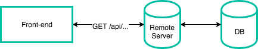
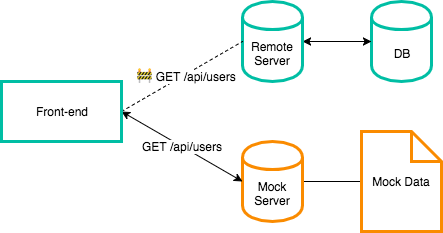
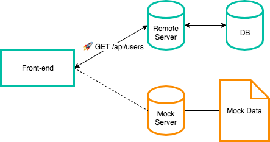
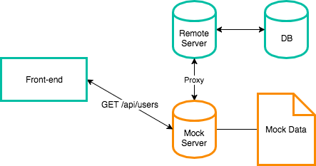
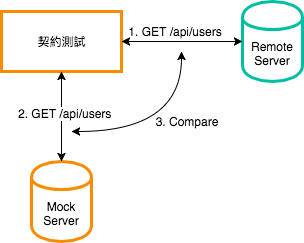
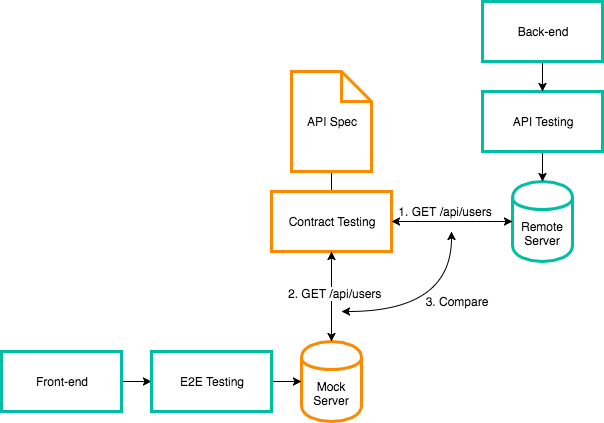

---


這篇文章會介紹如何運用 Mock Server 和 Integration Contract Test（契約測試）解決一些在前後端分離的開發環境底下會碰到的問題。

大綱如下：

* 什麼是 Mock Server？
* 為什麼需要 Mock Server？
* 如何使用 Mock Server？
* 什麼是契約測試？
* 為什麼需要契約測試？

### 什麼是 Mock Server？

下圖是傳統的前後端分離架構：



當後端 API 還沒開發完成的時候，前端會需要一個可以暫時回應假資料（mock data）的 mock server，如下圖：



等到後端的 API 開發完成之後，前端只需要將 API endpoint 從 mock server 切回 remote server 就可以使用真實資料，如下圖：



### 為什麼需要 Mock Server？

一句話，因為有了 Mock Server 之後，前後端就能夠並行開發。

### 如何使用 Mock Server？

這裡會介紹兩種方法：

1. Postman Mock Service
2. Puer Mock Server

### Postman Mock Service

[Postman](https://www.getpostman.com/) 是前後端在開發上很常用到的一款 HTTP Client 應用程式，主要是拿來測試 API，除了有好用的 Collection Test Runner 之外（詳見《[基於 Postman 的 API 自動化測試](https://segmentfault.com/a/1190000005055899)》），其實 Postman 還有提供 Mock Service 的功能，大致流程如下：

1. 送出一個 request（R1）
2. 儲存 R1 至 Collection（C1）
3. 編輯 R1 的 response，儲存成為一個 example（P1）
4. 建立一個 C1 的 Mock Server（M1）
5. 再次向 M1 送出 R1，即會收到格式為 P1 的 response

詳細操作方法請見官方教學文章《[Mocking with examples](https://www.getpostman.com/docs/postman/mock_servers/mocking_with_examples)》。

但是使用 Postman Mock Service 會碰到一個問題，雖然 Postman 可以同時 mock 多筆 API，但是一個頁面可能會同時存在「需要 mock 的 API」和「後端已經寫好的 API」。

### Puer Mock Server

為了解決上面碰到的問題，找到了這個 open-source 的 mock server：[puer-mock](https://github.com/ufologist/puer-mock)。

它可以將沒有 mock 的 API route 經由 proxy 導向後端的 API server，示意圖如下：



安裝＆使用步驟如下：

```bash
$ npm install --save puer puer-mock
```

新增 `mock.json`，加入一筆 mock route（以 `GET /api/users` 為例）：

```json
{
    "api": {
        "GET /api/users": {
            "response": {
                "foo": "bar"
            }
        }
    }
}
```

其中 `response` 的部分就是你自定義的 mock data。

新增 `server.js`：

```javascript
module.exports = require('puer-mock')(__filename, './mock.json') ;
```

修改 `package.json`：

```json
{
    "scripts": {
        "start": "puer -a server.js"
    }
}
```

如果要 proxy 後端的 API server，可以加上 `-t` 或 `--target`：

```json
{
    "scripts": {
        "start": "puer -a server.js -t http://<YOUR_API_SERVER_HOST>"
    }
}
```

啟動 mock server：

```bash
$ npm start
```

測試 mock API：

```bash
$ curl http://localhost:8080/api/users

{
    "foo": "bar"
}
```

更多的配置可以參考 [puer-mock](https://github.com/ufologist/puer-mock)、[puer](https://github.com/leeluolee/puer) 和 [Mock.js](https://github.com/nuysoft/Mock)。

### 什麼是契約測試？

契約測試（Integration Contract Test）的流程大致如下：

1. 前後端在開發之前先約定好契約，也就是 API 的 spec（常見如 [Swagger](https://swagger.io/)、[RAML](https://raml.org/)、[API Blueprint](https://apiblueprint.org/) 或 [apiDoc](http://apidocjs.com/)）
2. 後端根據這份契約開發 remote server（API server）
3. 前端根據這份契約建立 mock server
4. 撰寫契約測試，驗證雙方的 request 和 response 是一致的
5. 將契約測試上 CI server

示意圖如下：



### 為什麼需要契約測試？

1. 防止前後端其中一方更改 API 之後，另一方卻不知情（因為 CI 會失敗）
2. 契約需要一直保持在最新的狀態，代表 API 文件有人維護

### 結論

1. 有一個 Mock Server 對於前後端的並行開發是有幫助的
2. 加入契約測試可以避免前後端任一方修改 API 之後，導致另一方程式崩潰的狀況
3. API 文件有人維護

最後，如果再整合進「前端的 E2E 測試」和「後端的 API 測試」，架構的示意圖大概如下：



相信這對整個團隊的開發穩定度會有很大的幫助，從此前端與後端過著幸福快樂的日子。

### 參考資料

* [你是如何構建 Web 前端 Mock Server 的？](https://www.zhihu.com/question/35436669)
* [如何處理好前後端分離的 API 問題](https://github.com/phodal/fe/blob/master/chapters/chapter-13.md)
* [IntegrationContractTest](https://martinfowler.com/bliki/IntegrationContractTest.html)
* [為什麼你需要一個 mock server](https://github.com/ufologist/puer-mock/blob/master/why-your-need-a-mock-server.md)
* [Test Doubles — Fakes, Mocks and Stubs.](https://dev.to/milipski/test-doubles---fakes-mocks-and-stubs)
* [對付時好時壞的測試案例(4)：Remote Services](http://teddy-chen-tw.blogspot.tw/2012/12/4remote-services.html)
