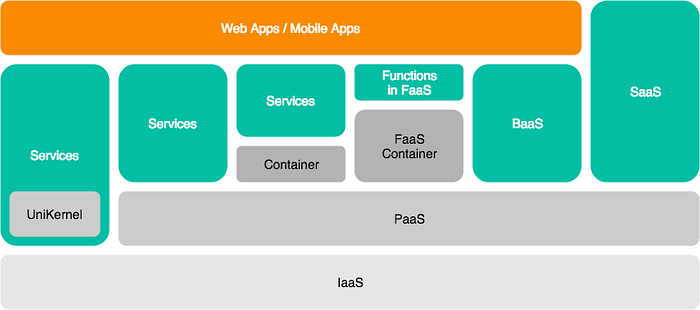
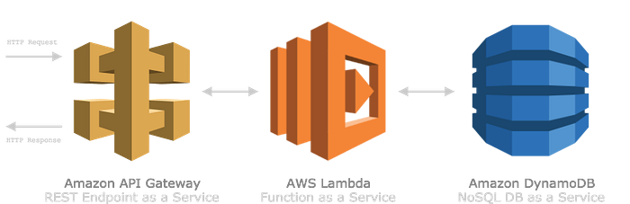
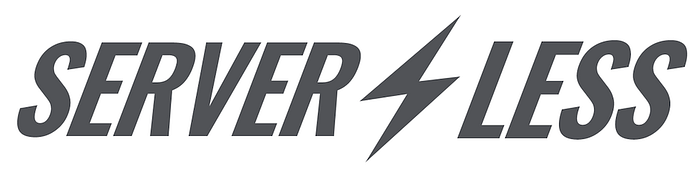
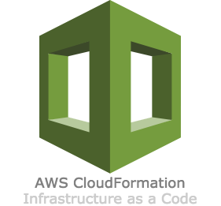

近幾年在雲架構上討論熱度較高的 2 大主題分別是 **容器化**（Containerize）與 **無伺服器**（Serverless）架構。本篇文章會帶你瞭解什麼是 AWS 無伺服器架構，以及如何使用 Serverless Framework 這個框架，快速開發 RESTful APIs。

### 大綱

1. 什麼是 XaaS？
2. AWS 無伺服器架構
3. Serverless Framework
4. CRUDable Service
5. 基礎設施即程式碼

### 什麼是 XaaS？

馬雲說過一句話：「過去的一百年，我們把人變成了機器，未來的一百年，我們將會把機器變成人。」


如果要用一句話來定義 XaaS（X as a Service）的話，那就是「**萬物皆服務**」。

舉凡 IaaS（基礎設施及服務）、PaaS（平台即服務）或 SaaS（軟體即服務）等⋯⋯，用一張圖來概括各個 XaaS 的關係：



**身為程式設計師，我們就是那個負責寫服務來取代人類的存在**。

所以能夠以最快速度開發出可驗證的服務原型，就成了開發者彼此之間的競爭條件之一，也是本篇文章的目的。

### AWS 無伺服器架構

AWS 是目前雲技術的領頭羊，如果想要用 AWS 來開發 Serverless 的 RESTful APIs，主要會由 3 個核心服務所構成：

1. AWS Lambda（Functions as a Service）
2. Amazon API Gateway（REST API Endpoint as a Service）
3. Amazon DynamoDB（NoSQL DB as a Service）



這裡不會贅述如何操作這些 AWS 服務，如果你已經熟悉這些服務，可以直接前往下一章的 Serverless Framework；如果還不知道它們是怎麼運作的，強烈建議先跑過一遍官方的幾篇教學與實作，理解這 3 個傢伙為什麼這麼酷，也才能理解為什麼接下來要介紹的 Serverless Framework 比它們更酷！

1. [無伺服器運算和應用程式](https://aws.amazon.com/tw/serverless/)
2. [Build a Serverless Web Application](https://aws.amazon.com/tw/getting-started/serverless-web-app/)

### Serverless Framework

接下來進入本篇文章的重點，如果每次建立 REST API 都需要手動操作 Lambda、API Gateway 和 DynamoDB 這些服務的話就太麻煩了，所以這裡介紹一個第三方社群維護的框架：[Serverless Framework](https://serverless.com/)。



Serverless Framework 提供了一整套專為「無伺服器架構」所設計的開發＆部署工具，除了 AWS 之外還支援了 Google Cloud Platform 和 Microsoft Azure 等雲服務平台，讓開發者只需專注在 Web、Mobile 和 IoT 應用的核心功能，而無需煩惱基礎設施的維護。

先來跑一遍官方的快速入門暖暖身，首先安裝 Serverless 的 CLI：

```bash
$ npm install serverless --global
```

*注意：因為 Serverless CLI 會透過 AWS SDK 間接操作你的 AWS 帳戶，所以在開始之前，請先確認本機端已經配置完 AWS 的 credential，詳細設定方法可以參考官方文件的《*[*Credentials*](https://serverless.com/framework/docs/providers/aws/guide/credentials/)*》。*

新增一個 Node.js 環境的專案 `hello-service`：

```javascript
module.exports.hello = (event, context, callback) => {
  const response = {
    statusCode: 200,
    body: JSON.stringify({
      message: 'Go Serverless v1.0! Your function executed successfully!',
      input: event,
    }),
  };

  callback(null, response);
};
```

部署 Lambda Function 至 AWS：

```bash
$ serverless deploy --verbose
```

`*--verbose*`* 顯示部署過程的細節。*

如果每次都需要重新部署所有 Lambda Function 會很沒效率，Serverless 也可以只部署單個 Lambda Function：

```bash
$ serverless deploy function --function hello
```

`*--function*`* 指定 Lambda Function 的名稱。*

部署完成之後，使用 `invoke` 執行 Lambda Function：

```bash
$ serverless invoke --function hello --log
```

`*--log*`* 顯示執行回傳的結果。*

```json
{
    "statusCode": 200,
    "body": "{\"message\":\"Go Serverless v1.0! Your function executed successfully!\",\"input\":{}}"
}
```

CLI 也可以使用 `logs` 和 `--tail` 來持續監控 Lambda Function 的執行結果：

```bash
$ serverless logs --function hello --tail
```

瞭解整個 Serverless 的運作方式之後，CLI 還有提供 `remove` 指令，讓你可以將整個專案從 AWS 帳戶移除，畢竟佔用這些資源是要計費的：

```bash
$ serverless remove
```

### CRUDable Service

瞭解 Serverless Framework 如何輕易地部署 Lambda Function 之後，我們來看看 Serverless Framework 如何開發一套完整、可以 [CRUD](https://zh.wikipedia.org/wiki/%E8%B3%87%E6%96%99%E6%93%8D%E7%B8%B1%E8%AA%9E%E8%A8%80) 資料庫的 REST API 服務。

下載 Serverless 社群寫好的 To-do CRUD 範例：

```bash
$ serverless install --url https://github.com/pmuens/serverless-crud
```

*注意：因為這個範例有用到其它第三方的 npm packages，所以部署前記得先 *`*npm install*`* 安裝。*

部署 To-do service 至 AWS：

```bash
$ serverless deploy --verbose
```

部署完成之後，CLI 會顯示你的 API Gateway endpoints：

```bash
...

endpoints:
  POST - https://18055egsjj.execute-api.us-east-1.amazonaws.com/dev/todos
  GET - https://18055egsjj.execute-api.us-east-1.amazonaws.com/dev/todos
  GET - https://18055egsjj.execute-api.us-east-1.amazonaws.com/dev/todos/{id}
  PUT - https://18055egsjj.execute-api.us-east-1.amazonaws.com/dev/todos/{id}
  DELETE - https://18055egsjj.execute-api.us-east-1.amazonaws.com/dev/todos/{id}

...
```

#### Read All To-dos

使用 cURL 或 [HTTPie](https://httpie.org/) 之類的 HTTP client 來測試結果，首先是取得所有 to-dos：

```bash
$ http GET https://18055egsjj.execute-api.us-east-1.amazonaws.com/dev/todos
```

沒意外的話，會回傳空的 To-do 陣列：

```bash
HTTP 200 OK

[]
```

打開程式碼，Read all to-dos 的 Lambda Function 很簡單，透過 AWS SDK 的 DynamoDB `scan` API 來取得所有 todos table 的 items：

```javascript
// todos-read-all.js

const AWS = require('aws-sdk');
const dynamoDb = new AWS.DynamoDB.DocumentClient();

module.exports = (event, callback) => {
  const params = {
    TableName: 'todos',
  };

  return dynamoDb.scan(params, (error, data) => {
    if (error) {
      callback(error);
    }
    callback(error, data.Items);
  });
};
```

#### Create To-do

接著我們試著新增一筆 to-do：

```bash
$ http POST https://<省略>/todos body="Hodor"
```

新增成功並回傳一筆包含 `id`、`body` 和 `updateAt` 欄位的 to-do item：

```bash
HTTP 200 OK

{
    "body": "Hodor",
    "id": "1b691310-a0e7-11e7-b1c4-1d790783726f",
    "updatedAt": 1506230011585
}
```

Create 的 Lambda Function 也很好懂，透過 UUID 以及 DynamoDB 的 `put` API 新增一筆 to-do item：

```javascript
// todos-create.js

...
const uuid = require('uuid');

module.exports = (event, callback) => {
  const data = JSON.parse(event.body);

  data.id = uuid.v1();
  data.updatedAt = new Date().getTime();

  const params = {
    TableName: 'todos',
    Item: data
  };

  return dynamoDb.put(params, (error, data) => {
    if (error) {
      callback(error);
    }
    callback(error, params.Item);
  });
};
```

#### Read One To-do

接著我們試著讀取剛才新增的 id 為 `1b691310-a0e7-11e7-b1c4-1d790783726f` 的 to-do：

```bash
$ http GET https://<省略>/todos/1b691310-a0e7-11e7-b1c4-1d790783726f

HTTP 200 OK
{
    "body": "Hodor",
    "id": "1b691310-a0e7-11e7-b1c4-1d790783726f",
    "updatedAt": 1506230011585
}
```

這裡要注意，DynamoDB 讀取所有 items 所使用 API 是 `scan`，讀取單筆 item 的 API 是 `get`：

```javascript
// todos-read-one.js

...
module.exports = (event, callback) => {
  const params = {
    TableName: 'todos',
    Key: {
      // 透過 event.pathParameters 來取得 URL 的 todo item id
      id: event.pathParameters.id
    }
  };
  return dynamoDb.get(params, (error, data) => {
    if (error) {
      callback(error);
    }
    callback(error, data.Item);
  });
};
```

#### Update To-do

更新已經存在的單筆 to-do：

```bash
$ http PUT https://<省略>/todos/1b691310-a0e7-11e7-b1c4-1d790783726f body="Hold The Door"

HTTP 200 OK

{
    "body": "Hold The Door",
    "id": "1b691310-a0e7-11e7-b1c4-1d790783726f",
    "updatedAt": 1506230311609
}
```

更新 DynamoDB item 的程式碼基本上與新增的方式差不多：

```javascript
// todos-update.js

...
module.exports = (event, callback) => {
  const data = JSON.parse(event.body);
  data.id = event.pathParameters.id;
  data.updatedAt = new Date().getTime();
  const params = {
    TableName : 'todos',
    Item: data
  };
  return dynamoDb.put(params, (error, data) => {
    if (error) {
      callback(error);
    }
    callback(error, params.Item);
  });
};
```

#### Delete To-do

最後剩下刪除已存在的單筆 to-do：

```bash
$ http DELETE https://<省略>/todos/1b691310-a0e7-11e7-b1c4-1d790783726f

HTTP 200 OK

{
    "id": "1b691310-a0e7-11e7-b1c4-1d790783726f"
}
```

刪除的 Lambda Function 程式碼：

```csharp
// todos-delete.js

module.exports = (event, callback) => {
  const params = {
    TableName : 'todos',
    Key: {
      id: event.pathParameters.id
    }
  };
  return dynamoDb.delete(params, (error, data) => {
    if (error) {
      callback(error);
    }
    callback(error, params.Key);
  });
};
```

### 基礎設施即程式碼

跑完上面的 to-do services 之後有沒有感到很神奇呢？竟然一個 `serverless deploy` 指令，就可以把原本需要手動配置的所有 AWS 基礎服務都自動建立好了，這是因為 Serverless Framework 用到了 [AWS CloudFormation](https://aws.amazon.com/tw/cloudformation/) 這個服務。



我們先打開 `serverless.yml` 這個檔案來看看 Lambda Function 和 API Gateway 的配置：

```yaml
functions:
  create:
    ...
  readAll:
    ...
  readOne:
    handler: handler.readOne
    events:
      - http:
          path: todos/{id}
          method: get
          ...
  update:
    ...
  delete:
    ...
```

DynamoDB 的設定：

```yaml
resources:
  Resources:
    TodosDynamoDbTable:
      ...
      Properties:
        AttributeDefinitions:
          -
            AttributeName: id
            AttributeType: S
        KeySchema:
          -
            AttributeName: id
        ...
        TableName: 'todos'
```

這就是 Infrastructure as a Code（基礎設施即程式碼）的威力，它的好處：

* 隨地配置：直接使用程式碼控制你的基礎設施資源，忘記那些繁瑣的操作流程
* 易於維護：因為程式碼可以上版本控制，所以可以多人共同維護一份基礎設施
* 持續交付：因為可以進版本控制，所以更容易整合進 CI/CD 的自動化流程

### 結論

1. XaaS（萬物皆服務）是未來的趨勢，而服務的本質就是 API，誰能夠越快地開發出原型、越有機會成功
2. 如果要用 AWS 的無伺服器架構來開發 REST API，核心服務分別是 Lambda、API Gateway 和 DynamoDB
3. Serverless Framework 利用「基礎設施即程式碼」的概念，讓開發者可以更迅速地在 AWS 上建立一套可維護的 CRUD RESTful API Services

### 參考文章

* [IaaS，PaaS，SaaS 的區別](http://www.ruanyifeng.com/blog/2017/07/iaas-paas-saas.html)
* [蔡學鏞：別再用物件導向，純雲架構最好改用函數式設計，5大架構秘訣公開](http://www.ithome.com.tw/news/115074)
