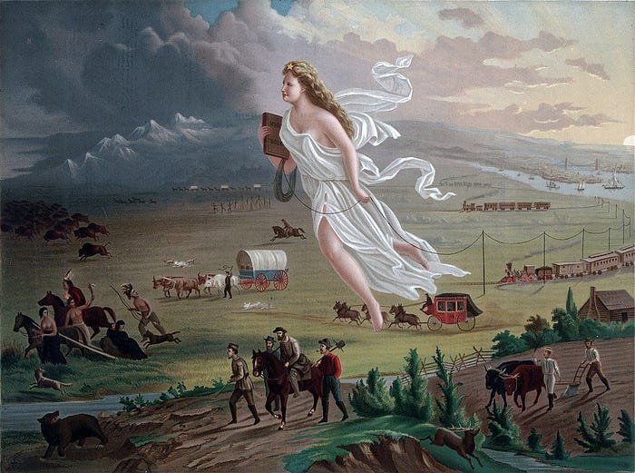
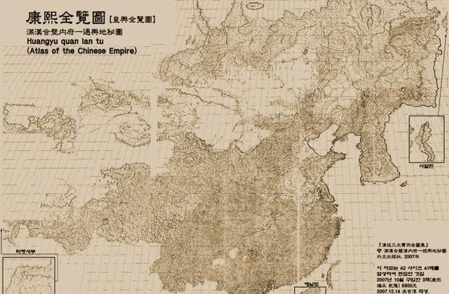
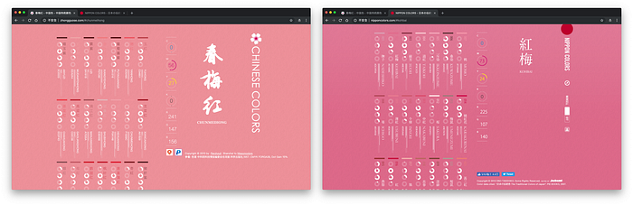
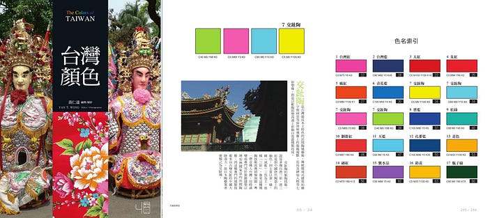
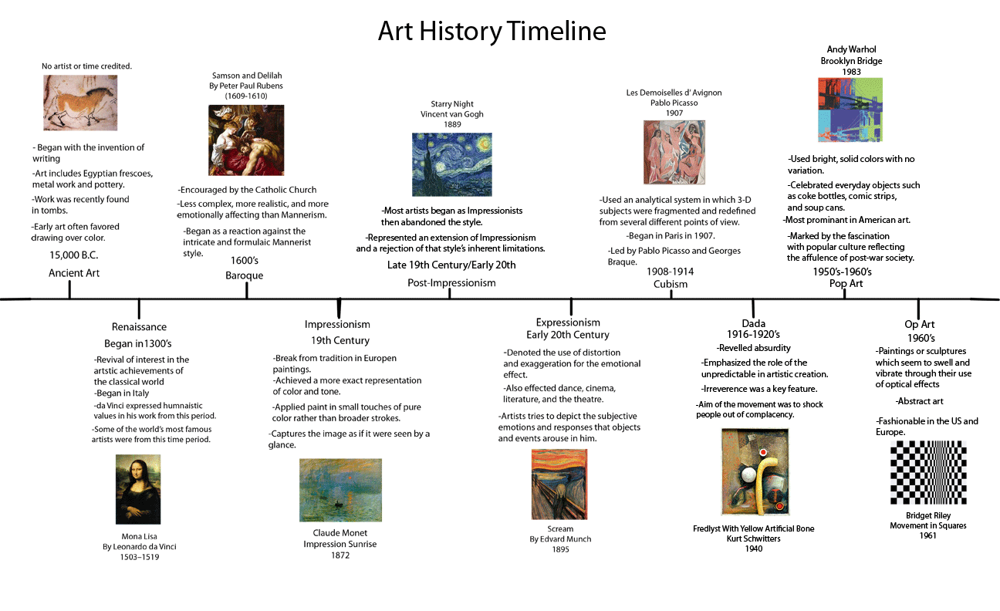
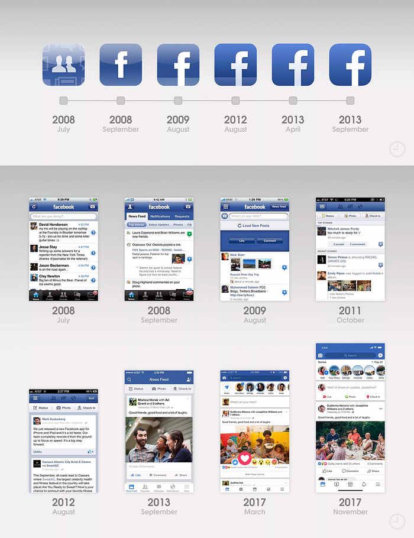

### 新聞

美國總統川普於 18 日正式下令成立「太空司令部」，這將成為美軍在陸軍、海軍、陸戰隊和空軍之外的另一支全新軍種。

回顧美國一路走到今天世界霸權的地位，「[昭昭天命](https://zh.wikipedia.org/wiki/%E6%98%AD%E6%98%AD%E5%A4%A9%E5%91%BD)」這個美式擴張主義的「天命論」起了很大的作用。

> 昭昭天命是美國對西向擴充運動的一種辯解或理由；又或者是一種促發其進程的意識形態或學說。

從建國開始前的迫害印地安人、吞併德克薩斯共和國，一直到介入北美洲以外事務，美國人認定國家的擴張是神的安排，拓展疆域是美國對這個世界的使命。

太空司令部成立之後，美國下一步打算將野心延伸向地球圈外。

作為緊追在後的第二強權，中國今年恰逢改革開放 40 週年，同樣也有一套屬於自己的天命論，那就是「[天下觀](https://zh.wikipedia.org/zh-tw/%E5%A4%A9%E4%B8%8B)」。

以清代《[康熙皇輿全覽圖](https://zh.wikipedia.org/zh-tw/%E5%BA%B7%E7%86%99%E7%9A%87%E8%BC%BF%E5%85%A8%E8%A6%BD%E5%9C%96)》為例，台灣、外蒙古、外東北與庫頁島、北朝鮮與南韓，都是中國神聖領土不可分割的一部份。

最近「來自中國台灣」事件鬧得沸沸揚揚，類似議題總是在兩岸爭論不休。

反倒是《[璦琿條約](https://zh.wikipedia.org/zh-tw/%E7%92%A6%E7%90%BF%E6%A2%9D%E7%B4%84)》沙俄割走了東北 60 萬平方公里的土地，大約相當於 15 個台灣的大小，還有「[外蒙古獨立](https://zh.wikipedia.org/zh-tw/%E5%A4%96%E8%92%99%E5%8F%A4%E7%8B%AC%E7%AB%8B)」等等⋯⋯，怎麼小粉紅們卻興致缺缺，連屁都不敢吭一聲呢？

理由很簡單，因為台灣的利益大、拳頭弱、好欺負，就只是這樣而已。

身為小國，應該會有適合小國自己聰明的玩法，例如前陣子九合一選舉，聽到了一個有趣的想法：「中央政府選親美、親日的黨派，地方政府則選親中的候選人」。

一來可以在主權的高度上 hold 住，避免被「封鎖非洲豬瘟消息」的極權黨國給併吞，二來「東西賣得出去，人進得來，地方發大財」，降低成為美國魁儡的風險。

最後，回歸本質談起，「教育興則國家興，教育強則國家強」，本周 [Hahow 好學校](https://hahow.in/) 發佈了新版本的 App，並且可以參加 [Samsung Galaxy Note9 抽選](https://www.facebook.com/hahow.in/videos/vb.1565253993719446/360615201391809/?type=3&theater)，大家一起來「學那些學校不會教的事」吧！

[Hahow app 登陸頁](https://events.hahow.in/hahowapp-21892)

### 資源

#### Coloring China ! | 色染中国

[https://se.joway.io/](https://se.joway.io/)

色票網站，取材自山寨「[日本の伝統色](http://nipponcolors.com/)」的「[中国传统颜色](http://zhongguose.com/)」。

剛好兩年前在書店翻到了《[台灣顏色](https://www.linkingbooks.com.tw/lnb/book/Book.aspx?ID=190033)》這本書，就順手開源了一個「台灣顏色 Taiwan Colors」網站。

[http://taiwan-colors.surge.sh](http://taiwan-colors.surge.sh/)

對台灣傳統顏色有興趣的朋友，歡迎在 GitHub 留下您寶貴的 issue 或 pull request。

[https://github.com/amowu/taiwan-colors](https://github.com/amowu/taiwan-colors)

### 工具

#### remove.bg

[https://www.remove.bg](https://www.remove.bg/)

這周 remove.bg 席捲了各大 RSS 和 Weekly Mail，號稱可以快速無腦地幫圖片去背。

好奇之下，找了一張老婆的照片來測試，沒想到效果還真不錯，連髮絲的部分都有處理到：

玩上癮了⋯⋯再測試一張：

喂！怎麼把下半身給截掉了啦！

嗯⋯⋯是沒什麼問題啦，不過能順便把那傢伙給一起去掉嗎？

### 本周圖片

Behance 大神 [Milo](https://www.behance.net/milothemes) 整理了一篇《[2019 年設計趨勢指南](https://www.behance.net/gallery/71481981/2019-Design-Trends-Guide)》，針對顏色、插畫、動畫特效、字型和排版等方面，給出了自己的預測分析和建議。

雖然我是看不出相比 2018 年有哪些區別，但是果然高手在民間，討論區出現一則有趣的留言：

> UI 設計演化史，古典主義（早期的功能 UI 設計）> 裝飾主義（擬物寫實風格）> 現代主義（扁平化時代）> 後現代主義（扁平化基礎之上衍生的一些細節裝飾和 3D 動畫表現）。和整個藝術設計史如出一轍。

於是我 Google 了一張與「[西方美術史](https://zh.wikipedia.org/wiki/%E8%A5%BF%E6%96%B9%E7%BE%8E%E6%9C%AF%E5%8F%B2)」時間軸相關的圖片：

然後對比了歷代 Facebook iOS app 的設計：

竟然！⋯⋯好吧，或許是我藝術造詣不夠，感受不太出來，你們覺得如何呢？

### 本周金句

1.

> 誰控制過去就控制未來，誰控制現在就控制過去。

> 所謂自由就是可以說二加二等於四的自由。

> ――《一九八四》

2.

> 普通人認為嘗試新體驗意味著冒險。在企業家們看來，什麼都不做才是冒險，因為這意味著錯失機遇。

> 人們總是太高估自己能在一年裡做到什麼，而又總是太低估自己能在十年裡做到什麼。

> ――《富人的邏輯》

3.

> 什麼叫老闆？
> 老闆必須要成為企業的領袖。
> 那什麼是領袖？
> 領袖就是知道要「做什麼」，但是不知道怎麼做。
> 所以去影響一大堆「知道怎麼做」，
> 但是「不知道做什麼」的人來幫他做。

> ―― 馬雲

4.

> 我上班就是為了賺錢，別跟我談什麼理想，我的理想就是不用上班賺錢。

5.

> 煩惱就是慾望比口袋多一分錢；
> 幸福是口袋裡比慾望多一分錢。

> ――《吳軍的谷歌方法論》

6.

> 來舉杯暢飲吧，為了所謂人這種生物。
> 善人也好惡人也罷，無論世間如何變化，皆輪迴也。
> 困於足以讓人腐化，卻不足以讓人學習的時間渦流裡，
> 人才會充滿慾望，才會挑起事端吧？
> 生命，明明是只需要陽光、大地與詩歌就能滿足的東西。

> ――《所謂人》
