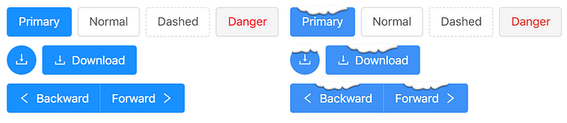
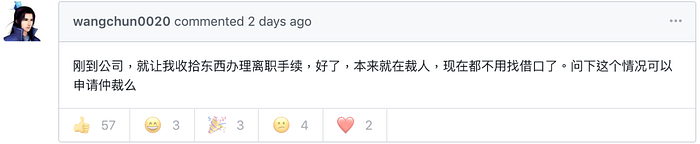
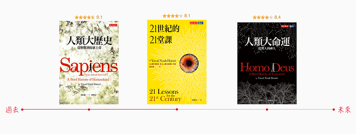
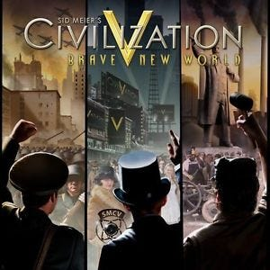
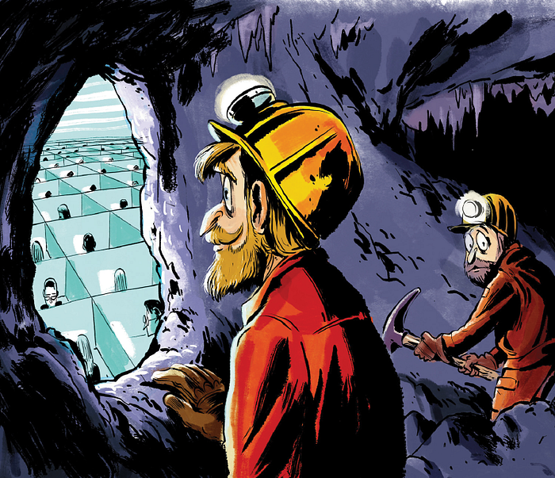
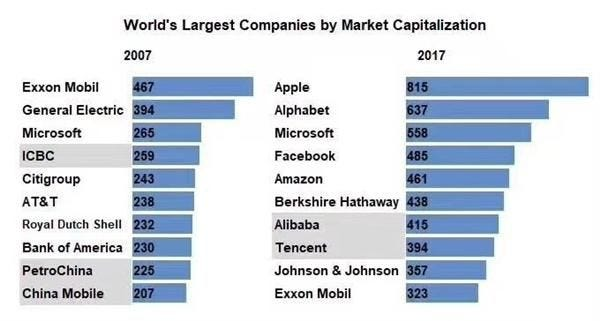

---

### 新聞

#### 如果你想年底被公司開除，可以考慮使用 Ant Design

雖然馬上就要迎接 2019 跨年，街頭仍然瀰漫著濃厚的聖誕節氣氛。

不同於台灣，中國近來因為「[中美貿易戰](https://zh.wikipedia.org/zh-tw/2018%E5%B9%B4%E4%B8%AD%E7%BE%8E%E8%B4%B8%E6%98%93%E4%BA%89%E7%AB%AF)」的關係，不少地方政府開始強烈「抵制洋節」，除了北京、上海等主要城市，很多地方都禁止公共場所懸掛帶有聖誕節氣氛的裝飾物品或擺放聖誕樹。此外，許多教會所舉辦的平安夜彌撒活動也受到衝擊。

然而，這周的 IT 圈也不寧靜，牽扯上了一則相關新聞：

開源 UI 框架 [Ant Design](https://ant.design/) 在未告知開發者的情況下，自動在前端頁面開啟聖誕節彩蛋，導致前端工程師被公司開除。

令人疑惑的是：

1. 這個新修改竟然沒有出現在 [Changelog](https://github.com/ant-design/ant-design/releases/tag/3.9.3)，搞不清楚是給誰的彩蛋⋯⋯
2. 彩蛋預設還是開啟的，而不是交由開發者自行決定
3. 沒有提供關閉選項，只能透過「[覆寫 CSS](https://github.com/ant-design/ant-design/issues/13098)」的方式⋯⋯
4. 即便是如此大的開源專案，也還是沒有監督到這件事

作者之後也出面「[回應](https://zhuanlan.zhihu.com/p/53214213)」了整起事件的來龍去脈：

> 關於 Ant Design 聖誕彩蛋，起源自 2018 年 9 月 10 日我的一次提交：[add christmas easter egg · ant-design/ant-design@00aebeb](https://github.com/ant-design/ant-design/commit/00aebeb9756afecc884ad48486084836b9a2707a) ，代碼實現會在 12 月 25 日當天給所有按鈕添加積雪效果，並增加 Ho Ho Ho! 的瀏覽器默認提示信息。這完全是我個人的一意孤行且愚蠢的決定，是我的錯誤給大家造成了不良影響，非常抱歉。

先撇開被開除的真實性不論，作為一個影響力僅次於 [Bootstrap](https://github.com/twbs/bootstrap) 和 [Semantic UI](https://github.com/semantic-org/semantic-ui/) 的開源 UI 框架（GitHub 40k stars），這玩意兒萬一出現在伊斯蘭國家的政府網站上，後果不堪設想啊⋯⋯。

### 文摘

#### 我們從哪裡來？我們要往哪裡去？

今年的《[豆瓣 2018 年度讀書榜單](https://book.douban.com/annual/2018)》之中，我唯一讀過的作品只有《[21世紀的21堂課](https://book.douban.com/subject/30295288/)》。

哈拉瑞的《人類大歷史》三部曲，《[人類大歷史](https://book.douban.com/subject/25952974/)》說的是人類社會如何形成，《[人類大未來](https://book.douban.com/subject/26945954/)》說的是未來社會如何演化，一本是回顧過去，一本是展望未來，而這本《[21世紀的21堂課](https://book.douban.com/subject/30295288/)》考察的是當下，說的是生活在今天的你和我正在經歷、或者將要面臨的問題。

引述自《[起源](https://book.douban.com/subject/30180290/)》的一段話：

> 假如你有一台功能強大的電腦，無所不知，無所不曉，你想問什麼問題都可以。那麼，十有八九你最終會問到人類的兩個最基本的問題。這兩個問題自人類自我意識覺醒以來，便一直縈繞在他們的心頭。
> 我們從哪裡來？我們要往哪裡去？

如果說人生的終極問題是：人類的起源和歸宿，那麼《人類大歷史》三部曲給出的答案就是：猿猴、智人（[Homo sapiens](https://zh.wikipedia.org/wiki/%E6%99%BA%E4%BA%BA)）和神人（[Homo deus](https://zh.wikipedia.org/wiki/%E7%A5%9E)）。

> 最不符合進化論的就是人類本身。―― 達爾文

生物靠「基因突變」來進化太漫長了（從猿猴到智人 200 萬年），智人到現在也就 7 萬年，生活方式就有了天翻地覆的變化，這是因為「認知革命」之後，智人有了「語言」能力，培養出「說故事」這個逆天的技能，憑藉著三大故事「金錢、國家和宗教」，我們的祖先開始可以共同相信一件事物，讓這個物種的進化不再是依賴基因突變，而是依賴「分工合作」，組建起複雜的社會，發展出高度的文明。

「農業革命」之後，人類從「狩獵採集文明」過渡至「農耕文明」，雖然身體素質下降，但是族群基因的傳播效率卻大大提升，最初的政治意識形態：「帝國」的概念也開始隨之盛行。

「科學革命」最大的進步就是人類「願意承認自己的無知」，科學因為證明了上帝不靠譜，給了以人為本的「人文主義」發展的機會，加上各國開始走向工業化，不論是工人、士兵或是婦女，人力成為非常寶貴的資源，因此意識形態開始由帝國主義轉向人文主義，其中最具代表的分別是：「進化人文主義（法西斯）」、「自由人文主義」和「社會人文主義（共產）」。

歷經第二次世界大戰的納粹德國戰敗、冷戰的共產蘇聯瓦解之後，代表「自由主義」的美國勝出，於是「自由」與「平等」的概念被視為人權，並且奉若神明，成為當今 21 世紀的主流思想一直延續到現在。

然而，未來很有可能因為「資訊科技革命」和「生物技術革命」，顛覆自由主義建立起來的兩大價值觀。

首先是「自由」，世間一切學科，不管是文學、科學、音樂還是經濟學，背後都是數學模式。每個人都是一個處理器，人與人之間的交流就是一套資訊處理系統，整個人類歷史，就是給這個系統增加效率的歷史。如果一切問題都是演算法問題，那麼我們只要建立一個連接所有資訊的「萬物互聯」網路，到那個時候，人工智能＋大數據＋演算法就比你更了解你自己，為了你我的利益，大家都應該讓算法替我們做決定，與其信奉個人、信奉神，還不如信奉這個網絡。個人「自由」徹底崩解，一個新的社會人文主義將會誕生：集中式資料處理的數位獨裁主義。

為了讓我們活得更健康，幫助我們做出更好的決定，完善這個萬物互聯網成為最值得幹的工作。終有一天，萬物互聯網會發展到人類無法理解的地步。演算法之間互相配合升級，演算法自己產生新的演算法，萬物互聯網將獨立於人類而存在，到時候，萬物互聯網就成了世界上第一個重要的東西，比人更重要。所有這些為萬物互聯網工作的職業就成了一份神聖的工作。

然後是「平等」，過去的剝削者與被剝削者只是在地位、權力和財富上的不平等，生理上並無不同。但是「生物技術革命」之後，富裕階層已經有能力透過「基因編輯」之類的改造技術，在體能和智能上優於其他人，甚至達到永生，成為「神」這種動物，那麼社會將會大變，自由主義提出「人類生而平等」的口號，將不再成立。

未來，假設上述兩個趨勢同時進行。那麼全體人類很有可能會被劃分成兩種人：無用的人和神人，這兩種人不可能是平等的，一個新的進化人文主義將會誕生：如同《[美麗新世界](https://zh.wikipedia.org/wiki/%E7%BE%8E%E9%BA%97%E6%96%B0%E4%B8%96%E7%95%8C)》故事中的「新種姓制度」。

過去，人類征服了地球，只用了最後的幾十年時間，就解決了困擾千年以來的三大問題：飢荒、瘟疫和戰爭。

未來，人類打算追求永生，變成神這種動物，但是我們有因此過得比狩獵採集文明的智人還幸福快樂嗎？我們要往哪裡去？

後記：第一次聽說《人類大歷史》是在比爾蓋茲和馬克祖克柏的推薦書單，或許《人類簡史》、《未來簡史》和《今日簡史》的譯名較廣為人知。無神論加上打擊自由主義的觀點，也難怪這本書在中國會受到如此追捧的程度，甚至在收官之作《今日簡史》一書中，每每提到 Amazon、Google 和 Facebook，就要順便帶入阿里巴巴、百度和騰訊。

就像美國的好萊塢電影一樣，第三方國家的出現率從過去的俄羅斯、日本，到現在幾乎所有大片都有中國的影子，哈拉瑞不免俗還是要屈就自由主義的自由市場經濟。

### 本周金句

> 與其受人喜愛，讓人害怕才更安全。

> ――《[利器](https://movie.douban.com/annual/2018)》

> 智者將建立橋梁，而愚者則建立高牆。

> ――《[黑豹](https://movie.douban.com/annual/2018)》

> 如果連出門看星星都做不到，那麼教她們追逐星辰還有什麼意義？――《[她說：女性人生瞬間](https://movie.douban.com/annual/2018)》

> 能說會道的人很多，但能夠從無到有上線一個產品的人不多。執行力很重要。你很容易對幾百人、做了好幾年的產品挑出一堆毛病，但你卻無法協調幾個人在兩三個月內上線一個不完美的產品。誇誇其談的人太多。很多人用「完美主義」來掩飾自己的無能。

> ――《[如何招一個好的產品經理](https://wanqu.co/a/7201/%E5%A6%82%E4%BD%95%E6%8B%9B%E4%B8%80%E4%B8%AA%E5%A5%BD%E7%9A%84%E4%BA%A7%E5%93%81%E7%BB%8F%E7%90%86/)》
