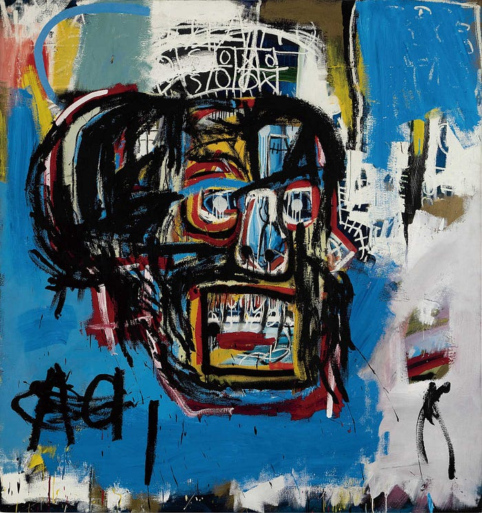
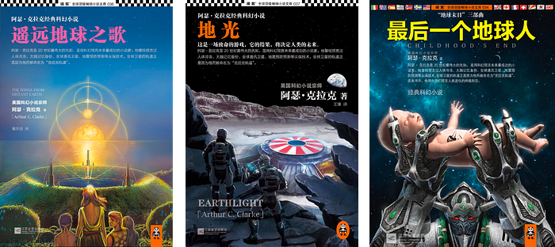
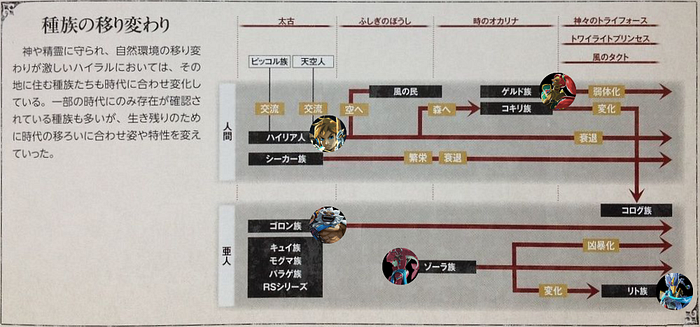
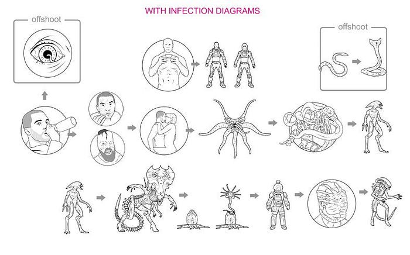
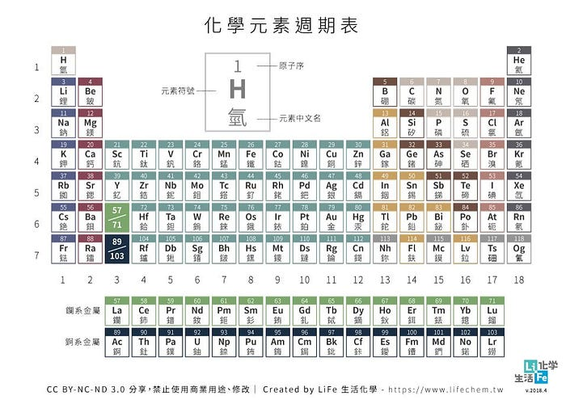
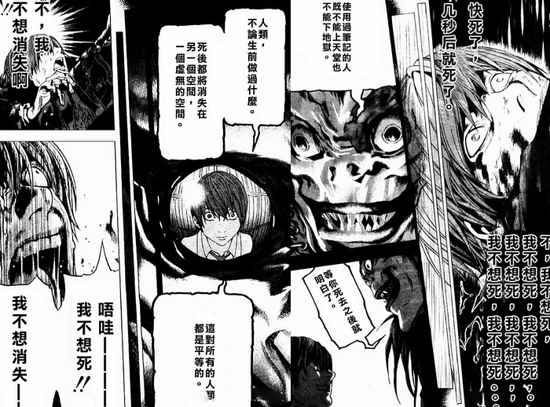
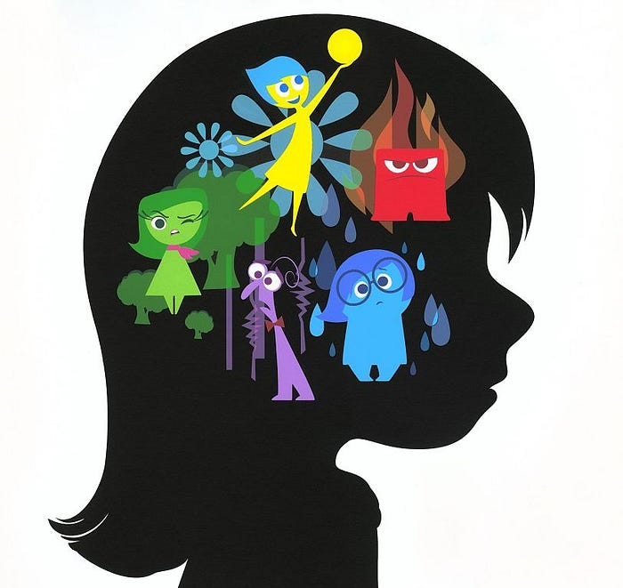

---

### 新聞

#### 1、財神和前澤

日本大型線上時裝購物網 Zozotown 創辦人前澤友作，因新年打破最快達 100 億日圓營業額紀錄，所以決定當個大撒幣（誤）在 Twitter 上抽選 100 名網友，每人 100 萬日圓的紅包。沒想到，這則推文吸引超過 500 萬名網友的轉推，打破「[溫蒂漢堡](https://twitter.com/carterjwm/status/849813577770778624)」保持的 350 萬轉推數，成為 Twitter 有史以來最多人轉推的推文。

前澤友作，[2018 福布斯日本排名最富有人物](https://forbesjapan.com/feat/japanrich/)第 18 位。SpaceX 宣布其為全球首位私人月球旅行的乘客，並且提出「[親愛的月球](https://zh.wikipedia.org/wiki/%E4%BA%B2%E7%88%B1%E7%9A%84%E6%9C%88%E7%90%83)」計劃，邀請六至八位藝術家參加 2023 年進行的環遊月球之旅。

#### 2、財神對貝佐斯

再來看看另一位也想上太空的富豪，2018 福布斯世界排名最富有人物第 1 位的傑夫·貝佐斯「[宣佈離婚](https://www.ettoday.net/news/20190110/1352847.htm)」，很有可能因為財產均分而讓出世界首富之位，這將會是「史上最昂貴的離婚」，屆時前妻將因此成為全球女首富。

身為 Amazon 最大股東的貝佐斯，一共持有 8000 萬股的股票，如果平分財產，將導致貝索斯的持股佔比下降至 8.15 %，雖然仍遠超第二大股東 5.8% 的持股，但這勢必將削弱他對公司的所有權和所有權。

#### 3、財神的精確度

節錄自 [ifanr 報導](https://www.ifanr.com/1158813)：

> 2018 年一共產生了 72 萬億美元成本的塑膠垃圾。
> 72 萬億美元可以買到什麼？
> 72 萬億美元能同時買下 Apple、Google、微軟、Amazon、Facebook 還有找⋯⋯。
> 如果有人把地球上所有廢棄塑膠都回收起来，那麼下一位全球首富就是他的了。

身為一個無法得知金融交易內線消息、只能計較 KPI 那點小錢的工薪階層，富豪們的世界實在離我太遙遠了⋯⋯。財神哪一天能找上門呢？

### 文摘

#### 一個末日，各自表述

本周，我想分享[克拉克](https://zh.wikipedia.org/wiki/%E4%BA%9E%E7%91%9F%C2%B7%E6%9F%A5%E7%90%86%E6%96%AF%C2%B7%E5%85%8B%E6%8B%89%E5%85%8B)的《地球末日》三部曲，分別是《遙遠地球之歌》、《地光》和《最後一個地球人》。

阿瑟·克拉克，最知名的科幻小說作品是《[2001 太空漫遊](https://zh.wikipedia.org/wiki/2001%E5%A4%AA%E7%A9%BA%E6%BC%AB%E9%81%8A_%28%E9%9B%BB%E5%BD%B1%29)》，與[艾西莫夫](https://zh.wikipedia.org/wiki/%E8%89%BE%E8%90%A8%E5%85%8B%C2%B7%E9%98%BF%E8%A5%BF%E8%8E%AB%E5%A4%AB)、[海萊恩](https://zh.wikipedia.org/wiki/%E7%BE%85%E4%BC%AF%E7%89%B9%C2%B7%E6%B5%B7%E8%90%8A%E5%9B%A0)並稱為二十世紀三大科幻小說家。

用一句話概括《地球末日》系列，那就是「一個地球末日，各自表述 」：

1. 遙遠地球之歌：環境如何毀滅地球
2. 地光：人類如何毀滅地球
3. 最後一個地球人：未知如何毀滅地球

以下，聊聊一些我覺得有趣的部分。

#### 遙遠地球之歌

故事發生在地球得知 1600 年後太陽會爆炸，礙於現有科技無法馬上離開太陽系，人類面臨兩個抉擇：

* K 策略「少數個人生存主義」
* R 策略「多數高機率生存主義」

最後選擇了如魚產卵般的 R 策略，成功讓人類後代在幾個太陽系外的恆星系生存下來。

因為環境的關係，這些人類已經演化成了非當初地球人的型態（相貌大變化、一張白紙重新來過的全新道德觀、各系之間的人類互相沒往來）。

這讓我想起《薩爾達傳說》的種族，雖然彼此之間差異大，但也都是從人類和亞人演化而來的。

這也解釋了，為什麼電影中的外星人都長得像人類。成本考量？想像力受限？或許我們真的都是「[尼比魯](https://zh.wikipedia.org/wiki/%E5%B0%BC%E6%AF%94%E9%AD%AF)」星人的後裔，而非猿類？

#### 地光

22 世紀如果一定要搶資源的話，那可能就是金屬。

回顧人類幾千年的資源搶奪史：搶錢、搶糧、搶娘們。

後來，隨著科學的進步，只要有了能源，財富、糧食、人口，就都好解決了。所以到了 20 世紀和 21 世紀，人類基本就只剩下搶能源了。

科學家預計，人類很有希望在 21 世紀徹底解決能源問題。解決的方案就是可控「[核融合](https://blog.amowu.com/p/ca8eb59e-6ad1-4b89-86f2-1b8dcfb7f74c/%E6%A0%B8%E8%9E%8D%E5%90%88)」技術。只要這個技術突破了，那大海或月球上，核燃料有的是。

到了 22 世紀，人類是不是就什麼都不用搶了呢？人類接下來搶的東西，應該會是稀有的元素，也就是金屬。

宇宙剛出現的時候，只有氫元素和氦元素。恆星是宇宙的煉金爐，恆星生產的元素有三種：

1. 把兩個原子序是 1 的氫原子合在一起，變成一個原子序是 2 的氦。
2. 太陽生命的最後階段，會變成一顆紅巨星，相當於太陽爆炸。這個時候溫度高、壓力大，就能生產原子序是 6 的碳元素，或者原子序是 8 的氧元素，最多只能生產原子序數到 26 的鐵元素。
3. 只有質量大於太陽 1.44 倍的恆星，才有資格發生二次爆炸，這個過程叫超新星爆發。超新星爆發提供的溫度和壓力，才能生產原子序 26 以上的元素。

要合成像金銀這樣的元素，需要報廢掉一個 8 倍太陽質量的恆星。用這麼高昂的代價所製造的金屬元素，它們都是這個宇宙最稀缺的東西。

所以，宇宙所有元素生產的規律就是：原子序數越往後，就越難被生產出來。

原始人最開始使用水、火、土、石頭和獸皮來生活，這些東西的元素組成都很簡單，基本上就是原子序數 30 以下的氫碳氮氧矽磷。這些元素也是所有低等生命賴以維生的基本元素。

後來人類掌握了冶煉技術，就能利用原子序數 20 至 60 之間的鐵、銅元素，製造工具、汽車和飛機。在掌握了更高級的知識之後，我們才能用得上後面原子序數分別是 92 和 94 的鈾元素和鈽元素來造原子彈。

到了 21 世紀，隨便選一個原子序數 100 以上的金屬元素，它一定在工業上佔一席之地，甚至可能支撐一個產業。

整個人類的發展史，就是一個在元素週期表往上爬的過程。一個文明能利用的元素越後面，代表這個文明的層級越高。

如果這個規律成立的話，未來人類在科技進步的過程中，對原子序數高的金屬的需求量一定會變得越來越大。原本你看到的那些金字旁、不知道怎麼讀音的元素，第一反應通常是，這東西和我沒啥關係；但現在不一樣了，你知道它在未來可能是對人類非常重要的資源。

#### 最後一個地球人

文明的兩大哉問：

1. 如果文明的目的是生存，那世界大同能不能算是一個文明的頂點？人類社會如何實現世界大同？
2. 如果生存的終點是滅亡，那人類終將面對死亡。怎樣的信仰能夠最好地面對死亡？

故事講述文明水平高出人類一個層級的外星文明「Overlord」來到地球，居然在十多年的時間內幫助人類建立一個世界大同的理想國，實現了人類追尋了幾千年的社會目標。

怎麼實現世界大同？Overlord 只做了兩件事，第一次，毫髮無傷地抵擋住了人類的核彈攻擊。第二次，擋住太陽。就這兩件事情，分別樹立起了「絕對防禦」和「絕對攻擊」的威信，。

鬧了半天，我們人類距離所謂世界大同，缺少的不是愛和什麼兩岸一家親，我們缺少的是一個攻守兼備、絕對優勢的武力。

任何一個信仰，都不可避免的一個話題，就是對死亡的解釋。好的信仰應該可以讓人不恐懼死亡，讓一個人變得坦然。只要你的信仰夠深，無論什麼時候想到最終的結局，心裡都能夠不慌張，甚至是一片祥和。

人們能接受死亡的兩種原因：

1. 有希望，例如：輪迴轉生論
2. 有意義，例如：奉獻式的犧牲小我、完成大我。

一個信仰哪怕再惑眾，人類還是有那個想象力填補上的。但是你要是一點素材都不給我，那我就要徹底絕望了。

最恐怖的不是死亡本身，而是死亡本身沒有任何希望、沒有任何意義。

#### 小丑與白痴

本周，看了一部想像力爆棚的皮克斯動畫電影《[腦筋急轉彎](https://zh.wikipedia.org/wiki/%E8%85%A6%E7%AD%8B%E6%80%A5%E8%BD%89%E5%BD%8E_%28%E9%9B%BB%E5%BD%B1%29)》（Inside Out），導演將人類大腦的五種情緒給擬人化，然後透過情緒之間的相互作用，將影響人類性格與情感的因素給擬物化（核心記憶、個性島嶼、抽象空間、造夢製片廠、潛意識監獄、記憶廢墟和遺忘深淵）。著實有趣，極富創意。

至於故事的劇情就不在這裡提了，保留樂趣給還沒看過的人去挖掘。影評之類的文章，網路上也已經一籮筐了。說說我看完這部劇之後，唯一的感想。

吳宗憲曾經說過：

> 一個人的歡喜跟悲傷，他是要一比一的。那個比例如果出現誤差的話，你就是生病了。小丑跟白痴，他最大的差別在哪裏？白痴不知道什麼時候要停止；小丑知道，他下班了，他就會停止。

[吴宗宪：你知道小丑和白痴的分别吗？ 一个人的欢喜跟悲伤，它是要一比一的。 如果那个比例出现误差的话，你就是生病了。…](https://www.facebook.com/watch/?v=156367621192907)

### 本周金句

> 一個人能同時保有全然相反的兩種觀念，還能正常行事，是第一流智慧的標誌。

> ―― [費茲傑羅](https://zh.wikipedia.org/wiki/%E5%BC%97%E6%9C%97%E8%A5%BF%E6%96%AF%C2%B7%E6%96%AF%E7%A7%91%E7%89%B9%C2%B7%E8%8F%B2%E8%8C%A8%E6%9D%B0%E6%8B%89%E5%BE%B7)

> 基礎決定高度，細節決定深度。
