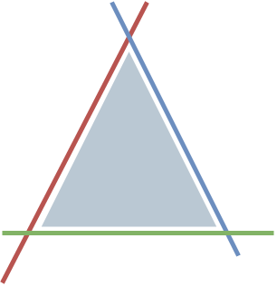
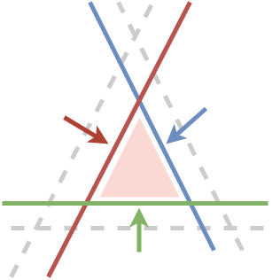
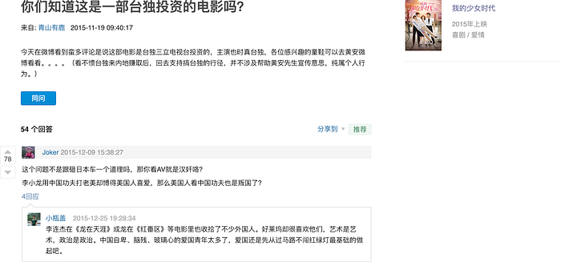
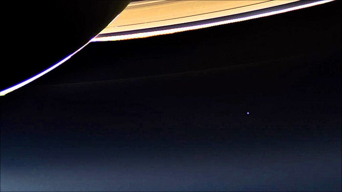

### 新聞

#### 三條底線理論

上周，台北市長柯文哲在專訪中談到兩岸的時候，提出了一個「三條底線」理論。聽完之後覺得有趣，故整理之後分享上來。

八年前，美中台三方的底線分別如下：

1. 美國的底線：台灣不能成為中共的軍事基地，突破[第一島鏈](https://zh.wikipedia.org/wiki/%E7%AC%AC%E4%B8%80%E5%B3%B6%E9%8F%88)。
2. 中國的底線：台灣不能法理上搞獨立，變更國旗和國號。
3. 台灣的底線：中共不可以實質上統治我，人民不希望發生戰爭。

現在，因為美中對抗的關係，三方的底線有了變化：

1. 美國：台灣應該要對中國再強硬一點
2. 中國：台灣應該表示將來願意統一
3. 台灣：人民無法接受兩岸一家親

三條底線都向內縮的結果就是，台灣的空間越來越小。政治人物會越來越難做，因為拿到的考卷題目會越來越難。

> 考第一名的條件是，第二名考得比你差

我們對政治人物的期望是不對的，不是誰當上總統，然後就突然天下太平了。國家之力量在國民全體，整個國家，如果每個國民都做好了，國家最後才會變好，如果國家的基礎結構不是很好，換誰當總統也一樣。

柯 P 提到，他最佩服的美國總統是雷根，聽說他晚年老年癡呆症，結果他還可以做得很好。這表示什麼，當總統不一定要很厲害，每一件事情都有人可以幫你處理。

歐美首長連任失敗的案例很少見。通常前兩年要先處理前人的東西，第三四年才是開始做你要做、想做的東西，可是要做的東西要好幾年，結果第四年一到，沒政績，就中斷了。這對整個台灣的地方政治是很大的傷害。

民調治國，如果一年就要看到成果，為了扭轉民調，政治人物就會被迫要開始做那些「短利」的事情。雖然大家聽起來會不爽，但跟那些歐美老牌民主國家比較，我們的平均國民水準沒那麼高，這是事實。

弱國無外交，自己的經濟實力要夠。90 年代為什我們很好過？那時台灣的 GDP 佔全中國 43%，2017 掉到只剩 4.6%。假如現在還是 43%，那什麼和平協定都好談；沒有實力，無論是簽了條約、談了共識，歷史證明，哪一個有效的？

過去 20 年台灣國力損耗太多。如果像九二一大地震一發生，全世界電腦價格就要上漲的時候，那台灣就很安全了。如果有一天，台灣出事，全世界經濟會金融風暴，台灣就安全了。所以不是什麼簽協定的問題，是先壯大自己的問題。

> 教育興則國家興，教育強則國家強

要是台灣出現一位有辦法同時說服中國和美國底線的人，就實在是太了不起了。這不是不可能的事，這就是智慧。中國可以不仁，台灣不可以不智。

> 惟仁者，能以大事小；惟智者，能以小事大

### 文摘

#### 圍城

人生有三座圍城：婚姻、事業與自我。

婚姻這座圍城，外圍的人想進去，裡面的人想出來。

美好的愛情永遠只能停留在記憶與想像裡，一但落到現實的柴米油鹽之中，就會失去原來純粹的模樣。每個男人的生命中都會有一朵白玫瑰和一朵紅玫瑰，無論娶了哪一朵，最終都會是遺憾。最完美的是永遠得不到的那朵玫瑰。

最近剛好看了《[我的少女時代](https://zh.wikipedia.org/zh-tw/%E6%88%91%E7%9A%84%E5%B0%91%E5%A5%B3%E6%99%82%E4%BB%A3)》和日本翻拍的《[那些年，我們一起追的女孩](https://zh.wikipedia.org/wiki/%E9%82%A3%E4%BA%9B%E5%B9%B4%EF%BC%8C%E6%88%91%E5%80%91%E4%B8%80%E8%B5%B7%E8%BF%BD%E7%9A%84%E5%A5%B3%E5%AD%A9_%28%E6%97%A5%E6%9C%AC%29)》，剛好可以解釋為什麼這種純愛片，既老梗又狗血，卻還是有市場（包括我），因為走的都是這個套路。

小時候不理解《[灌籃高手](https://zh.wikipedia.org/zh-tw/%E7%81%8C%E7%AF%AE%E9%AB%98%E6%89%8B)》結局為什麼不讓湘北拿冠軍，後來作者井上雄彥在[訪談](https://movie.douban.com/subject/4849922/)中回答：「因為青春，往往是不完美的」。

人終其一生，都努力想要活成別人所期待的樣子。也許「自我」才是最大的一座圍城。

有時候，才子的信手捻來卻勝過平庸之輩的嘔心瀝血，指的就是[錢鍾書](https://zh.wikipedia.org/wiki/%E9%8C%A2%E9%8D%BE%E6%9B%B8)的《[圍城](https://zh.wikipedia.org/wiki/%E5%9B%B4%E5%9F%8E_%28%E5%B0%8F%E8%AF%B4%29)》吧。

---

題外話，前陣子在豆瓣[討論區](https://movie.douban.com/subject/26366465/questions/63797/?from=subject)，看見下圖這段會心一笑的回覆：

#### 維梅爾的帽子

這是一部講述「從一幅畫看十七世紀全球貿易」的作品，其中最令我印象深刻的一段話：

> 人非孤島，無人可以自全。整個世界的歷史，無論是屠殺還是成就，都是我們共同的遺產；每個民族乃至每個人的命運，也都是整個世界的縮影。

這讓我想起 NASA 的[航海家 1 號](https://zh.wikipedia.org/zh-tw/%E6%97%85%E8%A1%8C%E8%80%851%E5%8F%B7)在完成任務之後，即將飛出太陽系之際，拍攝了最後一張地球的照片，天文學家[卡爾·薩根](https://zh.wikipedia.org/wiki/%E5%8D%A1%E5%B0%94%C2%B7%E8%90%A8%E6%A0%B9) 那段關於《[暗淡藍點](https://zh.wikipedia.org/wiki/%E6%9A%97%E6%B7%A1%E8%97%8D%E9%BB%9E)》的經典名言：

> 看一眼這個小點。
> 在這裡。這就是家。這就是我們。
> 在這個小點上，每一個你愛的人，每一個你認識的人，每一個你聽說過的人，每一個人，無論他是誰，都曾經生活過。
> 我們所有的快樂和掙扎，數以千萬自傲的宗教信仰、思想體系觀念意識，以及經濟學原理教義，每一個獵人或征服者，每一位勇士或是懦夫，每一個文明的締造者或摧毀者，每一位君王或農夫，每一對陷入愛河的年輕伴侶，每一位為人父母者，所有充滿希望的小孩，發明家或探險者，每一位靈魂導師，每一個腐敗的政客，每一個所謂的「超級巨星」，每一個所謂的「最偉大領袖」，每一位我們人類史上的聖人或是罪人……我們的一切一切，全部都存在於這樣一粒懸浮在一束陽光中的塵埃上。
> （略）
> 地球，目前我們唯一已知有生命居住的世界。沒有其它任何一個地方，至少在不遠的未來，可供我們這一物種移民。去看看，可以。常駐，不可能。不管你喜歡還是不喜歡，目前為止只有地球是我們的立足之地。
> 天文學是一門謙卑的、同時也是塑造性情的學問。沒有什麼能比從遙遠太空拍攝到的我們微小世界的這張照片，更能展示人類的自負有多愚蠢。於我而言，這也是在提醒我們，我們的責任：互相間更加和善的對待彼此、維護和珍惜這顆暗藍色的小點，這個我們目前所知唯一共同的家園。

### 本周金句

1、

> 人造物表現得越來越像生命體，而生命變得越來越機械化。
> 古希臘只有自由男人才有投票權，但歷史的發展，不斷地把女人、奴隸、異族人、不同種族和膚色的人，甚至是動物、植物等等都放進了倫理主體的範疇。未來，機器也會進來。――《前沿科技之腦機接口》

2、

> 如果全人類 都有讀心術
> 或許有一點殘酷 但也省去些痛苦
> 我口是心非 是不得不
> 這樣流連在你身邊 才不會顯得太突兀―― 韋禮安《[Luvin’ U](https://www.youtube.com/watch?v=aN7R2Y28F68)》

> 誠實且和平的世界是最美好的，可是，兩者相比的話，比較重要的是和平吧？――《獵人》

3、

> 人可以沒投資，但是不能沒保險。――《[保哥和八姐](https://mp.weixin.qq.com/s/gTioASlvK7kt9bAmz2epWw)》

4、

> 成功就是把正確的簡單事反覆做――《[我的幾個每月必做例行任務](https://sspai.com/post/52149)》

5、

> 昨日的額外功能會變為今日的核心功能，今日的核心功能會變成明日的基礎功能。――《[硅谷產品大佬們寫的書 Ship it 到底在講什麼？](https://sspai.com/post/52240)》
