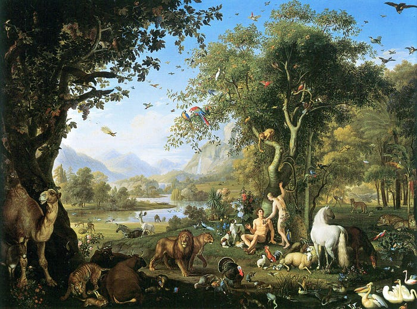

古人有「立德」、「立功」、「立言」三不朽之説，認為最完美的人生境界就是在道德、文章及功業方面均有建樹，此為真「[三不朽](https://zh.wikipedia.org/wiki/%E4%B8%89%E4%B8%8D%E6%9C%BD)」。

據説在中國歷史上，只有兩個半人能達到三不朽境界，一個是儒家創始人[孔子](https://zh.wikipedia.org/wiki/%E5%AD%94%E5%AD%90)，另一個是明代著名思想家[王陽明](https://zh.wikipedia.org/wiki/%E7%8E%8B%E5%AE%88%E4%BB%81)，還有剩下的半個是清朝中興名臣[曾國藩](https://zh.wikipedia.org/wiki/%E6%9B%BE%E5%9B%BD%E8%97%A9)。

本周讀了其中兩位的相關著作，分別是《[王陽明：一切心法](https://book.douban.com/subject/26879317/)》和《[曾國藩的正面與側面](https://book.douban.com/subject/5922204/)》，剛好可以分享心得。

### 《王陽明：一切心法》

南宋理學家[朱熹](https://zh.wikipedia.org/wiki/%E6%9C%B1%E7%86%B9)學問也大，為什麼沒有王陽明今天的地位呢？因為他只停留在思想家這個階段。

如果你的思想能夠用於你在現實世界當中建功立業，對我們這代人就意味著所謂的「成功學」，也就是自己的內心變化可以直接轉化為現世的利益和功勳。

作為三不朽代表人物之一的孔子，為什麼儒學很難出現在書架上，讓現代人感興趣呢？

過去的中國皇權，如果沒有世世代代的儒生不計生死，衝上去阻止皇帝幹壞事，那麼中國的皇權只會更加惡劣。

但是到了民國之後，因為皇權不在了，儒家的思想看起來就與成功學搭不上關係了，因為儒家追求的根本就不是成功。儒家追求的就兩樣東西，一個仁、一個義，誰跟你講利益？成功學在我這是要不到的。

王陽明的「心學」也是儒學的一個分支，它的目標和儒學是一致的，那就是當聖賢、做君子，達到「修身、齊家、治國、平天下」的境界。

傳統上，達成這個目標的方法我們很熟悉，就是參加考試。古代的儒生想當聖賢，首先要把聖賢書先讀好，找個人格榜樣，向他學，還有向他的那些徒弟們學。這是「向外求」。

但是王陽明不這麼想，他認為要「向內求」。

> 孔子是聖賢，我不是嗎？他是人，我也是人，憑什麼他是聖賢，我就不是呢？區別就在於，我本來也是聖賢，只是我的心靈被各種亂七八糟的東西給污染了。

> 無善無惡心之體；有善有惡意之動；知善知惡是良知；為善去惡是格物。

人性本無善惡，但是一旦跟世界接觸，意念一動，就出現了善惡之分。每個人的心裡都有一把尺叫良知，用這個良知去判斷善惡，最後為善去惡，[格物致知](https://zh.wikipedia.org/zh-tw/%E6%A0%BC%E7%89%A9%E8%87%B4%E7%9F%A5)。

#### 知行合一

王陽明的另一思想「知行合一」是什麼意思呢？狹義的理解是「不要說一套，做一套」。

更深一層的理解呢？

首先，是提升自己的認知，來驅動更正確的行為。舉個投資的例子，「行」很簡單，[樹精靈](https://www.cathaysec.com.tw/exclude_AL/tree_elf.aspx)點兩下，就「錢出去、股票進來」了。但是你有「發大財」嗎？知道哪個公司能投資，將來會漲，這個「知」是極難提升的。這就是「以更高的知來驅動正確的行」。

反過來說，所有「行」的目的，都是要提升自己的「知」。

為什麼知行合一對我們這代人來說特別難？因為從知到行當中有條鴻溝叫「選擇」。

我們這代人就是選擇太多，分分鐘就面對大量的選擇，看起來似乎是好事，但是它在撕裂我們的認知，每一個選擇的背後都有道理，但是一旦面臨選擇的時候，就會產生碎片化的焦慮，衍生出拖延之類的負面效應。

人性有兩個基本的訴求，分別是「意義」和「規範」。我為何而活？為了這個目標，我怎麼活？這兩個東西一有，幸福感油然而生。

### 《曾國藩的正面與側面》

接著另一位三不朽代表人物，後人是這麼評價曾國藩的一生：「立德立功立言三不朽，為師為將為相一完人」。

曾國藩解[太平天國之亂](https://zh.wikipedia.org/wiki/%E5%A4%AA%E5%B9%B3%E5%A4%A9%E5%9B%BD)，救清廷與累卵之間，是為立功；有家書傳世，著書立說，清末民初的[嚴復](https://zh.wikipedia.org/wiki/%E5%9A%B4%E5%BE%A9)、[林紓](https://zh.wikipedia.org/wiki/%E6%9E%97%E7%B4%93)，以及[譚嗣同](https://zh.wikipedia.org/wiki/%E8%B0%AD%E5%97%A3%E5%90%8C)、[梁啓超](https://zh.wikipedia.org/wiki/%E6%A2%81%E5%90%AF%E8%B6%85)等人均受他的文風影響，是為立言；但也因前有鎮壓太平軍，後處置天津教案不利，德行受損，難以立德。因此只被封為半個三不朽。

曾國藩年輕時深受儒家熏陶，後來又帶兵打仗，採用法家的嚴刑峻法來治兵治民，這儒、法兩家思想體系結合在一起，讓自己的意識形態變得非常僵化和嚴酷，而且性格上又太固執，做事強硬，所以在旁人眼裡，曾國藩做人做事都缺少寬容和彈性。長此以往，就成了官場上的孤家寡人，給人排擠出去。

後來的他心態轉變了，開始站在第三方角度來審視自己。找出《[道德經](https://zh.wikipedia.org/wiki/%E8%80%81%E5%AD%90_%28%E6%9B%B8%29)》和《[南華經](https://zh.wikipedia.org/wiki/%E8%8E%8A%E5%AD%90_%28%E6%9B%B8%29)》這些道家和佛教的經典來幫助自己提升思想境界。

在反思的過程中，他結合了道家的無為和辯證思想，真正理解了老子所說的「天下之至柔，馳騁天下之至堅」的道理。漸漸懂得政治家的處事態度一定要謙退、理性，要把官僚體製作為實現政治理想的工具，而不是時刻想著去反抗破壞這個系統。另外，官場上最基本的運行機制是利益，利益才是人與人合作最廣泛的共識，因為利益可以協商、可以分割，還可以交換，政治家必須要學會用利益來吸納更多同盟者為自己服務。

終於，曾國藩完成了從一個政治空想家到成熟的政治家的轉型。

有人批評曾國藩為什麼要貪污受賄呢？因為他必須依靠政治利益在官場上跟別人打交道，不得不接受已有的官場潛規則，但這些行為不是他做官的目的，而是他處事的手段。

曾國藩面對自己的時候，他是一個問心無愧的聖賢；而當他面對整個官場的時候，他又是一個圓滑務實的政治實幹家。他對西方文明的寬容，最終讓中國這個老舊帝國邁出走向近代化的第一步。

> 上帝要想懲罰人類，大概有幾種方式：一場飢荒、一場瘟疫，或者一場戰爭；但還有一種方式，就是在人間降臨一個道德家，如果這個人的道德目標一般人做不到，而且他還有強大的煽動力的話，這個人很危險，是人類的災難。―― 錢鐘書

我們過去都以為，貪官才是惡人，但[劉鶚](https://zh.wikipedia.org/wiki/%E5%88%98%E9%B9%97)認為，清官可能更惡。因為貪官幹的那些事，他自己知道不道德，他不敢光明正大地幹。但是一個清官，如果他覺得自己有道德追求，幹這些事又不是為了自己，那麼他幹起壞事來會完全沒有底線。
