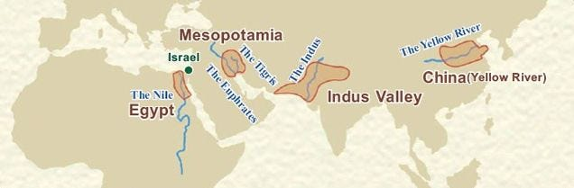
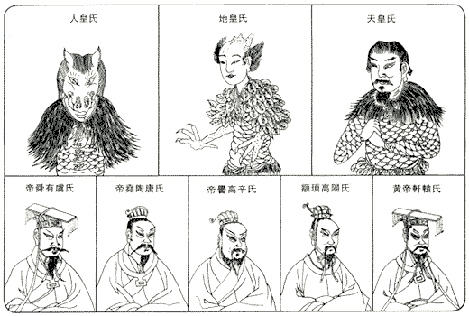
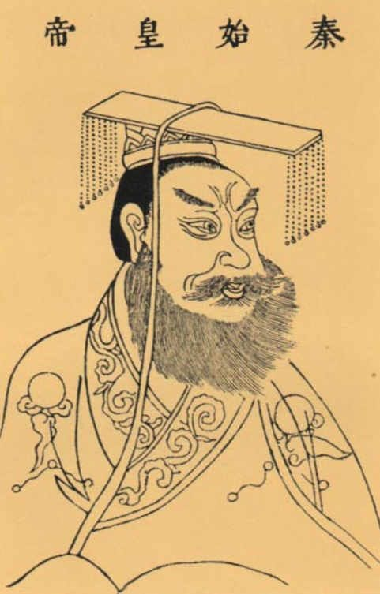
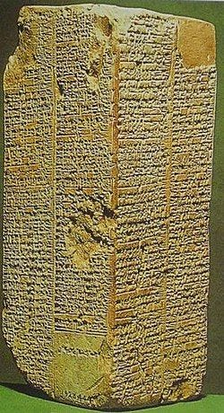

### 三皇五帝

考古學上，鑑定文明的標準有三條：

1. 城市（人口五千人以上）
2. 文字
3. 非居住用建築群（宗教、政治或經濟，例如：金字塔）

如果不能同時符合這三條，就只能被稱作「神話時代」。

作為「[四大古文明](https://zh.wikipedia.org/wiki/%E6%96%87%E6%98%8E%E6%91%87%E7%AF%AE)」之一的中華文明，其時間長度一直存在著爭議。西方學者只肯承認有甲骨文記載以後的 3000 年歷史（商朝），日本則是承認從夏朝開始的 4000 年歷史，而傳統中華文化圈的民間認知上，通常會從「[三皇五帝](https://zh.wikipedia.org/wiki/%E4%B8%89%E7%9A%87%E4%BA%94%E5%B8%9D)」的神話時代開始算起，約有 5000 年歷史。

#### 什麼是三「皇」五「帝」？

中國古代對於皇、帝、王的區分是很明確的。

「皇」指的是天神，「帝」是僅次於皇的存在，再往下才叫「王」（人類真正的首領）。

根據《[史記](https://zh.wikipedia.org/wiki/%E5%8F%B2%E8%AE%B0)》記載，三皇分別為伏羲、神農和女媧，屬於天神級別。五帝則分別為黃帝、顓頊、嚳、堯和舜，屬於「半人半神」的存在。

#### 為什麼後來的王都自稱「皇帝」？

四大文明古國的君王，都有屬於自己的一套「稱帝」說法，例如：巴比倫的統治者[漢摩拉比](https://zh.wikipedia.org/wiki/%E6%B1%89%E8%B0%9F%E6%8B%89%E6%AF%94)自稱為「月神的後裔」、古埃及的法老則自稱是「太陽神的兒子」。

中國的周朝，因為皇和帝都不在了，人類的君王為了張顯自己的地位，也開始自稱「天子」，到了秦始皇之後更是直接取「皇帝」二字來用，自此「皇、帝、王」稱號被統一。

#### 為什麼「皇」和「帝」這些級別的人物都不見了呢？

發現於[美索不達米亞](https://zh.wikipedia.org/wiki/%E7%BE%8E%E7%B4%A2%E4%B8%8D%E8%BE%BE%E7%B1%B3%E4%BA%9A)地區的「[蘇美王表](https://zh.wikipedia.org/wiki/%E8%8B%8F%E7%BE%8E%E5%B0%94%E7%8E%8B%E8%A1%A8)」，列舉了蘇美文明歷代的統治者以及統治的時間。如果按照王表記載，那些早期的君王統治時間都非常長（幾萬年起跳），怎麼看都不像人類，應該是類似於三皇五帝級別的神話人物。

有趣的是，蘇美文獻《巴比倫尼亞志》所提到的「[大洪水](https://zh.wikipedia.org/wiki/%E5%A4%A7%E6%B4%AA%E6%B0%B4)」之前的諸王，與蘇美王表中的記載驚人的吻合，不僅人名相同，而且連統治的時間也完全一樣。

大洪水是世界上多個文明都有提到的共同傳說，例如《[舊約聖經](https://zh.wikipedia.org/wiki/%E6%97%A7%E7%BA%A6%E5%9C%A3%E7%BB%8F)》的《[創世紀](https://zh.wikipedia.org/wiki/%E5%89%B5%E4%B8%96%E8%A8%98)》、上述提到的「[古巴比倫傳說](https://zh.wikipedia.org/wiki/%E5%90%89%E5%B0%94%E4%BC%BD%E7%BE%8E%E4%BB%80%E5%8F%B2%E8%AF%97)」，以及中國的「[大禹治水](https://zh.wikipedia.org/wiki/%E9%B2%A7%E7%A6%B9%E6%B2%BB%E6%B0%B4)」。

有此可推測，天神和半人半神這些級別的角色，可能都是在大洪水之後，消失於人類的歷史之中。至於為什麼？最近看了一篇有趣的「[創神論](https://www.youtube.com/watch?v=iEeBnhMadkk)」觀點，或許可以解釋其原因。

#### 創神論

關於「[人類的起源](https://zh.wikipedia.org/wiki/%E4%BA%BA%E7%B1%BB%E8%B5%B7%E6%BA%90)」有三個流派：

1. 達爾文的進化論（目前的主流學說）
2. 神創論（歷史最悠久）
3. 外星生物創造論

但是達爾文曾經說過，最不符合進化論的就是人類自己，也許是為了給宗教有個台階下，不過如果能結合三方的觀點來切入，或許可以得到如下有趣的假設：

1. 假設某個高等外星文明（以下簡稱[尼比魯](https://zh.wikipedia.org/wiki/%E5%B0%BC%E6%AF%94%E9%AD%AF)），就是我們所謂的天神，祂們也有一樣的終極目標（尋找自己的起源與永生）
2. 尼比魯來到地球，模擬了一個與自己母星相似的環境（伊甸園？）
3. 尼比魯以某種方法（譬如電影《[普羅米修斯](https://zh.wikipedia.org/zh-tw/%E6%99%AE%E7%BD%97%E7%B1%B3%E4%BF%AE%E6%96%AF_%28%E7%94%B5%E5%BD%B1%29)》的 DNA）創造了一批類似於自己的生命體（人類），開始了祂們的實驗
4. 尼比魯也創造了一些級別較高的半神人（古文明早期的統治者），協助自己管理人類
5. 因為某些原因（鳥盡弓藏？忌憚威脅？），尼比魯以某種方法（譬如[月球](https://www.youtube.com/watch?v=uXEgyvQ9C6Y)）引發了大洪水，消滅了所有半神人，只留下人類來繼續觀察實驗

是否覺得與近年來「擔憂[人工智慧](https://zh.wikipedia.org/wiki/%E4%BA%BA%E5%B7%A5%E6%99%BA%E8%83%BD)威脅人類」的話題很相似？或許我們可以從尼比魯的故事之中，總結出一些預防的方法，例如：限制在沙盒中發展（火星？）、注入有限的生命（遠比人類平均壽命還短的生命週期），萬不得已之時還留有最後一手 — — THE 大洪水（`sudo rm -rf /usr/*`）。

整個宇宙也許就像《[百年孤寂](https://zh.wikipedia.org/wiki/%E7%99%BE%E5%B9%B4%E5%AD%A4%E7%8B%AC)》那樣不斷地輪迴，神創造了人、人再創造了神，生命之間彼此尋找自己起源的故事。

https://youtu.be/iEeBnhMadkk?si=tiP9AIN659pViKfn
