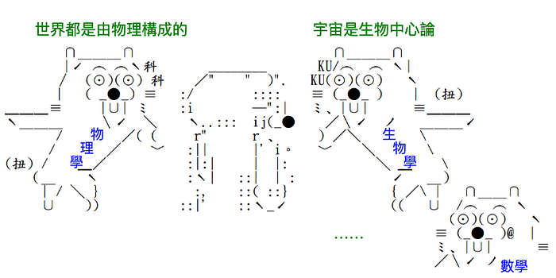
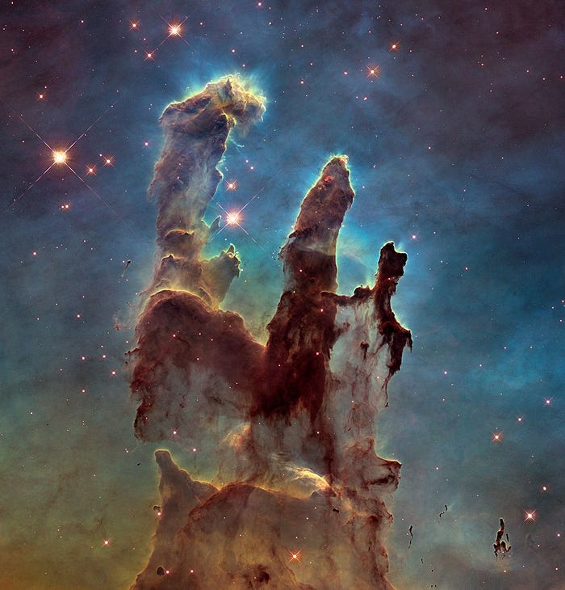
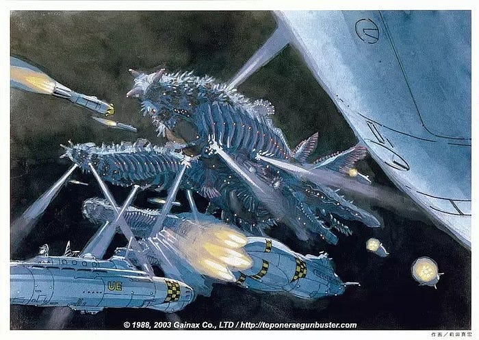
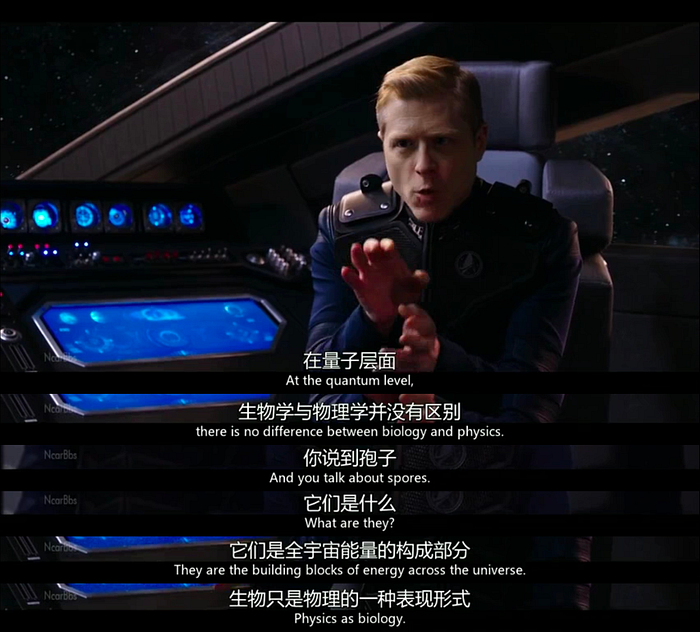
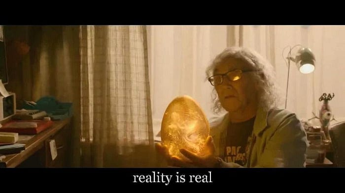
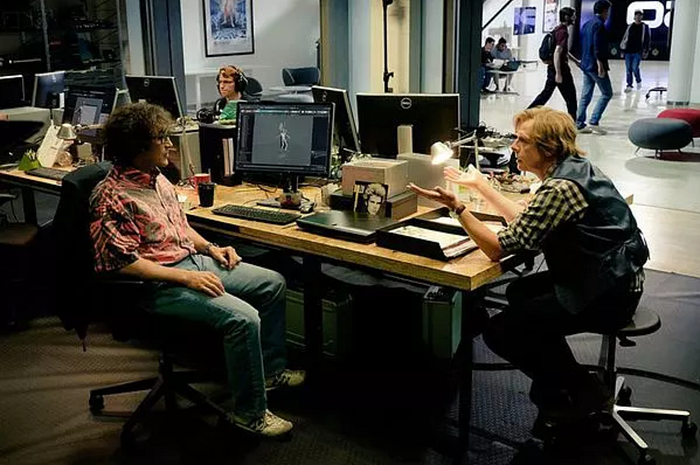

物理學家主張他們的研究領域是最基礎的科學。畢竟生物學、工程學、化學等等都必須依賴物理學中的物質、能量和交互作用。

但美國科學家 [Robert Lanza](https://en.wikipedia.org/wiki/Robert_Lanza) 認為，生物學才是宇宙的核心科學。他稱自己的理論為 [生物中心論](https://en.wikipedia.org/wiki/Robert_Lanza) （Biocentrism）。

以量子力學中著名的謎團「 [雙縫實驗](https://zh.wikipedia.org/wiki/%E9%9B%99%E7%B8%AB%E5%AF%A6%E9%A9%97) 」為例，朝屏幕上的兩道平行狹縫射出一束電子時，兩道狹縫的電子產生交互作用，形成干涉條紋。如果我們觀察電子穿過哪道狹縫，干涉條紋就不會出現，電子彷彿知道有人在觀察它們，而不再產生交互作用。

物理學家無法解答這個問題，但 Robert Lanza 認為答案很簡單：「因為我們的意識也是現實的一部份。」

相同邏輯也可套用在 [量子纏結](https://zh.wikipedia.org/wiki/%E9%87%8F%E5%AD%90%E7%BA%8F%E7%B5%90) 上，粒子不論相隔多遠，它們的特定量子態都會保持連結。Robert Lanza 說：「它們其實無法在星系的兩端彼此連結，而是因為空間和時間都是我們意識的工具。」

這讓我想起，科幻美劇《 [星際爭霸戰：發現號](https://zh.wikipedia.org/wiki/%E6%98%9F%E9%9A%9B%E7%88%AD%E9%9C%B8%E6%88%B0%EF%BC%9A%E7%99%BC%E7%8F%BE%E8%99%9F)》第一次出現的「孢子驅動」技術，太空飛船可以透過某種外星生物的 DNA，遨遊於整個宇宙的菌絲網絡之間。星際空間的移動能力簡直吊打「 [曲速引擎](https://zh.wikipedia.org/wiki/%E6%9B%B2%E9%80%9F%E5%BC%95%E6%93%8E) 」。

[via GIPHY](https://giphy.com/gifs/CBSAllAccess-star-trek-1gTQD5ma92KhxVstkI)

從《發現號》第二季的片頭中，也能找出一些端倪。例如：形似皮膚紋理的地形、你的眼是星象儀⋯⋯之類的生物特徵。彷彿在暗示整個《星際爭霸戰》的宇宙就是建立在生物中心論之上的。

其它類似設定的科幻作品，我能想到的還有 1988 年的動畫作品《 [勇往直前](https://zh.wikipedia.org/wiki/%E9%A3%9B%E8%B6%8A%E5%B7%94%E5%B3%B0) 》。

故事把「人類比作宇宙中的癌細胞，而宇宙怪獸是白細胞」的設定，是另一種值得深思的情節。（《寄生獸》既視感？）

最後，蓋上一張保羅哥打臉這個假說的牌，結束這燒腦的一回合。

一、

> *誠實且和平的世界是最美好的，可是，兩者相比的話，比較重要的是和平吧？*――《 [HUNTER×HUNTER](https://zh.wikipedia.org/wiki/HUNTER%C3%97HUNTER) 》

二、

> *獬豸，能審判善惡的傳說中的神獸。然而，你知道為何它只存在於傳說中嗎？因為想在現實中審判善惡，是不可能的。*――《 [獬豸](https://zh.wikipedia.org/wiki/%E7%8D%AC%E8%B1%B8_%28%E9%9B%BB%E8%A6%96%E5%8A%87%29) 》

三、

> *如果要走的快的話，一個人走；如果要走的遠的話，那要大家一起向前*

> ―― 柯文哲

四、

> *科學是對真相的探索
> 科學是一種思考方式，從「我不懂某事」開始
> 接著利用各種證據削弱「我不懂的事」
> 不管那會領向何種結果
> 最後都會得到一個結論
> 然後，首先會發生的
> 是有十個人會想找出其中錯誤
> 這叫做「團體失驗」
> 這樣的話，獲得肯定時，便是經過相當的測試
> 如果對這個過程產生仇恨
> 有點奇怪*

> ――《 [地球圓不圓](https://www.netflix.com/title/81015076) 》

五、

文章的最後，分享一部我在上周才看完的科幻電影，去年豆瓣外語電影評分第一，史蒂芬·史匹柏的《 [一級玩家](https://zh.wikipedia.org/wiki/%E4%B8%80%E7%B4%9A%E7%8E%A9%E5%AE%B6_%28%E9%9B%BB%E5%BD%B1%29) 》，以下節錄我最喜歡的部份：

> *我創造《綠洲》
> 因為我在現實世界裡，從未感到自在
> 我不知道怎麼跟人打交道
> 我一輩子都很害怕
> 直到我知道，生命即將結束的那一天
> 那時我領悟到
> 現實雖然很可怕又痛苦
> 但也是唯一
> 可以好好吃一餐的地方⋯*

> *我最大的遺憾就是⋯
> 失去唯一的朋友*

> *綠洲
> 絕對不該是單人遊戲
> 再會，帕西法爾
> 謝謝
> 謝謝你玩我的遊戲*

> ―― 哈勒代
