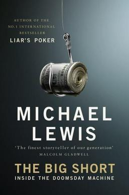
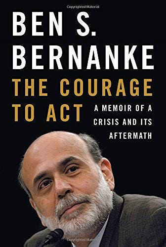
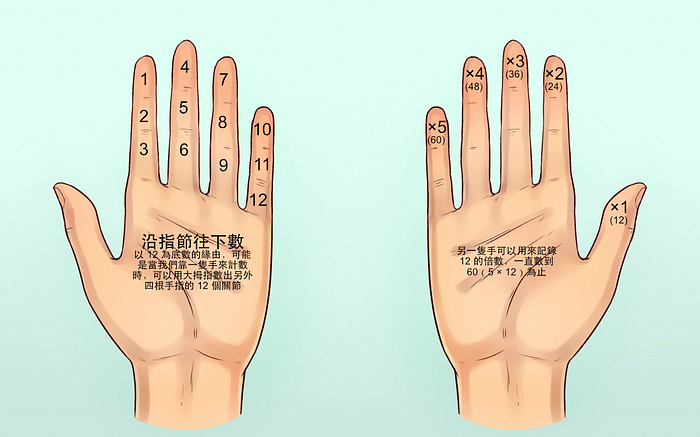
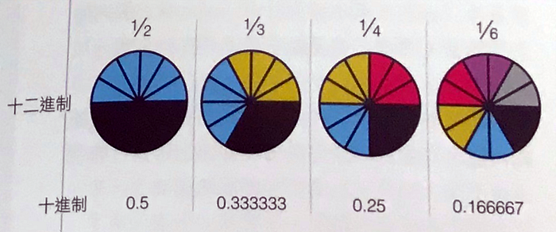

---

### 文摘

#### 《大賣空》

《[大賣空](https://zh.wikipedia.org/wiki/%E5%A4%A7%E8%B3%A3%E7%A9%BA)》（The Big Short）是一本由 Michael Lewis 所著，講述 2000 年代「[泡沫經濟](https://zh.wikipedia.org/wiki/%E6%B3%A1%E6%B2%AB%E7%BB%8F%E6%B5%8E)」題材的暢銷書籍。

賣空，也可以稱作「空頭」，是貫穿全書的一個核心概念。

說到「金融」這個詞，簡單一點的，股票、債券、基金，還有形形色色的理財產品；複雜一點的，結構性的資產證券化、衍生類的期權、期貨等等。但其實金融產品說白了，它就是一份「合約」。

只要是合約，就有買賣雙方：甲方和乙方。最多再有個經紀人：中間方。金融業說白了就是一個關於「風險和預測」的行業。能簽合約，通常說明雙方對一件事的風險和預測立場是不同的。覺得會漲的，我們就說他對未來「看多」，說他們是「多頭」；相反，那些覺得會跌的，是對未來「看空」，他們就是「空頭」。

《大賣空》講得就是「[美國次貸危機](https://zh.wikipedia.org/wiki/2007%E5%B9%B4%E2%80%932008%E5%B9%B4%E7%92%B0%E7%90%83%E9%87%91%E8%9E%8D%E5%8D%B1%E6%A9%9F)」之後，收穫巨大利益的四群人的故事，他們被稱作「大空頭」。

> 一個人要是沒有任何成見，就算再笨，也能理解最困難的問題。但是如果一個人堅信，擺在他面前的問題他早已瞭然於胸，毫無疑慮，那就算他在聰明也無法理解最簡單的事。

―― 托爾斯泰

#### 《行動的勇氣》

金融危機通常是指銀行過度向股票或房地產市場放貸，隨後泡沫破滅，銀行放出去的貸款收不回來，老百姓存在銀行裡的錢就取不出來，銀行不得不宣佈破產。這就是所謂的「擠兌」。一旦銀行出現了擠兌，那麼銀行首先需要保證盡量兌現儲戶的存款，而不得不停止向正常的企業發放貸款，從而導致一些企業出現資金鏈斷裂，進而出現大量的企業破產、工人失業等等一系列的惡性循環。簡單來說就是，銀行缺錢，企業缺錢，老百姓缺錢，最後經濟停擺。

美國次貸危機不同。美國的金融監管碎片化，出現了很多傳統銀行體系之外、形式多樣的金融機構。它們往往不是銀行，而是某某資產管理或信貸公司，但它們卻像傳統銀行一樣涉足房貸、抵押擔保和票據融資業務。它們的資金也不是來自於儲戶的存款，而是通過一種叫做短期票據市場再回購協議，從其它銀行和基金公司吸收存款。次級債券就是這樣一種金融產品。

次貸危機之後，一路調查下來才發現實在太荒唐了，沒有穩定收入的人都能貸款買 5 套房，甚至有人貸款用的還是自己家寵物狗的名字。那些看好房市的「多頭」不是瘋子就是傻子。

《行動的勇氣》這本書的作者，是次貸危機期間，擔任美聯儲主席的 Ben Bernanke，講述面對金融危機的市場混亂和政治派別之間的互相攻擊，深處漩渦中的決策者們，更多的是需要勇於擔當和勇於變革的進取之心，而不是怨天尤人和推卸責任的政治技巧。

美聯儲相當於台灣的央行，是美國最高級別的金融行業管理部門，美聯儲主席等同於我們的央行總裁。

美聯儲主席這個職位對世界經濟的影響深遠。美元是全球通行的貨幣，一旦美聯儲做出某個決定，不僅直接影響到規模龐大的美國經濟，也同時會影響全球的經濟走勢。可以說，美聯儲主席對世界的影響力可能僅次於美國總統。

### 新奇

#### 12 的力量

現代的「[記數系統](https://zh.wikipedia.org/wiki/%E8%AE%B0%E6%95%B0%E7%B3%BB%E7%BB%9F)」雖然大部分已經被十進制給取代，但仍可以在曆法、度量衡、語言和音階上看見「[十二進制](https://zh.wikipedia.org/wiki/%E5%8D%81%E4%BA%8C%E8%BF%9B%E5%88%B6)」的影子。

歷史上，很多古老文明中都以 12 這個數為基礎。或許是由於一年中月球繞地球轉十二圈，也有人認為這和人類一隻手有十二指骨節點有關（不包括姆指），這樣方便記數。

古埃及文明就將白天夜晚分別劃分為 12 部分，而從古巴比倫文明傳承到西方文化中的黃道十二宮則是將一年分為了 12 個星座。

在中國文化中，十二進位在記時中也有廣泛應用。中國古代設有 12 地支，與一天的 12 個時辰對應。一個地支還對應兩個節氣，從而表示一年的二十四節氣。同時，將地支與 12 種動物對應，成為十二生肖，來表示 12 年為週期的循環。

12 可以被 2、3、4、6 整除，這對度量衡制度很有用，因為在這些制度中，需要把較大的單位分成一半、三等分及四等分。

這讓我想起一位我很喜歡的天文學家 [Carl Sagan](https://zh.wikipedia.org/wiki/%E5%8D%A1%E5%B0%94%C2%B7%E8%90%A8%E6%A0%B9) 撰寫的科幻小說《[接觸未來](https://zh.wikipedia.org/wiki/%E6%8E%A5%E8%A7%B8%E6%9C%AA%E4%BE%86_%28%E5%B0%8F%E8%AA%AA%29)》。

> 如果真的有造物主的話，祂應該是十一根手指頭

在小說的最後，主角用十一進制，把圓周率 π 一直往下計算，π 本來應該是一個無限不循環的小數，但在計算到了 10 的 20 次方之後，驚人的事情出現了，π 從隨機分布的數字，變成了全部是 0 和 1 的組合。主角讓電腦對 0 和 1 進行了排列，發現用一個特定的行數和列數排列成一個正方形方塊的話，圖形是造物主本人的簽名。

為什麼在一個 π 裡藏一個圖形，是一件特別了不起的事呢？因為如果這個世間，有什麼知識是最難以撼動的。答案就是數學。

Carl Sagan 認為判斷一個文明的等級，可以透過該文明可以改變的知識理論來劃分。

學生時期，我們接受的教育包括：歷史、政治、語文、地理、化學、物理、數學等等。本來以為這些是確定性的知識，都有恆定的標準答案。但是，其實每種確定性的知識，都是會發生變化的。

綜觀歷史，一位強大的君王，能夠改寫該文明的歷史、政治，能改變一個國家的語言，能挖一條大運河，改變地理，一直到要近代改變化學，難度才會提高很多。而對於人類來說，最難改變的是物理學。至今為止，最厲害的人類，也只能理解物理規律，沒有誰能改變物理。

如果有個高等文明能夠掌握黑洞，那麼或許可以改變物理學，因為在黑洞的奇點沒有時間，引力無限大，一切物理定律都會失效。

但是，黑洞也改變不了的東西，是數學。因為包括黑洞在內的天體，都是符合數學規律的。我們可以這麼總結，在自然界，物理學覆蓋所有學科，但數學覆蓋了物理。

所以數學是最難以撼動的。而圓周率 π 是數學最基本的概念，是在宇宙被建立之初就存在的。所以，如果我們發現一個文明，能跑到 π 裡面去留一個簽名。祂一定就是最後的終極文明。
