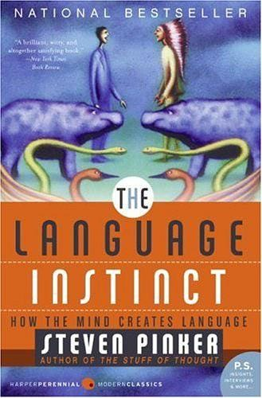
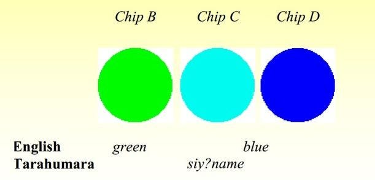
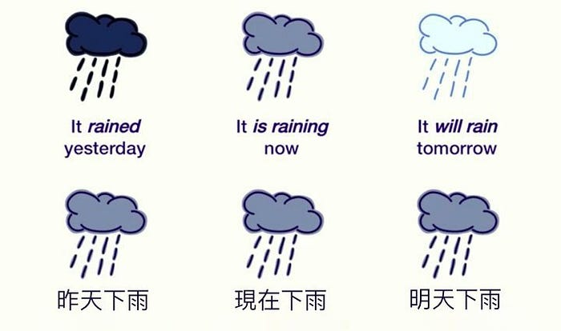
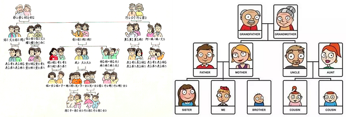
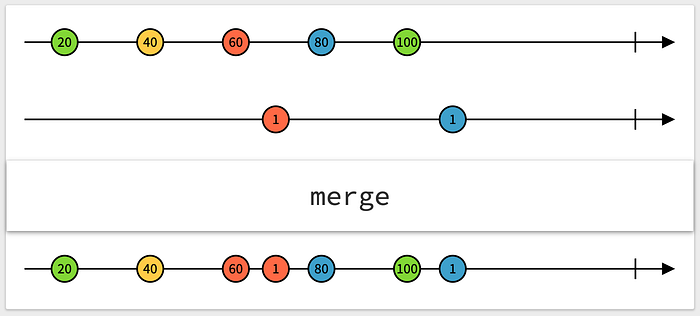
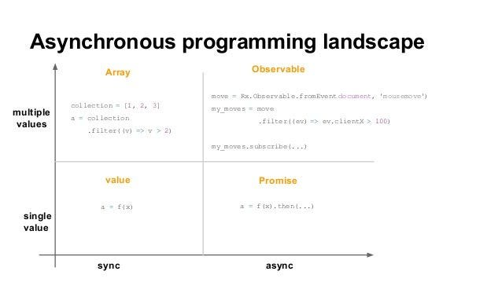

---

### 語言本能

本周閱讀 [Steven Pinker](https://zh.wikipedia.org/wiki/%E5%8F%B2%E8%BF%AA%E8%8A%AC%C2%B7%E5%B9%B3%E5%85%8B)「語言與人性四部曲」的《[語言本能：探索人類語言進化的奧秘](https://zh.wikipedia.org/wiki/%E8%AA%9E%E8%A8%80%E6%9C%AC%E8%83%BD)》時，提到了「[沙皮爾-沃爾夫假說](https://zh.wikipedia.org/wiki/%E8%96%A9%E4%B8%95%E7%88%BE-%E6%B2%83%E5%A4%AB%E5%81%87%E8%AA%AA)」。

> 沙皮爾-沃爾夫假說（Sapir–Whorf hypothesis）是一個關於人類語言的假說，由語言學家兼人類學家 Edward Sapir 及其學生 Benjamin Whorf 所提出，是一門心理學及語言學的假說。這項學說認為，人類的思考模式受到其使用語言的影響，因而對同一事物時可能會有不同的看法。

S-W Hypothesis 還可以分為強弱兩種，分別是 Linguistic relativity（語言相對論）和 Linguistic determinism（語言決定論）。前者認為，不同語言在結構上的差異，對認知過程有所影響的。譬如一個人認為彩虹有幾種顏色，是由他的母語有那些基本顏色的詞彙來決定的。後者則認為語言極大程度地決定了一個人的世界觀。譬如愛斯基摩人對於雪的認識遠超於其它母語的人，因為他們對於不同狀態的雪（地上的雪、正飄下的雪、堆積的雪、雪堆）都有不同的名字，認為彼此是完全不一樣的東西。

語言可以分為強未來時表述（如英語）和弱未來時表述（如中文）。 使用強未來時表述語言使人從認知上將現在和未來區分開來，使未來感覺起來更加遙遠。而使用弱未來時表述語言的人，認為現在和未來是連接相通的，而他們現在的行為會對未來產生更大的影響，於是他們會進行更多著眼於未來的事，例如儲蓄。

在我們博大精深的中文裡，如果你想稱呼一位男性長輩親戚，有伯父、叔叔、舅舅、姑丈、姨丈⋯⋯，而英文就一個詞「uncle」。中文讓我們對於家族關係更加敏感。

中文的所有數字都只有一個音節，但英文有多個音節（如 seven）。因為音節短，所以在有限的工作記憶中佔優勢。另一方面，像中文和日語都有規律可循的數字系統，如 11 ＝ 十一（對比英文中的 eleven)，潛移默化地加強了亞洲人對數字關係的認識。這樣的優勢被一部分研究認為是亞洲數學天賦的原因。

除了影響人的顏色、時間觀、金錢觀、人際觀、數字關之外，語言還有可能影響其它像空間、因果、個性（多重人格）、工作等等，有興趣的人可以看這篇《[使用不同的語言，會對人們的思維方式產生怎樣的影響？](https://www.zhihu.com/question/27797363)》

---

華裔科幻作家[姜峯楠](https://zh.wikipedia.org/wiki/%E5%A7%9C%E5%B3%AF%E6%A5%A0)的短篇小說《[妳一生的預言](https://zh.wikipedia.org/wiki/%E4%BD%A0%E4%B8%80%E7%94%9F%E7%9A%84%E6%95%85%E4%BA%8B)》（Story of Your Life）就是基於沙皮爾-沃爾夫假說來架構的故事，並且在 2016 年改編成電影《[異星入境](https://zh.wikipedia.org/wiki/%E9%99%8D%E4%B8%B4_%28%E7%94%B5%E5%BD%B1%29)》（Arrival）上映。

故事主要講述身為語言學家的女主角 Louise，受美國軍方征召，負責研究來訪地球的外星生物「七腳族」的語言。

七腳族告訴 Louise 3000 年後的未來，牠們的種族會需要人類的幫助，這就是牠們來地球的目的。作為回報，七腳族分享了一項「武器」 — — 語言，它可以改變人類對時間的線性感知，使他們能夠體驗尚未發生的「未來記憶」。

人類過去認為宇宙是一個線性時空，以為時間是單向、不可逆的，但是來訪的七腳族外星人教導人類時間和空間一樣，是同時存在的，時間的過去和未來都像空間一樣是展開在眼前的，這也表現在牠們的語言中。當 Louise 學會外星語言，才恍然大悟，開始「回憶」起未來的事。

### 後記

本身是一位程式設計師，對於語言會改變思維這件事也深有同感。

雖然工程師的語言鄙視鏈中常常出現 C++、Java、PHP、Python 這些常客，但其實都脫離不了[物件導向式](https://zh.wikipedia.org/wiki/%E9%9D%A2%E5%90%91%E5%AF%B9%E8%B1%A1%E7%A8%8B%E5%BA%8F%E8%AE%BE%E8%AE%A1)語言的[指令式程式設計](https://zh.wikipedia.org/wiki/%E6%8C%87%E4%BB%A4%E5%BC%8F%E7%B7%A8%E7%A8%8B)（Imperative programming）思維。

直到接觸了[函數式程式設計](https://zh.wikipedia.org/wiki/%E5%87%BD%E6%95%B0%E5%BC%8F%E7%BC%96%E7%A8%8B)（functional programming）的語言（如 Erlang、Lisp、Scala）之後，才發現另一種不同的程式設計思維方式。

最近在學習 RxJS 的時候，發現《異星入境》這種從「線性時空」轉換至「非線性時空」的思維方式，對於理解 observable 的 stream 概念很有幫助。

《異星入境》是少數我認為同時結合硬科幻與軟科幻的優秀電影作品，另一部則是神作《[星際效應](https://zh.wikipedia.org/wiki/%E6%98%9F%E9%99%85%E7%A9%BF%E8%B6%8A)》（Interstellar）。
