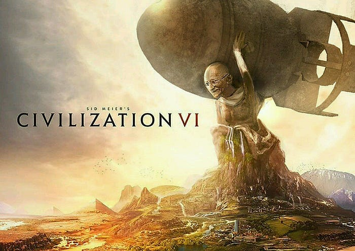
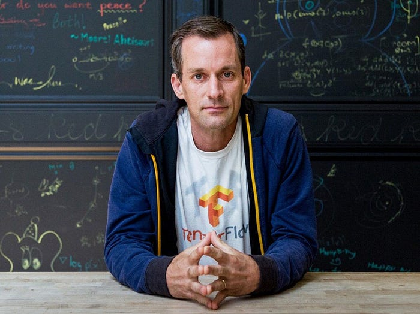
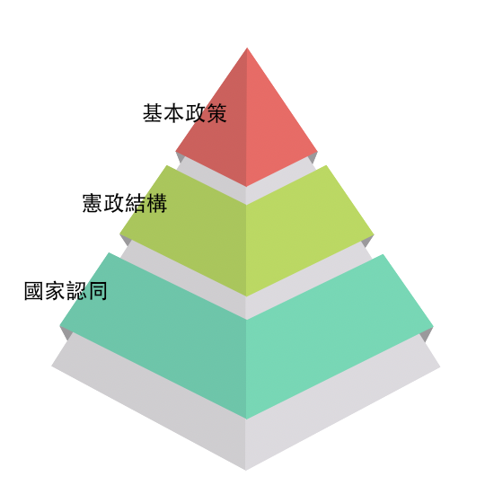
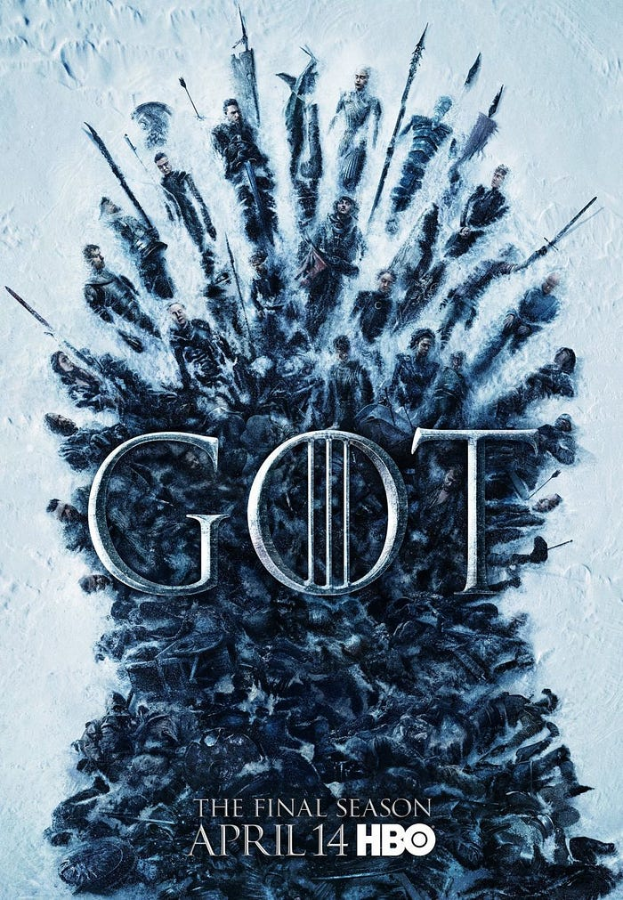

---

知名策略遊戲《[文明帝國](https://zh.wikipedia.org/zh-tw/%E6%96%87%E6%98%8E%E7%B3%BB%E5%88%97)》有個被玩家吐槽的 Bug。遊戲中每位國家領導人皆擁有預設的「侵略指數」，而其中「和平主義者」甘地的預設數值為 1，這鮮明地反映了他在真實世界的人格特質：不挑起戰爭，不侵犯他國。

然而，若玩家在遊戲中採取民主政體時，國家的侵略數值會自動下降 2 點。此時，甘地的數值會變為 -1。有趣的是，遊戲中並沒有注意到負數的判斷，導致該數字直接跳至最高的 255 點，聖雄也因此褪下和平外衣，瞬間化身為「核平主義者」！

這故事告訴我們寫「[邊界測試](https://zh.wikipedia.org/wiki/%E9%82%8A%E7%95%8C%E6%A1%88%E4%BE%8B)」的重要性。

---

上周這篇《[上帝擲骰子嗎？](https://blog.amowu.com/2019/04/weekly-015.html)》一文中，我提到了幾位自己很嚮往的程式設計師，其中一位 Jeff Dean 有朋友問我，他是誰？

在 Google，如果你問最牛的工程師是誰，大家會告訴你是 Google 的大腦 — — [傑夫·迪恩](https://zh.wikipedia.org/wiki/%E5%82%91%E5%A4%AB%C2%B7%E8%BF%AA%E6%81%A9)（Jeff Dean）。他不但開創了雲計算時代，也是深度學習算法的發明人。另外，如果問收入最高的工程師是誰，也是迪恩。他的收入比大部分 VP 要高很多。

最後，如果你問作為一個軟體工程師能走多遠，要是你能像迪恩那樣當上美國工程院院士，就可以寫程式一輩子。

更多關於傑夫·迪恩的故事，請參見《[吳軍的谷歌方法論](https://m.igetget.com/share/course/pay/detail/4/42)》。

---

在西方，一座教堂蓋上百年是常有的事情，中間自然要更換很多建築師，等到教堂完工時，通常和最初的設計會有很大差別。

建築大師[高第](https://zh.wikipedia.org/wiki/%E5%AE%89%E4%B8%9C%E5%B0%BC%C2%B7%E9%AB%98%E8%BF%AA)為了保證「[聖家堂](https://zh.wikipedia.org/wiki/%E5%9C%A3%E5%AE%B6%E5%A0%82)」的設計思想不至於被後來的設計師改動，一反先建造內部的主體，再裝上外立面的做法，而是先從外立面開始建設，這樣後人就不會縮小教堂的規模了。

人們都說寫程式就像蓋房子，或許我們能從這些偉大的建築師之中，發掘出他們的智慧來應用。

---

中研院院士[胡佛](https://zh.wikipedia.org/wiki/%E8%83%A1%E4%BD%9B_%28%E8%87%BA%E7%81%A3%29)曾經說道，民主選舉有三個層次：國家認同、憲政結構、基本政策。

美國沒有國家認同的問題，除非夏威夷想要「夏獨」。憲政結構也就是一個「聯邦制」。所以選舉最後要辯論的就只剩下是否加減稅、墮胎或同性戀是否合法化這些「基本政策」問題。

台灣的困境是，國家認同的問題還沒解決，每每選舉佔據新聞版面的都是統獨議題，甚至連憲政結構的部分也在討論要換「總統制」或是「內閣制」之類的，導致與民生最相關的基本政策進展緩慢。

---

傳統的射擊遊戲裡，因為爆頭即死，所以玩家傾向提高「槍法」高效殺敵。

但在真實世界，作戰部隊追求的是無傷殺敵，因為受傷的代價太大了。為了不受傷，哪怕降低效率和浪費資源也在所不惜。

有個統計，戰場上平均每兩萬發子彈才能有一發擊中敵人，這些子彈主要都拿來做火力壓制，「彈幕」一詞就來源這裡。

---

東西方對龍的印象其實挺兩極的，前者認為神聖，後者認為邪惡。有一說，西方神話中所提到的魔鬼形象，恰巧與東方神話中所提到的神相似（角、鱗片）。或許，在西方信仰的這夥外星文明裡，和東方信仰的文明剛好是處於對立面？比方說：大洪水是西方神發動，卻是女媧給堵上的。

— — 《[老高與小茉 Mr & Mrs Gao](https://www.youtube.com/watch?v=0vomd4ymSLc)》

---

郵件是一個重要的溝通工具。在職場上甚至比見面和開會還要重要。很多人這輩子可能彼此只會透過郵件溝通。那麼一封好的郵件應該長什麼樣呢？我們與人見面的基本禮儀，不一定要打扮得花枝招展，而是保持得乾乾淨淨。一封好的郵件也一樣。

1. 郵件禮儀的第一步，就是用真名
2. 標題用不到 20 字來總結這封信的核心內容
3. 真正的高手，所有文字只有一個顏色、一個大小、一個字型
4. 排版只用三種方式：分段（閱讀邏輯）、縮排（層次關係）、粗體（突出重點）
5. 每段的首句是整段的概括。用句簡短、用詞簡單、用字簡潔
6. 結尾的部分再次總結郵件的內容，並強調對方需要行動的部分
7. 收到郵件盡快回覆，代表你的能力、效率、重視的程度
8. 送出前再次檢查標題、稱呼、錯別字、附件

雖然 Slack 已經取代了大部分的郵件使用場景，但是我認為還是一樣受用，對於寫文章也很有幫助。

— — 《[羅輯思維](https://m.igetget.com/share/course/pay/detail/4/14)》

---

Google 收購 YouTube 之後，透過關鍵幀的特徵值提取和信息指紋的比對技術，可以找出兩段影片是否相似。因此 Google 制定了一個有意思的廣告分成策略：所有影片都可以插入廣告，但廣告收益全部歸原創影片所有。這樣一來，拷貝上傳別人的影片就無法獲得收入。沒有了經濟利益，就少了很多盜版。

— — 《[數學之美](https://www.books.com.tw/products/CN11192265)》

---

最近同事推薦了一部公視和 HBO 合作推出的社會寫實劇 — — 《[我們與惡的距離](https://www.pts.org.tw/theworld_betweenus/news.html)》。趁著連假一口氣看了四集，真的好看！

> 故事透過「無差別殺人事件」呈現不同立場的關係者視角，描摹加害者家屬與被害者家屬的心理，探究人權律法的掙扎以及精神病識，同時反思媒體現象。 — — 維基百科

一個好的故事不會給你絕對的答案，而是給你「思考」的空間。

全天下沒有一個爸爸媽媽，要花個二十年去養一個殺人犯，加害者的家屬也可能是被害者。如果一個民主法治的國家要靠不符合程序的死刑殺人才可以討好民眾、討好媒體，那我們殺的人，並不會比殺人犯還少。

這讓我想到最近一部我已經棄坑、也在討論善惡的韓劇 — — 《[獬豸](https://programs.sbs.co.kr/drama/haechi)》。片頭一段令人印象深刻的話：

> 獬豸，能審判善惡的傳說中的神獸。然而，你知道為何它只存在於傳說中嗎？因為想在現實中審判善惡，是不可能的。

感謝良心電視台公視，讓我們看到台劇並沒有比較差，台灣歐爸還是有希望的（雖然我比較喜歡賈靜雯的演技）。

---

最後，作為同樣感謝的贊助商，這期就特別留個百萬版面（？）給 HBO 放廣告。4 月 11 日，《[冰與火之歌](http://hboasia.com/HBO/en-tw/shows/game-of-thrones/season8/)》最終季即將播映！究竟最後會是誰坐上鐵王座！？

