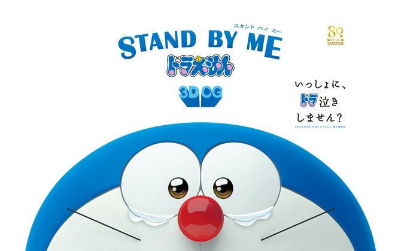
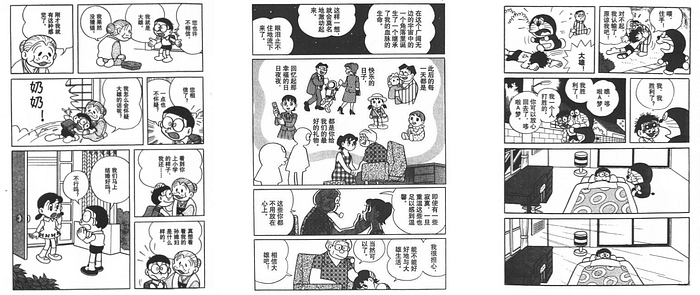
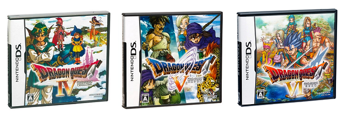

---

2019 年可以說是 3DCG 動畫電影的一年，尤其是改編經典故事的作品。除了年初的《艾莉塔：戰鬥天使》之外，還有近期上映的《小飛象》，以及未來即將播出的《名偵探皮卡丘》和《獅子王》。

知名日本遊戲公司 SQUARE ENIX 日前宣布，《勇者鬥惡龍》系列也將推出 3DCG 動畫電影《勇者鬥惡龍 你的故事（暫譯）》。預定 8 月 2 日在日本上映。

身為一個 DQ 的粉絲，看到這則新聞的時候很興奮，覺得不吹一波對不起自己的情懷。

《勇者鬥惡龍 你的故事》是由過去同樣製作過 3DCG 動畫電影《STAND BY ME 哆啦A夢》的團隊負責。

作為一個從「小叮噹」漫畫時代開始看起的過來人，這裡順便科普一下《STAND BY ME 哆啦A夢》的故事，其實是結合了多部原作中的經典劇情，例如《從未來之國千里迢迢而來》、《雪山上的浪漫史》、《大雄的結婚前夜》、《再見哆啦A夢》和《哆啦A夢回來了》等篇目。

其中在看《大雄的結婚前夜》的當下，我都抱持「為什麼藤子不二雄要讓靜香嫁給大雄？」的疑問。直到這段「靜香與爸爸的對話」：

> *靜香：「我很擔心，能不能好好地與大雄生活」
> 爸爸：「我認為你選擇大雄是完全正確的。大雄會為別人的幸福而高興，為別人的不幸而傷心。這對於一個人來說是最重要的東西」*

當時三觀受到的衝擊，可以說不亞於「 [為什麼井上雄彥不讓湘北拿冠軍？](https://blog.amowu.com/weekly-007/) 」一樣的程度。

話題回到 DQ。說來也巧合，前陣子才剛好和同事聊起這系列的想法。基本上《勇者鬥惡龍》的正統系列我只玩過 4、5、6 和 9 代，其中前面三代因為故事有關聯，被合稱作「天空系列三部曲」，也是被跨平台重製或移植次數最多的一個系列。

如果只讓我推薦一款 DQ 給你，我會毫不猶豫的選擇 5 代《天空的新娘》。如果讓我選出心目中最棒的穿越故事劇情，我也會毫不猶豫的告訴你是《天空的新娘》。

而這次的電影《勇者鬥惡龍 你的故事》就是以《勇者鬥惡龍 5 天空的新娘》為原案，所以爆米花可以先準備好了，到時候我們電影院報到（如果台灣會上映的話⋯⋯）。
