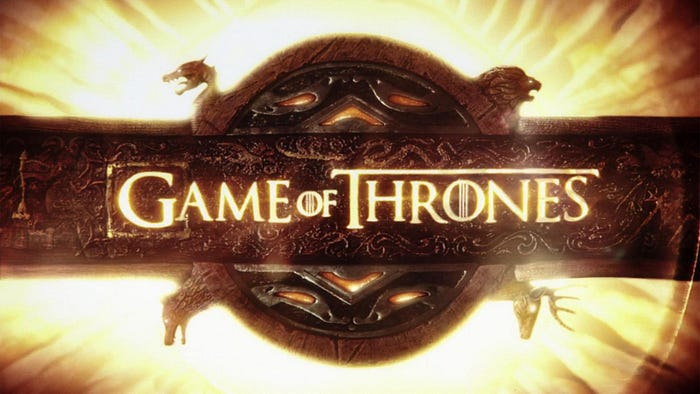
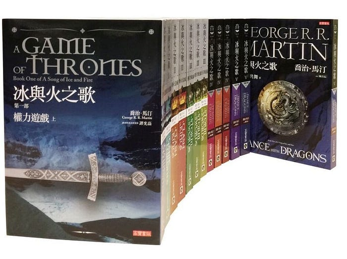
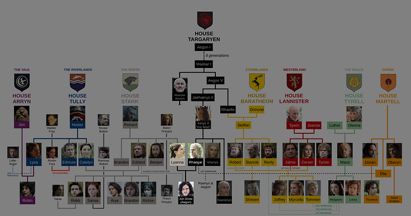
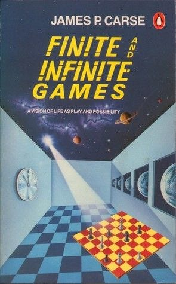

---

HBO 當家美劇《權力遊戲》終於迎來了最終季，在上周開始全球播映。

首集上線之後馬上就創造了 5,500 萬次的「[盜版收視](https://www.theverge.com/2019/4/17/18412159/game-of-thrones-got-season-8-premiere-pirated-55-million-times-first-24-hours-hbo)」。而相較於盜版來源，官方的收看來源總計也不過 1,740 萬名觀眾。

即便是在美國這種相對容易訴諸法律的國家，在非法收視排行榜上仍居第三位。

雖然在台灣可以合法收看該影集，但因為正版授權的版本都經過了「[審查](https://ent.ltn.com.tw/news/breakingnews/1286231)」，不少片段遭到刪剪，因此有些人轉向收看盜版的「完整版本」。

> 過去許多軟體開發商設計很多數位鎖，想要防止被盜版，但歷史證明都沒有用。開發數位鎖不但浪費了軟體開發商大筆的時間和金錢，最後鎖住的卻往往是有良心乖乖買正版的使用者。 — — 《[軟體如何賺錢？](https://blog.techbridge.cc/2018/11/14/future-of-software/)》

作為一個追劇近 10 年的死忠粉絲，一直不解為何劇組要將這部劇的標題命名為 Game of Thrones（權力遊戲），而不是原作小說的書名「冰與火之歌」？

直到 2013 年的某一天，當時《權力遊戲》的進度還只是在第三季的時候，我就被知乎這篇「[《冰與火之歌》為什麼取名叫『冰與火之歌』？](https://www.zhihu.com/question/20718470/answer/16291861)」之中的一則回答給驚豔：

> A Son（瓊恩·雪諾）g of Ice（萊安娜·史塔克）and Fire（雷加·坦格利安）

要知道雪諾的身世之謎這個秘密，可是一直到了 2017 年第七季的最後一集《[The Dragon and the Wolf](https://www.youtube.com/watch?v=WZPPdXB_vYU)》才被公諸於世。由此可見這個伏筆埋得之深，想必連劇組自己當初也沒想到。

所以相比之下，我其實是更喜歡「冰與火之歌」這組命名的。

---

但是最近隨著知識的長進，接觸了更多的人情世故之後，我原先的這個想法開始有了改變，漸漸能理解為什麼要叫《權力遊戲》。

除了「電影要比小說更貼近大眾」這個理由之外，其實這個世界上的所有人類活動，你都可以看作是一次次「權力的遊戲」。

最近讀了一本書，書名是《有限與無限的遊戲》。書名中的「Games」除了翻譯「遊戲」之外，也可以翻為「博弈」。

那麼「有限與無限的博弈」是什麼意思？

本書作者把世界上所有的人類活動都看作是一次又一次博弈。

其中大量的活動是「有限」的博弈，小到下棋、跟人吵架，大到經營一家企業、發起一場戰爭等等。這種博弈有個特點，那就是以「取勝」為目的，這也是為什麼叫有限博弈，因為贏了就結束了，只有輸贏一種結局。

還有一種「無限」的博弈，這種博弈是以「延續」為目的，例如：婚姻、文化、宗教還有生命等等，在延續的過程中會產生出無數種可能的結局。

這種世界觀有什麼用呢？它可以解答一個人類的終極問題：

> 人的一生該怎麼過？

什麼是有價值的，什麼是有意義的。人要是死了，一切都是白談，所以「生命」這個無限遊戲想必是最值得追求的。那當我們把時間維度放大到生死邊界的時候，該追逐什麼就一目了然了。

玩有限遊戲時的一次次成敗，不過是我們人生中的某一次體驗、某一段經歷，而讓我們的人生真正產生價值的，是那些可以不間斷延續下去的事物。

> 有限遊戲在邊界內玩，無限遊戲卻是在和邊界玩，探索、改變邊界本身。

有限遊戲看起來像在做一件有期限的事情，我們做的時候常常假定自己是能永遠活下去的；與之相反，無限遊戲是一件沒有邊界的事情，所以當我們做的時候，是抱著自己一定會死的心情。

有限遊戲的參與者為了取勝，會在有限的時間維度下自願給自己設定許多邊界，摒棄自己一部分的自由；無限遊戲的參與者會將時間維度拉長到一生，抱著向死而生的心境去生活，透過延續各種無限遊戲，來達成根本自由的狀態。

我們的社會就是一個有限遊戲，目的是取得勝利從而獲得權力。社會為了提高自身獲勝的機率，設置了一系列的運行機制，用來確保社會中的每一位公民都在玩同一種有限遊戲。

既然我們都是生活在社會中的公民，那麼是不是注定一生中的大量時間只能被用來玩各種有限遊戲？

這本書的最大價值，就是為我們提供了一個新的方式去理解世界的認知模型，或許我們應該用無限遊戲的心態去玩有限遊戲，發現生命的可能性。

就像傳統電子遊戲也分「開放世界遊戲」、「沙盒遊戲」和「箱庭遊戲」，它們不分誰優誰劣，這些遊戲會根據不同的目標群體，有著不同的優點和缺點。但是可以確定的是不論是什麼遊戲類型，在合適的製作人手中都能創作出最棒的遊戲作品。

> 有限遊戲是有劇本的，而無限遊戲則是傳奇的。
