---

自 1989 年的平成元年算起，持續了約 30 年的「平成時代」已於今年 4 月畫下句點，5 月起由新年號「令和」正式接班。

日本遊戲媒體[週刊ファミ通](https://www.famitsu.com/)日前[公布](https://www.famitsu.com/news/201904/22175124.html)由讀者票選的「平成最佳遊戲」前三名經典作品。

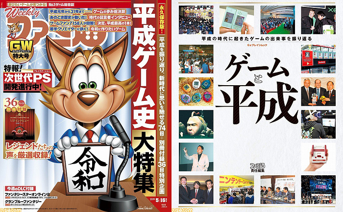

拿下第一名的是 1995 年在 SFC（俗稱：[超任](https://zh.wikipedia.org/wiki/%E8%B6%85%E7%B4%9A%E4%BB%BB%E5%A4%A9%E5%A0%82)）平台發售的《[超時空之鑰](https://zh.wikipedia.org/wiki/%E6%97%B6%E7%A9%BA%E4%B9%8B%E8%BD%AE)》。本作受到 30 歲以上玩家（包括我）一致壓倒性支持，高票獲選。

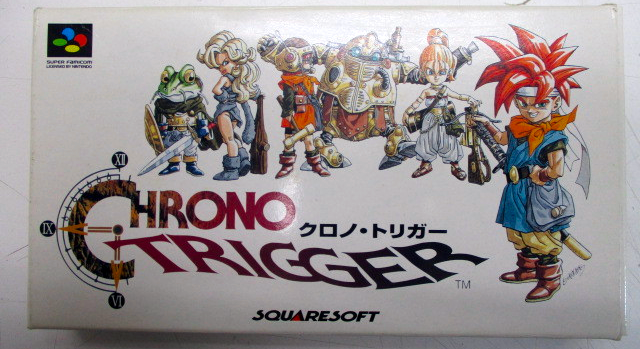

《超時空之鑰》是由 [SQUARE](https://zh.wikipedia.org/wiki/%E5%8F%B2%E5%85%8B%E5%A8%81%E7%88%BE)（當時尚未合併 [SQUARE ENIX](https://zh.wikipedia.org/wiki/%E5%8F%B2%E5%85%8B%E5%A8%81%E5%B0%94%E8%89%BE%E5%B0%BC%E5%85%8B%E6%96%AF)）負責製作發行，《[七龍珠](https://zh.wikipedia.org/wiki/%E4%B8%83%E9%BE%99%E7%8F%A0)》作者[鳥山明](https://zh.wikipedia.org/wiki/%E9%B3%A5%E5%B1%B1%E6%98%8E)、《[勇者鬥惡龍](https://zh.wikipedia.org/wiki/%E5%8B%87%E8%80%85%E9%AC%A5%E6%83%A1%E9%BE%8D%E7%B3%BB%E5%88%97)》之父[堀井雄二](https://zh.wikipedia.org/wiki/%E5%A0%80%E4%BA%95%E9%9B%84%E4%BA%8C)，以及《[太空戰士](https://zh.wikipedia.org/wiki/%E6%9C%80%E7%B5%82%E5%B9%BB%E6%83%B3%E7%B3%BB%E5%88%97)》之父[坂口博信](https://zh.wikipedia.org/wiki/%E5%9D%82%E5%8F%A3%E5%8D%9A%E4%BF%A1)聯手打造的夢幻級 RPG。無論是劇情、美術、系統或音樂，放到今天來看仍是不朽的經典名作。

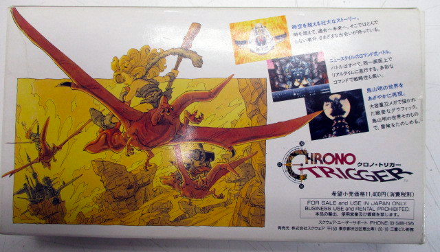

作為一路走過昭和、平成、令和時代的三朝元老級玩家，見證了這 30 年間五花八門的遊戲作品問世。最近看了 YouTube 頻道 [攻壳 Gamker](https://www.youtube.com/channel/UCLgGLSFMZQB8c0WGcwE49Gw) 的《[十大影響我的遊戲](https://www.youtube.com/watch?v=oY4DxPRV0Bs)》系列之後，也想來寫一篇影響我一生的十大遊戲。

### 第十位：熱血行進曲（FC）

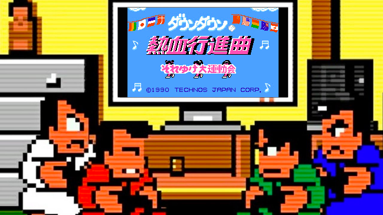

1992 年在 FC（俗稱：[紅白機](https://zh.wikipedia.org/wiki/%E7%BA%A2%E7%99%BD%E6%9C%BA)）上發售的《[熱血行進曲](https://zh.wikipedia.org/wiki/%E7%86%B1%E8%A1%80%E8%A1%8C%E9%80%B2%E6%9B%B2)》是我最早接觸的「強社交」類型作品。什麼是強社交？簡單來講就是「互相傷害、往死裡打」系列。

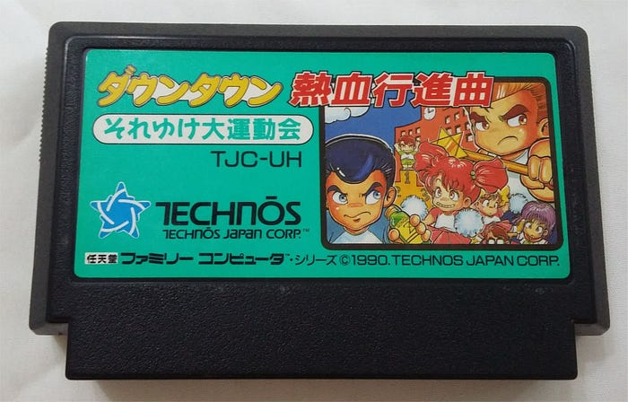

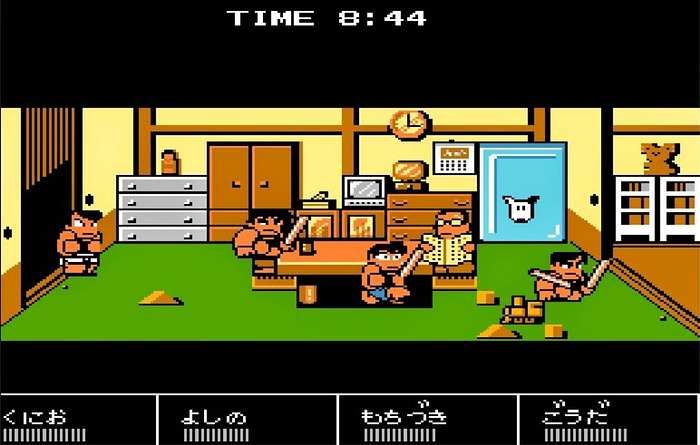

正所謂「不打不相識」，俗話說「見面三分情」，在我小時候還沒有網際網路的時代，社交基本都靠交換玩具、聊卡通、聊漫畫、打球，以及打電動這些娛樂來聯繫感情。

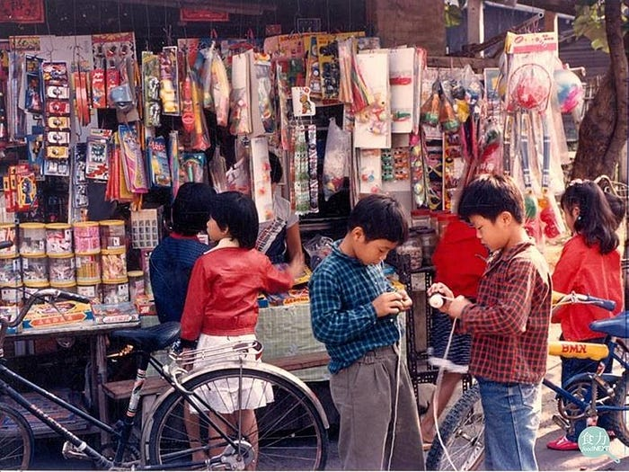

> 老人圍在公園涼亭下象棋，小孩圍在電視機前搏感情

另外還有一款類似的遊戲，同樣也影響我深遠。那就是 1995 年在 Windows 平台上的《[小朋友齊打交](https://zh.wikipedia.org/wiki/%E5%B0%8F%E6%9C%8B%E5%8F%8B%E9%BD%8A%E6%89%93%E4%BA%A4)》（簡稱：LF）。

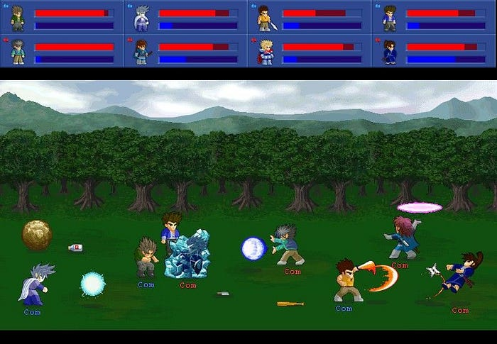

這款遊戲最有魅力的地方在於四個人需要擠在同一塊鍵盤上操作。還記得我讀高職的時候，原本下課鈴響都是搶球場優先，但自從學校替每間教室配一台爛電腦之後，我們的下課目標就變成了搶鍵盤。

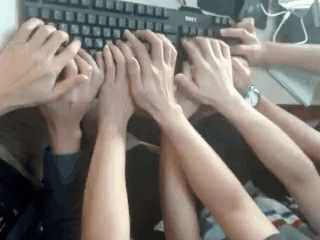

因為我很喜歡這兩款遊戲帶來的同樂氛圍，所以大學的畢業專題便以此為靈感，開發了一款多人連線的對戰遊戲。那段埋首寫程式的日子為我日後的遊戲程式設計打下基礎，並順利應徵上第一份正職工作。

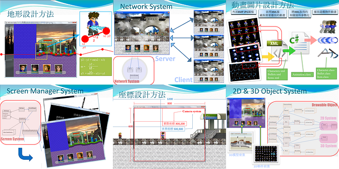

還是學生的時候，同學或是三五好友的時間較一致，放學下課比較沒事，想打電動，約一約就可以隨時開始打了。

可是隨著年紀增長，你的朋友在上班，你的朋友在陪女友，你還能夠朋友幾個人聚在一起？幾個一起玩遊戲的好朋友，也許從一代二代認識的，現在，我們要一起玩個四代，很難了。

所以，你看朋友之間都已經這麼難聚在一起玩遊戲了，如果還要把這麼珍貴的時間花在與那些外掛氾濫的遊戲玩家對賭，豈不浪費人生。

所以我還是堅持買主機玩線下的單人遊戲或是可以同樂的多人遊戲，因為買的是一個尊嚴。

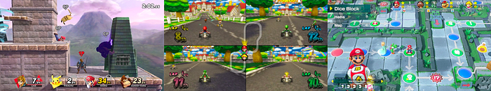

總結：《熱血行進曲》和《小朋友齊打交》這些「強社交」類型的遊戲，影響了我的朋友關係與職涯發展，故列為第十位。

下一期，影響我一生的第二款遊戲，我打算介紹某款台灣製作的 PC 遊戲，敬請期待。
