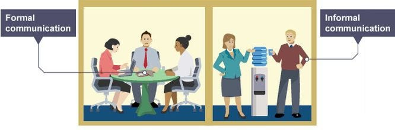

---

遠端工作並非一個需要克服的挑戰。而是一個明顯的商業優勢。

> *原文標題：All Remote
> 原文網址：https://about.gitlab.com/company/culture/all-remote/
> 原文作者：GitLab*

GitLab 是一間全遠端（All Remote）的公司，[團隊成員](https://about.gitlab.com/company/team/)遍布全球 50 多個國家。這裡介紹了一些 GitLab 的[工作原理](https://about.gitlab.com/company/culture/all-remote/tips/)。

### 遠端工作宣言

全遠端工作提倡：

* 從世界各地招聘和工作，而非從公司附近
* 彈性工時優於固定工時
* 通過寫下來記錄知識，而非口頭傳授
* 建立流程，而非在職培訓
* 公開分享資訊，而不是只告訴你該知道的
* 開放每份文件供任何人編輯，而非自上而下的存取權限控制
* 非同步通訊優於同步通訊
* 重視工作結果，而非投入的工時
* 正式的溝通管道優於非正式的溝通管道

### 為何遠端？

> 遠端工作並非一個需要克服的挑戰。而是一個明顯的商業優勢。
>  — — Victor, Product Manager, GitLab

從節省辦公空間的成本到提供員工日常生活的更大靈活性，完全遠端工作為組織及其員工提供了許多優勢。 但我們也體認到，並非所有人都適合成為一家完全遠端的公司。 以下是一些優點和缺點。

### 優點

#### 對於員工

* 日常生活更彈性（小孩、父母、朋友、雜務、運動、快遞）
* 不會浪費時間、精力或金錢在通勤上（捷運和公車費用、汽油、汽車維護費、收費站等）
* 減少接觸生病同事的細菌
* 減少被打斷的狀態，提高[生產力](https://www.inc.com/brian-de-haaff/3-ways-remote-workers-outperform-office-workers.html)
* 能夠在不請假的情況下遊歷其它地方（家庭、娛樂等）
* 自由移動
* 有些人發現遠端更容易與難搞的同事溝通
* 減少入職可能會有的社交壓力
* 在家吃飯（有時）更好，更便宜
* 某些國家的稅收可能更便宜
* 不需要工作服（譯者註：不用煩惱今天穿什麼）

從家庭時間到旅行計劃，有很多關於遠程工作如何影響全球 GitLab 團隊成員生活的[例子和故事](https://about.gitlab.com/company/culture/all-remote/stories/)。

> 這些靈活性使家庭的生指品質呈指數級增長，從而減輕壓力，提高您的工作效率和積極性。 這些價值是金錢無法衡量的。 — — Haydn, Regional Sales Director, GitLab

#### 對於組織

* 招募優秀的人才，[無論他們所居何處](https://about.gitlab.com/jobs/faq/)
* 員工的干擾更少，效率更高
* 增加省下來的辦公室成本和[補償金](https://about.gitlab.com/2019/02/28/why-we-pay-local-rates/)（基於在低成本地區招聘）
* 吸引自我啟動者（self-starters，他們不等待被賦予任務、職責，他們會直接出擊，在短時間內獲得最好的成果）
* 更容易快速發展您的公司
* 減少會議次數，重點關注結果和出色的工作成果
* 在當地動亂或自然災害（例如政治或天氣相關事件）的情況下保持業務的連續性

#### 對於世界

全遠端工作的優勢不僅止於一個組織及其人員。 由於沒有通勤的員工，也沒有辦公大樓或園區，所以遠端公司的碳足跡都要小得多。 對於全球公司而言，為低成本地區帶來薪酬較高的工作也會產生積極的經濟影響。

### 缺點

儘管有其優點，但全遠端工作並不適合所有人。根據他們的生活方式和工作偏好，它可能對潛在員工以及組織有不利之處。

#### 對於員工

* 當你處於遠端時，入職可能很困難，因為它涉及更多的自我學習，而你並沒有與新同事和新員工在一起
* 遠端角色的[第一個月](https://www.linkedin.com/pulse/transition-remote-work-1-month-casey-allen-shobe/)可能會感到孤獨，特別是如果您從傳統的辦公環境過渡
* 如果組織沒有意識到替員工之間建立保持聯繫的方式，那麼遠端可能會導致溝通技巧中斷
* 有些人可能會發現很難在他們生活和睡眠的同一環境中工作，因為專用的工作空間有助於將環境從他們的家庭生活轉換為工作
* 不同時區的團隊成員可能不得不在會議時間上妥協
* 世界各地的貨幣和稅收要求的差異可能給組織帶來挑戰

#### 對於組織

* 因為全遠端工作非傳統，有時會讓投資者、合作夥伴和客戶有所顧慮
* 世界各地的貨幣和稅收要求的差異可能給組織帶來挑戰

### 為何時機已成熟？

如果沒有技術的不斷發展，並且持續開發和改善這類工具，完全遠端工作是不可能的。

我們不僅僅看到這些對全遠端公司的影響。事實上，在一些大型園區的組織中，員工通常會進行視訊對話，而不是花 10 分鐘去其它大樓。

以下是使遠端工作成為可能的一些關鍵因素：

* 隨處可連的高速網路，100Mb/s 以上的有線網路、5GHz Wifi、4G 行動網路
* 視訊對話軟體，Google Hangouts、Zoom
* 行動科技，每個人的口袋裡都有一台電腦
* 語音轉文字軟體的進化，比打字更快、更準
* 通訊應用程式，Slack、Mattermost、Zulip
* 任務追蹤工具，Trello、GitHub issues、GitLab issues
* 貢獻工具，GitHub Pull Requests、GitLab Merge Requests
* 靜態網站，GitHub Pages、GitLab Pages
* 英語水平，更多人學習英語
* 城市的交通擁堵在增長

### 「全遠端」並不意味什麼？

讓我們來解決一些關於完全遠端工作的常見誤解。

首先要做的事情是：一個全遠端的公司意味著沒有多個人所在的辦公室或總部。 在分區辦公室沒有人的唯一方法就是沒有總部。

通常「遠端」和「分佈式」是可以互換使用的術語，但它們並不完全相同。GitLab 更喜歡「遠端」一詞，因為「分佈式」表示多個實體辦公室。「遠端」指的是能夠從任何地方完成工作。

對於員工而言，成為一家完全遠端公司的一分子並不意味著獨立工作或孤立，因為它不是人類互動的替代品。技術使我們能夠與團隊[保持密切聯繫](https://about.gitlab.com/company/culture/all-remote/tips/)，無論是在非同步的文字中還是通過視訊進行的即時對話。團隊應該密切合作、經常溝通，並感覺自己是一個大型團隊的寶貴成員。

遠端工作也並不意味著你身體受到限制。您可以隨意在任何地方工作。這可能是在家裡與家人、咖啡館、一個共享空間，或當地的圖書館，而你的小寶貝正在享受故事書時間。您可以全天與同事進行頻繁的視訊聊天或虛擬會議配對，如果您位於彼此附近，您甚至可以與其他同事見面，親自一起工作。

在組織層面，「完全遠端」並不僅僅意味著外包工作。相反，這意味著您可以聘請來自世界各地最優秀的人才。它也不是一種管理範式。您仍然有一個分層組織，但重點是輸出而不是輸入。

總而言之，遠端基本上是關於自由和個人選擇。在 GitLab，我們[重視您的結果](https://about.gitlab.com/handbook/values/)，而不是您完成工作的地方。

### GitLab 如何建立他們的全遠端團隊

GitLab 已經學習了很多關於構建和管理完全遠端團隊所需的知識，並希望分享這些知識以幫助其他人取得成功。

了解 GitLab [如何使其工作](https://about.gitlab.com/company/culture/all-remote/tips/)並查看我們的[遠端工作提示](https://about.gitlab.com/company/culture/all-remote/tips)。

### 資源

瀏覽 GitLab 的[資源頁面](https://about.gitlab.com/company/culture/all-remote/resources)，了解有關 GitLab 全遠端方法的更多資訊，閱讀新聞中的遠端工作，以及了解其他公司的主導方式。

這裡列出了受 GitLab 文化啟發的[公司名單](https://about.gitlab.com/handbook/got-inspired/)。
