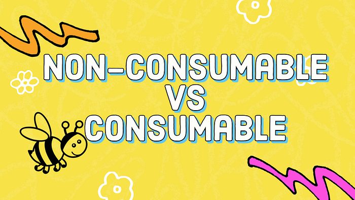
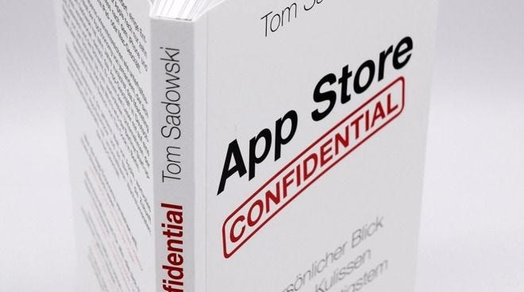
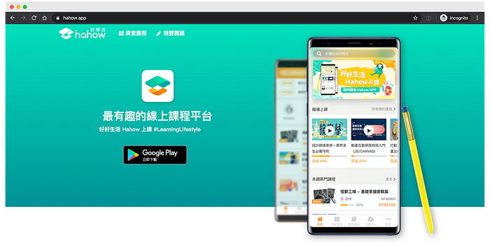
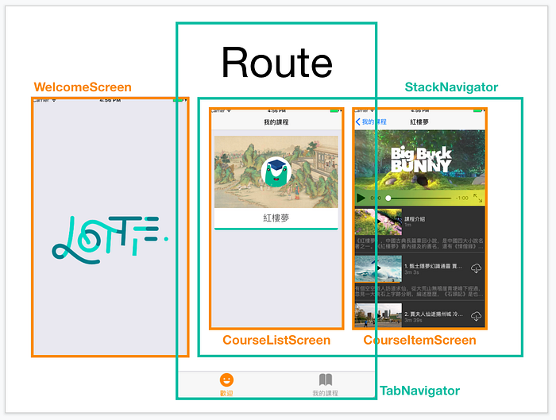
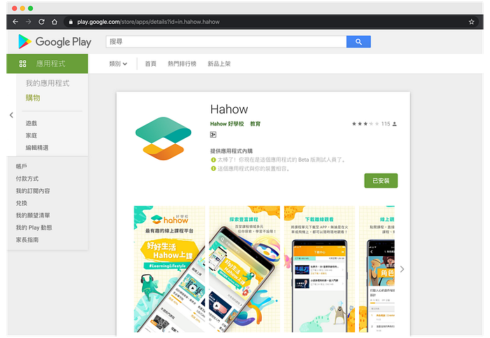
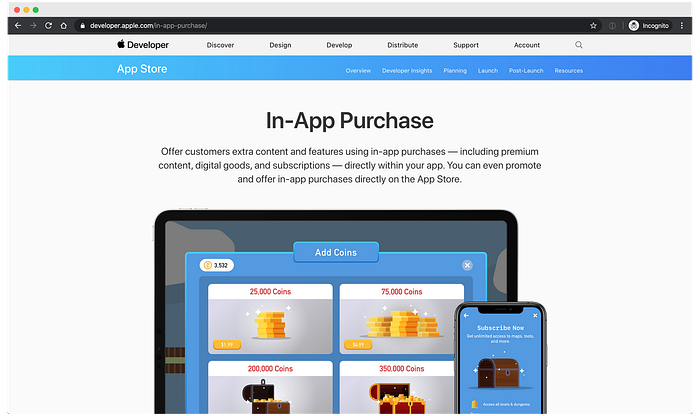
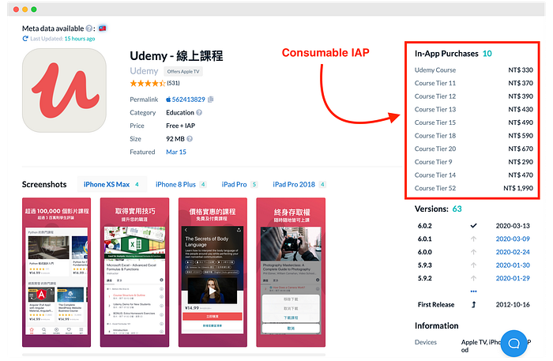

---

### 大綱

* 前言
* Hahow 為什麼沒有 iOS App？
* 為什麼有了「App 內購買」還是被拒絕？
* 為什麼 Hahow 要使用「消耗型項目」IAP？
* 為什麼 Udemy 可以使用「消耗型項目」IAP？
* Hahow iOS App 接下來的計畫？
* 結語

> 2022/07/20 更新：Hahow 已經有自己的 iOS App 囉 🎊

[‎Hahow 好學校 - 一站式跨域人才學習入口](https://apps.apple.com/tw/app/hahow-%E5%A5%BD%E5%AD%B8%E6%A0%A1-%E6%9C%80%E6%9C%89%E8%B6%A3%E7%9A%84%E7%B7%9A%E4%B8%8A%E8%AA%B2%E7%A8%8B%E5%B9%B3%E5%8F%B0/id1529044948)

### 前言

最近看到一篇 The Verge [報導](https://www.theverge.com/2020/2/19/21144053/apple-publication-book-app-store-confidential-tom-sadowski)，Apple 的律師要求 App Store 的前任經理停止發行《App Store Confidential》這本書，因為此書透露了「重大的商業機密」，違反了員工與公司簽訂的合約。

但是此書的作者 Sadowski 表示，這本書的很多內容其實是大家都知道的，例如：應用程式必須將使用者轉化為 付費客戶。

眾所周知，Apple 的 App Store 平台審核機制封閉，很多東西是他們說的算。

作為一位曾經參與 Hahow App 的開發人員，看到這一篇報導感觸很深，滿肚子苦水不吐不快。

許多 Hahow 的使用者常常詢問，為什麼 Android 的 App 已經上架這麼久了，iOS App 卻還看不見影呢？

### Hahow 為什麼沒有 iOS App？

其實 iOS App 一直都是與 Android App 同步開發的。

最早可以回朔到 2017 年 10 月，當初 Web 使用者不斷反應，希望可以在手機上，下載 Hahow 的課程，方便通勤時間也能離線觀看。

於是我自己利用公司讀書會的機會，嘗試使用 [React Native](https://reactnative.dev/) 開發了一個 Hahow App 的原型（Prototype），簡單演示了「下載離線觀看」和「通知」兩個手機上才能做到的功能。

也因此，成功說服了幾位頭頭，於 2018 年 2 月正式投入開發 Hahow App。

並於同年 6 月，順利在 Google Play 上架 Android App。

有關於我們如何用 [Expo](https://expo.io/) 這個 React Native SDK 開發 App、踩過哪些坑，以及專案的 Scrum 怎麼跑之類的，會再另外找時間分享一篇《Hahow 如何開發 Android App》文章，這裡就先不多贅述。

就在第一版 Android App 上架 Google Play 的同時，我們也將 iOS App 送審了 App Store。

但是，由於第一版的 Hahow App 功能還很陽春，只提供了登入、下載已購課程和離線觀看，以至於 Apple 以「付費內容需要在 App 內提供付費管道」的理由拒絕我們上架。

隨著每次發布一個 Android 新版本，送審 App Store 的期間，Apple 都會以各種理由拒絕你，例如：需要提供完整的註冊登入系統、首頁、瀏覽以及搜尋課程的頁面，還有必須訪客在不註冊登入的前提下，提供試用帳號之類的。

這導致我們的 Roadmap 一直因為 Apple 的要求而不斷修正，必須放棄開發很多原本只有在手機 App 才能提供的功能體驗，例如：聽課和通知。

經過幾個月的折騰之後，我們終於完成了 Apple 所要求的最後一項功能 ── App 內購買（In-App Purchase，以下簡稱 IAP）。

歡欣鼓舞之際，本以為這次終於可以在 App Store 上看見 Hahow App 成功上架的畫面。然而，最後 Apple 還是拒絕了我們的送審。

### 為什麼有了「App 內購買」還是被拒絕？

簡而言之，Apple 以 Hahow App 的 IAP 商品不適用「消耗型項目」為理由，拒絕了我們。

#### 什麼是「消耗型項目」IAP？

基本上，Apple IAP 提供[四種方式](https://developer.apple.com/in-app-purchase/)在 iOS App 內付費：消耗型、非消耗型、自動續期訂閱，以及非續期訂閱，後面兩種屬於訂閱制的範圍，這裡不討論，我們來看前兩種的說明：

#### 消耗型項目（Consumable）

> 使用者可以購買各種消耗型項目（例如遊戲中的生命或寶石）以繼續 app 內的進行。消耗型項目只可使用一次，使用之後即失效，必須再次購買。

需要注意的是，這類型的 IAP，可以重複購買，但無法提供「恢復購買」的選項。

#### 非消耗型項目（Non-Consumable）

> 使用者可購買非消耗型項目以提升 app 內的功能。非消耗型項目只需購買一次，不會過期（例如修圖 app 中的其它濾鏡）。

與消耗型 IAP 相反，非消耗型項目只能購買一次，並且可以「恢復購買」，因為購買的資料是儲存在 Apple 的資料庫。

### 為什麼 Hahow 要使用「消耗型項目」IAP？

假設 Hahow 有兩堂 100 元的課程 A 和 B，如果它們共用同一組 100 元的「非消耗型項目」IAP，那麼當使用者買了 A，那麼他就無法再購買 B，因為「非消耗型」IAP「只能購買一次」。

除非分別為 A 和 B 都各自建立一組 100 元的非消耗型 IAP，但是 Hahow 有 300 堂以上的線上課程，如果每堂課程都需要建立一組「非消耗型」IAP，那麼投入的人力成本會上升（Apple 沒有提供 API 自動化，建立 IAP 需要手動在後台操作）。

於是我們參考了同是線上教育平台 ── [Udemy](https://www.udemy.com/) 的 iOS App 作法，選擇「可以重複購買」的「消耗型項目」IAP。

但是 Apple 認為我們的「課程」不適用「消耗型項目」IAP，因為「課程」應該要「可以恢復購買」。

### 為什麼 Udemy 可以使用「消耗型項目」IAP？

當初就是因為 Udemy 使用這個方式操作，所以我們才認為可行。但是 Apple 的審核人員卻以「因為 Udemy 的課程**超過 1000 堂以上**，所以特例為他們開放」這個令人傻眼的理由，回絕了我們的申訴。

我並沒有在 [App Store 審核指南](https://developer.apple.com/app-store/review/guidelines/) 上看見有這條規則，所以這就是為什麼我在文章開頭提到的「App Store 平台審核機制封閉，很多東西他們說的算」。

### Hahow iOS App 接下來的計畫？

Apple 的審核人員給了我們兩個建議：

1. 為每一堂課建立「非消耗型項目」IAP
2. 使用「消耗型項目」IAP 建立「虛擬點數」的購買機制，也是目前的主流做法

遺憾的是，2019 年 5 月，我們決定將人力投入到其它的 Hahow 專案，停止 Hahow App 的後續開發及維護 。

### 結語

很多東西到最後已經不是技術的問題，Code 能解決的都是小問題。

最後，我們公司正在招募 [iOS Engineer](https://hahow.breezy.hr/p/dc7bdec5debb-ios-gong-cheng-shi-ios-engineer) 以及 [Android Engineer](https://hahow.breezy.hr/p/61c55e37ce22-android-gong-cheng-shi-android-engineer)。

如果你熟悉 App Store Review Guidelines，跌過無數次 Apple 裏規則的坑，擁有豐富的送審經驗，擅長與 Apple 審核人員打交道。那麼，我們非常需要你這樣的人才。

### 參考資料

* [Apple tries to halt publication of App Store book allegedly containing company secrets](https://www.theverge.com/2020/2/19/21144053/apple-publication-book-app-store-confidential-tom-sadowski)
* [In-App Purchase](https://developer.apple.com/in-app-purchase/)
* [App 内购买项目](https://developer.apple.com/cn/in-app-purchase/)
* [最前线｜苹果禁售前员工新书，称其透露了App Store的“重大商业机密”](https://www.36kr.com/p/5293547?ktm_source=feed)
* [蘋果前員工出了本App Store的新書，蘋果抓狂要求禁售：書中「透露 App Store 重大商業機密」](https://www.techbang.com/posts/76318-former-apple-employee-sits-on-new-book-on-app-store-secrets-apple-jumps-to-ask-for-ban-book-reveals-app-store-major-trade-secrets)
* [You Download the App and it Doesn’t Work](https://youdownloadtheappanditdoesntwork.com/)
