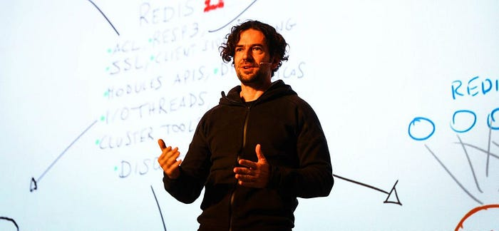
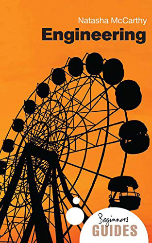
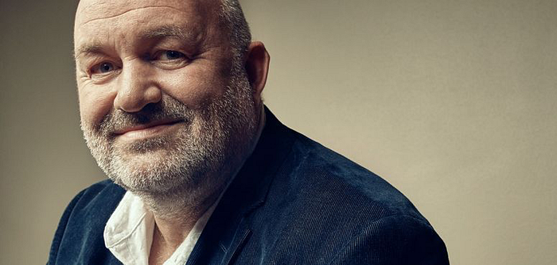

---

藝術家、科學家、發明家還有工匠，相比工程師有什麼不同之處？

前陣子， [Redis](https://redis.io/) 的作者 antirez [宣佈](http://antirez.com/news/133) 退出維護團隊。理由大致如下：

> *我寫程式是為了表達自己，我認為自己寫的東西是一件藝術品，而不僅僅是為了完成任務而寫的有用的東西。如果我寫的東西有用，那只是機緣巧合，因為我的首要目標是做出一些美的東西。****我寧願被人記住是一個糟糕的藝術家，也不要是一個好的工程師。****Redis 現在需要的，較多的是專案維護，而不是表達自己。這並不是我想做的。*

這讓我想起曾經讀過的《 [Hackers & Painters](https://books.google.com.tw/books?id=spfTBLWvVxcC&lpg=PP1&hl=zh-TW&pg=PP1&q&f=false) 》（譯：駭客與畫家）一書提到：

> *應該把駭客和畫家當作同一種人看待，他們都是創作者。*

駭客（hacker）追求的三個特色：好玩、高智商和探索精神，而不是實用性和金錢。

*（註：這裡的 hacker 是指那些最優秀的軟體工程師，惡意入侵電腦系統的人應該被稱為 cracker）*

[重點筆記《Hackers and Painters》](https:blog.amowu.com/posts/2013-10-01-hackers-and-painters/)

這看起來很美好，我也嚮往這樣的「Hacker 精神」。但隨著工作的時間久了，我開始覺得工程師與藝術家還是有本質上的不同。

最近聽了《 [Engineering: A Beginner’s Guide](https://www.amazon.com/Engineering-Beginners-Guide-Guides/dp/1851686622)》這本書的 [得到解讀版本](https://www.igetget.com/eBook/%E4%BA%BA%E4%BA%BA%E9%83%BD%E8%AF%A5%E6%87%82%E7%9A%84%E5%B7%A5%E7%A8%8B%E5%AD%A6?param=mZBf1sGf9&token=XOnaYG1qlM7amvGYerDZOy9JVnXL40BpxO3Bkp1NKxoRdb86P2Q5AzgEj9vE5rDo) ，裡面提到了一些角色和工程師的比較，覺得有趣，就摘錄出來。

什麼是工程（Engineering）？

> *工程學有很多個分支，例如：土木工程、機械工程、電機工程、材料工程、生物工程以及電腦工程等等。英國土木工程師協會最早將工程學定義為「****為了人類的使用和便利而引導自然中巨大能源的技術****」。*

套用在我們這行的話，軟體工程師掌握的是「透過光電這些自然能源，提供人類能夠便利操作資訊的技術（Information Technology）」。

那麼，科學家、發明家還有工匠，這些角色和工程師比較，有什麼不同之處呢？

### 工程師和科學家有什麼不同？

我們常常把「理工科」放在一起說，理科和工科，其實就是自然科學和工程學。 **科學家更擅長發現，工程師更擅長實現。** 科學家主要的工作，是探索「是什麼」，而工程師思考的是「能夠做什麼」。科學家們發現未知之事，工程師們創造未有之物。這兩者缺一不可。

*不少 IT 公司都設有科學家，例如 AWS 的 CTO Werner Vogels 過去就擔任過相關職位*

### 工程師和發明家有什麼不同？

發明家關注的是發明（這不是廢話？），工程師關注的是創新。發明是「第一次出現新產品或新工藝的想法」，創新是「在實踐中第一次嘗試這種想法」。 **發明家是那個提出可能性的人，工程師是那群真正動手，把可能性轉化為現實的人。**

*現代已經沒有像愛迪生之類的發明家，能讓我聯想到形象最接近的大概就是 Elon Musk*

### 工程師和工匠有什麼不同？

最早一批工程師，都是從工匠變化而來的。工匠是把普通人培養成手藝人，來完成複雜精細的工作，而工程師思考的，是怎麼讓普通人不用學習手藝，也能完成複雜的工作。需要多年經驗才能完成的工作，那是手藝。而建立一套標準化的流程，讓門外漢也能完成，那就是工藝。 **工匠傳承手藝，工程師把手藝變成工藝。**

大家喜愛日本製造、德國製造或是瑞士製造的精品，這背後都是工匠精神的體現，我也曾借此在《殺雞用牛刀》一文聊過 Google 和 Facebook 兩家截然不同的工程文化。

[殺雞用牛刀](https://blog.amowu.com/posts/2019-01-21-weekly-006/)

綜上所述，工程師的不同之處在於：

> *工程師信仰科學，但是更關注怎樣借助科學創造一個可能的世界；他們總是在創新，但是更關注怎樣創新才能讓想法落地；他們重視手藝，但是更關注怎麼把手藝變成標準化的工藝。*

工程師所有工作的最終目標： **把全部的複雜都封裝起來，只交給你一個簡單的界面。**

回到開頭的話題，我認為工程師與藝術家的最大不同處就在於，工程的複雜度遠高於一件藝術品，因為這種複雜，反而讓工程學的世界，很難講出動人的故事。我們都期待能出現一位像藝術家一樣的英雄來創造奇跡。可是在真實的世界裡，那些好用的產品背後，往往都有一支工程師團隊在默默努力。

你會看到一群工程師在開發同一個產品，但你不會看到一群畫家在畫同一幅畫。

**一個人走得快，一群人走得遠。**
