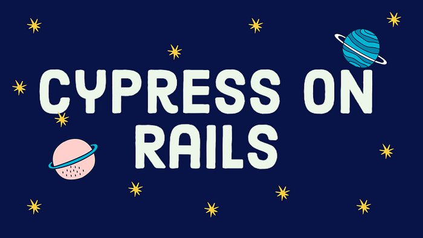
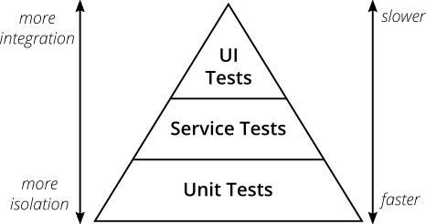
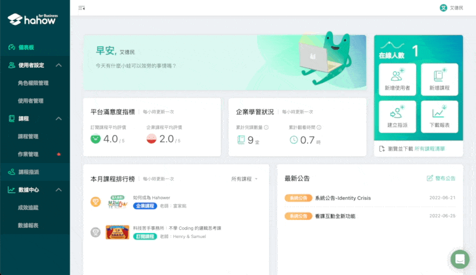
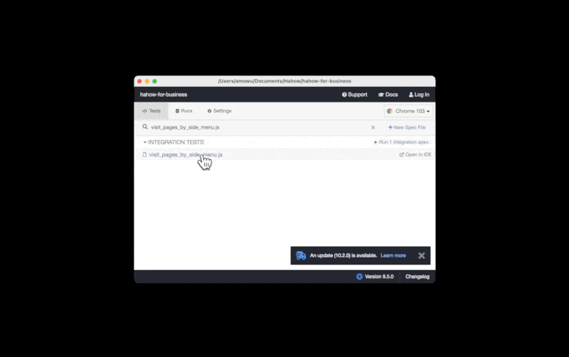
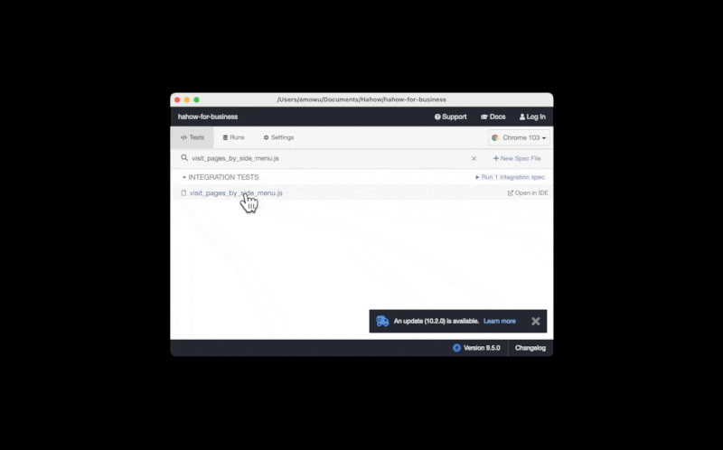
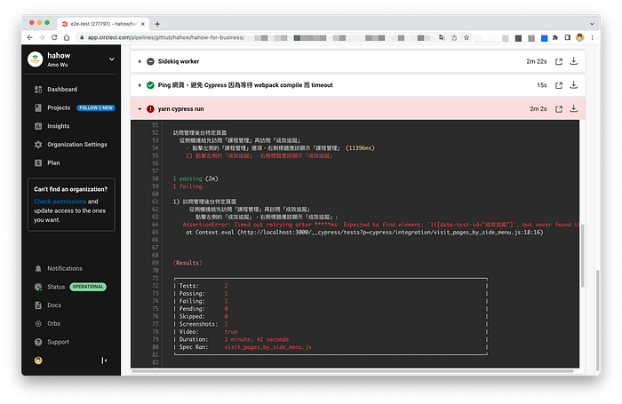
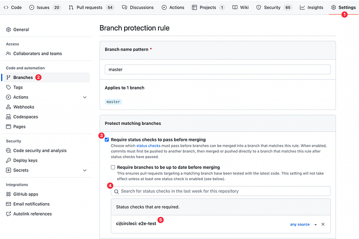
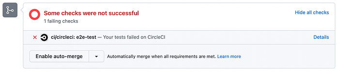
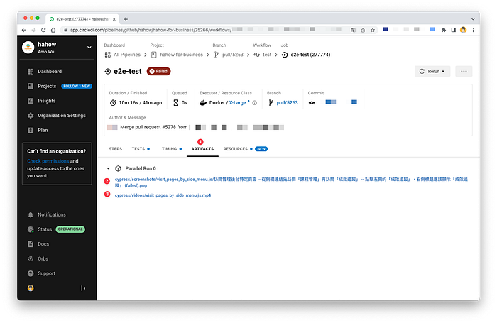
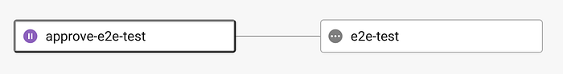

---

隨著 Chrome headless 模式的推出，E2E 測試上 CI 已經變得容易。這篇文章分享什麼是 Cypress，為什麼我覺得寫 E2E 測試很重要，以及我們團隊是怎麼跑這個流程的。



這篇文章會介紹 Ruby on Rails 如何配置 CircleCI 運行 Cypress 的 E2E 測試。

### 什麼是 Cypress？

[Cypress](https://www.cypress.io/) 是一款**自動化 E2E 測試**（Automated End-to-End Testing）工具，編寫方式以 JavaScript 語言為主。

[Testing Frameworks for Javascript | Write, Run, Debug | Cypress](https://www.cypress.io/)

E2E 這類測試方法，是從終端使用者的角度出發，模擬真實世界的操作場景，用於確保網站的行為符合預期。

類似的工具還有 [Selenium](https://www.selenium.dev/)、[Nightwatch](https://nightwatchjs.org/)、[Puppeteer](https://github.com/puppeteer/puppeteer) 以及 [Playwright](https://playwright.dev/)。

除了測試之外，這些工具一般也可以用來寫[網頁爬蟲](https://en.wikipedia.org/wiki/Web_scraping)（Web Scraper）腳本。

### E2E 測試 vs 單元測試

可能有人會問，為什麼不寫單元測試（Unit tests）就好？

因為兩者適用的場景不同。



很多東西是單元測試寫得再好也測不出來的。


*2 unit tests. 0 integration tests*

舉個 [Hahow for Business](https://business.hahow.in/) 的例子，最近前端加入了 [Code-Splitting](https://reactjs.org/docs/code-splitting.html) 的機制，結果某天 Sales 在向客戶 demo 產品的時候，發現後台有點選特定頁面會造成網站 crash 的問題。（關於 Rails 怎麼做 code-splitting 我之後會專門寫一篇文章跟大家講解）


*不好意思，有些地方出錯了！*

如上圖操作所示，像這種問題就是單元測試無法重現的。無法重現的話，就沒辦法寫測試來避免再度發生。

以 B2B 這種對網站穩定性要求相對高的產品來說，合約上通常會規定網站的 HA 必須維持在一個數字。

如果工程師不想下次因為一樣的問題而被 on-call 的話，或許可以考慮加入 E2E 測試。

其中最保險的方式是把 E2E 測試加進團隊的 [CI/CD](https://en.wikipedia.org/wiki/CI/CD) 流程之中。

自從 [Headless Chrome](https://developer.chrome.com/blog/headless-chrome/) 模式（可以把它想像成在 CLI 模擬一個 browser 環境）出現後，Cypress 這類 E2E 測試上 CI 已經變得很容易許多。

但也不是所有的技術棧（Tech stack）說想要導入這個流程就能導入的。

要在 CI 整合 E2E 測試，有一個重要的先決條件是：**前後端合一的 monorepo。**

近年來流行「前後端分離」的 [SPA](https://en.wikipedia.org/wiki/Single-page_application) 架構，無論是 [CSR](https://web.dev/rendering-on-the-web/) 或 [SSR](https://web.dev/rendering-on-the-web/)，這種架構下都容易出現將原始碼分開管理的 Multi-repo（又稱 [Polyrepo](https://github.com/joelparkerhenderson/monorepo-vs-polyrepo)）形式。

Multi-repo 的劣勢在於很難自動化 E2E 這類整合測試（Integration Tests），因為不管是修改前端或是後端的 code，都有可能造成 E2E 測試失敗，如果這時候 CI 還需要整合兩邊的 repo 環境，想必在技術上會是一個困難的挑戰。

Hahow for Business 使用的框架是 Ruby on Rails，RoR 本身是 monolithic 架構，前後端在同一個 codebase 底下，加上其完善的生態（例如資料庫的 [Migrations 和 Seed Data](https://guides.rubyonrails.org/v5.1/active_record_migrations.html)，這些機制很重要），讓 Cypress 在搭配 Ruby on Rails 的過程中，沒有遇到太大的問題。

接下來，就來介紹怎麼在 Ruby on Rails 環境下跑 Cypress。

### Getting started

Cypress 的安裝和語法就不贅述了，詳見[官方文件](https://docs.cypress.io/guides/getting-started/installing-cypress)。

我們直接以剛才提到的「後台 crash」案例為例，撰寫 Cypress 測試，寫起來大概這種感覺：

```javascript
// cypress/integration/visit_pages_by_side_menu.js
```

先在 local 跑一遍試試，指令是 `yarn cypress open`，記得要先把 development 的環境開起來，以 Hahow for Business 為例，大致如下：

```bash
$ bin/webpack-dev-server # 前端 local 開發環境
$ bin/rails server # Rails Server
$ bundle exec sidekiq # Sidekiq 環境，非必要
$ yarn cypress open
```

接著點擊要執行的檔案，Cypress 就會開啟一個 Chrome，開始跑自動化測試：



如上圖，沒意外的話，就會看到 `AssertionError`，表示成功重現 crash 的問題，接著就可以開始 [TDD](https://en.wikipedia.org/wiki/Test-driven_development) 找原因了。

### 解決 Cookies 問題

E2E 測試通常不會只有一個檔案要跑，如果不同的測試之間所使用的帳號不一樣，就有可能會碰到 Cookies 相關的問題（例如 `InvalidAuthenticityToken` 錯誤），解決方法如下：

```javascript
describe('...', () => {
  before(() => {
    // 清除此前測試的登入狀態
    cy.clearCookies();

    // 登入此次的測試帳號
    // ...
  });

  beforeEach(() => {
    // 在接下來的每一個 test case 之間，保留 cookies 狀態，
    // 避免 InvalidAuthenticityToken 錯誤。
    Cypress.Cookies.preserveOnce('YOUR_COOKIE_NAME');
  });

  // ...
});
```

更多細節可以參考 Cypress 有關 [Cookies 的章節](https://docs.cypress.io/api/cypress-api/cookies)。

完整的程式碼大致如下：

```javascript
// cypress/integration/visit_pages_by_side_menu.js
describe('訪問管理後台特定頁面', () => {
  before(() => {
    cy.clearCookies();

    cy.fastSignIn('admin@hahow.in', 'password');

    cy.visit('http://localhost:3000/admin');
  });

  beforeEach(() => {
    Cypress.Cookies.preserveOnce('_hahow_for_business_session');
  });

  describe('從側欄連結先訪問「課程管理」再訪問「成效追蹤」', () => {
    it('點擊左側的「課程管理」選項，右側標題應該顯示「課程管理」', () => {
      cy.get('li[data-test-id="課程管理"]').click();

      cy.get('[data-test-id="control-panel"] h3').contains('課程管理');
    });

    it('點擊左側的「成效追蹤」，右側標題應該顯示「成效追蹤」', () => {
      cy.get('li[data-test-id="成效追蹤"]').click();

      cy.get('[data-test-id="control-panel"] h3').contains('成效追蹤');
    });
  });
});
```

上面這段程式碼，其實還可以寫得更漂亮些，例如看似重複的兩個 `it` 可以透過 [cypress-cucumber-preprocessor](https://github.com/badeball/cypress-cucumber-preprocessor) 寫成容易共用的 [BDD](https://en.wikipedia.org/wiki/Behavior-driven_development) 模組。另外因為受限於 CSS selector 語法，常常每個測試都要侵入原始碼去加 `data-test-id`，感覺不太好，這部分可以改用 [cypress-xpath](https://github.com/cypress-io/cypress-xpath) 解決。

關於 [cypress-xpath](https://github.com/cypress-io/cypress-xpath) 和 [cypress-cucumber-preprocessor](https://github.com/badeball/cypress-cucumber-preprocessor) 我之後會專門寫一篇文章跟大家講解。

### 修復問題

追了一會兒的原因之後，發現罪魁禍首是我們把 webpack 的 minimizer 換成 [ESBuildMinifyPlugin](https://github.com/privatenumber/esbuild-loader) 的緣故。修復之後，如下圖所示，再跑一遍 E2E 測試，確認全部通過之後就沒問題了：



（關於「如何透過 [esbuild-loader](https://github.com/privatenumber/esbuild-loader) 加速 webpack compile」我之後會專門寫一篇文章跟大家講解）

### Continuous integration

接下來，為了避免問題再度發生，我們希望將 E2E 測試整合進團隊的 CI 流程，並且每個 Pull Request 都會觸發。如果測試不通過，PR 將無法被 merge，可以有效地將問題的範圍縮小在源頭。

以我們團隊在用的 [CircleCI](https://circleci.com/) 為例，配置大致如下：

```yaml
# .circleci/config.yml
version: 2.1

jobs:
  e2e-test:
    docker:
      - image: cimg/ruby:2.7.4-browsers
      - image: cimg/postgres:12.7
      - image: redis:4-alpine # 非必須，有跑 Sidekiq 才需要
    steps:
      - checkout
      # 安裝 Gem 和 npm 的套件
      - run: bundle install
      - run: yarn --frozen-lockfile
      # 這裡省略了 Gemfile.lock 和 yarn.lock 的 restore_cache 和 save_cache
      - run: bin/rails db:setup
      - run: bin/rails dev:prime # or bin/rails db:seed
      - run:
          name: Ruby on Rails server
          command: bin/rails server
          background: true
      # 非必須，有跑 Sidekiq 才需要
      - run:
          name: Sidekiq worker
          command: bundle exec sidekiq
          background: true
      - run:
          name: Ping 網頁，避免 Cypress 因為等待 webpack compile 而 timeout
          command: npx wait-on http-get://localhost:3000
      - run: yarn cypress run

workflows:
  test:
    jobs:
      - e2e-test
```

（其它 CI Provider 的設定應該也大同小異，詳細可以參考 [Cypress 提供的範例](https://docs.cypress.io/guides/continuous-integration/ci-provider-examples)）

其中 `rails db:setup` 和 `rails dev:prime` 可以確保每次 CI 都是一個初始狀態的環境。`cypress run` 與 `cypress open` 不同，前者會以 Chrome headless 模式運行測試。

丟到 CircleCI 之後，如果 E2E 測試不通過，就會顯示如下圖的相關資訊：



### GitHub

最後，記得將 GitHub 的 `Require status checks to pass before merging` 給打開，然後加入 `ci/circleci: e2e-test`，如下圖所示：



設定好之後，如果 E2E 測試沒通過，PR 就無法被 merge。



為了方便 developer 查找測試沒通過的原因，可以利用 CircleCI 提供的 `store_artifacts` 機制，將 Cypress 產生的截圖和錄影暫存起來，只需要加四行：

```yaml
- run: yarn cypress run
- store_artifacts:
    path: cypress/videos
- store_artifacts:
    path: cypress/screenshots
```

如下圖，這樣就可以在 CircleCI 的 Artifacts 底下看到 `e2e-test` failed 的相關截圖以及錄影的連結：



### FAQ

#### CircleCI 如何安裝 Chrome？

如果 CircleCI 遇到找不到 Chrome 的問題，可以安裝官方提供的套件 `circleci/browser-tools`：

```yaml
# .circleci/config.yml
version: 2.1

orbs:
  browser-tools: circleci/browser-tools@1.2.4

jobs:
  e2e-test:
    # ...省略
    steps:
      - browser-tools/install-chrome
      - browser-tools/install-chromedriver
      - checkout
      # ...省略
```

（參考自 [https://circleci.com/developer/orbs/orb/circleci/browser-tools#usage-install_chrome](https://circleci.com/developer/orbs/orb/circleci/browser-tools)）

#### CircleCI 如何顯示中文字型？

如果你的 E2E 測試對象是中文網站，可能會遇到 CircleCI 的截圖和錄影無法顯示中文字的問題，解決方法如下：

```yaml
# .circleci/config.yml
version: 2.1

jobs:
  e2e-test:
    # ...省略
    steps:
      - run:
          name: Cypress 截圖、影片支援顯示中文
          command: |
            sudo apt-get -qqy update
            sudo apt-get -qqy --no-install-recommends install fonts-wqy-zenhei
            sudo rm -rf /var/lib/apt/lists/*
            sudo apt-get -qyy clean
```

（參考自 [https://github.com/cypress-io/cypress-docker-images/issues/109#issuecomment-590183007](https://github.com/cypress-io/cypress-docker-images/issues/109)）

### 結語

導入 E2E 測試流程之後，團隊可能會遇到以下問題：

* 錢
* 時間
* 人力

一開始 E2E 測試還很少的時候，可能不會有什麼問題；但是隨著測試案例增加，CI 運行的時間勢必也會增長，需要付出的金錢成本也會提高。

其中最容易造成浪費的部分，就是每個 Pull Request 都會觸發 E2E 測試這個環節。通常來說，developer 不會開了 PR 之後就完事了，後續還會 push commits 到 PR，這就造成每次 push 也都會觸發 E2E 測試的問題。

一個比較快的解決方式，是在 `e2e-test` job 之前，加入 [manual approval](https://circleci.com/docs/2.0/workflows) 的機制，讓 developer 自己決定跑 E2E 測試的時機點。



其次是時間成本問題，E2E 測試很容易發生隨機錯誤（[Flaky Tests](https://www.jetbrains.com/teamcity/ci-cd-guide/concepts/flaky-tests/)），如果沒有做 [Parallelization](https://docs.cypress.io/guides/guides/parallelization)，常常會因為一個 flaky test 造成整個 E2E 測試 failed，需要再重跑一遍，導致 DX（Developer experience）變得極差。

這部分我們是將流程遷移至 [Cypress Dashboard](https://www.cypress.io/dashboard/) 服務之後才有所改善。關於 [Cypress Dashboard](https://www.cypress.io/dashboard/) 我之後會專門寫一篇文章跟大家講解。

[Cypress Cloud | Elevated Test Automation In Your CI](https://www.cypress.io/dashboard/)

最後是人力問題，就跟「寫註解」還有「寫文件」一樣，developer 也不喜歡「寫測試」，這裡我的建議是：

* 轉念，如果這個功能出問題，第一時間是 on-call 你修的話，就寫測試來防禦吧
* 先寫業務核心的重要功能（例如：支付流程）
* 交給專業的來，如果團隊有 QA 或 QE 的角色，通常會做回歸測試（Regression Tests），這部分如果能跟團隊的 E2E 測試流程整合在一起的話，想必能事倍功半

> 當公司從小團隊發展成大團隊之後，一些流程就變得必要。還是小團隊的時候，一些事情直接做無仿，但當規模變大了，就需要有規範的流程。當然，有了流程就可能出現繁雜的障礙。但是一家公司不能永遠處於初創期，它總要進入成熟期。

> 這些規範，有時不是為了最好的結果，而是為了防止最壞的結果。一些人不習慣這些規範流程，會講這是內卷（involution），其實這些看似繁雜的過程，可以避免很多災難性的結果。當你只有 100 元的家產時，不會太擔心把事情搞砸了損失家產，而當你有 100 萬的時候，做事的方式就完全不同了。

> — — 吳軍《硅谷來信》

### 參考文章

* [What is end-to-end testing? | CircleCI](https://circleci.com/blog/what-is-end-to-end-testing/)
* [The Practical Test Pyramid](https://martinfowler.com/articles/practical-test-pyramid.html)
