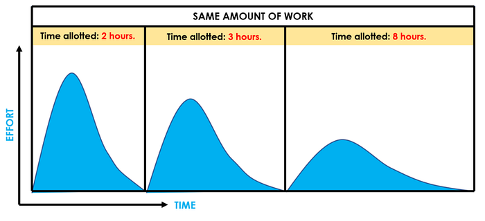
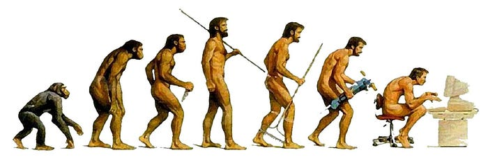

人類的自然規律：不是做多少事、就需要多少資源。而是有多少資源、人類就一定會把這個資源用到耗盡為止。

### 前言

最近團隊交付產品的時間，常常有不如預期的情況發生。

通常想解決這個問題，可能會想到以下幾種方式：

1. 增加人力
2. 增加時間
3. 其它（例如：改善流程、自我成長、加班）

第一種「增加人力」在《[人月神話](https://zh.wikipedia.org/zh-tw/%E4%BA%BA%E6%9C%88%E7%A5%9E%E8%AF%9D)》 一書中，已經告訴我們為什麼沒有用了。

第二種「增加時間」，我們曾經嘗試過把 Scrum 的 Sprint 週期從兩個禮拜增加到三個禮拜，但是結果看起來並不理想。

這篇文章我想要探討，為什麼我覺得第二種「增加時間」的方法也是沒有用的。

### 為什麼會有拖延症？

最近在《[罗辑思维](https://www.igetget.com/)》聽到一期《[為什麼會有拖延症？](https://d.dedao.cn/DN1DUiWhTCF9xsMJ)》令我印象深刻，摘錄分享出來。

為什麼會有拖延症？其實不是因為我們自我管理不嚴格，而是因為只要時間資源在那裡，你就會傾向於把它用盡。

1955 年，英國政治學家帕金森，提出了一個「帕金森定理」：一個組織，總是會趨向於層級越來越多，規模越來越膨脹，人越來越忙，但組織效率越來越低下。

為什麼會變這樣呢？是因為組織腐敗嗎？不是，員工自己也覺得工作很辛苦、每天忙得要死。那是為什麼呢？

因為人類組織的自然規律：**不是做多少事、就需要多少資源。而是有多少資源、組織就一定會膨脹到那個程度，直到把這個資源耗盡為止。**

至於事情有沒有多做、做得好不好，反倒不是那麼重要了。反過來，把資源砍掉，也未必會影響做事的成效。

*Parkinson’s law*

這個過程中，不僅資源會被用上，而且還會衍生出新的事務，迫使組織又進一步渴望新的資源，進入惡性循環。

舉個例子，一間公司原本很小，只有兩個人，分工清楚。

這個時候，公司招聘了一批新人，那麼有些工作就可以交給他們了，但是原本的兩人有變輕鬆了嗎？並沒有，因為多了一個人，至少多出來了好幾件事：

1. **工作的分配問題**：要想清楚哪些工作可以交出去、什麼時候交、交到什麼程度？
2. **人際關係問題**：要考慮大家的心情和可能發生的矛盾，工作量和工作成果的分配要儘可能公平合理
3. **品質問題**：新人做事不放心，要去 review 他們的工作成果，有需要改善的地方，可能得查缺補漏甚至推倒重來
4. **組織發展問題**：公司要對他們負責，所以要花時間、找資源去培訓他們、提升他們
5. **評價標準問題**：人多了，就牽涉到排名問題，為了給將來的升職加薪留個依據，公司就要制定 KPI 之類的玩意兒

這裡面的每一件事你都不能說沒必要，但是每一件事都只是因為多了這麼個人、這麼個資源，因事生事，已經和最初的工作目標沒什麼關係了。

---

回到拖延症這個話題。這個規律也適用於「時間」這種資源：並不是因為需要多少用多少，而是有多少你就會用光多少。

你可能會懷疑，做一件事需要的時間不是有限的嗎？從鎖一顆螺絲到造一台汽車，不僅需要的時間是有限的，而且還可以持續優化，怎麼會需要無限的時間資源呢？

**這是因為人類工作要處理的對象，從「物品」變成了「事情」。**

以前，無論是農業時代還是工業時代，我們的工作對象主要是物品：種一畝地的田、流水線上加工一個零件。因為物品的邊界是清晰的，所以需要的工作時間就是有限的。我們努力的方向，就是通過各種工具和創新，節省時間資源，獲得更高的效率。

但是現在我們的工作對象越來越像是「事情」。比如寫一篇企劃搞、做藝術創作、開發一個程式功能、準備一場行銷活動。只要是「事情」，背後包含的複雜度就太高了。而且只要是一件「事情」，就可以膨脹成任何規模的工作。

只要有時間，你就可以無窮無盡地圍繞著這個決定做準備，沒有一件事是毫無必要的，也沒有一件事是確定有必要的。

*Human Evolution*

這也可以解釋 [996 工作制](https://zh.m.wikipedia.org/zh-hant/996%E5%B7%A5%E4%BD%9C%E5%88%B6)這件事。不是因為 IT 公司都是慣老闆，也不是因為 IT 公司的工作量就比別人多，而是因為 IT 公司面對的工作對象，不是清晰的「物品」，而是一件件說不清、道不明的「事情」，它的工作對時間資源的索取就是無止境的。所以 996 本質上不是說需要這麼多時間，而是現在一個 IT 從業人員能榨取的工作時間的極限就這麼多了，那些搞 996 工作制的公司，只是把它用盡了而已。

### 結語

如果「加人」與「加時間」都無法解決產品交付 delay 問題的話，可能就要從「其它」方式下手了。

撇開「自我成長」和「加班」這類不可控因素，我認為團隊應該要分配資源在「改善流程」上面。

比如我接下來預計要寫的幾篇文章：《Trunk Based Development 》、《Single Text of Truth 》以及《Design to Code》。這些都是跟交付功能無關的工作，卻是可以改善團隊交付速度的解決方案。

否則如果只是把「[瀑布](https://zh.wikipedia.org/zh-tw/%E7%80%91%E5%B8%83%E6%A8%A1%E5%9E%8B)」換成「[敏捷](https://zh.wikipedia.org/zh-tw/%E6%95%8F%E6%8D%B7%E8%BD%AF%E4%BB%B6%E5%BC%80%E5%8F%91)」的話，本質上還是在第二種資源「時間」上打轉而已，最終可能還是得應付處理不完的「[隕石](https://ithelp.ithome.com.tw/articles/10198394)」。
