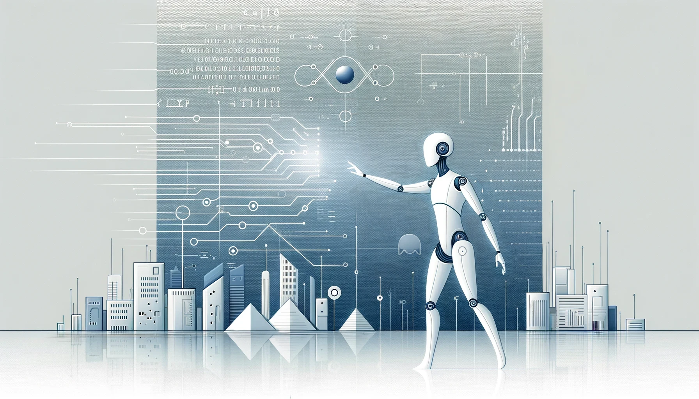
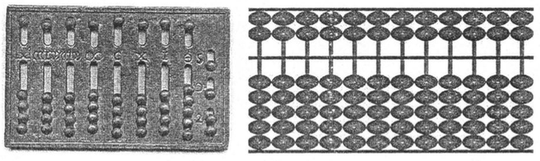
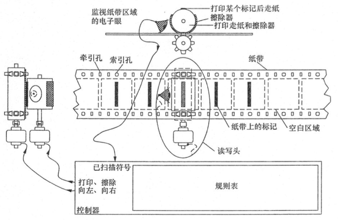
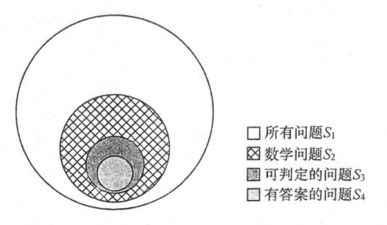
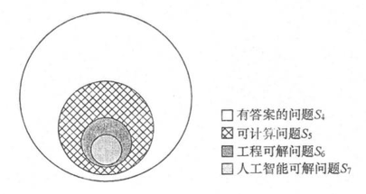
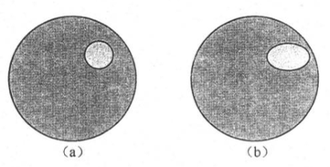
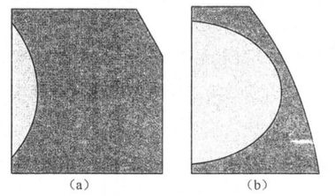
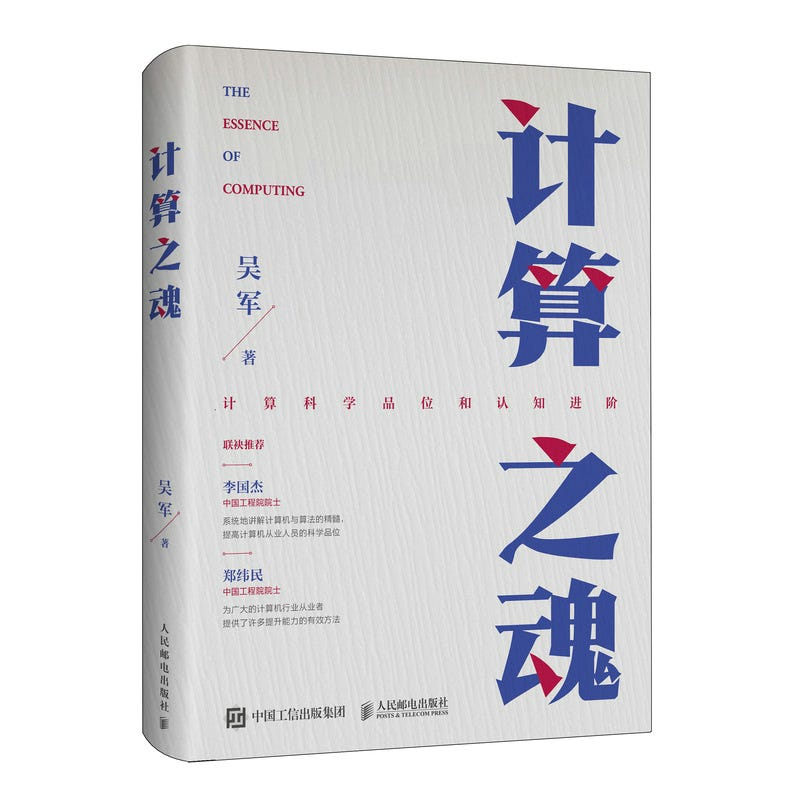

---

本文將探討哪些問題是 AI 可以解決的，哪些是它無法觸及的。希望通過這篇文章，讀者能夠對計算的本質與 AI 的限制有更清晰的認識，理性看待這項技術的發展。

*Generated with DALL·E*

#### 前言

在這個數位化迅速發展的時代，AI 逐漸成為我們生活中的一部分。從智能助理到自動駕駛汽車，AI 技術的應用範圍日益擴大。大數據和深度學習技術的飛速進步，使得 AI 在語音識別、圖像處理等領域表現得愈發出色。近期，生成式 AI 例如 ChatGPT 和 DALL-E，更是展現了 AI 在創意和生成內容方面的巨大潛力。

然而，隨著這些技術的進步，許多人也開始擔心：AI 會不會超越人類的能力，甚至取而代之？

最近讀了吳軍的《計算之魂》一書之後，我深受啟發，決定節錄書中的精華內容，撰寫成這篇文章。

#### 什麼是計算機

計算機（電腦）的歷史可以追溯到幾千年前，從中國的算盤到現代的電子計算機。儘管現代電子計算機在 1946 年才被發明，但計算的概念早已存在。計算機的核心構成包括**計算單元**、**存儲單元**和**控制指令序列**（[馮諾伊曼架構](https://en.wikipedia.org/wiki/Von_Neumann_architecture)）。沒有指令序列，計算機就不完整。

中國的算盤雖然簡單，卻蘊含了基本的計算思想。算盤的設計基於珠算口訣，使用中國算盤，人所提供的不過是機械動能，而非頭腦中的運算能力，算盤是在口訣指令的控制下完成機械運動的，而機械運動能得到計算結果，這與現代計算機的指令控制有異曲同工之妙。

*中國算盤（圖右）之所以被視為計算機，是因為它依靠珠算口訣控制操作，而古羅馬算盤（圖左）只是輔助計算工具，沒有指令序列的控制功能。*

#### 布林代數和開關電路

進入工業時代後，人們開始設計機械計算機來自動執行計算任務。[布萊茲·帕斯卡](https://en.wikipedia.org/wiki/Blaise_Pascal)和[哥特弗利德·萊布尼茲](https://en.wikipedia.org/wiki/Gottfried_Wilhelm_Leibniz)先後發明了能進行加減運算的機械計算機，而[查爾斯·巴貝奇](https://en.wikipedia.org/wiki/Charles_Babbage)則設計了更複雜的差分機，儘管未能成功製造出來，但其思想深遠地影響了後來的計算機發展。

[喬治·布爾](https://en.wikipedia.org/wiki/George_Boole)發明了[布林代數](https://en.wikipedia.org/wiki/Boolean_algebra_%28structure%29)統一算術與邏輯，為現代邏輯電路奠定了基礎。[克勞德·夏農](https://en.wikipedia.org/wiki/Claude_Shannon)（[信息論](https://en.wikipedia.org/wiki/Information_theory)之父）則是將布林代數應用於電氣工程，設計出基於開關電路的邏輯運算，這一突破性發明使現代數位計算機成為可能。

[康拉德·楚澤](https://en.wikipedia.org/wiki/Konrad_Zuse)通過簡單模組的複製，成功研制出了世界上第一台可編程計算機 [Z1](https://en.wikipedia.org/wiki/Z1_%28computer%29)。這台計算機利用布林代數和邏輯電路，實現了複雜計算的模組化，使得計算機的設計和製造進入了一個新階段。

#### 數學與邏輯的局限

在討論 AI 的極限時，必須首先理解數學和邏輯的邊界。數學家[大衛·希爾伯特](https://en.wikipedia.org/wiki/David_Hilbert)提出了三個重要的問題：數學是否完備（complete）、一致（consistent）和可判定（decisive）。所謂完備性，就是說對於任意一個命題，要麼可以證明它是對的，要麼可以證明它是錯的；一致性指的是一個命題不能既是真的又是假的；可判定性則是能否判斷一個具體問題是否有答案。

[庫爾特·哥德爾](https://en.wikipedia.org/wiki/Kurt_G%C3%B6del)通過其[哥德爾不完備定理](https://en.wikipedia.org/wiki/G%C3%B6del%27s_incompleteness_theorems)證明，數學不可能同時是完備和一致的。這意味著有些問題是無法通過數學方法證明其對錯的。1970 年，蘇聯數學家[尤里·馬季亞謝維奇](https://en.wikipedia.org/wiki/Yuri_Matiyasevich)解決了[希爾伯特第十問題](https://en.wikipedia.org/wiki/Hilbert%27s_tenth_problem)，證明了對於絕大多數[不定方程](https://en.wikipedia.org/wiki/Diophantine_equation)，我們既不能證明它們有整數解，也無法證明它們無解。這說明，**有些問題即使是最先進的 AI 也無法解決，因為它們根本不是數學問題**。

#### 圖靈機的理論邊界

在 20 世紀 30 年代中期，[艾倫·圖靈](https://en.wikipedia.org/wiki/Alan_Turing)開始思考三個非常根本的問題：

1. 數學問題是否都有明確的答案？
2. 如果有明確的答案，是否可以通過有限步的計算得到？
3. 是否能有一種假想的機器，通過機械運動解決這些數學問題？

圖靈提出的[圖靈機](https://en.wikipedia.org/wiki/Turing_machine)模型定義了哪些問題是可計算的（可以在有限步內完成計算），哪些問題是不可計算的（無法在有限步內完成計算）。

圖靈機的概念不僅幫助定義了計算的邊界，還引入了幾個關鍵的計算元素：紙帶（相當於現代的存儲地址）、讀寫頭、規則表（即今天的指令集）和寄存器（即計算機狀態）。這些元素構成了現代計算機的基本原理，使得計算過程與機械運動相對應。圖靈機將複雜的計算過程簡化為一系列基本操作，這一思路奠定了數字計算的基礎。

*圖靈機將複雜的計算過程簡化為一系列基本操作，這一思路奠定了數字計算的基礎。*

圖靈在思考計算機相關問題時，會回到問題的本源，拋開具體技術，從計算的本質來尋找計算機的極限。**現代計算機，包括最先進的 AI 系統，都沒有超越圖靈機定義的可計算問題範疇。**

#### 人工智慧的極限

在 2016 年，當 Google 的 AlphaGo 擊敗了李世石之後，許多人開始擔心世界上所有的事情是否都能由計算機比人類做得更好。然而，這種擔心多少有點杞人憂天，因為無論是什麼樣的計算機，實際上只能解決世界上一小部分問題。

我們在前面提到，世界上的很多問題並不是數學問題，這一點已經由[希爾伯特](https://en.wikipedia.org/wiki/David_Hilbert)和[哥德爾](https://en.wikipedia.org/wiki/Kurt_G%C3%B6del)等人證明了。如果我們畫一個大圈代表所有問題（下圖集合 S₁）的話，那麼所有的數學問題（集合 S₂）只是這個大圈中的一個小圈而已。

[馬季亞謝維奇](https://en.wikipedia.org/wiki/Yuri_Matiyasevich)解決了[希爾伯特第十問題](https://en.wikipedia.org/wiki/Hilbert%27s_tenth_problem)，這一發現使得我們清楚地知道，有些數學問題無法判定答案存在與否，這意味著我們無法用邏輯方法推導出答案。因此，我們可以將數學問題中的一小部分看作是可判定（是否有答案）的問題（集合 S₃），而真正有答案的問題（集合 S₄）的數量則更少。

*在數學領域，只有一部分問題我們能夠判斷是否存在答案，大部分問題是無法判斷答案是否存在的。*

在有答案的問題中，有一些是可以通過圖靈機解決的問題（下圖集合 S₅），即我們前面提到的可計算問題。現實生活中的計算機能解決的問題（即工程可解問題，集合 S₆）是可計算問題的一個小子集。

AI 的實際應用主要集中在工程可解問題上，這些問題可以通過現有的算法和計算能力在合理的時間內解決。然而，很多問題的計算複雜度高於可接受的範圍，即使計算機速度提升一萬倍，也無法顯著改善這些問題的解決能力。例如，某些加密算法的破解時間即使在量子計算機的幫助下也需要極其漫長的時間。

*人工智慧可解問題只是有答案的問題中很少的一部分*

今天的人工智慧主要是基於大數據的深度學習。我們可以把人工智慧系統理解為由特定程序（控制指令序列）控制的、能夠解決某一類問題的計算機。例如，語音和圖像識別、無人駕駛、自動翻譯、下圍棋或象棋等，這些問題並未超出圖靈機可計算問題的範疇。

人工智慧之所以顯得很聰明，是因為很多問題過去人們沒有找到轉變為數學問題的橋梁，而現在找到了。這意味著集合 S₆ 沿著某個維度擴大了一些範疇，但無論怎麼擴展，它都不可能超出可計算問題的范疇。

*利用 AI 技術已經解決的問題（大圓內的小圓和橢圓）只是工程可解問題中的一小部分*

*很多人只看到局部的進步，就誤認為 AI 技術已經解決大部分問題了*

#### 結論

迄今為止，計算機相關理論和技術的發展都沒有超越圖靈機的范疇。也就是說，80 多年前圖靈為計算機所能解決的問題劃的那條線，至今還沒有被逾越。這說明理論對工程的影響是多麼深遠。在學術界，試圖越過圖靈劃的紅線其實沒有必要。今天，世界上需要用計算機、用人工智慧來解決的問題實在太多，因此將注意力放在利用它們解決現有的問題上，而不是杞人憂天或異想天開，更有意義。

未來是否會有能夠解決非數學問題的機器？或許會有，但這不是我們今天所談論的計算機。

---

以上內容節錄自吳軍《計算之魂》這本書的第一章，省略了很多細節。如果你對這些內容感興趣，強烈建議購買這本書進行詳細閱讀。希望這篇文章能幫助你更深入地了解計算的本質。

