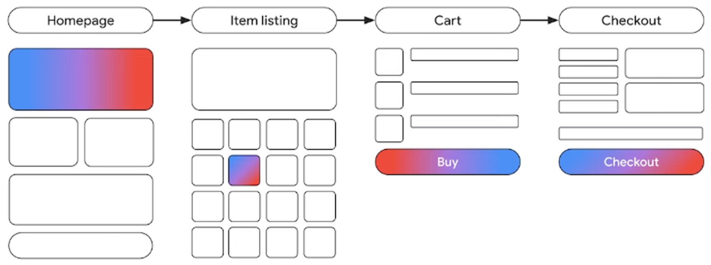
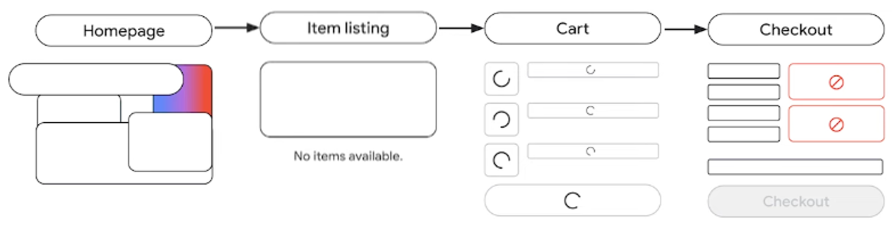
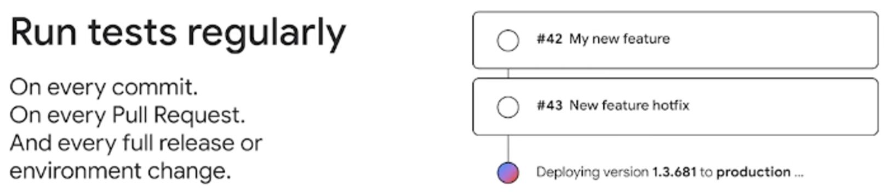
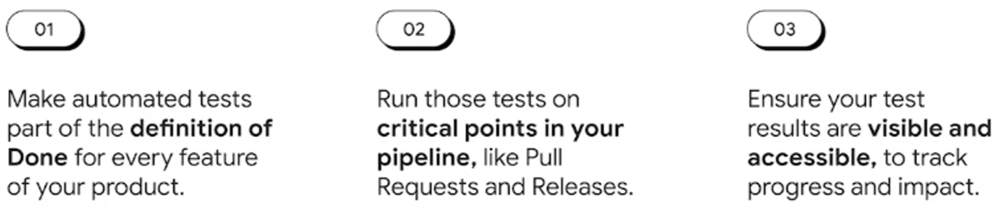
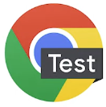
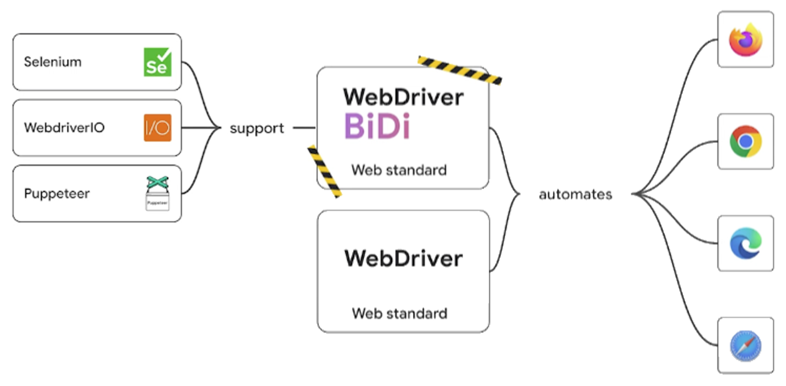

隨著科技的迅速發展，網站和應用程式的複雜性日益增加，對品質和穩定性的要求也變得更加迫切。在這篇文章中，我們將探討自動化測試的重要性、如何在組織中實施自動化測試，以及 Chrome 提供的測試工具和策略。

### 前言

最近有許多跟前端相關的 conference，例如 [React Conf 2024](https://conf.react.dev/)、[Google I/O 2024](https://io.google/2024/) 以及 [React Paris 24](https://react.paris/)。

雖然每段議程都不長，但要全部追完也是很累人，所以公司同事就揪大家一起共筆。

我認領到的議程有這三場：

1. [Real-time server components](https://conf.react.dev/talks/8)
2. [Automate browser testing with tools and best practices from Chrome](https://io.google/2024/explore/f6a77c6d-e1fe-434b-92ca-879f8d153672/)
3. [Multi-page application View Transitions are here](https://io.google/2024/explore/8ae18b72-028e-4722-9a05-4a480048e629/)

這篇是第二篇，介紹《Automate browser testing with tools and best practices from Chrome》，第一篇可以點擊下方連結前往。

[Real-time Server Components](https://blog.amowu.com/posts/2024-06-08-real-time-server-components/)

### 自動化測試的重要性及其優勢

#### 確保品質

在電子商務網站中，用戶需要完成多次互動來完成訂單，每個互動都是潛在的故障點。通過自動化測試，可以全面覆蓋這些互動，確保每個步驟的可靠性，提前發現並解決這些問題，減少系統崩潰和功能故障的風險，**使品質能成為產品的一部分，而不是事後考量**。


*觀察全球受歡迎的電子商務網站，平均來說，使用者需要完成至少 16 次的互動才能順利下訂單。*


*每一次互動都是潛在的失敗點。跑版，按鈕無法點擊、API 沒有正確回應等…。而這還只是網站中數百個互動情境的其中之一。*

#### 提高開發效率

自動化測試在每次 commit、Pull Request 和 release 時自動運行，可以減少了手動測試的資源和時間消耗，使開發團隊能更專注於新功能的開發和現有功能的優化。



### 如何在組織中實施自動化測試

#### 統一心態

在實施自動化測試的過程中，團隊內部需要達成共識：品質即功能（Quality as a feature）。這意味著將品質視為一種投資，而不是負擔。滿意的客戶會帶來繁榮的業務，一旦這種心態被接受，測試（Tests）自然成為產品開發工作流程的一部分。

#### 測試流程的整合

將自動化測試納入每個功能完成的定義中（DoD），並在開發流程的每個關鍵步驟中運行測試。例如，每次 commit 程式碼、每次 Pull Request 以及每次完整 release 或環境變更後，都應進行測試。此外，確保測試相關的衡量標準對組織中的每個人都是可見和可訪問的，例如，每月發佈次數、bug reports、測試覆蓋率，以便追踪進度、影響並更好地了解產品的健康和品質。



### Chrome 測試工具及策略

#### Chrome for Testing

新推出的 Chrome for Testing 是專為自動化測試設計的特製版本，它不會自動更新，但包括所有 Chrome Stable 版本的功能，可以用於複製特定版本的測試環境。這對於需要在特定版本的 Chrome 上進行測試的情況特別有用。

| Channel |  Chrome for Testing |  Chrome Stable |  Chrome Beta |  Chrome Dev |  Chrome Canary |
| --- | --- | --- | --- | --- | --- |
| 特點 | 特製版本，不自動更新，包含所有 Chrome Stable 功能 | 針對大眾使用者，功能穩定可靠 | 即將成為 Stable 版本的測試版，功能相對穩定 ｜ 最新功能和修復，每週更新一次 | 最實驗性的版本，每天更新，包含所有最新功能和修復 | |
| 更新頻率 | 不定期 | 每月 | 每四至六週 | 每週 | 每天 |
| 適用對象 | 測試工程師、開發人員 | 所有人 | UX/UI 團隊、開發團隊 | 工程團隊、開發人員 | 開發者、測試人員 |
| 主要用途 | 自動化瀏覽器測試 | 日常瀏覽使用、確保穩定性 | 提前預見即將發佈的功能和變化 | 測試最新功能和 API，提前適應變化 | 是用最新的 Chrome 功能和 API，進行實驗性測試 |

#### 新 Headless 模式

過去 Chrome 的舊 headless 模式（無頭模式）是單獨維護的瀏覽器版本，容易發生結果不一致的問題。新 headless 模式不再是單獨維護的瀏覽器，而是與 Chrome Stable 使用相同的程式碼，支援所有 Chrome Stable 功能。這使得測試 Extensions 和使用 WebGPU（AI 相關應用）的網站變得更加容易。

```javascript
// for Chrome Extensions

import puppeteer from 'puppeteer':

const EXTENSION_PATH = '~/dino/workspace/my-super-cool-extension-src';
const EXTENSION_ID = 'jkomgjfbbjocikdmilgaehbfpllalmia' ;

const browser = await puppeteer.launch({
  headless: true, // Defaults to new headless mode from Puppeteer 22+
  args: [
    '--disable-extensions-except=${EXTENSION_PATH}',
    '--load-extension=${EXTENSION_PATH}',
  ]
});

const page = await browser.newPage();
await page goto('chrome-extension://${EXTENSION_ID}/page.htm');
```

```javascript
// for Chrome Extensions

import puppeteer from 'puppeteer':

const EXTENSION_PATH = '~/dino/workspace/my-super-cool-extension-src';
const EXTENSION_ID = 'jkomgjfbbjocikdmilgaehbfpllalmia' ;

const browser = await puppeteer.launch({
  headless: true, // Defaults to new headless mode from Puppeteer 22+
  args: [
    '--disable-extensions-except=${EXTENSION_PATH}',
    '--load-extension=${EXTENSION_PATH}',
});

const page = await browser.newPage();
await page goto('chrome-extension://${EXTENSION_ID}/page.htm');
// for WebGPU

const browser = await puppeteer.launch({
  // Defaults to new headless mode from Puppeteer 22+
  headless: true,
  args: [
    '--no-sandbox',
    '--headless=new',
    '--use-angle=vulkan',
    '--enable-features=Vulkan',
    '--disable-vulkan-surface',
    '--enable-unsafe-webgpu',
  ]
});
```

#### 跨瀏覽器測試

為了確保網站在所有瀏覽器中都能良好運行，Google 與主要瀏覽器和測試工具供應商合作開發了 WebDriver BiDi 協議。這個協議允許使用相同的命令自動化所有瀏覽器，不論其引擎如何。目前，部分自動化工具如 Selenium、WebDriver I/O 和 Puppeteer 已部分支持 WebDriver BiDi。Firefox、Chrome 和 Edge 都已經或計劃部分支持 WebDriver BiDi。


*您仍可以使用現有的 WebDriver 標準來自動化所有瀏覽器。*

### 總結

自動化測試是一種確保產品品質的重要手段，應成為每個開發團隊的核心部分。通過充分利用 Chrome 提供的測試工具（Chrome for Testing、新 headless 模式）和策略（WebDriver BiDi），我們可以確保產品在各個瀏覽器中的一致性和可靠性。品質即功能，自動化測試能使我們更自信地面對未來的挑戰，並提供更優質的用戶體驗。
