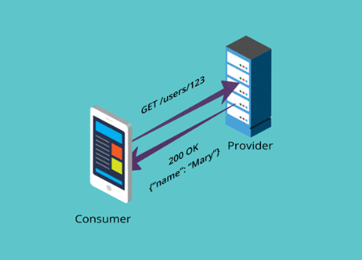
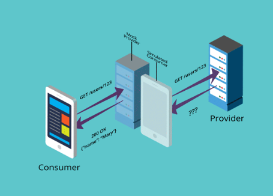
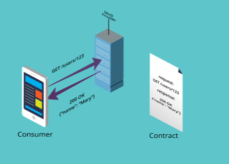
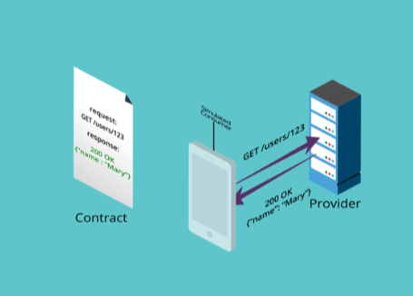
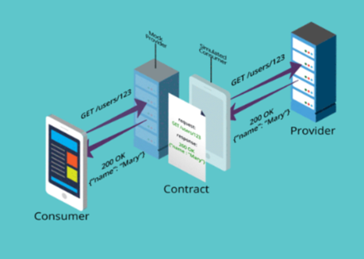
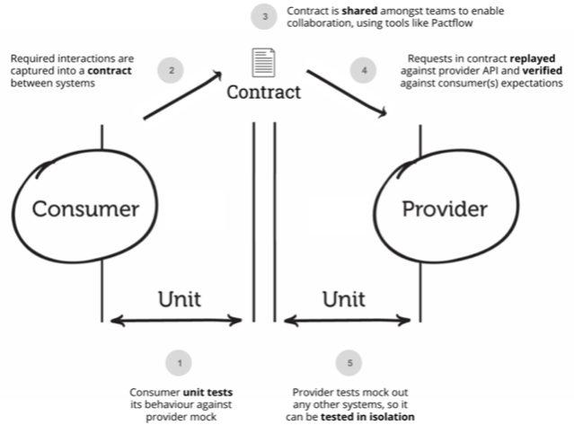
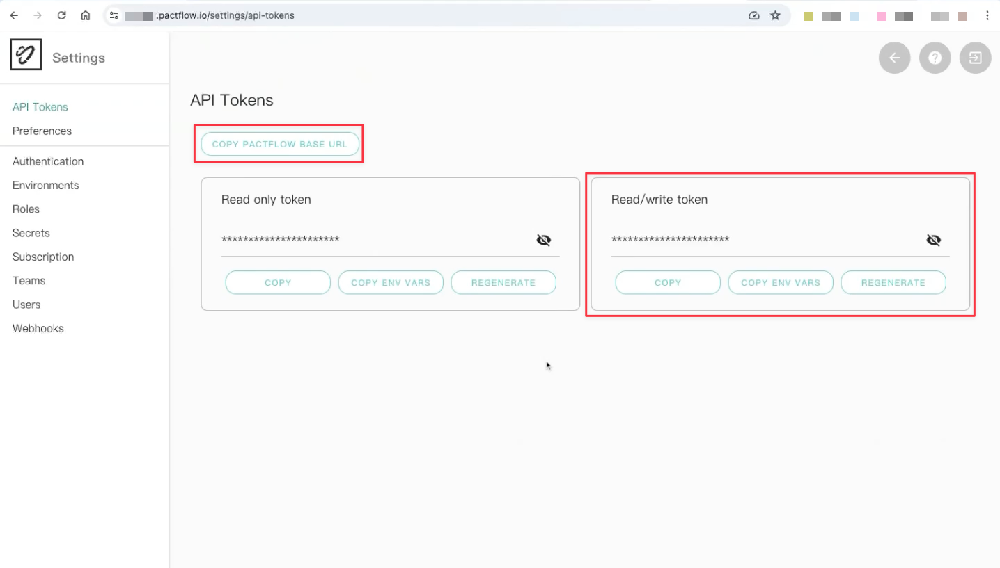
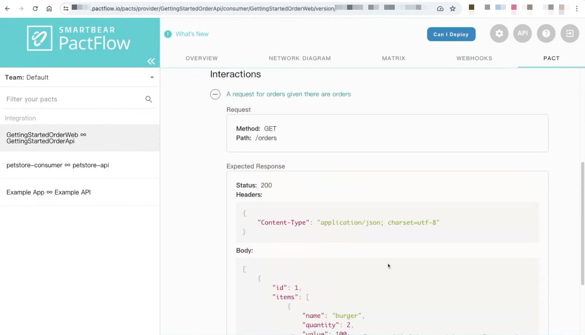

#### 初探 Pact & PactFlow

不知道大家有沒有聽過「契約測試」這個冷門的概念，它適合兩種對象：

1. 一個後端（API server）＋多個 client 端（web＋mobile）
2. 多個 server 端（例如 microservices）

這篇文章會介紹 Pact 這個契約測試工具，以及 PactFlow 這個服務。

### 前言

大概是在 2017 年左右，當時我正在尋找前端 mock server 相關資料的時候，第一次聽到「契約測試」這個概念，當時並沒有深入去瞭解它。

[Mock Server＆契約測試](https://blog.amowu.com/posts/2017-08-26-mock-server/)

後來公司開始有了 iOS & Android 工程師，這時候就出現一些問題。因為後端的 API 要同時服務於 web 前端跟 mobile app，有時候兩邊要的東西是不一樣的，可能就很容易產生衝突。在尋找解決方案的時候，又再次聽到契約測試的名字。

即便是今天，我搜尋了一下 contract testing，還是沒多少人在介紹，可見這個東西是相對冷門的。於是我就決定來研究一下它是什麼，並於 2023 年在公司的前端聚會上分享，這篇文章就是整理自當時簡報的內容。

以下是大綱：

* 什麼是 Contract Testing？
* Pact Contract Testing 如何運作
* 5 分鐘指南
* 總結

### 什麼是 Contract Testing？

Content testing 的中文通常翻譯成「契約測試」，也有一些地方譯作「合約測試」或「合同測試」。

這是一種整合測試（Integration testing）技術，通過對每個應用（application）進行獨立檢查，確保其「發送」或「接收」的「訊息」符合記錄在「契約」中的共識。

例如，對於通過 HTTP 進行通信的應用，這些訊息將是 HTTP 請求（request）和回應（response）；而對於使用隊列（queues）的應用，訊息則是放入隊列的消息（message）。

在實踐中，**實施契約測試的常見方式（也是 Pact 的方式）是檢查所有對「測試替身（test doubles）」發送和接收的結果，是否與對真實應用發送和接收的結果一致。**

#### 何時該使用契約測試？

契約測試適用於任何需要通信的兩個以上的應用，最簡單的例子是 API server 與 web 前端之間的通信。

雖然單個客戶端對單個服務端的情況較為常見，但在多個服務環境下，契約測試能發揮最大的作用。例如現今流行的微服務（Microservices）架構中，使用契約測試能幫助開發人員更好地管理版本。

#### 契約測試會用到的術語

契約通常由**消費者端（Consumer）**和**提供者端（Provider）**直接簽訂。Consumer 端可以想像成需要獲取某些資料的客戶端（client），而 Provider 端則是提供資料的伺服器（server）。

那為何不直接使用 client 和 server 呢？因為在微服務架構中，通信可能是伺服器對伺服器之間的通信，這時使用 client 和 server 並不合適，因此更傾向於使用 Consumer 和 Provider 這兩個術語。

#### Contract Testing Patterns

契約測試主要分為兩種模式（pattern）：

1. 以消費者為驅動的契約測試（Consumer-Driven Contract Testing）
2. 以提供者為驅動的契約測試（Provider-Driven Contract Testing）

今天要介紹的 Pact 是一種 Code-First 的「消費者驅動契約測試」工具。

**什麼是 Code-First 呢？**

契約是在 Consumer 執行測試的階段自動產生，這就是所謂的 Code-First Consumer-Driven。

這種模式的優點是只有 Consumer 實際使用的通信部分才會被測試。因此，如果 Provider 對當前 Consumer 未使用的部分進行修改，測試也不會受到影響。

其他類似於契約測試的概念還包括 Schema Testing 和 OpenAPI specification（OAS），不過這些今天都不會提到，有興趣的人可以看這篇[官方文章](https://pactflow.io/blog/contract-testing-using-json-schemas-and-open-api-part-1/)。

### Pact Contract Testing 如何運作

在說明 Pact 契約測試如何運作之前，我們先來看看傳統測試會有哪些問題。

[Microservices and API testing framework](https://pact.io/)

#### 整合測試的問題

整合測試（Integration testing）雖然能提升信心，但也會引入依賴關係。因為 Consumer 和 Provider 需要一起運作，這會使除錯變得緩慢。例如，使用 Cypress 進行 E2E 測試時，可能需要執行完整的回歸測試（Regression testing）才能發現問題，這會延遲修正問題的時間。

此外，整合測試較容易失敗。例如，前端或後端的一些小改動可能會導致整個測試失敗，迫使我們重新編寫測試，增加了維護的負擔。



[Hahow for Business 如何跑 E2E 測試？](https://blog.amowu.com/posts/2022-06-29-cypress-on-rails/)

#### 獨立測試的問題

那為什麼不獨立的測試呢？獨立測試將 Consumer 和 Provider 分開測試，這樣能提供獨立運作的優點，反饋速度快且測試穩定，維護也較容易。然而，獨立測試相比整合測試，對發佈（release）的信心較低，可能會在上線後才發現真實世界中的問題。



#### Pact 契約測試

那 Pact 是如何運作的呢？我們先來看 Consumer 端。在測試期間，Consumer 會對模擬 Provider 的 mock server 發送 request，並記錄預期的 response。這些互動（interactions）會自動生成一份契約（稱作 pact）。



Provider 端則會拿到這份生成的契約，對其進行回放（replays），檢查 Provider 實際產生的 response 是否符合 Consumer 的預期。如果兩者匹配，我們就能確信它們在真實應用中的行為也是符合預期的。



這就是 Pact 契約測試的大致運作流程。這種方法同時保有獨立運作的優點，反饋快速且測試穩定，維護起來也容易。此外，Pact 契約測試也能夠提升我們的發佈信心，雖然不如整合測試那麼強，但比獨立測試更有信心。



#### PactFlow

使用 Pact 契約測試後，就會需要管理這些契約（pacts），否則每次都要等 Consumer 生成契約再交給 Provider 測試，這會很麻煩。因此，需要一個中介角色，Pact 將之稱作 **Pact Broker**。

具體操作是自動化將契約存放到某個地方，Provider 再從中取回契約進行測試。這塊除了可以自行實作，也可以使用 Pact 提供的開源 Pact Broker。此外 Pact 還提供了一個完全托管的 Pact Broker 服務，叫做 PactFlow，後面會介紹。


*Pact Contract Testing*

### 5 分鐘指南

接下來，我將介紹官方提供的[五分鐘指南](https://docs.pact.io/5-minute-getting-started-guide)。

#### 官方五分鐘指南Demo

官方五分鐘指南有提供一個[範例 repository](https://github.com/pact-foundation/pact-5-minute-getting-started-guide)，有興趣的朋友可以自行 clone 下來操作。

#### 目錄結構介紹

Clone 下來後，目錄結構大致如下：

```
pact-5-minute-getting-started-guide/
├── consumer/
├── pacts/
├── provider/
├── scripts/ci/
├── index.html
├── index.js
├── package.json
├── pact.js
├── publish.sh
├── runConsumerTest.js
├── runProviderTest.js
└── runTest.js
```

主要的資料夾包括：**consumer**、**provider** 和用來存放自動產生契約的 **pacts** 資料夾。為了方便理解，官方將 Consumer 和 Provider 都放在一起，這樣演示比較方便。

我們先來看一下 package.json 文件，這個範例的前端和後端都是使用 JavaScript 語言：

```json
// package.json
{
  ...
  "dependencies": {
    "express": "^4.18.2"
    ...
  },
  ...
}
```

測試工具的部分，前端和後端都是使用 mocha 和 chai，以及 Pact 提供的測試 library：

```json
// package.json
{
  "devDependencies": {
    "@pact-foundation/pact": "12.1.0",
    "mocha": "^10.2.0",
    "chai": "^4.3.7",
    ...
  }
}
```

#### 測試流程

首先，我們會執行 Consumer 端的測試，指令是 `npm run test:consumer`，接著執行 Provider 端的測試，指令是 `npm run test:provider`。這兩個測試都是在本地進行的：

```json
// package.json

{
  "scripts": {
    "test:consumer": "node runConsumerTest.js",
    "test:provider": "node runProviderTest.js",
    "test": "npm run test:consumer && npm run test:provider",
    ...
  },
}
```

演示完這部分之後，我還會示範如何將契約發佈到 PactFlow 執行測試，主要指令是 `npm run test:broker`：

```json
// package.json

{
  "scripts": {
    ...
    "pact:publish": "./publish.sh",
    "test:broker": "npm run test:consumer && npm run pact:publish && npm run test:provider",
  },
}
```

#### Consumer 測試

我們先來看 Consumer 端的測試。這個範例主要是測試一個訂單 API，前端會呼叫 RESTful API 並轉換成自己的 model 結構：

```javascript
// consumer/order.js

class Order {
  constructor(id, items) {
    this.id = id;
    this.items = items;
  }

  total() {
    return this.items.reduce((acc, v) => {
      acc += v.quantity * v.value;
      return acc;
    }, 0);
  }

  toString() {
    return `Order ${this.id}, Total: ${this.total()}`;
  }
}

module.exports = {
  Order,
};
// consumer/orderClient.js

const request = require("superagent");

const { Order } = require("./order");

const hostname = "127.0.0.1"

const fetchOrders = () => {
  return request.get(`http://${hostname}:${process.env.API_PORT}/orders`).then(
    (res) => {
      return res.body.reduce((acc, o) => {
        acc.push(new Order(o.id, o.items));
        return acc;
      }, []);
    },
    (err) => {
      console.log(err)
      throw new Error(`Error from response: ${err.body}`);
    }
  );
};

module.exports = {
  fetchOrders,
};
```

我們會對這個 model 進行單元測試，測試會模擬一個 HTTP GET 請求來獲取訂單，並將返回的 response 轉換為前端的訂單 model：

```php
// consumer/consumer.spec.js

// 設定我們的測試框架
const chai = require("chai");
const expect = chai.expect;
const chaiAsPromised = require("chai-as-promised");
chai.use(chaiAsPromised);

// 我們需要 Pact 才能在測試中使用它
const { provider } = require("../pact");
const { eachLike } = require("@pact-foundation/pact").MatchersV3;

// 導入我們的待測邏輯（orderClient）和訂單模型
const { Order } = require("./order"); 
const { fetchOrders } = require("./orderClient");

// 這是我們開始寫測試的地方
describe("Pact with Order API", () => {
  describe("given there are orders", () => {
    const itemProperties = {
      name: "burger",
      quantity: 2,
      value: 100,
    };

    const orderProperties = {
      id: 1,
      items: eachLike(itemProperties),
    };

    describe("when a call to the API is made", () => {
      before(() => {
        provider
          .given("there are orders")
          .uponReceiving("a request for orders")
          .withRequest({
            method: "GET",
            path: "/orders",
          })
          .willRespondWith({
            body: eachLike(orderProperties),
            status: 200,
            headers: {
              "Content-Type": "application/json; charset=utf-8",
            },
          });
      });

      it("will receive the list of current orders", () => {
        return provider.executeTest((mockserver) => {
          // Mock server 是在一個隨機可用的 port 上啓動的，
          // 因此我們設置了 API_PORT，這樣 HTTP 客戶端就能動態找到 endpoint 了。
          process.env.API_PORT = mockserver.port;
          return expect(fetchOrders()).to.eventually.have.deep.members([
            new Order(orderProperties.id, [itemProperties]),
          ]);
        });
      });
    });
  });
});
```

其中 `require("../pact")` 會先 setup 測試環境，這些設置包括 Consumer 和 Provider 的名稱以及契約的存放位置（本地的 pacts 資料夾）：

```javascript
// pact.js

const path = require("path");
const consumerName = "GettingStartedOrderWeb";
const providerName = "GettingStartedOrderApi";
const pactFile = path.resolve(`./pacts/${consumerName}-${providerName}.json`);
...

module.exports = {
  pactFile,
  consumerName,
  providerName,
  ...
};
```

然後是 Provider mock server 的設置：

```javascript
// pact.js

const pact = require("@pact-foundation/pact");
const Pact = pact.PactV3;
const path = require("path");
const process = require("process");
...

...

const provider = new Pact({
  log: path.resolve(process.cwd(), "logs", "pact.log"),
  dir: path.resolve(process.cwd(), "pacts"),
  logLevel: "info",
  host: "127.0.0.1",
  consumer: consumerName,
  provider: providerName,
  host: "127.0.0.1"
});

// 用於在出現錯誤時 kill 剩餘的 mock server instances
process.on("SIGINT", () => {
  pact.removeAllServers();
});

module.exports = {
  provider,
  ...
};
```

接著，我們運行 Consumer 測試指令 `npm run test:consumer`：

```bash
➜ npm run test:consumer

> test:consumer
> node runConsumerTest.js

...

  Pact with Order API
    given there are orders
      when a call to the API is made
...
        ✔ will receive the list of current orders

  1 passing (14ms)

consumer test passed! Open the pact file in .../pact-5-minute-getting-started-guide/pacts/GettingStartedOrderWeb-GettingStartedOrderApi.json
```

測試通過後，pacts 資料夾會生成一個契約文件，記錄 Consumer 預期的 request 和 response：

```json
// pacts/GettingStartedOrderWeb-GettingStartedOrderApi.json

{
  "consumer": {
    "name": "GettingStartedOrderWeb"
  },
  "interactions": [
    {
      ...
      "request": {
        "method": "GET",
        "path": "/orders"
      },
      "response": {
        "body": [
          {
            "id": 1,
            "items": [
              {
                "name": "burger",
                "quantity": 2,
                "value": 100
              }
            ]
          }
        ],
        ...
      }
    }
  ],
  ...
  "provider": {
    "name": "GettingStartedOrderApi"
  }
}
```

#### Provider 測試

Provider 端的範例使用 Express.js 搭建一個簡單的 API server，提供 `GET /orders` 的端點，返回訂單數據：

```javascript
// provider/provider.js

const express = require("express");
...
const server = express();

...

// "寫死" 的示範資料
let dataStore = require("./data/orders.js");

server.get("/orders", (_, res) => {
  res.json(dataStore);
});

module.exports = {
  server,
  dataStore,
};
// provider/data/orders.js

module.exports = [
  {
    id: 1,
    items: [
      {
        name: "burger",
        quantity: 2,
        value: 20,
      },
      {
        name: "coke",
        quantity: 2,
        value: 5,
      },
    ],
  },
];
```

在 Provider 測試中，我們同樣會引入 Pact 的設置文件。這些設置包括契約文件的位置，以及一些測試環境的變數。

Provider 測試會模擬 Consumer 的請求，檢查實際的 response 是否符合契約的預期：

```javascript
// provider/provider.spec.js

const Verifier = require("@pact-foundation/pact").Verifier;
const chai = require("chai");
const chaiAsPromised = require("chai-as-promised");

const { server } = require("./provider.js");
const { providerName, pactFile } = require("../pact.js");

chai.use(chaiAsPromised);

let port;
let opts;
let app;

const hostname = "127.0.0.1"

// 驗證 Provider 是否滿足所有 Consumer 的期望
describe("Pact Verification", () => {
  before(async () => {
    port = 3000;

    opts = {
      // 我們需要知道 Provider 的名稱
      provider: providerName,
      // 我們需要確定 Provider 運行的位置
      providerBaseUrl: `http://${hostname}:${port}`,
      ...
    };

    // 為了方便起見，我們提供了執行 npm run test:consumer 時，
    // 產生的示例契約的路徑。
    opts = {
      ...opts,
      pactUrls: [pactFile]
    }

    ...

    app = server.listen('3000', '127.0.0.1', () => {
      console.log(`Provider service listening on http://localhost:${port}`);
    });
  });

  after(() => {
    if (app) {
      app.close();
    }
  });

  it("should validate the expectations of Order Web", () => {
    console.log(opts)
    return new Verifier(opts)
      .verifyProvider()
      .then((output) => {
        console.log("Pact Verification Complete!");
        console.log(output);
      })
      .catch((e) => {
        console.error("Pact verification failed :(", e);
      });
  });
});
```

接著，我們運行 Provider 測試指令 `npm run test:provider`：

```bash
➜ npm run test:provider

> test:provider
> node runProviderTest.js

...

  Pact Verification
Provider service listening on http://localhost:3000
{
  provider: 'GettingStartedOrderApi',
  providerBaseUrl: 'http://127.0.0.1:3000',
  pactUrls: [
    '.../pact-5-minute-getting-started-guide/pacts/GettingStartedOrderWeb-GettingStartedOrderApi.json'
  ]
  ...
}
...

Verifying a pact between GettingStartedOrderWeb and GettingStartedOrderApi

  a request for orders (0s loading, 441ms verification)
     Given there are orders
    returns a response which
      has status code 200 (OK)
      includes headers
        "Content-Type" with value "application/json; charset=utf-8" (OK)
      has a matching body (OK)

...
Pact Verification Complete!
finished: 0
    ✔ should validate the expectations of Order Web (603ms)

  1 passing (607ms)

provider test passed! Open the pact file in .../pact-5-minute-getting-started-guide/pacts/GettingStartedOrderWeb-GettingStartedOrderApi.json
```

以上就是 Pact 契約測試的本地範例運作原理。

#### PactFlow

最後，我們來介紹如何將契約發佈到 Pact Broker 進行管理。

官方提供了一個名為 [PactFlow](https://pactflow.io/) 的全託管 Broker 服務，有免費方案可以使用。

我們需要註冊 PactFlow 以取得 API Token 和 PactFlow base URL。



回到 Provider 測試，我們重新配置了相關變數，這樣 Provider 才有辦法從 PactFlow 獲取契約：

```javascript
// provider/provider.spec.js

...

describe("Pact Verification", () => {
  before(async () => {
    ...

    // 如果我們有 Broker，那麼還有一些相關的配置
    if (process.env.PACT_BROKER_BASE_URL) {
      opts = {
        ...opts,
        // 我們需要知道我們的 Broker 在哪裡
        pactBrokerUrl: process.env.PACT_BROKER_BASE_URL,
        // 我們需要有關我們正在驗證的 Provider 版本的詳細信息，
        // 以便我們稍後可以識別它。
        providerVersion: process.env.GIT_COMMIT,
        providerVersionBranch: process.env.GIT_BRANCH,
        // 只有在 CI 的情況下，我們才需要自動發布契約
        publishVerificationResult: !!process.env.CI ?? false,
      }

      // 我們需要設置 Broker 身份驗證選項
      if (process.env.PACT_BROKER_TOKEN) {
        opts = {
          ...opts,
          pactBrokerToken: process.env.PACT_BROKER_TOKEN,
        }
      }

      ...
    }
    ...
  });
  ...
});
```

配置好之後，我們準備執行 `run test:broker` 指令。

在執行之前，我們先來看一下這個指令，前面介紹指令時有提到，`npm run test:broker` 會執行三個步驟的指令：

1. `npm run test:consumer` - 執行 Consumer 測試，產生契約
2. `npm run pact:publish` - 將契約發佈到 PactFlow 上（script 細節本文就不介紹了）
3. `npm run test:provider` - Provider 從 PactFlow 獲取契約，執行 Provider 測試

理解指令的作用之後，我們開始執行 `run test:broker` 指令：

```bash
➜ PACT_BROKER_BASE_URL=<YOUR_PACT_FLOW_BASE_URL> \
PACT_BROKER_TOKEN=<YOUR_PACT_FLOW_API_TOKEN> \
# 如果在 CI 執行的話，通常會自帶 GIT_COMMIT 和 GIT_BRANCH，可以不用指定
GIT_COMMIT=$(git rev-parse HEAD) \
GIT_BRANCH=$(git rev-parse --abbrev-ref HEAD) \
npm run test:broker
```

這裡就不貼出冗長的輸出結果了，如果順利的話，你就會看到這三個步驟的執行過程並且通過測試。

測試結束之後，就可以在 PactFlow 上看到發布的契約文件：



之後你就可以把這套機制丟到 CI 上，自動化契約測試的流程了，未來如果 Consumer 或 Provider 有一方的更改違反了契約，CI 測試就會失敗。

以上就是官方[五分鐘指南](https://docs.pact.io/5-minute-getting-started-guide)的基本原理，當然真實環境一定沒有像範例這麼單純，例如 Provider 端通常不會跟 Consumer 一起跑 CI，這時候可能就會需要用到 Pact 的 [webhooks](https://docs.pact.io/pact_broker/webhooks?utm_source=pact&utm_medium=client_library) 之類的，有興趣的朋友可以自行深入探索。

### 總結

我們來回顧一下 Pact Contract Testing 的概念：

* 整合測試（Integration testing）雖然在發布時的信心表現較好，但它引入了依賴關係，反饋速度慢，測試不穩定等問題，增加了維護難度。
* 獨立測試（Unit testing）雖然解決了整合測試的一些問題，但難以模擬真實環境，因此發布的信心不足。
* Pact 契約測試引入中間契約的概念，記錄了 Consumer 對 Provider mock server 預期的 request 和 response。Provider 則根據契約回放，確保真實環境的互動與 Consumer 的預期匹配。
* 契約需要有地方管理，Pact 稱作 Broker。你可以自己實作一個，也可以使用 Pact 開源的 Pact Broker，或使用 Pact 提供的 Broker 服務 PactFlow。

### 參考

* [https://pact.io/](https://pact.io/)
* [General Pact documentation](https://docs.pact.io/)
* [How Pact contract testing works](https://pactflow.io/how-pact-works/)
* [The Pact Broker overview](https://docs.pact.io/pact_broker/overview)
* [Bi-Directional Contract Testing Guide](https://docs.pactflow.io/docs/bi-directional-contract-testing)
* [PactFlow University](https://docs.pactflow.io/docs/workshops)
