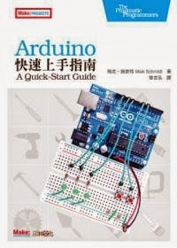
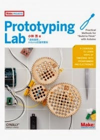
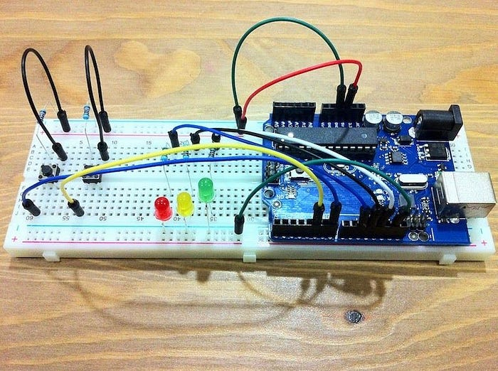
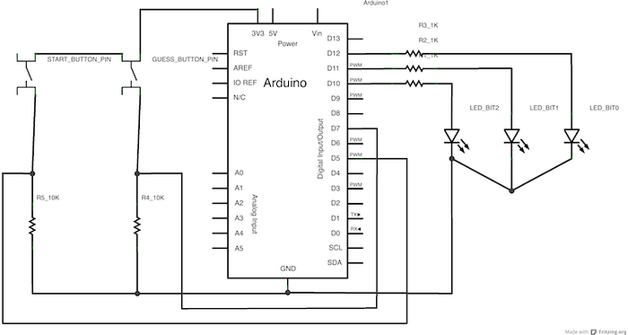
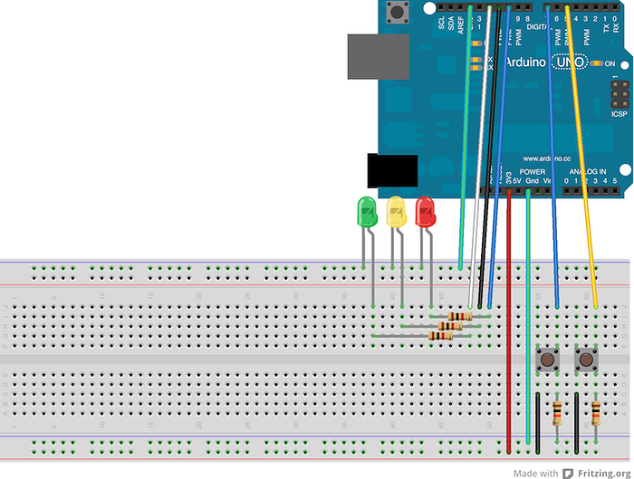

說來慚愧，去年才知道有 Arduino 這麼好玩的東西，連國外小朋友都知道它有多火紅！（不過最近好像是某樹莓派比較牛）。

好歹以前也是電子相關科系的，想說入門應該不難，回老家把塵封已久的高職工具包翻出來，今年要試作一隻簡單的機器人！既然決心已定，就開始做一些行前準備，買了幾本書跟一些工具來練習：

## [Arduino快速上手指南](http://www.anobii.com/books/Arduino%E5%BF%AB%E9%80%9F%E4%B8%8A%E6%89%8B%E6%8C%87%E5%8D%97/9789866076510/0160e1cadeb309e4e7/)

## [Prototyping Lab「邊做邊學」Arduino的運用實例](http://www.anobii.com/books/Prototyping_Lab%E3%80%8C%E9%82%8A%E5%81%9A%E9%82%8A%E5%AD%B8%E3%80%8D%EF%BC%8CArduino%E7%9A%84%E9%81%8B%E7%94%A8%E5%AF%A6%E4%BE%8B/9789866076428/01314863f2de56513c/)

## [Make](http://www.makezine.com.tw/)

由馥林文化代理出版，國際中文版的雜誌，一季一期，訂閱一年約一千台幣，裡面的內容很豐富，強力推薦！

## 入門工具包

雖然自己有一些零件，但是要能完成書上的作品還是有缺，所以買了一個簡單的工具組合，基本上拍賣網站都能找到，價格大約都在一千元台幣上下。

## 猜數字遊戲

這是我的第一個實作，也是 **Arduino 快速上手指南**的第一章，主要的玩法是先用第一顆按鈕按出你要猜的數字，LED 會以二進位的方式顯示，決定後再按下另外一顆按鈕，Arduino 會隨機產生一組數字，如果玩家猜中的話，LED 燈就會閃爍。

這個小電路做完後基本上可以了解：

* 如何在電腦上寫程式, 並上傳到 Arduino 運作
* 基本的電路零件知識，ex：LED、push button
* 如何利用 Serial 來 debug
* 如何利用 Serial 來傳送和接收資料
* 如何使用網路上別人寫好的 Library

## 碰到的問題

* 一開始電腦一直抓不到板子，後來發現我的 USB 線是充電專用的 囧

## 推薦工具

* [Fritzing](http://fritzing.org/) — 畫電路圖的工具

Source code 跟之後的專案都會放在 [GitHub](https://github.com/amowu/arduimo) 上，歡迎有興趣的人一起交流 :-)
