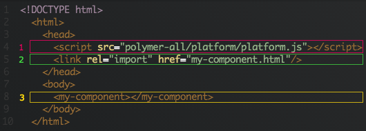
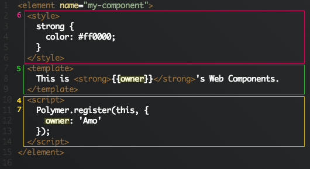

今天想要跟大家聊聊 Web Components 這個新玩具，說是新玩具，其實這個概念已經發展有段時間了，尤其筆者本身是玩 Flash 技術出身的，發現 Web Components 跟 [Flex Component](http://www.adobe.com/devnet/flex/articles/creating_components.html) 差不多，所以就來分享一些心得。

## Web Components 是什麼？

簡單來講就是你可以客制化 HTML `<tag>`：

```xml
<my-component></my-component>
```

由 W3C 提出：

> The component model for the Web.
> When used in combination, Web Components enable Web application authors to define widgets with a level of visual richness and interactivity not possible with CSS alone, and ease of composition and reuse not possible with script libraries today.

## 使用 Web Components 有什麼好處？

> 鉴于许多 Web 框架通过暴露 JavaScript API 来构建用户界面，而构建用户界面实际上就是生成一堆 div 和 spans 标记，Web 组件是原生浏览器的解决方案因此不依赖于一个完整的框架。因此，与现在的一般依赖某个 Javscript 框架的 HTML 组件相比，Web组件希望能减少碎片。

最近新起許多 MDV（Model-driven-view）這類 template 和 data binding 開發方式的框架（backbone、angular、ember），那 Web Components 跟這些框架有什麼不同呢？

基本上就是希望藉由規格標準化，讓 Web application 的開發方式與架構更清晰。

## Web Components 的瀏覽器支援情況？

> 尽管 Web 组件是一项有趣的新技术，但在浏览器们都支持它们（并且大部分用户都开始使用这些浏览器们）之前，其中的大部分功能还派不上用场。解决这个问题的一种方法是使用 polyfills。

很遺憾，目前的瀏覽器普遍都還不支援完整的 Web Components，不過可以使用 Google I/O 2013 中釋出的 [Polymer](http://www.polymer-project.org/) library，讓瀏覽器模擬 Web Components 環境嘗嘗鮮。

## 使用 Polymer 開發 Web Components

## Basics



## Component



## 1. Simulate

載入 `platform.js` 讓瀏覽器支援 Web Components 的功能。

## 2. HTML Imports

使用 `<link>` 和 `import` 載入 Web Components：

```xml
<link rel="import" href="import-file.html">
```

## 3. Custom Elements

使用自己建立的元件 `<my-component></my-component>`，命名方式以 dash(-) 分開為原則：

```xml
<element name="my-component">
```

可以加入 `constructor` 讓 javascript 使用， 例如：

```xml
<element name="my-component" constructor="MyComponent">
... 
<script>
    var myComponent = new MyComponent();
</script>
```

也可以繼承其他元件：

```xml
<element name="my-button" extends="button">
```

## 4. Initialize Polymer

在 `<script>` 內加入 `Polymer.register()`，讓這個元件初始化。

## 5. Templates

定義元件的 HTML Markup，UI layout。

## 6. Decorators

使用 `<style>` 定義元件的 CSS 樣式，另外也可以載入外部樣式：

```xml
<element name="my-component">
  <link rel="stylesheet" href="my-component.css">
  <template>
  …
```

## 7. Model Driven Views

使用 `{{}}` 將 data binding 到 template，然後在初始化的時候定義變數，例如替這個元件建立一個公用的 `title` 屬性：

```xml
<element name="my-component" constructor="MyComponent">
  <template>
    <h1>{{title}}</h1>
  </template>
  <script>
    Polymer.register(this, {
      title: "Web Components"
    });
  </script>
</element>
```

定義完後，就可以使用：

```xml
<my-component title="Hello World!"></my-component>
```

or

```xml
<script>
  var myComponent = new MyComponent();
  myComponent.title = "Hello World!";
</script>
```

## 結語

> Web Component 将会横扫 Backbone、Ember、Angular、Knockout 等等这些框架。但是，接下来这几年，我们还是要用它们，因为很多 Web Component 的 API 只能在 Chrome 的 Canary 开发版本和Firefox的开发版本中使用。

雖然引言中講的很聳動，但目前玩下來還是碰到不少問題。例如我想使用一些第三方的 jQuery Plugin 會無法動作等…，不過因為開發架構很接近 Flash，小弟認為應該會是未來 HTML5 RIA 的開發趨勢，所以目前還是會持續關注。

以上是初步試玩 Polymer Web Components 的一些心得，更多的 feature 可以到 W3C 和 Polymer 網站看看，如果有錯誤的地方也歡迎糾正，祝大家有個愉快的開發旅途 :-)

## Reference

* [Introduction to Web Components — W3C](http://www.w3.org/TR/2013/WD-components-intro-20130606/)
* [Polymer](http://www.polymer-project.org/)
* [Web Components: A Tectonic Shift for Web Development — Google I/O 2013](https://www.youtube.com/watch?v=fqULJBBEVQE)
* [Web Components — Google I/O](http://www.webcomponentsshift.com/)
* [Google 发布新一代Web UI库Polymer](http://www.infoq.com/cn/news/2013/06/webcomponents)
* [Twitter发布基于组件的轻量级JavaScript框架 — — Flight](http://www.infoq.com/cn/news/2013/02/Twitter-Flight-Framework)
* [Flight by Twitter](http://twitter.github.io/flight/)
* [Web UI Package](http://www.dartlang.org/articles/web-ui/)
