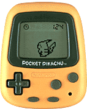
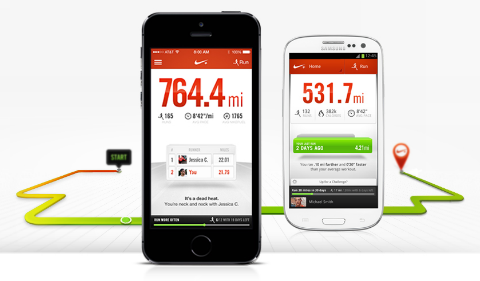
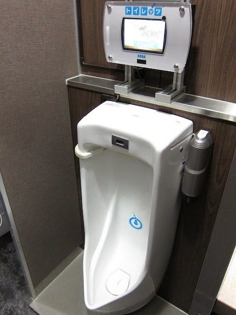
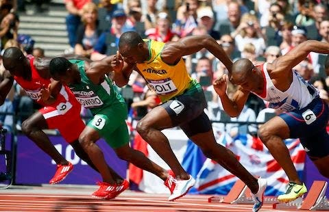
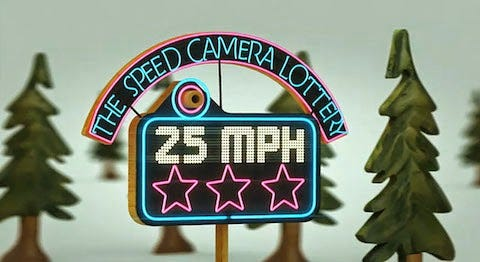

> *在 2011 年，*[*Gamification*](https://en.wikipedia.org/wiki/Gamification)* (遊戲化) 繼 *[*Web 2.0*](https://en.wikipedia.org/wiki/Web_2.0)*，*[*Mashup*](https://goo.gl/3mWtjK)*，*[*Cloud*](https://en.wikipedia.org/wiki/Cloud_computing)*，*[*Freemium*](https://en.wikipedia.org/wiki/Freemium)* 之後，成為網路上科技的熱門關鍵詞。
>  Gamification 將會是*[*Social media*](https://en.wikipedia.org/wiki/Social_media)*、*[*Big data*](https://en.wikipedia.org/wiki/Big_data)*、*[*Internet of Things*](https://en.wikipedia.org/wiki/Internet_of_things)* 的下一波網路趨勢。*

## 持續「步行」的工具就是遊戲化

> *知道步行對健康有益，但要付諸行動真的很難。… 遊戲化漸漸地扮演起重要的角色，為了持續每天的健康步行運動，只要帶著遊戲化工具，每天無聊的步行就會得到回饋。*

1998 年發售的「口袋皮卡丘」結合計步器和電子寵物，是成功的遊戲化案例。

近幾年熱門的健康管理 App 之一， [Nike+](https://secure-nikeplus.nike.com/plus/) 運用智慧型手機的 GPS 和感應器來達成有趣的慢跑應用。

## Serious Game 與遊戲化的不同

> *「*[*Serious Game*](https://en.wikipedia.org/wiki/Serious_game)* 是將社會上的各種問題帶到遊戲裏，而遊戲化是將遊戲帶到社會的各個角落。」*

小便斗加上一個簡單的靶心之後，就能增添許多樂趣。

## 會員制與遊戲化哪裏不同？

> *思考使用者的「動機」，動機的概念可分為外在動機與內在動機。外在動機指的是因報酬，賞罰等理由所被激發的動機，內在動機則相反，並非因為外來的報酬或賞罰，而是被活動內容所激發的內在動機。****所謂的遊戲化，既是想要謀得報酬的外在動機，同時也是能驅動內在動機的結構****。*

Starbucks 利用簡單的集點遊戲規則讓消費者參與解決環保問題。詳見 [Karma Cup](http://www.bnext.com.tw/article/view/id/15191)。
 註： [圖片來源 OnEarth](http://www.onearth.org/article/meet-the-change-makers-starbucks-quest-for-a-better-cup)

## 受到量化的我們

> *在印刷技術上，「油墨」扮演重要的角色。而在遊戲化，同樣也需要各種「測量的技術」。*

> *如果沒有碼表記錄這些時間，世界選手大會或奧運的競技，根本無法成立。*

註： [圖片來源 Washington Post](http://www.washingtonpost.com/blogs/london-2012-olympics/?attachment_id=8917)

> *「不譴責，不罰款，而是獎賞！」
>  福斯汽車 2010 年舉辦了一個名為「車速照相樂透的活動」，並不是針對超速車輛的取締罰款，而是表揚遵守車速駕駛的偵測系統，試行期間平均車速下降了 22%。*

> *能用數據計算的東西，要變成遊戲比較容易，相反地，判斷標準不一的對象就比較難以變成遊戲，例如評價一幅畫。*

## 遊戲變成生活化之後，遊戲化就會擴大散播？

> *「知之者不如好之者，好之者不如****樂之者****。」
>  印刷技術是結合造紙術和冶金術，再由能看懂文字的知識族群拓展。同樣地，遊戲化也是因為有智慧手機，*[*Lifelog*](https://en.wikipedia.org/wiki/Lifelog)* 與眾多的玩家才能夠有今日的發展。*

## 遊戲之所以會進展得那麼快，原因如下：

1. 測量技術的進步
2. 網路的發達讓「時間」有了戲劇性的變化
3. 遊戲世代的成熟

## 測量技術的進步

> *透過許多感應器和 *[*Lifelog*](https://en.wikipedia.org/wiki/Lifelog)* 的功能，已可以從生活中的各個「空間」中得到要成立遊戲所需的數值，原本壓根無法變成遊戲的各種領域裏，因為有了上述的功能，使得原本不能實現的遊戲變得可能了。*

## 網路的發達讓「時間」有了戲劇性的變化

> *比「遊戲」更重要的一件事，時間的獲得。
>  在活版印刷的時代「紙」所發揮的功能，就相當於現代的智慧型手機所帶來的快速一樣。為什麼「時間」的取得會那麼重要呢？其實應該說「任何時候都能確認遊戲的結果」才是更重要的。
>  玩家在遊戲裏做了什麼動作，透過社群網路，馬上就會有人回覆訊息。即使沒有任何人回應，電腦也會成為「對手」，穩定用戶的結構早已完備。*

## 遊戲世代的成熟

> *以活版印刷時代為例，「必須有一定以上的人識字」才有辦法拓展活版印刷技術。同樣地，要促進遊戲化最後的條件就是「遊戲世代的成熟」。
>  玩遊戲的「人」增加了，而那個世代的人在社會的權責地位愈高，追求「遊戲」的機會也就愈高。遊戲的世代隨著時間的經過總算超過半數了。*

## 「空間」「時間」「人」

> *「空間」「時間」「人」，這麼複雜的條件正好在 2010 年代帶來極大的影響力。正因為要擴大遊戲化的條件全都齊全了，遊戲化就要開始展開。*

## 遊戲改變商業

> *迪士尼認為要提升「顧客滿意度」，首先要提升「員工滿意度」。
>  「遊戲化並不是讓人不認真，鬧著玩的東西，而是喚起人的本性，讓人認真工作的工具。」*

## 思考遊戲化

> *「任何人都覺得有趣的遊戲架構並不存在」，我們想的不應該是「加進甚麼結構應該會很好玩吧？」，而是「想讓玩家是甚麼的話，這樣設計應該不錯」。*

## 玩家的操作與設計者的期待不一致

> *事實上，讓玩家感受勝利的快樂，並不是拓展遊戲化業者的主要目的，他們希望從玩家身上賺取利潤，希望玩家透過遊戲學習某件事，或者是希望玩家對社會有實質的貢獻等。不同於電腦遊戲，遊戲化的主要目的並不是提供玩家娛樂。另一方面，大部分玩家的目的不是從自己口袋掏錢出去，更不是想對社會有什麼幫助，只是想開心地玩個遊戲而已。兩者的動機不一致，在建構遊戲化時，會是很大的問題和阻礙。*

## 太慢的「遊戲」讓人容易產生厭倦

> *並不是只要注入遊戲元素就能夠增加固定用戶，遊戲還有另外一個現象，那就是「厭倦」。一般常見容易上癮的遊戲設計，基於道德倫理的觀念，也經常受到許多人的否定。因此，****不需要設計易使人成癮的遊戲****，只需要讓大部分使用者「慢慢地厭倦」就可以。因為這樣的結構設計可以讓用戶反覆利用網路服務。*

## 遊戲化只是拉條輔助線而已

> *「世界上幾乎所有事，也許都含有遊戲的要素在其中」。並不是任何事只要遊戲化就一定能成功。例如，有人像是在玩遊戲一樣愛上做菜，卻有人不知道如何將做菜當作是遊戲一般享受。*

## 結語

> *遊戲，應該早就存在於我們所能想像的歷史之前，只是遊戲，遊玩的概念經常以配角之姿出現，所以我們才沒有注意到遊戲。
>  對社會而言，與其推廣各種多樣的遊戲，我們可以更進一步描繪未來的藍圖，讓人們可以將遊戲當作更幸福的科技使用。那就是「開放設計遊戲的權限」。*

> *「過去十年，是社群的十年。未來十年，是遊戲十年。遊戲的力量將會影響每個人的行為，是非常強力且令人興奮的力量。各位！請一起開心的製作遊戲，使用遊戲吧！」*
