這篇文章將一步一步介紹如何使用 Docker、GitHub Flow、CircleCI、AWS Elastic Beanstalk 與 Slack 來完成**持續整合**與**持續交付**的開發流程。

## 前言

### 什麼是持續整合＆持續交付？

持續整合＆持續交付（Continuous Integration & Continous Delivery），簡稱 CI & CD，具體介紹可以參考「 [山姆鍋對持續整合、持續部署、持續交付的定義](https://samkuo.me/post/2013/10/continuous-integration-deployment-delivery/) 」這篇文章。

簡單來說就是盡量減少手動人力，將一些日常工作交給自動化工具。例如：環境建置、單元測試、日誌紀錄、產品部署。

### 我使用了哪些工具？

* [Git](http://git-scm.com/) — 版本管理
* [GitHub](https://github.com/) — 程式碼託管、審查
* [CircleCI](https://circleci.com/) — 自動化建置、測試、部署
* [Docker](https://www.docker.com/) — 可攜式、輕量級的執行環境
* [AWS Elastic Beanstalk](https://aws.amazon.com/elasticbeanstalk/) — 雲端平台
* [Slack](https://slack.com/) — 團隊溝通、日誌、通知

### 看完這篇你可以學到什麼？

* 瞭解 GiHub 的工作流程（[GitHub Flow](https://guides.github.com/introduction/flow/)），利用 **Pull Request** 以及**分支**來完成**代碼審查**（Code Review）與**環境配置**，例如：開發版（development）、測試版（testing/QA）、上線產品（staging/production）。
* 使用 Docker，統一開發者、測試人員、以及產品的執行環境。
* 使用 EB CLI 將應用程式部署到 AWS Elastic Beanstalk 平台上。
* 使用 CircleCI 將以上工作全部自動化。偵測 GitHub 分支上的程式碼，若有更新則觸發：建置 Docker 環境、單元測試、然後自動部署新版本到 AWS EB。
* 使用 Slack，讓團隊成員能夠即時接收 GitHub 與 CircleCI 每一項動作的通知。

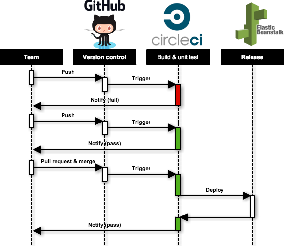

## 內容大綱

* Node.js
  * 在本地端執行 Node.js
  * 在本地端測試 Node.js
* GitHub
* CircleCI
  * 在 CircleCI 測試 Node.js
* Code Review with GitHub Flow
* Docker
  * 在 Docker 執行 Node.js
  * 在 CircleCI 測試 Docker
* AWS Elastic Beanstalk
  * 在本地端部署 AWS
  * 在 CircleCI 部署 AWS
* Slack

## Node.js


*安裝：*

* [node](https://nodejs.org/): 0.10

這篇文章以 Node.js 的應用程式作為範例，其他語言（Ruby on Rails、Python、PHP）也同樣適用此工作流程。

### 建立新專案

```shell
$ mkdir hello-ci-workflow $ cd hello-ci-workflow
```

### 在本地端執行 Node.js

初始化 Node.js 的環境，填寫一些資料之後會在目錄下產生一個 `package.json` 的檔案：

```bash
$ npm init
```

安裝 Node.js 的 web framework，以 [Express](http://expressjs.com/) 為例：

```bash
$ npm install express --save
```

`*--save*`*: 寫入 *`*package.json*`* 的 dependencies。*

完成之後， `package.json` 大概會長這個樣子：

```json
// package.json
{
  "name": "hello-ci-workflow",
  "main": "index.js",
  "dependencies": {
    "express": "^4.12.3"
  },
  "scripts": {
    "start": "node index.js"
  }
}
```

在 `index.js` 裡寫一段簡單的 Hello World! 的程式：

```javascript
// index.js
var express = require('express');
var app = express();

app.get('/', function (req, res) {
  res.send('Hello World!');
});

var server = app.listen(3000, function () {

  var host = server.address().address;
  var port = server.address().port;

  console.log('Example app listening at http://%s:%s', host, port);

});
```

執行 `npm start` 或 `node index.js` ：

```bash
$ npm start
```

打開瀏覽器 `http://localhost:3000` 看結果：


`*--save-dev*`*: 寫入 *`*package.json*`* 的 devDependencies，正式上線環境不會被安裝。*

### 在本地端測試 Node.js

安裝 Node.js 的單元測試，以 [Mocha](http://mochajs.org/) 為例：

```lua
$ npm install mocha --save-dev
```

`*--save-dev*`*: 寫入 *`*package.json*`* 的 devDependencies，正式上線環境不會被安裝。*

```json
// package.json
{
  "name": "hello-ci-workflow",
  "main": "index.js",
  "dependencies": {
    "express": "^4.12.3"
  },
  "devDependencies": {
    "mocha": "^2.2.4"
  },
  "scripts": {
    "start": "node index.js"
  }
}
```

根目錄 `test` 資料夾，並新增一個測試腳本 `test.js` ：

```shell
$ mkdir test 
$ cd test 
$ touch test.js
```

加入一筆錯誤的測試 `assert.equal(1, [1,2,3].indexOf(0))` ：

```javascript
// test/test.js
var assert = require("assert")
describe('Array', function(){
  describe('#indexOf()', function(){
    it('should return -1 when the value is not present', function(){
      assert.equal(1, [1,2,3].indexOf(0));
    })
  })
})
```

執行 mocha 測試：

```csharp
$ ./node_modules/.bin/mocha


  Array
    #indexOf()
      1) should return -1 when the value is not present


  0 passing (9ms)
  1 failing
```

結果顯示 `1 failing`，測試沒通過，因為 `[1,2,3].indexOf(0)` 回傳的值不等於 `-1` 。

將 `test.js` 的測試修正：

```bash
// test/test.js 
assert.equal(-1, [1,2,3].indexOf(0));
```

再次執行 mocha 測試：

```bash
$ ./node_modules/.bin/mocha


  Array
    #indexOf()
      ✓ should return -1 when the value is not present


  1 passing (6ms)
```

結果顯示 `1 passing` ，通過測試。

## GitHub


*安裝：*

* [git](http://git-scm.com/): 2.3

*帳號：*

* [GitHub](https://github.com/)

初始化 git 環境：

```csharp
$ git init .
```

輸入 `git status` 會顯示目前哪些檔案有過更動：

```bash
$ git status
On branch master

Initial commit

Untracked files:
  (use "git add <file>..." to include in what will be committed)

  index.js
  node_modules/
  package.json
  test/
```

將 `node_modules` 加到 `.gitignore` 黑名單，因為這個資料夾是由 `npm install` 自動產生的，不需要放到 GitHub 上：

```bash
# .gitignore

# Dependency directory
# https://www.npmjs.org/doc/misc/npm-faq.html#should-i-check-my-node_modules-folder-into-git
node_modules
```

將更動 commit：

```bash
$ git add . $ git commit -m "first commit"
```

打開 GitHub，新增一個 repository：


輸入 repository 的名稱，以 `hello-ci-workflow` 為例：


使用 `git remote add` 將新創建的 GitHub repository 加入到 remote：

*帳號：*

```bash
$ git remote add origin https://github.com/<USER_NAME>/hello-ci-workflow.git
```

`*<USER_NAME>*`* 改成自己的帳號。*

使用 `git push` 將程式碼傳到 GitHub：

```bash
$ git push -u origin master
```

成功之後前往 `https://github.com/<USER_NAME>/hello-ci-workflow` 就可以看到剛才上傳的檔案：

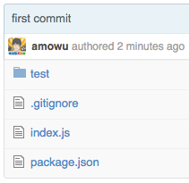

## CircleCI


### 加入 GitHub repository

點選左邊欄的 `Add Projects` 按鈕：


選擇自己的 GitHub 帳號：


搜尋要加入的 GitHub repository，然後點選 `Build project` 按鈕，以 `hello-ci-workflow` 為例：

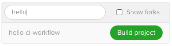

完成之後 CircleCI 就會自動執行第一次的建構，不過因為還沒加入測試腳本，所以建構結果會顯示 no test：

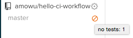

### 在 CircleCI 測試 Node.js

在專案根目錄底下建立一個 `circle.yml` ，並加入 mocha test：

```yaml
# circle.yml
machine:
  node:
    version: 0.10

test:
  override:
    - ./node_modules/.bin/mocha
```

完成之後將檔案 push 上 GitHub：

```bash
$ git add circle.yml 
$ git commit -m "add circle.yml" 
$ git push
```

Push 成功之後，CircleCI 會自動觸發建構和測試：

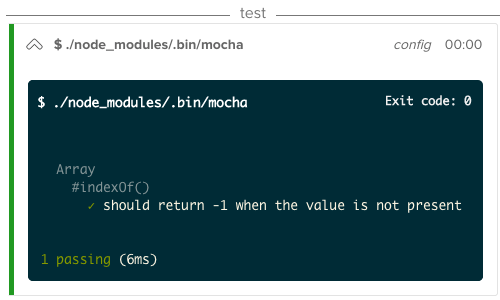

測試通過，建置成功：

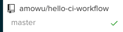

## 代碼審查（Code Review）with GitHub Flow

目前開發中比較常用的 workflow 有 [Git flow](http://nvie.com/posts/a-successful-git-branching-model/) 和 [GitHub flow](https://guides.github.com/introduction/flow/) 兩種，可以參考以下幾篇文章。

Git flow：

* [Git flow 開發流程](https://ihower.tw/blog/archives/5140)
* [git-flow cheatsheet](https://danielkummer.github.io/git-flow-cheatsheet/)
* [A successful Git branching model](http://nvie.com/posts/a-successful-git-branching-model/)

GitHub flow：

* [Understanding the GitHub Flow](https://guides.github.com/introduction/flow/)
* [Git Flow 和 Github Flow 的不同](http://www.arthurtoday.com/2015/02/git-flow-vs-github-flow.html)
* [在 GitHub 當中使用的 work flow](http://blog.krdai.info/post/17485259496/github-flow)

這裡我們使用 GitHub flow，它的核心精神是：

* 所有在 master 分支上的程式都一定要是通過測試，可以部署的產品版本。
* 要開發功能、修復 Bug、做任何事情，都要從 master 開一條新的分支。
* 隨時 commit 和 push 你的程式碼到 GitHub 上，與大家討論。
* 功能完成時，使用 pull request 讓大家作 code review。
* 確認沒問題之後才可以 merge 回 master，並且部屬新版本到線上。

### 建立一條分支

為了確保 master 這條主線上的程式碼都是穩定的，所以建議開發者依照不同的功能、建立不同的分支，這裡以 `test-github-flow` 為例，使用 `git branch` 新增分支、然後 `git checkout` 切換分支：

```bash
$ git branch test-github-flow 
$ git checkout test-github-flow
```

### 加入 commits

在 `test.js` 裡加入一行錯誤的測試 `assert.equal(3, [1,2,3].indexOf(5))` ：

```javascript
// test/test.js 
// ... 
assert.equal(3, [1,2,3].indexOf(5));
```

```bash
$ git add test/test.js 
$ git commit -m "add a error test case"
```

### 新增一個 Pull Request

Push 到 GitHub 的 test-github-flow 分支：

```bash
$ git push -u origin test-github-flow
```

打開 GitHub 之後，會出現 `test-github-flow` 分支的 push commits，點選旁邊的 `Compare & pull request` 按鈕：

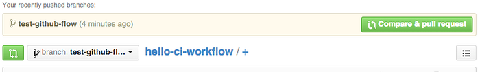

點選之後會進入 Open a pull request 的填寫頁面，選擇想要 merge 的分支、輸入描述之後，點選 `Create pull request` 按鈕：

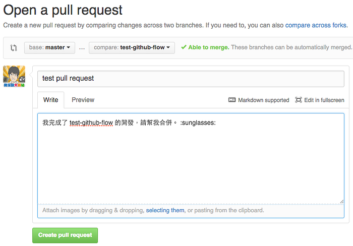

### 檢視＆討論你的程式碼

新增一個 pull request 之後，其他人就會在 GitHub 上出現通知：


點進去之後可以看見相關的 commits 與留言，但是下面有一個紅紅大大的叉叉；因為每次 GitHub 只要有新的 push，就會觸發 CircleCI 的自動建置和測試，並且顯示結果在 GitHub 上：

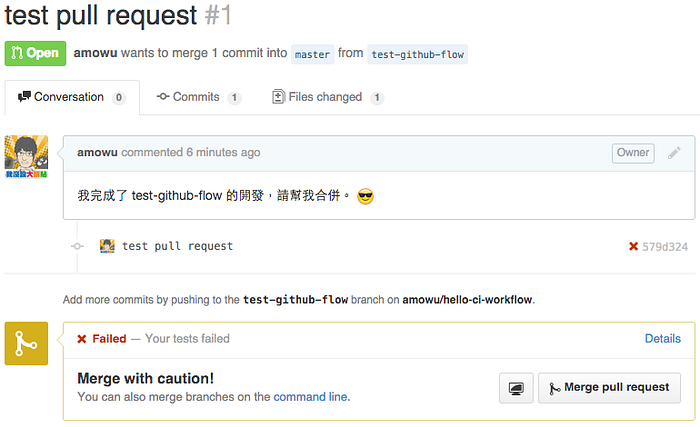

點選叉叉，前往 CircleCI 查看錯誤原因：


就會發現剛剛 push 到 test-github-flow 的測試沒通過：

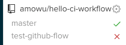

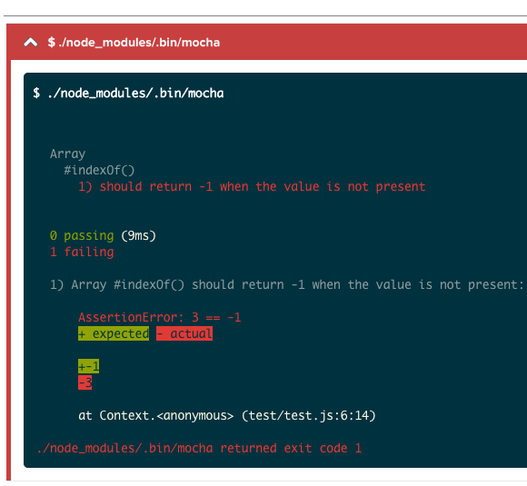

回到 GitHub，因為測試沒通過，所以審查者不能讓這筆 pull request 被 merge 回 master。

找到剛剛 commit 的那段程式碼，留言告知請開發者修正錯誤之後，再重新 commit push 上來：

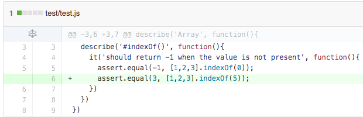

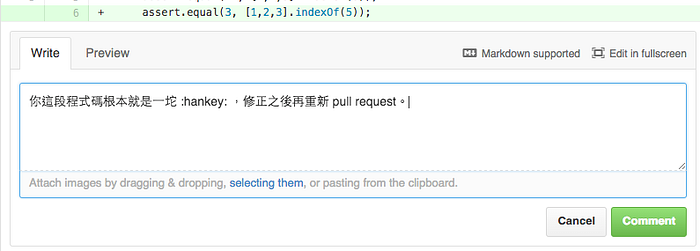

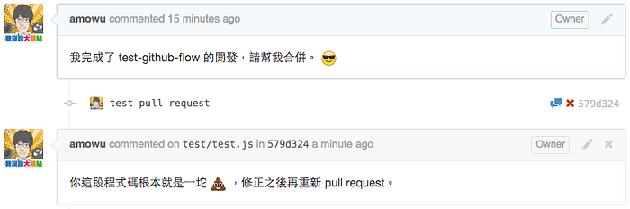

修正 `test.js` 的測試腳本：

```javascript
// test/test.js 
// ... 
assert.equal(-1, [1,2,3].indexOf(5));
```

再次 commit & push：

```bash
$ git add test/test.js 
$ git commit -m "fix error test case" 
$ git push
```

回到 GitHub 的 pull request 頁面，可以看到最新一筆的 commit 成功通過 CircleCI 的測試了：

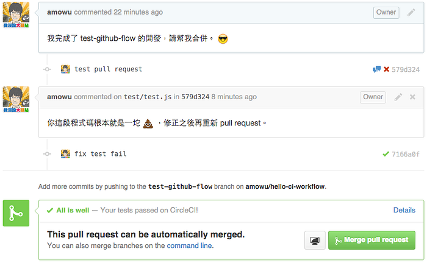

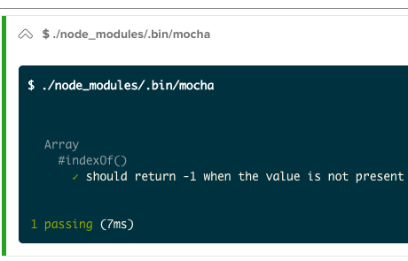

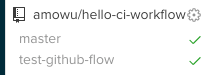

### Merge＆部署

審查之後，確定沒有問題，就可以點選 `Merge pull request` 的按鈕，將 `test-github-flow` 的程式碼 merge 回主線 `master` ：

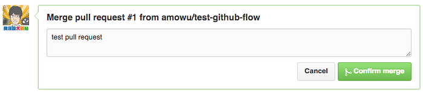

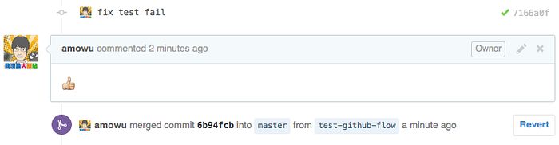

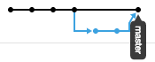

## Docker


*安裝：*

* [boot2docker](https://github.com/boot2docker/boot2docker): 1.5（Mac only）
* [docker](https://www.docker.com/): 1.5

什麼是 Docker？為什麼要用它？

因為 Docker 最近很火，所以網路上不缺關於介紹它的文章，原諒我這裡只稍微提一下：

以往開發人員面對開發環境不同的問題，常常出現「明明在我的電腦上可以跑」的囧境，所以為了解決這類問題，通常會使用虛擬機器（VM）搭配一些工具（ [Vagrant](https://www.vagrantup.com/)、 [Chef](https://www.chef.io/) ）來協助統一開發人員、測試人員、上線產品的執行環境。

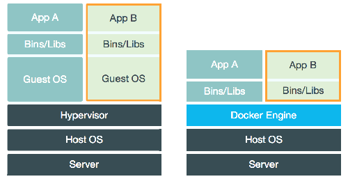

Docker 也是類似的解決方案，不同於 VM 的是，Docker 運行起來更輕巧、可攜度更高。配置好一份設定之後，就可以讓大家馬上進入開發狀況，減少不必要的環境問題，提升效率。

## 在 Docker 執行 Node.js

在專案根目錄底下建立一個 `Dockerfile` ：

```bash
# Dockerfile

# 從 [Docker Hub](https://hub.docker.com/) 安裝 Node.js image。
FROM node:0.10

# 設定 container 的預設目錄位置
WORKDIR /hello-ci-workflow

# 將專案根目錄的檔案加入至 container
# 安裝 npm package
ADD . /hello-ci-workflow
RUN npm install

# 開放 container 的 3000 port
EXPOSE 3000
CMD npm start
```

使用 `docker build` 建構您的 image：

```bash
$ docker build -t hello-ci-workflow .
```

`*-t hello-ci-workflow*`* 是 image 名稱。*

使用 `docker run` 執行您的 image：

```bash
$ docker run -p 3000:3000 -d hello-ci-workflow
```

`*-d*`* 在背景執行 node，可以使用 *`*docker logs*`* 看執行結果。*

打開瀏覽器 `http://localhost:3000` 看結果：

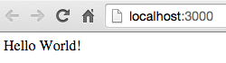

其實每一次都要 `build` 和 `run` 還蠻麻煩的，推薦可以試試 [Docker Compose](https://github.com/docker/compose)，用起來有點像 [Vagrant](https://www.vagrantup.com/) 。

### 在 CircleCI 測試 Docker

修改 `circle.yml` ：

```yaml
# circle.yml
machine:
  # 環境改成 docker
  services:
    - docker

dependencies:
  override:
    # 建構方式使用 docker build
    - docker build -t hello-ci-workflow .

test:
  override:
    - ./node_modules/.bin/mocha
    # 使用 curl 測試 docker 是否有順利執行 node
    - docker run -d -p 3000:3000 hello-ci-workflow; sleep 10
    - curl --retry 10 --retry-delay 5 -v http://localhost:3000
```

`*-p*`* 可以指定 EB 的應用平台，例如 php 之類；這裡使用 docker。*

Push 更新到 GitHub：

```bash
$ git add Dockerfile circle.yml 
$ git commit -m "add Docker" 
$ git push
```

查看 CircleCI 建構＆測試結果：

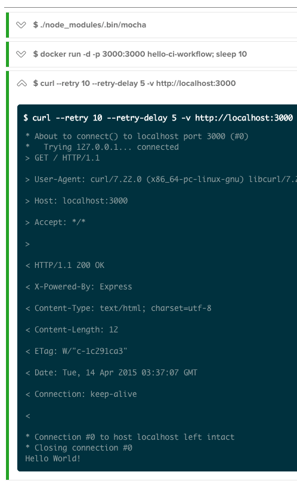

## AWS Elastic Beanstalk


*帳號：*

* [Amazon Web Services](https://aws.amazon.com/)

*安裝：*

* [AWS EB CLI](http://docs.aws.amazon.com/elasticbeanstalk/latest/dg/eb-cli3-getting-set-up.html): 3.x

最後要將程式上線啦！現在 PaaS 雲端平台的選擇非常多（ [Heroku](https://www.heroku.com/)、 [Google App Engine](https://cloud.google.com/appengine/)、 [Azure](http://azure.microsoft.com/z)、 [OpenShift](https://www.openshift.com/)、 [Linode](https://www.linode.com/) ），這裡我選擇 Amazon 推出的 Elastic Beanstalk 當作範例，以下是它的特色：

* 支援的開發環境多（Java、.NET、PHP、Node.js、Python、Ruby、GO），重點是有支援 Docker！
* 只需要上傳程式碼，Elastic Beanstalk 即可幫你完成從容量配置、負載均衡（load balancing）、自動擴展（auto scaling）到應用程式的運行狀況監控的部署。

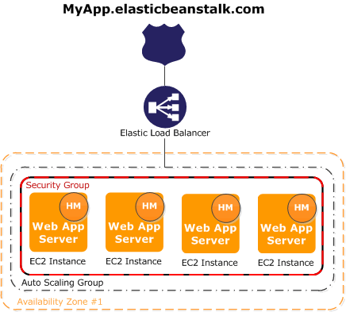

初始化 EB 環境：

```bash
$ eb init -p docker
```

該命令將提示您配置各種設置。 按 Enter 鍵接受預設值。

如果你已經存有一組 AWS EB 權限的憑證，該命令會自動使用它。 否則，它會提示您輸入 `Access key ID` 和 `Secret access key` ，必須前往 AWS IAM 建立一組。

初始化成功之後，可以使用 `eb create` 快速建立各種不同的環境，例如：development, staging, production。

這裡我們以 `env-development` 為例：

```bash
$ eb create env-development
```

等待 Elastic Beanstalk 完成環境的建立。 當它完成之後，您的應用已經備有負載均衡（load-balancing）與自動擴展（autoscaling）的功能了。

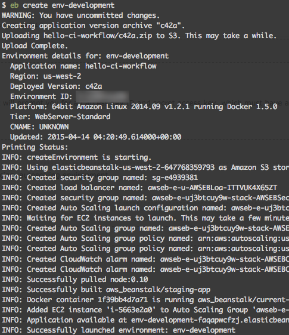

使用 `eb open` 前往目前版本的執行結果：

```bash
$ eb open env-development
```

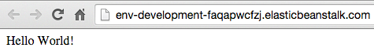

### 在本地端部署 AWS

稍微修改 `index.js` ：

```javascript
// index.js
// ...
app.get('/', function (req, res) {
  res.send('Hello env-development!');
});
// ...
```

執行 `eb deploy` 部署新版本到 AWS Elastic Beanstalk：

```bash
$ eb deploy env-development
```

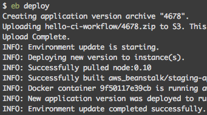

部署完成之後，執行 `eb open` 打開網頁：

```bash
$ eb open env-development
```

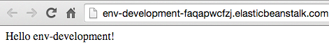

`env-development` 上的應用程式更新完成。

### 在 CircleCI 部署 AWS

`git checkout` 將分支切換回主線 master：

```bash
$ git checkout master
```

`eb create` 新增一組新的環境，作為產品上線用，命名為 `env-production` ：

```bash
$ eb create env-production
```

```bash
$ eb open env-production
```

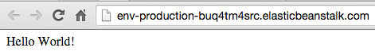

這樣就成功啟動第二組機器了，目前我們有 `env-development` 和 `env-production` 兩組環境。

### 前往 [AWS IAM](https://console.aws.amazon.com/iam/home) 新增一組帳號給 CircleCI 使用：

1. `Dashboard` > `Users`
2. `Create New Users`
3. Enter User Names: **CircleCI** > `Create`
4. `Download Credentials`
5. `Dashboard` > `Users` > `CircleCI`
6. `Attach Pollcy`
7. `AWSElasticBeanstalkFullAccess` > `Attach Pollcy`

前往 CircleCI，設定您的 AWS 權限：

1. `Project Settings`
2. `Permissions` > `AWS Permissions`
3. 打開剛才下載的 `credentials.csv`，輸入 `Access Key ID` & `Secret Access Key`
4. `Save AWS keys`
5. 在 `.elasticbeanstalk` 目錄底下，建立 `config.global.yml`：

```yaml
# .elasticbeanstalk/config.global.yml
global:
  application_name: hello-ci-workflow
  default_region: us-west-2 # EB 所在的 region，預設是 us-west-2
```

修改 `circle.yml` ：

```yaml
# circle.yml
machine:
  # 安裝 eb 需要 python
  python:
    version: 2.7
  services:
    - docker

dependencies:
  pre:
    # 安裝 eb
    - sudo pip install awsebcli
  override:
    - docker build -t hello-ci-workflow .

test:
  override:
    - npm test
    - docker run -d -p 3000:3000 hello-ci-workflow; sleep 10
    - curl --retry 10 --retry-delay 5 -v http://localhost:3000

# 新增一筆部署腳本
deployment:
  production:
    branch: master
    commands:
      - eb deploy env-production
```

這樣就能在 GitHub 的 master 支線有更新時，觸發 CircleCI 的自動建置、測試、然後部署。

接下來馬上來試試看流程，修改 `index.js` ：

```javascript
// index.js
// ...
app.get('/', function (req, res) {
  res.send('Hello env-production!');
});
// ...
```

Commit & Push：

```bash
$ git add . 
$ git commit -m "test deploy production" 
$ git push
```

前往 CircleCI 看結果：

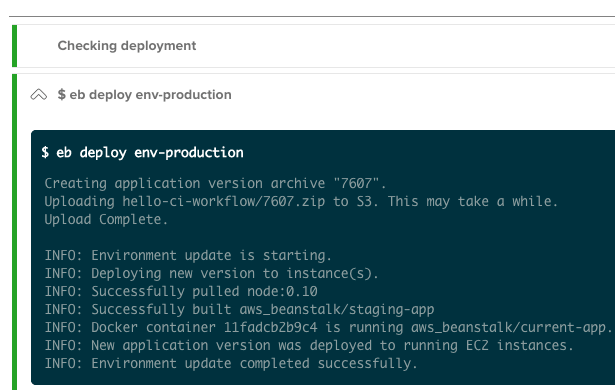

部署成功， `eb open` 打開瀏覽器來看看結果：

```bash
$ eb open env-production
```

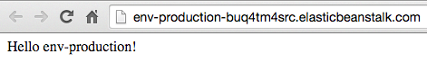

## Slack


*帳號：*

* [Slack](https://slack.com/)

到這邊其實已經差不多結束了，最後來講講 Slack 吧。

Slack 是一款給團隊使用的即時溝通工具，類似的產品還有 [Gitter](https://gitter.im/) 與 [HipChat](https://www.hipchat.com/) 。

至於跟 Skype、Lync 這些軟體有什麼不一樣的地方呢？

它們整合了許多開發工具（GitHub、CircleCI）的服務，例如 GitHub 有新的 push、pull request、issue；CircleCI 的單元測試沒有通過之類的通知，會即時出現在你的團隊的 Slack 上面，既然我們已經將大部分的工作自動化，勢必需要讓相關人員知道這些工具發生了哪些事情，所以使用 Slack 是必要的。

1. 登入 Slack 頁面
2. 點選 `Configure Integrations` > `CircleCI`

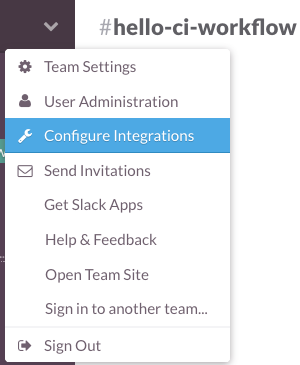


1. 選擇要接收 CircleCI 通知的 channel
2. 點選 `Add CircleCI Integration` 按鈕
3. 複製畫面上的 `webhook URL`

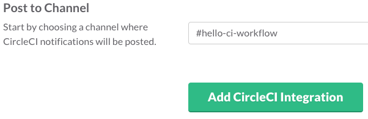

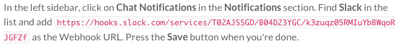

1. 返回 CircleCI
2. 點選 `Project settings` > `Chat Notifications`
3. 貼上將複製的 `Webhook URL` > `Save`

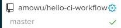


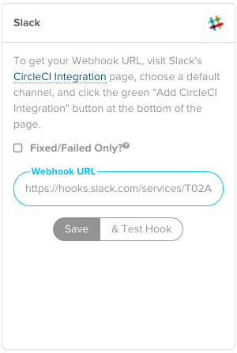

類似的步驟，將 GitHub 的通知加入 Slack：


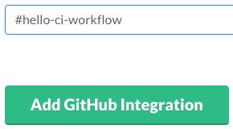

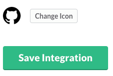

測試 Slack 通知，是否能夠順利運作，新增一條 `test-slack` 分支：

```bash
$ git branch test-slack 
$ git checkout test-slack
```

修改 `index.js` ：

```javascript
// index.js
// ...
app.get('/', function (req, res) {
  res.send('Hello Slack!');
});
// ...
```

Commit & Push：

```bash
$ git add index.js
$ git commit -m "index.js: update to test slack"
$ git push -u origin test-slack
```

1. CircleCI 通過測試，開啟一個 Pull Request
2. 將 `test-slack` merge 回 `master`，觸發 CircleCI 自動部署

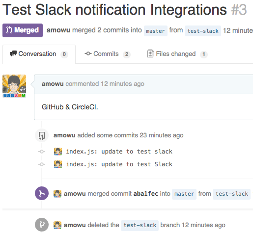

That’s it! On your next build, you’ll start seeing CircleCI build notifications in your Slack chatroom.

結束！可以看見 Slack channel 會顯示每一個步驟的通知過程：

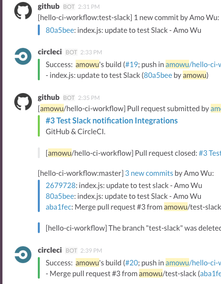

`eb open` 打開瀏覽器查看結果，成功自動部署新版本：

```bash
$ eb open env-production
```

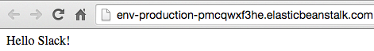

## 結語

> 「書山有路勤為徑，學海無涯苦作舟。」 — 韓愈

DevOps 的開發流程與工具每天都在不斷推陳出新，請站在巨人的肩膀上、保持一顆「活到老、學到老」的心。

我將這個範例的程式碼放在 [GitHub](https://github.com/amowu/hello-ci-workflow) 上，有興趣的人可以參考看看。

文章若有需要改進的地方，還請不吝指教，感激不盡。

## 參考

* [DevOps — Wikipedia](https://en.wikipedia.org/wiki/DevOps) [[中文](https://zh.wikipedia.org/zh/DevOps)]
* [Continuous integration（持續整合）- Wikipedia](https://en.wikipedia.org/wiki/Continuous_integration) [[中文](https://zh.wikipedia.org/wiki/%E6%8C%81%E7%BA%8C%E6%95%B4%E5%90%88)]
* [Continuous delivery（持續交付）- Wikipedia](https://en.wikipedia.org/wiki/Continuous_delivery)
* [山姆鍋對持續整合、持續部署、持續交付的定義](http://blog.eavatar.com/post/2013/10/continuous-integration-deployment-delivery/)
* [Integrate CircleCI with GitHub](http://rettamkrad.blogspot.tw/2014/11/integrate-circleci-with-github.html)
* [Understanding the GitHub Flow · GitHub Guides](https://guides.github.com/introduction/flow/)
* [Dockerizing a Node.js Web App](https://docs.docker.com/examples/nodejs_web_app)
* [Integration with Docker Containers — CircleCI](https://circleci.com/integrations/docker)
* [Continuous Integration and Delivery with Docker](https://circleci.com/docs/docker)
* [Getting Started with EB CLI 3.x](http://docs.aws.amazon.com/elasticbeanstalk/latest/dg/eb-cli3-getting-started.html)
* [Slack Integration | The Circle Blog](http://blog.circleci.com/slack-integration/)
* [Docker in Action — Fitter, Happier, More Productive](https://realpython.com/blog/python/docker-in-action-fitter-happier-more-productive/) [[中文](http://segmentfault.com/a/1190000002598713)]
* [CircleCIからAWS Elastic Beanstalkにpush](http://qiita.com/sawanoboly/items/28e98827bc044abdc32f)
* [Delivery pipeline and zero downtime release](http://waytothepiratecove.blogspot.tw/2015/03/delivery-pipeline-and-zero-downtime.html)
* [Re-Blog: CI & CD With Docker, Beanstalk, CircleCI, Slack, & Gantree](http://sauceio.com/index.php/2014/12/ci-cd-with-docker-beanstalk-circleci-slack-gantree/)
* [Node With Docker — Continuous Integration and Delivery](http://mherman.org/blog/2015/03/06/node-with-docker-continuous-integration-and-delivery)
* [深入浅出Docker（四）：Docker的集成测试部署之道](http://www.infoq.com/cn/articles/docker-integrated-test-and-deployment)
