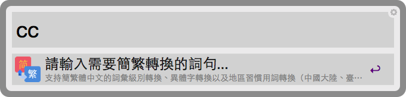
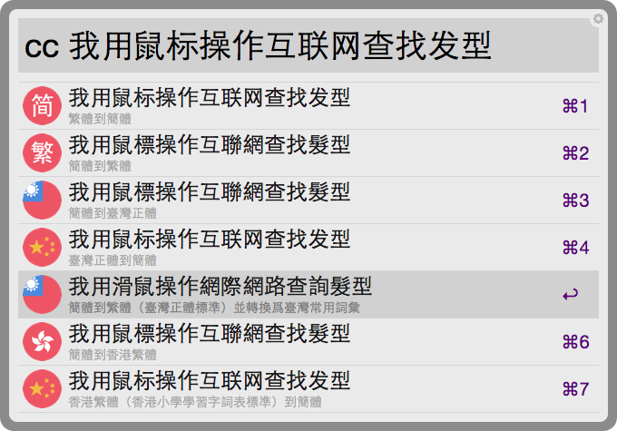

從以前就在找一個可以簡繁互換的 Alfred workflow，可惜一直沒找到滿意的，所以一直以來都是用 Yahoo 的輸入法來切換模式。結果前幾天突然看到 [OpenCC](https://github.com/BYVoid/OpenCC) 這個開源項目，而且還有 Python 的庫可以用！二話不說就自己來寫一個了，以下是節自我的 GitHub [alfred-chinese-converter](https://github.com/amowu/alfred-chinese-converter) v1.0.0 的 README。

## Introduction 介紹

使用開源項目 [OpenCC](https://github.com/BYVoid/OpenCC)（開放中文轉換）開發的 [Alfred 2](http://www.alfredapp.com/) workflow，支持簡繁體中文的[詞彙級別轉換](https://zh.wikipedia.org/wiki/%E7%B9%81%E7%B0%A1%E8%BD%89%E6%8F%9B)、[異體字轉換](https://zh.wikipedia.org/wiki/%E7%B9%81%E7%B0%A1%E8%BD%89%E6%8F%9B)以及[地區習慣用詞轉換](https://zh.wikipedia.org/wiki/%E7%B9%81%E7%B0%A1%E8%BD%89%E6%8F%9B)（中國大陸、臺灣、香港）。

## Features 特點

節選自 [OpenCC](https://github.com/BYVoid/OpenCC) 的部份特點：

* 嚴格區分「一簡對多繁」和「一簡對多異」。
* 完全兼容異體字，可以實現動態替換。
* 嚴格審校一簡對多繁詞條，原則爲「能分則不合」。
* 支持中國大陸、臺灣、香港異體字和地區習慣用詞轉換，如「裏」「裡」、「鼠標」「滑鼠」。
* 詞庫和函數庫完全分離，可以自由修改、導入、擴展。

## Installation 安裝

Mac OS X 環境底下，使用 [Homebrew](http://brew.sh/) 安裝 [OpenCC](https://github.com/BYVoid/OpenCC) 這套開放中文轉換庫：

```bash
$ brew install opencc
```

## Download 下載

[alfred-chinese-converter.alfredworkflow](https://github.com/amowu/alfred-chinese-converter/releases/download/1.0.0/alfred-chinese-converter.alfredworkflow) v1.0.0

## Usage 用法

使用關鍵字 `cc` 輸入需要作簡繁轉換的詞句：



Alfred 會列出 7 項轉換結果：

* 簡體到繁體
* 繁體到簡體
* 簡體到臺灣正體
* 臺灣正體到簡體
* 簡體到香港繁體（香港小學學習字詞表標準）
* 香港繁體（香港小學學習字詞表標準）到簡體
* 簡體到繁體（臺灣正體標準）並轉換爲臺灣常用詞彙



選擇其中一筆結果，自動複製至剪貼簿：


