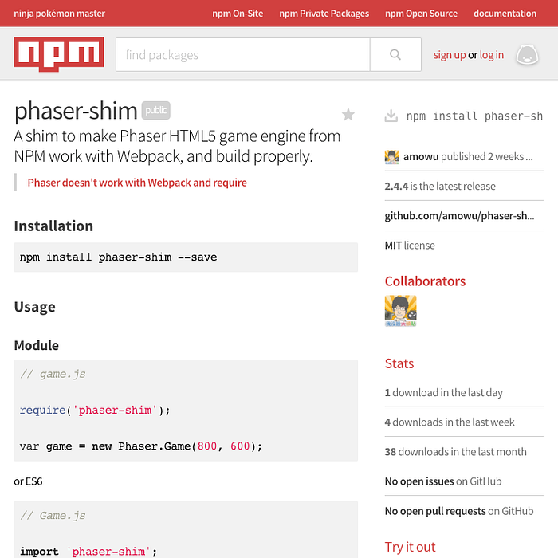

最近 [Bower](http://bower.io/) 宣布停止維護，所以許多前端的 packages 都移到了 [NPM](https://www.npmjs.com/) 上，甚至連 [Grunt](http://gruntjs.com/) 和 [Gulp](http://gulpjs.com/) 這類 build tools 都有要被 NPM scripts 取代的趨勢。


這篇文章主要是紀錄怎麼在發布自己的 package 之前，打包好需要的檔案。

假設你會使用 [Grunt](http://gruntjs.com/) 或 [Gulp](http://gulpjs.com/) 將所有原始碼打包存成一支檔案，例如 `dist/build.js`，但是因為通常我們不會把 `dist` 這類輸出文件放進版本控制，所以要在每次發布新版本的時候動態打包。

方法是在 `package.json` 的 `script` 底下新增一個 `prepublish` 的腳本，然後把你的打包命令寫在這裡：

```json
// package.json
{
  "script": {
    "prepublish": "..." // grunt or gulp
  }
}
```

接下來是透過 `main` 指定程式的進入位置，讓其他人在使用的時候可以正常的 `require` 或 `import` 你的 package。

預設的檔案通常是 `index.js`，這裡我們把它改成剛剛打包完成的 `dist/buid.js` ：

```json
// package.json
{
  "main": "dist/build.js"
}
```

最後也是最重要的部分，記得在專案根目錄新增一份 `.npmignore` 的空檔案，因為如果沒有它，NPM 在發布的時候會參考 `.gitignore` 的清單來決定哪些檔案不能被發布，而通常 `dist` 就會在這裡面，所以要將它從 `.npmignore` 裡面移除。

都準備完成之後就可以發布了，如果你還沒有 NPM 的帳號，可以註冊一個：

```bash
npm adduser
```

然後發布新版本：

```bash
npm publish
```

記得更新 `package.json` 的 `version` 才能發布。

發布成功之後前往 [**http://npmjs.com/package/name**](http://npmjs.com/package/name) 看結果：



完整專案可以參考我的 [GitHub](https://github.com/amowu/phaser-shim)

## 參考文章

* [Publishing npm packages](https://docs.npmjs.com/getting-started/publishing-npm-packages)
