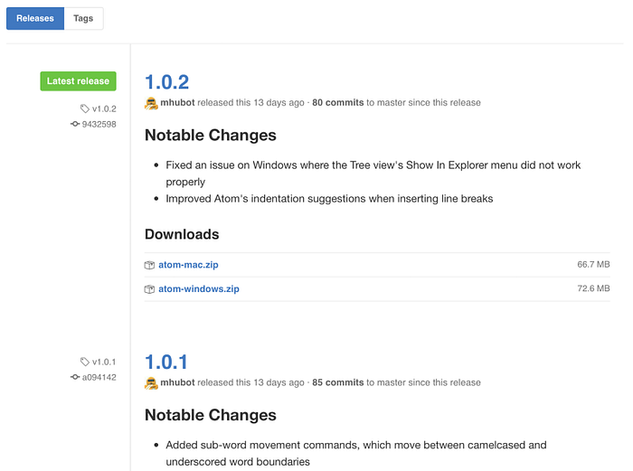
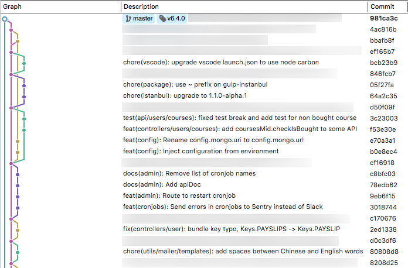
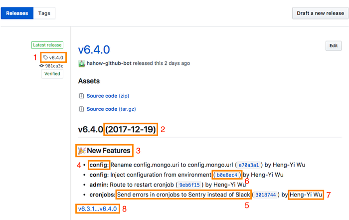

2017 年初的時候，曾經寫了《[如何自動化 release 的流程？](https://blog.amowu.com/posts/2017-01-24-how-to-automate-js-release/)》這篇文章，介紹了如何利用 [semantic-release](https://github.com/semantic-release/semantic-release) 和 [TravisCI](https://travis-ci.org/) 自動化 GitHub Releases 和 NPM publish 這件事。這次要介紹的是如何直接透過 [Probot](https://probot.github.io/) 機器人做到 GitHub Releases。

## 大綱

* 什麼是 GitHub Releases？
* GitHub Releases 有什麼問題？
* 什麼是 Conventional Commits？
* 什麼是 Conventional Release Bot？
* 為什麼要用 Conventional Release Bot？

## 什麼是 GitHub Releases？

[GitHub Releases](https://help.github.com/articles/about-releases/) 是 GitHub 提供給每個專案在釋出（Release）新版軟體時，用來紀錄更新內容（Change Log）的頁面。



通過 GitHub Releases，你可以為每次的 release 加入說明，描述該 release 進行了哪些更改。

GitHub Releases 的基礎是建立在 [Git tags](https://git-scm.com/book/en/v2/Git-Basics-Tagging) 之上。Tags 代表了你的專案在某個特定時間點下的里程碑，所以它會是一個很好的 release 表達方式。

更多有關於 Git tags 的資訊可以參考 GitHub 的《[Working With Tags](https://help.github.com/articles/working-with-tags/)》。

## GitHub Releases 有什麼問題？

我們團隊在執行 release 的過程中碰到過不少問題，總結如下：

1. 無法回憶起曾經「新增了哪些功能」或「修復了哪些問題」，就像突然有人問「你記得上禮拜二中午吃什麼嗎？」的感覺，每次負責 release 的人都要口頭一個一個問其他工程師，最後崩潰躲在角落獨自一個人慢慢爬 commit log⋯⋯😢
2. Push 或 merged `master` 的當下就應該馬上 release Git tag，但是常常會忘記做這件事，導致之後想起來還要回去找 commit SHA 才能補上 tag
3. 不是所有人都知道 [SemVer](https://semver.org/) 的版本號更新規則
4. Git tag 下在錯誤的 branch：因為有些 repository 的 default branch 會設為 `develop`，但是常常忘記選擇 `master`
5. Git tag name 打錯字：不是忘記加 v（例如 `1.1.0` ）就是多一個點（例如 `v.1.1.0` 或 `v1.1.0.` ）◢▆▅▄▃ 崩╰(〒皿〒)╯潰 ▃▄▅▆◣
6. 即使上面的步驟都讓你做對好了，但是下一次要 release 還是得手動再來一遍⋯⋯這種彷彿在玩疊疊樂，希望積木不要倒的心情，我覺得不行


## 什麼是 Conventional Commits？

Conventional Commits 是 [conventionalcommits.org](https://conventionalcommits.org/) 在維護的一份 Git commit message 規範。

Conventional Commit 定義的 commit message 結構應該如下：

```plaintext
<type>[optional scope]: <description>

[optional body]

[optional footer]
```

根據 commit message 的不同，產生的 release 內容也會有所不同：

* **Bug Fixes**：當 *type* 為 `fix`，那麼它屬於「修復問題」類型的 commit（等同於 SemVer 的 `[PATCH](https://semver.org/)`）
* **New Features**：當 *type* 為 `feat` ，那麼它屬於「新增功能」類型的 commit（等同於 SemVer 的 `[MINOR](https://semver.org/)`）
* **BREAKING CHANGES**：當 *body* 或 *footer* 的開頭有出現 `BREAKING CHANGE:` 這個關鍵字，那麼它屬於「會讓舊版程式無法運行的更新」類型的 commit（等同於 SemVer 的 `[MAJOR](https://semver.org/)`）。一個 breaking change 的 type 只能是 `fix`、`feat` 或 `chore`。

Scope 為選填內容（使用括號包在內），它可以協助 commit 提供額外的上下文資訊。例如：

```
feat(component): add brand button
```

Commit types 除了 `fix` 和 `feat` 之外，其它 types 也是允許的，例如 [Angular convention](https://github.com/angular/angular/blob/master/CONTRIBUTING.md) 建議的 `docs`、`style`、`refactor`、`test` 和 `chore`，但是這些 types 僅供閱讀方便使用，並不會出現在 release notes 之中。

遵循 Conventional Commits 之後，整體的 commits log 感覺大致如下：



更多細節可以參考 [Conventional Commits Specification](https://conventionalcommits.org/)。

## 什麼是 Conventional Release Bot？

[Conventional Release Bot](https://github.com/apps/conventional-release-bot) 是 [Hahow](https://hahow.in/) 開源的 GitHub 機器人，它能夠根據 [Conventional Commits](https://conventionalcommits.org/) 的規範，自動幫你產生 GitHub Releases 和 Git tags。



如上圖所示，Conventional Release Bot 自動產生的 GitHub Releases 內容如下：

1. Git tag（遵循 [SemVer](https://semver.org/)）
2. Release 日期
3. Release 類型：**Bug Fixes**、**New Features** 和 **BREAKING CHANGES**
4. Conventional Commit 的 scope（有填寫才會出現）
5. Commit 說明
6. Commit SHA
7. Commit 作者
8. 和上一版本的 diff

如果機器人沒有在 commits 裡發現 `feat`、`fix` 或 `BREAKING CHANGE`，則會跳過建立 GitHub Releases 的步驟。

## 為什麼要用 Conventional Release Bot？

總結一下 Conventional Release Bot 的優點：

* 自動化產生 CHANGELOG（GitHub Releases）
* 自動化更新 SemVer 版本號（以 Conventional Commits 的 types 為基礎）
* 通過友善的結構化 commit 規範，讓開發者更容易瀏覽更新歷史，提高對專案做出貢獻的意願
* 更好地向人類（同事、使用者或其他利益相關者）傳達軟體更新的本質

最後，Conventional Release Bot 的原始碼＆安裝方式可以在 [amowu/probot-conventional-release](https://github.com/amowu/probot-conventional-release) 找到，歡迎大家一起來貢獻 Pull Request。😘
