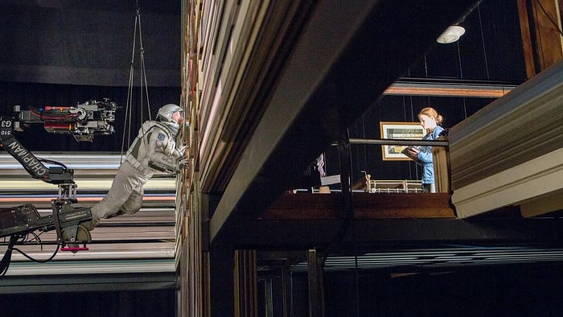
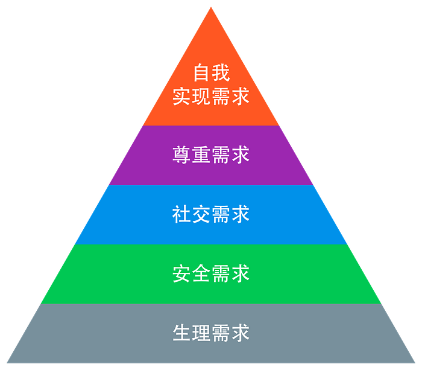
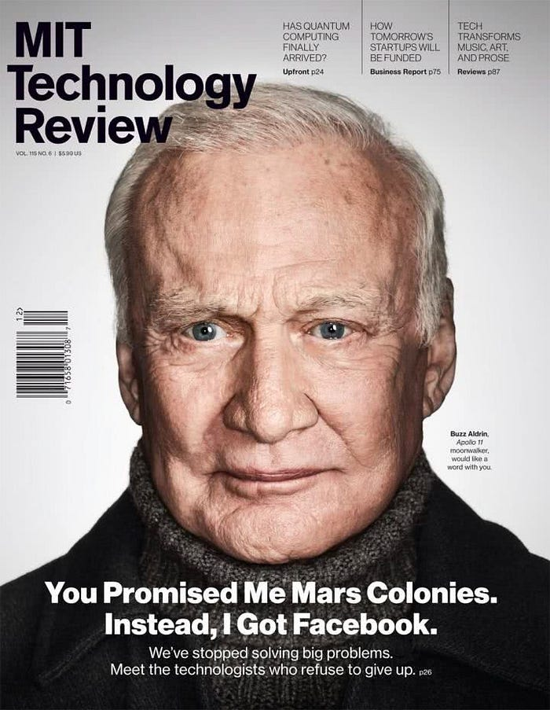
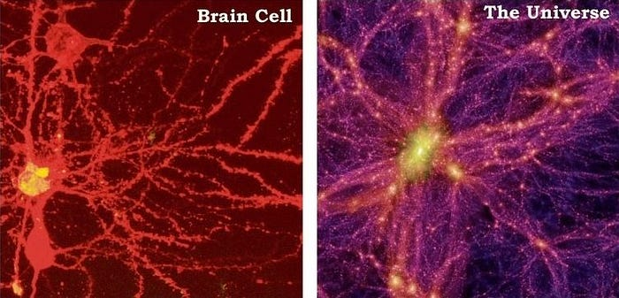
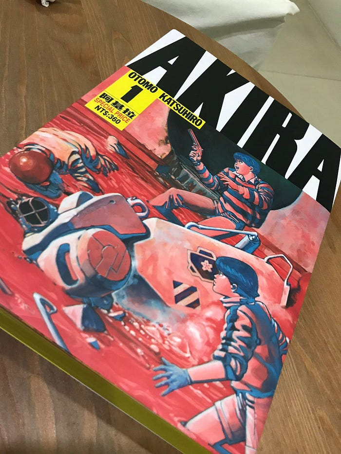
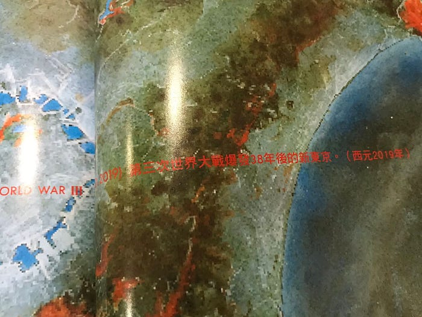
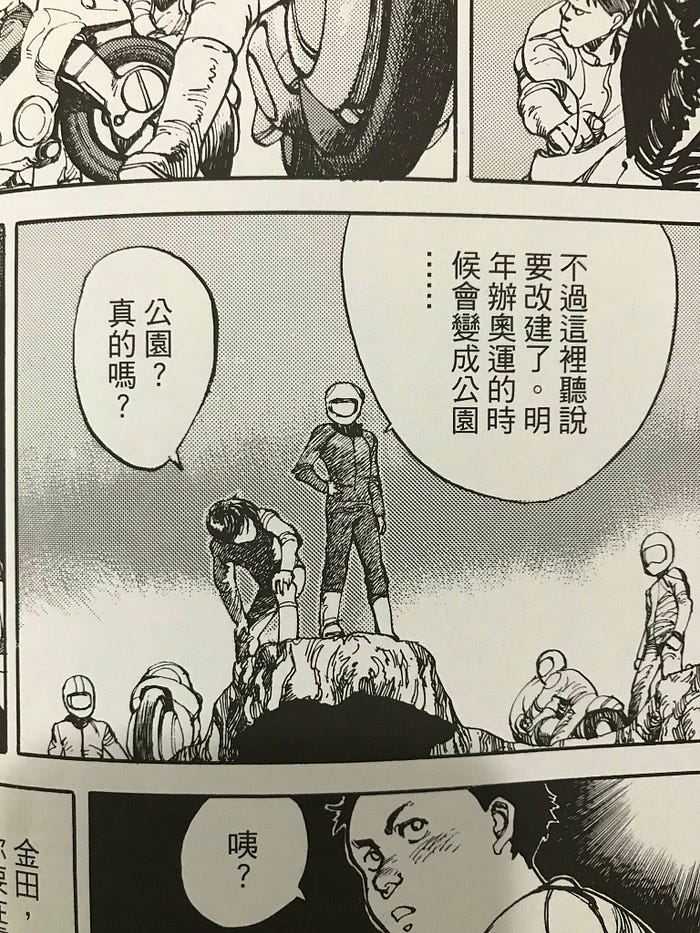
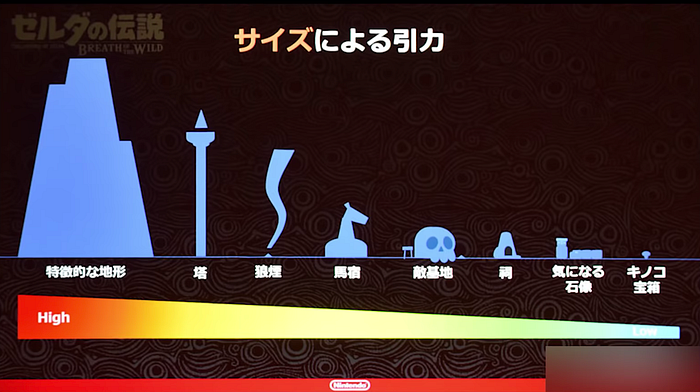
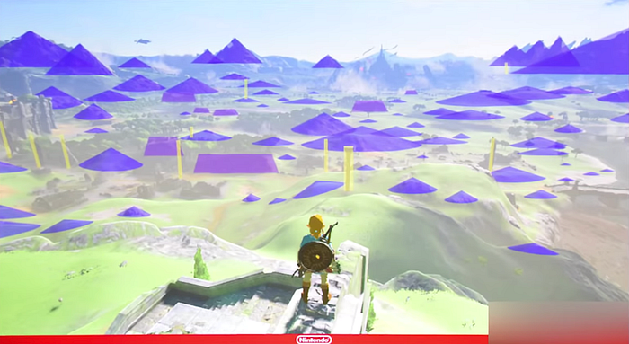
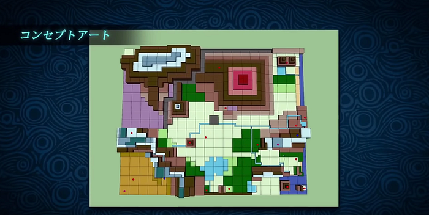

## 前言

轉眼 2018 就要結束了，每年這個時候，總是充滿了焦慮的心情，感覺好像還有很多目標沒有完成。

其中之一就是文章的產出極低。

所以想趁著這個機會，效仿阮一峰的《[每周分享](http://www.ruanyifeng.com/blog/clipboard/)》系列，總結一下每周看到的知識，並將之轉化成值得分享的心得文章。

## 新聞

### 平成最後的漢字

日本天皇明年就要退位了，所以今年可以看到很多掛上「平成最後的〇〇」的梗。

京都的清水寺每年都會總結出一個代表日本的漢字，今年選出的是「災」這個字。

豪雪、豪雨、酷暑、強颱、地震再加上瘟疫，日本今年經歷了一系列的自然災害。

巧的是，我今年十月曾經眼皮跳了將近一個月左右，接著身邊就陸續發生了一些不幸的憾事。

民間流傳著一句「左眼跳財、右眼跳災」。最近剛三刷完《[星際效應](https://zh.wikipedia.org/wiki/%E6%98%9F%E9%99%85%E7%A9%BF%E8%B6%8A)》之後，突然覺得好像可以解釋這種現象，該不會是有老祖先正在諾蘭的五維空間之中撥動弦，想要傳達些什麼訊息給我？

不過現在回想起來，我眼皮是跳在左眼⋯⋯，所以，財呢？

## 文摘

### 我們將毀於我們所熱愛的東西

本周，我聽了一本經典的反烏托邦科幻小說，《[美麗新世界](https://zh.wikipedia.org/wiki/%E7%BE%8E%E9%BA%97%E6%96%B0%E4%B8%96%E7%95%8C)》。

聽完之後，我對社會主義有了重新的思考。

故事中的未來社會，人類皆透過人工授精、體外培養的方式來繁殖，並且制定了新的種姓制度：α、β、γ、δ 和 ε。不同於舊種姓制度只是在階級上的不平等，新種姓制度下的新生兒連智力和體力都有高低之分，徹底重新定義了不平等的下限。

然而，卻不會有一群人壓迫另一群人的情況發生，各個階層的人都被培養成非常適合、也非常熱愛自己的工作。彼此間也不會感到「不幸福」，每個人都滿足於馬斯洛提出的 [需求金字塔](https://zh.wikipedia.org/wiki/%E9%9C%80%E6%B1%82%E5%B1%82%E6%AC%A1%E7%90%86%E8%AE%BA)。

如何做到的呢？

簡單來說，就是透過修改先天的基因＆後天的洗腦教育。

例如：最低種姓 ε，讓他們一摸到鮮花就觸電，形成一種「想到大自然植物就噁心」的恐懼反射，避免他們在野外娛樂，浪費時間和社會資源。再比如 β 種姓只是技術人員，通過前期教育降低夢想，只做好手上的技術活，不夢想開創什麼學術新領域。反之在 α 種姓教育中則被鼓勵。

為了追求社會的高效，每個階級各自負責如汽車製造流水線般的精細分工，各就其位，整個社會非常和諧穩定。所有人都成為社會這台大機器之中「獨立卻又需要彼此、不可分割」的螺絲釘。實現了終極的社會主義：人為社會服務，而不是社會為人服務。

故事中「犧牲了人性複雜的多樣性與獨立個性」換來的幸福並不可怕，可怕的是，有一天，這個世界會用廉價的娛樂讓我們變成社會的零件，而不是社會的主人。

我們以前活在《[一九八四](https://zh.wikipedia.org/wiki/%E4%B8%80%E4%B9%9D%E5%85%AB%E5%9B%9B)》，未來可能會活在《[美麗新世界](https://zh.wikipedia.org/wiki/%E7%BE%8E%E9%BA%97%E6%96%B0%E4%B8%96%E7%95%8C)》。

(登月第二人，伯茲·艾德林：「你們承諾會殖民火星，卻給了我 Facebook」)

最近「CRISPR 基因編輯嬰兒」的新聞鬧得沸沸揚揚，或許這個未來也不遠了⋯⋯。

## 工具

### Logpoints

Chrome Debugger 實驗室最近推出了一個名叫 logpoints 功能，對於不喜歡使用中斷點（breakpoints）的 `console.log` 派來說，應該是個好消息。

## 本周圖片

### 大腦就是一個三磅重的宇宙

《紐約時報》曾經刊登過這兩張有意思的照片，左邊是小白鼠的大腦神經元網路，右邊則是宇宙的星系，兩張照片放在一起看，竟然驚人地相似。

最近聽了《得到》專欄《前沿科技之腦機接口》，裡面提到做腦機介面，最想要實現的就是看誰能採集更多、更精准的「腦電波」資料，然後嘗試理解這些訊號所對應的大腦指令。

那怎麼採集呢？科學家分成兩派，「侵入式」的腦機介面與「非侵式」腦機介面。

這兩種探測大腦的方式，其實跟科學家探索宇宙的方法如出一轍。

「侵入式」的腦機介面，像《駭客任務》一樣，把電極放到大腦裡去，就像宇宙的觀測者，如果能發射衛星、飛船進入太空，登陸月球、火星，那麼就能帶回珍貴的資料。這就是侵入式腦機介面的邏輯。

不同於侵入式腦機介面需要動開顱手術，風險很高，非侵入的風險就低很多，其實就是醫院裡面你會見到的腦電圖。做腦電圖的時候，你會戴上一個佈滿電極的帽子，分析你的腦電波。這就相當於科學家在地球上，對星系進行遠距離觀測。

如果腦機介面技術被順利發展起來，那麼將會徹底顛覆人類的文明，它將會取代五萬年來我們賴以為生的協作工具：語言。直接建立一個能讓大腦和外界溝通的全新方式。估計下一間一萬億美元的公司就會誕生於此吧。

## 新奇

### 神預測 2020 東京奧運

被奉為經典漫畫的科幻神作《阿基拉》，最近在台灣推出了再版。

(聽說絕版曾經喊到天價，如今再版，質感爆棚)

距今 34 年前的漫畫（1984），全手繪的細膩筆觸，即便是放在現在來看，也有過之而無不及。

作者大友克洋將故事設定在 2019 年的新東京，並且在劇情中提到了 2020 年東京將舉辦奧運，簡直神預測！這麼好的梗，動漫立國的日本政府絕對能拿來操作啊。

(雖然不是現在的東京，而是第三次世界大戰後的「新東京」)

(慶幸的是，第三次世界大戰沒有真的發生)

### 如果你想毀掉一個人，但又想讓他覺得你是全世界對他最好的，那麼送他《薩爾達傳說：曠野之息》吧

由於本身待過遊戲業的關係，對於日本的遊戲設計與遊戲開發一直都有在關注。最近看到一個有趣的新知。

正常來說一間遊戲公司有了別人做不到的「好玩」的創舉之後，肯定都是建立商業機密檔案，制定情報管理機制，確保這個製作秘密不會外流。

例如 [CAPCOM](https://zh.wikipedia.org/wiki/%E5%8D%A1%E6%99%AE%E7%A9%BA) 這家公司，任何遊戲專案，光是想要調用「如何做好打擊感」這方面的知識，就要特別動用公司裡一個專門調製打擊感的小組，而且那個小組是受到嚴格監控的，並且每個人所掌握的知識也只是其中的一小部分。

作為 [TGA](https://zh.wikipedia.org/wiki/%E6%B8%B8%E6%88%8F%E5%A4%A7%E5%A5%96) 2017 年度最佳遊戲的《[薩爾達傳說：曠野之息](https://zh.wikipedia.org/wiki/%E5%A1%9E%E5%B0%94%E8%BE%BE%E4%BC%A0%E8%AF%B4_%E6%97%B7%E9%87%8E%E4%B9%8B%E6%81%AF)》，任天堂的開發團隊竟然自己在 2017 日本開發者大會上分享了讓 [開放世界](https://zh.wikipedia.org/wiki/%E9%96%8B%E6%94%BE%E4%B8%96%E7%95%8C) 好玩的 3 個隱藏設計要素：引導點的巧妙安排、地圖場景的三角法則和對應真實世界的距離感、密度感和時間感。

(高塔就是吸引力很強的引導點，玩家看到它整個精神狀態就會開始不對勁，遊戲中巧妙地安排這些引導點，確保玩家在到達一個引導點之後，一定能看到其它引導點，從而下意識又有了一個潛在的目標)

(玩家也不是笨蛋，引導點會讓玩家有一種被設計好、而不是自由探索的《美麗新世界》既視感，所以《曠野之息》將大多數場景物件的輪廓都設計得接近三角形，把這些物件擺在兩個引導點的中間來影響玩家的視野和路線)

(透過京都的便利商店密度來掌握遊戲中該設置多少神廟數量的感覺)

更多細節有興趣的可以觀看下面的 YouTube 影片介紹，看完之後會不禁讚嘆遊戲設計中也充滿著「[行為經濟學](https://zh.wikipedia.org/wiki/%E8%A1%8C%E7%82%BA%E7%B6%93%E6%BF%9F%E5%AD%B8)」啊。

https://youtu.be/T35UQSWSM94?si=G_-Ibb1Fp4BEgTSy

## 本周金句

> 說唐僧成佛了，我們理解，一個有使命的偉大領導者；
> 孫悟空成佛了，我們也能理解，業務高手、降妖除魔，忠心耿耿；
> 沙和尚成佛了，我們也能理解，一路髒活苦活累活，沒有功勞也有苦勞；
> 你說豬八戒成佛了，我們不理解，好吃懶惰又好色，唐僧一被抓，「猴哥我們散伙吧」；
> 就這種員工，他最終還成佛了，為什麼？只因為一件事，跟對了團隊。
> ―― [名人名言](http://vt.tiktok.com/vrEdT/%20)

> 如果家長能想清楚，關鍵是贏在終點線上，而不是起跑線上，就沒有必要逼孩子從小搞得那麼累了。
> ――《維繫朋友關係之道》吳軍的谷歌方法論

> 今天，世界上絕大部分私立中小學，都要求學生們穿校服，這不僅僅為了整齊好看，也是為了讓不同家庭背景的孩子們感到平等。
> ――《熬夜排隊買蘋果手機和中國孩子的早教》吳軍的谷歌方法論

> 過去許多軟體開發商設計很多數位鎖，想要防止被盜版，但歷史證明，都沒有用。開發數位鎖浪費了軟體開發商的大筆時間和金錢，但最後鎖住的，卻往往是有良心乖乖買正版的使用者。
> ――《[軟體開發的未來，是大斗內時代？](https://blog.techbridge.cc/2018/11/14/future-of-software/)》

> 發明是從 0 到 n 的一個全過程，遠不是簡簡單單地從 0 到 1 那麼簡單。今天很多人一直夢想著自己碰到從 0 到 1 的好運氣，其實世界上從 0 到 1 的發明從來不缺，但是能走完全部 n 步才是一件難事。
> ――《發明的邏輯和可重複的成功》吳軍的谷歌方法論

> 做事不怕慢，就怕停。
> ―― 吳軍的硅谷來信

## 後記

備忘一下這個系列的初衷與目的：

1. 將看過的東西寫出來，有助於提升記憶＆理解程度
2. 除了 Evernote 之外，另外有個地方可以搜尋資料
3. 有輸入、有輸出，完善知識管理的最後一塊拼圖
4. 施比受更有福，如果能幫助到世界某個角落的一個人也好，我也透過寫作永生於人間了

有任何建議，也歡迎不吝留言指教。
