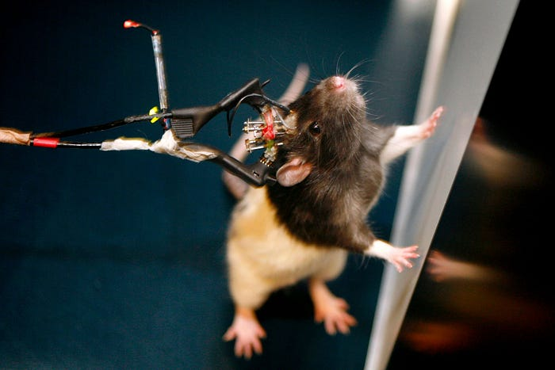
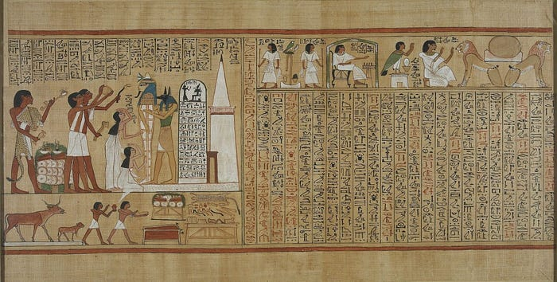
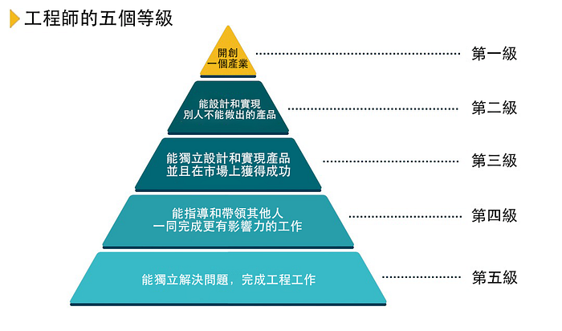
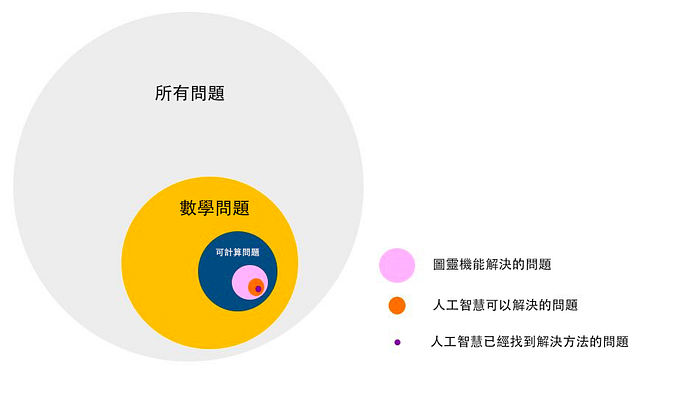
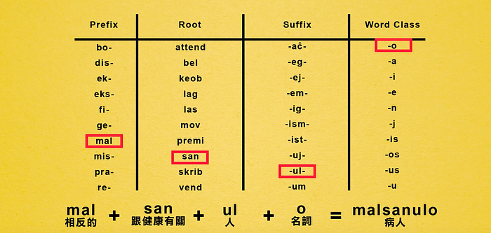
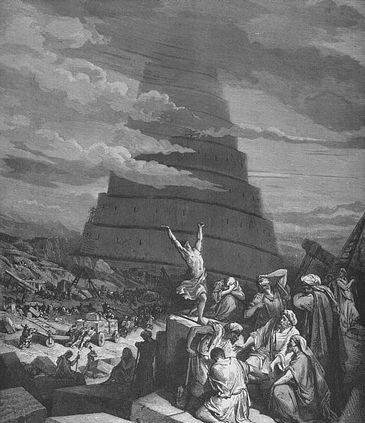

## 新聞

### 我們真的有「自由意志」嗎？

上周，Netflix 推出了互動式電影《[黑鏡：潘達斯奈基](https://www.netflix.com/tw/title/80988062)》，你玩出幾星評價的結局呢？

《黑鏡：潘達斯奈基》是一部巧妙結合「互動式電影」、「多重結局」和「探討自由意志」要素的作品。

雖然新鮮有趣，但是個人認為互動式電影無法成為主流，理由有三：

1. 製作成本高，而且破解的難度不高，盜版更是道高一尺，魔高一丈。
2. 無法在電影院上映，少了一筆主要的收入來源。
3. 觀賞體驗差，對於下班只想躺在沙發上、或是邊炒菜編追劇的小確幸來講，中斷 10 秒這個 MI（Movie Interface）MX（Movie Experience）不是很好。

而且互動式電影走到極致，其實就是被稱作「[第九藝術](https://zh.wikipedia.org/wiki/%E5%85%AB%E5%A4%A7%E8%97%9D%E8%A1%93)」的電玩遊戲，這讓互動式電影的角色定位有如「有聲書」般尷尬。

回到《黑鏡：潘達斯奈基》的主題，也許人類並不存在什麼「自由意志」。

什麼叫自由意志？如果說我想要什麼就可以去追求什麼，那我就是自由的嗎？錯了，這不叫有自由意志。大猩猩、小狗和鸚鵡也可以想要什麼就去追求什麼，這沒什麼高級的，只不過是被慾望驅使。

實驗證明，人的慾望並不受意識控制，而是意識受慾望控制。

科學家用「[功能性磁振造影](https://zh.wikipedia.org/zh-tw/%E5%8A%9F%E8%83%BD%E6%80%A7%E7%A3%81%E5%85%B1%E6%8C%AF%E6%88%90%E5%83%8F)」，觀察受驗者的大腦。結果發現，在受驗者做決定的幾百毫秒之前，在他還沒有意識到自己要怎麼選擇之前，科學家就已經可以透過大腦成像圖，提前知道了他會怎麼選。

不但可以先一步「知道」你想幹什麼，還可以進一步「控制」你想幹什麼。

科學家在老鼠大腦中插入三個電極，然後實現了遙控指揮，讓牠直行、爬樓梯或繞著轉圈，怎麼都行，跟遙控玩具一樣。

這對老鼠太殘忍了？但是科學家控制的其實是老鼠的意願。你看到的是老鼠被遙控，而老鼠自己的感覺是想去哪就去哪，非常快樂。那麼，老鼠還有什麼「自由意志」可言呢？

許多科幻作品都在探討「機器人是否存在意識」的問題，例如《[西方極樂園](https://zh.wikipedia.org/zh-tw/%E8%A5%BF%E9%83%A8%E4%B8%96%E7%95%8C)》和《[銀翼殺手](https://zh.wikipedia.org/wiki/%E9%93%B6%E7%BF%BC%E6%9D%80%E6%89%8B)》。

**仿生人會夢見電子羊嗎？**

反過來想，意識也許只是一種精神污染（[函數副作用 Side effect](https://zh.wikipedia.org/wiki/%E5%87%BD%E6%95%B0%E5%89%AF%E4%BD%9C%E7%94%A8)），人類不屬於純函數（[Pure Function](https://zh.wikipedia.org/wiki/%E7%BA%AF%E5%87%BD%E6%95%B0)）。

## 文摘

### 工程師的五個等級

身為一個喜歡科幻作品的理工男，文學作品的賞析對我來說一直都是罩門。

本周的《[吳軍的谷歌方法論](https://m.igetget.com/share/course/pay/detail/4/42)》 在介紹莎士比亞的《[第十二夜](https://zh.wikipedia.org/zh-tw/%E7%AC%AC%E5%8D%81%E4%BA%8C%E5%A4%9C)》文中提到，文學家在創作上有三個層次：

1. 編一個吸引人的故事（托爾金的《魔戒》、瓊瑤的小說）
2. 反映出一個時代的特點和問題（海明威的《戰地鐘聲》）
3. 通過對現實和一個時代的描寫，闡述作者自己心中的春秋大義。（雨果的《悲慘世界》、曹雪芹的《紅樓夢》）

其中「反映時代特點」剛好與《[吳軍的硅谷來信](https://m.igetget.com/share/course/pay/detail/4/19)》其中一篇《談文物的價值》不謀而合。

一般來講博物館收藏品的價值看三個：

1. **文物性**：重要歷史事件的見證，或者反映一個時期的文明水平，社會文化生活。（羅浮宮的《[漢摩拉比法典](https://zh.wikipedia.org/zh-tw/%E6%B1%89%E8%B0%9F%E6%8B%89%E6%AF%94%E6%B3%95%E5%85%B8)》）
2. **藝術性**：不僅僅是以今日眼光評判是否漂亮，還要放回到歷史中看它們是否具有里程碑式的意義。如果同時二者具備就更珍貴。（達文西的《[蒙娜麗莎](https://zh.wikipedia.org/wiki/%E8%92%99%E5%A8%9C%E4%B8%BD%E8%8E%8E)》、米開朗基羅的《[創世紀](https://zh.wikipedia.org/zh-tw/%E5%88%9B%E4%B8%96%E7%BA%AA_%28%E5%A3%81%E7%94%BB%29)》）
3. **稀缺性**：一般越古老的越稀缺。有些年代雖然不算太長，但全世界剩不了幾個，也非常珍貴。再有名人們用過的東西，當然也就獨一無二了。（顧愷之的《[女史箴圖](https://zh.wikipedia.org/wiki/%E5%A5%B3%E5%8F%B2%E7%AE%B4%E5%9B%BE)》）

吳軍老師在《工程師和職業發展》一文中，仿照「[朗道給物理學家分級](https://zh.wikipedia.org/wiki/%E5%88%97%E5%A4%AB%C2%B7%E6%9C%97%E9%81%93)」的方法，也將工程師分成了五個等級。分類的原則大致如下：

1. 能獨立解決問題，完成工程工作。
2. 能指導和帶領其他人一同完成更有影響力的工作。
3. 能獨立設計和實現產品，並且在市場上獲得成功。
4. 能設計和實現別人不能做出的產品，也就是說他的作用很難取代。（[比爾蓋茲](https://zh.wikipedia.org/wiki/%E6%AF%94%E7%88%BE%E8%93%8B%E8%8C%B2)、[約翰卡馬克](https://zh.wikipedia.org/wiki/%E7%B4%84%E7%BF%B0%C2%B7%E5%8D%A1%E9%A6%AC%E5%85%8B)）
5. 開創一個產業。（[圖靈](https://zh.wikipedia.org/wiki/%E5%9B%BE%E7%81%B5)、[高德納](https://zh.wikipedia.org/zh-tw/%E9%AB%98%E5%BE%B7%E7%BA%B3)）

## 本周圖片

### 為什麼人工智慧不可能取代人類

Vue.js 的作者尤雨溪最近在《[vue 和 react 優點分別是什麼？](https://www.zhihu.com/question/301860721/answer/545031906)》回覆之中，給出了一段話：

> 編程語言之間噴來噴去還少麼？大家都是圖靈完備，然而此之蜜糖，彼之砒霜。

好奇什麼是「[圖靈完備](https://zh.wikipedia.org/wiki/%E5%9C%96%E9%9D%88%E5%AE%8C%E5%82%99%E6%80%A7)」，查詢之後得到的簡答如下：

> 圖靈完備意味著你的語言可以做到模擬「圖靈機」能做到的所有事情，可以解決所有「可計算問題」。

> 圖靈不完備的語言常見原因有迴圈或遞迴受限（無法寫不終止的程式，如 `while(true){};`），無法實現類似 Array 或 List 這樣的資料結構。

這讓我想起《吳軍的硅谷來信》曾經給出下面這張圖，解釋為什麼人工智慧不可能取代人類：

至於什麼是「不可計算問題」？舉個例子：某個男生特別壞，在別人看來就是個渣男，但是你喜歡的女生偏偏就是特別喜歡他。這個問題就算放到 2049 年，Siri 也還是無法給出一個令你滿意的答案。

## 新奇

### 如果全世界的人都只說一種語言該有多好

YouTuber 啾啾鞋在《[世界語簡介](https://www.youtube.com/watch?v=iyl0zNntnOw)》的影片中，分享了一套叫「[世界語](https://zh.wikipedia.org/wiki/%E4%B8%96%E7%95%8C%E8%AF%AD)」的語言。

世界語是一套非常有邏輯、沒有例外，容易舉一反三的語言，只要記住基本單字和文法之後，就可以拼湊出想要表達的意思：

* 一字一音，會念就會拼，會拼就會念。
* 沒有複雜的動詞現在式、過去式和未來式規則。
* 單字的結構簡單，由「字首、字根、字尾和詞類」組成。

詳細內容可以到啾啾鞋的影片中進一步暸解，令我印象深刻的是總結的部分，為什麼世界語沒能成為人類的統一語言呢？

> 任何有這種「團結所有人」想法的發明，都會面臨相同的問題。
> 以「網路」的出現為例，人們原本以為可以透過資訊的流通，讓世界變得無邊界，人類就可以大同。但是網路也更有效率地讓許多志同道合的人形成自己的意見同溫層，然後開始和敵對陣營互相吐口水。

蘇聯共產黨原本打算透過世界語的力量統一全國人民，結果反而造成自己的內鬥，並且最後被禁止使用。

> 如果想要全人類真的團結在一起的話，恐怕只有當外星人出現的時候，人類才能團結在一起。
> 團結的同時，其實就意味著排外。

## 本周金句

> 除非違反物理定律，否則幾乎任何事情都是可能的。

> ――《[埃隆·馬斯克和特斯拉汽車的故事](http://www.ruanyifeng.com/blog/2018/12/elon-musk.html)》

> 任何在我出生時已經有的科技，都是稀鬆平常的世界本來秩序的一部分。任何在我 15～35 歲之間誕生的科技，都是將會改變世界的革命性產物。任何在我 35 歲之後誕生的科技，都是違反自然規律，要遭天譴的。

> ―― 《[銀河便車指南](https://zh.wikipedia.org/wiki/%E9%93%B6%E6%B2%B3%E7%B3%BB%E6%BC%AB%E6%B8%B8%E6%8C%87%E5%8D%97%E7%B3%BB%E5%88%97)》科技三定律

> 每個人都有一個計劃，直到被一拳打到臉上。

> ―― 泰森
