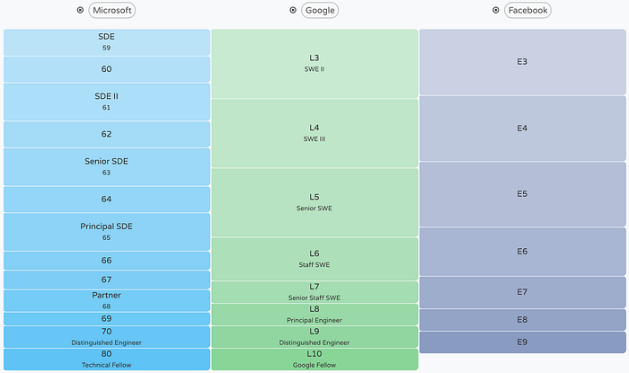
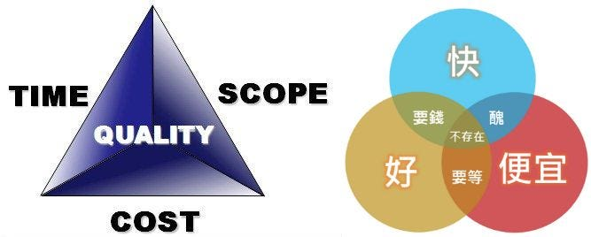

### 為何會有公司願意花大錢在電視、地鐵、體育比賽投放廣告？

如果無法透過「點擊率」追蹤「轉化率」，那這類廣告有何用？

1. 告訴你有這麼一個品牌存在，否則剛出生的人再過幾年之後就不知道它的存在了。
2. 既然肯花大錢買廣告，表示很重視該產品，應該不會半途而廢，服務肯定不錯。
3. 你知道其他人肯定也看過這個廣告了，你買了這東西之後就有面子了。

相比之下，網站或 App 類型的砸錢廣告好像比較少見，我認為《羅輯思維》在 2018 跨年演講中給出了理由。

互聯網公司要想上央視春晚，門檻是 DAU（每日活躍人數）超過一億，否則廣告出來的那一瞬間，你的伺服器就會掛掉。

有句話說，世界上最悲慘的事情是，錢花光了，人還在。

但是，世界上更悲慘的事是，花光自己的錢買廣告，搞掛了自己的產品，人還在。

最近聽了一本名叫《[空雨衣](https://book.douban.com/subject/10540584/)》的書，空雨衣是某座公園的一尊雕像，象徵著現代人所面臨的悖論：所有人都被「成功」這個目標綁架，不斷被驅趕著往前跑，反而失去了生活本身的意義。

1. 公司的經營目的是什麼？
2. 公司究竟屬於誰的？

追求利潤應該只是公司的手段而不是目的，就像我們吃飯是為了活著，但是活著不是為了吃飯。

公司的英文單字 Company，本意是一群夥伴，這才是公司的本質。

公司的目的是追求自身的永續存在，它本身不是誰的財產，也沒有股東；但是有規章、有成員、有管委會、有自己的資產，等等。

在未來，公司應該是這樣一種組織：

1. 聯邦制：公司會有一個負責管理和協調的核心機構，還有好幾個具有獨立行動能力的業務單元。
2. 雙重公民身份：員工既是整個公司的一員，又屬於某個業務團隊，需要同時對公司和團隊負責。

公司是由全體員工組成的自治型社區，所有成員都是夥伴關係。股份持有者只能分享紅利，不能參與經營。

為了落實「聯邦制」和「雙重公民身份」，應該降低個人績效獎金的比重，加大團體績效和公司整體績效獎金的比重。

利益捆綁是建立身份認同最有效的辦法。

### 軟體工程師的績效考核是否考慮技術難度？

Facebook 的核心精神是「Focus on Impact」和「Move Fast」，每半年一次的績效考核只考慮做出來的結果而不考慮過程。

如果通過改一行程式碼就能讓公司賺到與做一個複雜系統同樣多的錢，那兩者在評等上會是等價的。

這可能是 Facebook 與 Google 在軟體工程理念上最大的區別，因為 Google 無疑是把技術難度看得很重的。

Google 是一家思維方式與眾不同的公司，它認為，殺雞一定要用牛刀。

舉個電鑽的例子，很多人認為「日本製造」是品質的象徵。比日本製造品質更好的是「德國製造」。但最後會發現「瑞士製造」才是最好用。雖然比其它國家生產的要貴一倍，但是在工作效率和壽命上提高了十倍，怎麼算都是一筆划算的投資。

瑞士這個小國的產品不多，但是只要它做，就是精品。

做同樣的東西，即使功能相同，做得好不好，價值可以有天壤之別。瑞士製造的成本可能只比其他國家貴一倍，但是銷售價格可以貴十倍、百倍。

Google 在規模還很小的時候，就在貫徹「瑞士製造」的指導思想，一個大學生能完成的事，如果能找一個博士生來做，那麼一定能比同類公司做得更好。雖然要為這些員工多付一些工資，但也因此打造了「Google 製造」的品質，在商業競爭中取得很大的優勢。

#### 績效考核不考慮技術難度的好處？

Facebook 在早期是一個產品驅動的公司，很多事情的瓶頸並不在技術上。在結果驅動的考核機制下，工程師們會自發解決那些技術之外的問題，而不是對沒有技術難度的事情嗤之以鼻放在那不管，悶頭繼續敲自己的程式碼。

Facebook 的軟體工程師同時分擔了一部分產品經理的責任。

#### 績效考核考慮技術難度的好處？

因為技術發展很多時候是非線形的。常見的一種情況是，研發的前幾年進展很小，但超越過去之後飛速發展。如果在每半年一次的考核中只考慮結果，那這些高風險高回報的技術專案永遠不會被啓動。

要找到並留住大量肯動腦又肯動手的博士生，並不容易。同時，為了滿足這麼多聰明人做自己願意做的事，搞出了很多意義不大的小專案。要兼顧調動員工積極性、鼓勵創造性並集中精力在核心業務和重大專案上，對公司來講不是件容易的事。

這讓我想起《[萬曆十五年](https://zh.wikipedia.org/wiki/%E8%90%AC%E6%9B%86%E5%8D%81%E4%BA%94%E5%B9%B4)》書中提到的觀點：

萬曆皇帝遭遇到的困境，是西方精細的工商業社會和東方小農社會之間的衝突。在政治、經濟、軍事三個方面都有體現。

對於中國這樣大體量的農業國家來說，首要目的，是維持整個國家不散攤子。要想方設法維持社會的穩定，所以只能追求「大約」，也就是差不多就可以了。

政治上，用道德這樣的抽象原則維持就可以了，經濟上收收農業稅就行了，軍事上，士兵用大刀也就不錯了。

這樣的血液下，無論張居正和戚繼光多麼天才，都不可能改革成功，他們只能成為時代的悲劇。

今天，我們很多人以快速迭代、以及所謂的彎道超車為藉口，做事馬虎，只圖快，不遵守規矩，這都會留下安全隱患。這個習慣一旦養成，就難以再改了。

---

反觀華為，因為 2018 年中美貿易戰的緣故，首當其衝成為美國開刀的對象，被指控不安全，可能含有間諜軟件，竊聽國家機密。

近日[任正非](https://zh.wikipedia.org/wiki/%E4%BB%BB%E6%AD%A3%E9%9D%9E)為了走出這場危機，在致全體員工的一封信《[全面提升軟件工程能力與實踐，打造可信的高質量產品](https://www.chainnews.com/articles/062509325617.htm)》，信中有一句話：

> 我們要轉變觀念，追求打造可信的高質量產品，不僅僅是功能、特性的高質量，也包括產品開發到交付過程的高質量。

先撇開華為本身的評價如何、以及這封信是否真為任正非親筆所寫，更不考慮落實難度，單就內容本身，節錄一些有趣的部分：

1、

> 我們各級管理者和全體員工都不得以進度、功能、特性等為理由來降低可信的要求，確保可信的要求在執行過程中不變形。

2、

> 我們要從最基礎的編碼質量做起，視高質量代碼為尊嚴和個人聲譽。代碼就像是高樓大廈的一磚一瓦，沒有高質量的代碼，可信的產品就是空中樓閣。我們要優化並遵循公司各種編程規範，遵從架構與設計原則，熟練使用各種編程庫和 API，編寫出簡潔、規範、可讀性強、健壯安全的代碼。

3、

> 在確保可信的前提下，要在性能、功能、擴展性等方面做好權衡；慎重地定義我們的模塊與接口，真正做到高內聚與低耦合；我們要遵循權限和攻擊面最小化等安全設計原則，科學設計模塊之間的隔離與接口，提升安全性；低階架構與設計要遵循高階的架構與設計原則，在充分理解原有架構與設計的情況下，持續優化；我們要熟悉各種設計模式，重用公共成熟組件和服務，避免重復勞動。

4、

> 我們知道，再好的架構，其生命力也是有限的。隨著時間的推移、環境的變化以及新技術、新功能特性的引入，架構也會腐化。面對腐化了的架構，要毫不猶豫地去重構它。同時主動以可信設計原則為導向，去重構不符合軟件工程規範和質量要求的歷史代碼，提升軟件架構的生命力。

5、

> 軟件工程和質量工程需要依靠架構技術，而不是依靠 CMM 和 QA 管理流程。一切工程問題，首先要思考能否通過技術解決，當前技術無法解決的問題，暫時由管理手段代勞，同時不停止尋找技術手段。

6、

> 軟件工程就像一個國家的農業，是最基礎的設施！

---

最後，節錄幾段網友[宝玉](https://www.cnblogs.com/dotey/p/10220520.html)的金句：

1、

> 每個人都在一個領域能有深入的鑽研，同時對其他領域有一定瞭解，對個人，對團隊是非常有利的一件事。這樣也不需要 DevOps 這種為了兼顧開發、測試、運維三種角色而存在的工種！

2、

> 所有的涉及到人的管理最終都要歸結到人管理還是制度管理的問題上，軟件項目管理也不例外，如果過多的依賴於人的管理，那麼項目經理的職責就太重了，優秀的項目經理本身就是稀缺資源，最終會變成一個瓶頸。

3、

> 有人一提到軟件工程，就馬上說軟件工程不是銀彈。軟件工程從來不說自己是銀彈，就像現代醫學，也不會號稱自己包治百病，只會不斷改進，對症下藥！

技術應該只是我們打造產品的手段而不是目的。

### 參考資料

* [Ads Don’t Work That Way | 湾区日报](https://wanqu.co/a/7209/ads-dont-work-that-way/)
* [得到｜《空雨衣》| 徐玲解读](https://m.igetget.com/share/topic/tid/3893)
* [关于程序员的绩效考核要不要考虑技术难度 — 即刻App](https://m.okjike.com/originalPosts/5c30ab12f73f4d001102f8f8?share%5C_depth=2&share%5C_distinct%5C_id=168664274f693d-0dc2411747574-10306653-1296000-168664274f77aa&username=C5EFE5DB-70A4-4D38-AD96-67D616AB5B47&share_distinct_id=168664274f693d-0dc2411747574-10306653-1296000-168664274f77aa&share_depth=1)
* [吴军的谷歌方法论](https://m.igetget.com/share/course/pay/detail/4/42)
* [Compare career levels across companies with Levels.fyi](https://www.levels.fyi/SE/Microsoft/Google/Facebook)
* [得到｜《万历十五年》| 大象公会解读](https://m.igetget.com/share/topic/tid/2849)
* [从软件工程的角度解读任正非的新年公开信](http://blog.jobbole.com/114605/)
