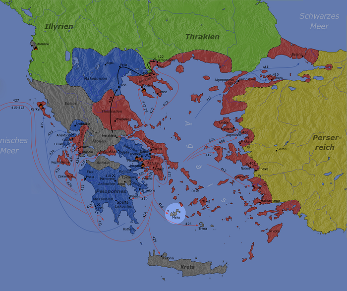
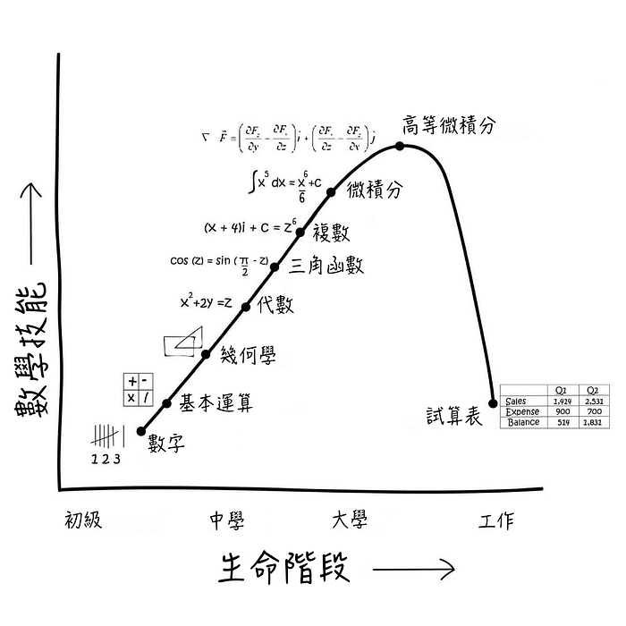
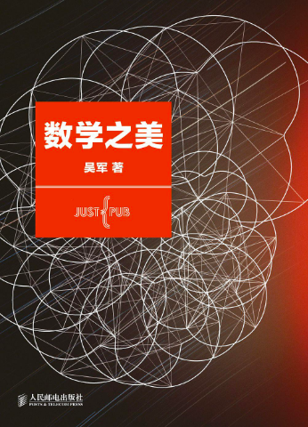
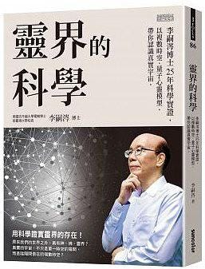
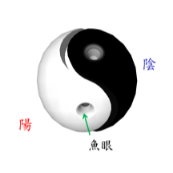

## 新聞

春節期間，除了「華航罷工」的新聞之外，另有一則「[抽不出國運籤](https://www.cna.com.tw/news/firstnews/201902050089.aspx)」吸引眾人目光。

雖然[網路上](https://www.youtube.com/watch?v=FKy8Eb0JasM)已經有人嘗試去解釋其機率的合理性，但是作為茶餘飯後的話題來看，今年沒有「國運」這件事，還是有八卦價值的。

> 中華民國即將結束？

台北市長柯文哲在《[閱讀城市](https://www.youtube.com/watch?v=Tiiw0tkcJ3I)》節目上，透過「科學談政治」這個主題，提出了許多有趣的觀點。（細胞死亡、磁吸效應、草履蟲的生態競爭⋯⋯）

其中，柯 P 認為想搞懂兩岸與國際外交的人，一定要去研究「修昔底德陷阱」和「米洛斯對話」這兩篇故事。

[修昔底德](https://zh.wikipedia.org/zh-tw/%E4%BF%AE%E6%98%94%E5%BA%95%E5%BE%B7)是古希臘的歷史學家， 著有《[伯羅奔尼撒戰爭史](https://zh.wikipedia.org/wiki/%E4%BC%AF%E7%BD%97%E5%A5%94%E5%B0%BC%E6%92%92%E6%88%98%E4%BA%89%E5%8F%B2)》一書，描述雅典與斯巴達之間的爭戰。

在談論美中貿易戰的時候，許多人會引用「修昔底德陷阱」來表示兩大強權之間必有一戰，但對台灣來說，最重要的不是美中終有一戰，而是自身該如何在強權中狹縫求生。

米洛斯是一個島國。經濟上，依賴與雅典的海上貿易；血統上，則與斯巴達較為親近；政治上，米洛斯維持獨立與中立。在兩強爭霸期間，儘管雅典曾要求其上貢，但礙於當時正與斯巴達打得如火如荼，故沒有餘力去理會米洛斯。

隨著雅典與斯巴達雙方簽下《[尼西阿斯和約](https://zh.wikipedia.org/wiki/%E5%B0%BC%E8%A5%BF%E9%98%BF%E6%96%AF)》休戰之後，暫時有了喘息的空間，便向米洛斯出兵。米洛斯最後的命運極其悲慘，不但被滅了國，雅典人還殘酷地處決了米洛斯的所有成年男性，並把女性與小孩都賣為奴隸。

雅典大軍來到米洛斯島之後，派出了使者與米洛斯的領導人談判，這就是著名的「米洛斯對話」。

米洛斯方提出了許多天真的想法（是友非敵、普世價值、老天有眼、斯巴達拯救論⋯⋯），都可以在現今台灣政治對兩岸關係的態度上看見似曾相識的影子。

國家戰略的思維，與一般人際交往不同。我們過去的教育是「王何必曰利？亦有仁義而已矣」，但是世間的運轉一切只看實力。米洛斯的故事，被譽為是現實主義的最早理論基礎。

有興趣的人，可以深入閱讀這篇《[藍弋丰專欄：別只談修昔底德陷阱 台灣更要懂「米洛斯對話」](https://www.upmedia.mg/news_info.php?SerialNo=48759)》。

## 文摘

上圖反應了大部分大學畢業的人在學校學習了大量的數學知識，但是實際工作後能用上 Excel 就不錯了的現象。許多人因此從中解讀得出「數學無用論」的結果。

我在大學學習[線性代數](https://zh.wikipedia.org/zh-tw/%E7%BA%BF%E6%80%A7%E4%BB%A3%E6%95%B0)時，實在想不出這門課除了告訴我如何解線性方程外，還能有什麼別的用途。關於矩陣的許多概念，譬如[特征值](https://zh.wikipedia.org/wiki/%E7%89%B9%E5%BE%81%E5%80%BC%E5%92%8C%E7%89%B9%E5%BE%81%E5%90%91%E9%87%8F)等，更是脫離日常生活，看不到可以應用的地方。當時修這些課，完全是為了取得學位。我想，今天大部分的學生恐怕也有過類似的經歷。直到後來從事了軟體工程相關的工作一段時間之後，我才發現數學家們提出的那些概念和算法，是有實際應用的意義的。

### 《數學之美》

這本書介紹了 Google 技術背後的一些數學原理，例如：搜尋引擎、語音辨識、語言翻譯、路線規劃、新聞分類和機器學習等⋯⋯。

其中新聞分類這個章節就用到了「[特徵向量](https://zh.wikipedia.org/wiki/%E7%89%B9%E5%BE%81%E5%80%BC%E5%92%8C%E7%89%B9%E5%BE%81%E5%90%91%E9%87%8F)」和「[餘弦定理](https://zh.wikipedia.org/wiki/%E9%A4%98%E5%BC%A6%E5%AE%9A%E7%90%86)」來描述文章之間的相似性，然後透過「[奇異值分解](https://zh.wikipedia.org/wiki/%E5%A5%87%E5%BC%82%E5%80%BC%E5%88%86%E8%A7%A3)」來處理電腦的大量矩陣運算，漂亮地解決了新聞自動化分類的問題。

技術分為「術」和「道」兩種，具體的做事方法是術，做事的原理和原則是道。《數學之美》這本書的目的是講道而不是術。很多具體的技術很快會從獨門絕技落伍至雕蟲小技，只追求術的人一輩子會工作得很辛苦。只有掌握了技術的本質和精髓才能永遠游刃有餘。很多人（包括我）只想學習「術」來走捷徑。但是真正做好一件事沒有捷徑，離不開一萬小時的專業訓練和努力。

或許除了「數學無用論」之外，我們還可以思考下一代是否應該重複現在的學習方式？又或者下一次你要進入一個新的知識領域時應該採取怎樣的策略？例如：[問題導向學習](https://zh.wikipedia.org/wiki/%E5%95%8F%E9%A1%8C%E5%B0%8E%E5%90%91%E5%AD%B8%E7%BF%92)（Problem Based Learning）、[專題式學習](https://zh.wikipedia.org/wiki/%E5%B0%88%E9%A1%8C%E7%A0%94%E7%BF%92)（Project Based Learning）。

---

二十世紀最成功的兩大物理理論，一個是「[相對論](https://zh.wikipedia.org/zh-tw/%E7%9B%B8%E5%AF%B9%E8%AE%BA)」，用來描述宏觀宇宙的重力；另一個則是「[量子力學](https://zh.wikipedia.org/wiki/%E9%87%8F%E5%AD%90%E5%8A%9B%E5%AD%A6)」，用來描述微觀世界的基本粒子、原子及分子。

但是量子力學目前存在最大的爭議有三項：

1. 描述粒子行為的[波函數](https://zh.wikipedia.org/wiki/%E6%B3%A2%E5%87%BD%E6%95%B0)解或[量子場論](https://zh.wikipedia.org/wiki/%E9%87%8F%E5%AD%90%E5%9C%BA%E8%AE%BA)中的量子場都是複數函數，沒有人知道複數代表的含義，因為複數不能被測量，能被測量的物理量必須是實數。
2. 任何粒子或物體的運動必須滿足[決定論](https://zh.wikipedia.org/wiki/%E6%B1%BA%E5%AE%9A%E8%AB%96)的方程式（[薛丁格方程式](https://zh.wikipedia.org/wiki/%E8%96%9B%E5%AE%9A%E8%B0%94%E6%96%B9%E7%A8%8B)或[狄拉克方程式](https://zh.wikipedia.org/wiki/%E7%8B%84%E6%8B%89%E5%85%8B%E6%96%B9%E7%A8%8B%E5%BC%8F)）。也就是在時間為零的時候，如果知道粒子的位置及速度，那麼時間 t 的時候，粒子的位置及速度就可以被計算出來。但是[哥本哈根詮釋](https://zh.wikipedia.org/wiki/%E5%93%A5%E6%9C%AC%E5%93%88%E6%A0%B9%E8%A9%AE%E9%87%8B)卻把波函數的平方當作粒子出現的或然率，非常的不合理。
3. 超光速的[量子糾纏](https://zh.wikipedia.org/wiki/%E9%87%8F%E5%AD%90%E7%BA%8F%E7%B5%90)現象。有連結的兩量子系統，處於混沌不定的[疊加狀態](https://zh.wikipedia.org/wiki/%E6%80%81%E5%8F%A0%E5%8A%A0%E5%8E%9F%E7%90%86)，不論兩者相距多遠，只要其中一個或一部分被儀器測量而確定狀態時，另一個也瞬間被決定，其之間訊息的傳遞是遠超過光速的（違反相對論），因此被愛因斯坦提出 [EPR 悖論](https://zh.wikipedia.org/wiki/%E7%88%B1%E5%9B%A0%E6%96%AF%E5%9D%A6-%E6%B3%A2%E5%A4%9A%E5%B0%94%E6%96%AF%E5%9F%BA-%E7%BD%97%E6%A3%AE%E4%BD%AF%E8%B0%AC)批評為「幽靈般的超距作用」。

### 《靈界的科學》

這本書嘗試用「複數時空」及「量子意識」兩個模型去解釋宇宙中大中小尺度的謎團，像暗物質、暗能量、超光速的量子糾纏、人體特異功能以及意識的本質。

第一個假設：真實的宇宙其實是一個八維的複數時空，除了目前所知的四維實數時空（俗稱陽間）以外，還有一個充滿意識及信息的四維虛數時空（可稱作陰間、信息場或靈界）存在。

第二個假設：複數量子態的虛數 i 就是代表意識。因此意識是一個量子現象，可以稱作量子心靈。

實虛時空雖然為同一複數時空，但是其之間存在實虛障礙（陰陽兩隔），僅能藉由特殊的時空點交換能量，這些連結點都是漩渦狀的時空結構，類似於太極圖上的魚眼結構。

一般物質存在於四維實數時空中，可以由四個座標（x、y、z、t）來定位，描述其運動。但是當物質如基本粒子、光子或物體進入微觀、宏觀量子狀態，必須用複數場來描述其量子狀態時，當複數[物質波](https://zh.wikipedia.org/wiki/%E7%89%A9%E8%B3%AA%E6%B3%A2)出現，物質波不受漩渦尺寸限制，就可以透過漩渦連結點穿隧進入虛數時空。

作者認為虛數時空的意識及無數的信息都具有能量，相當於質量的存在，而這些質量就是[暗物質](https://zh.wikipedia.org/zh-tw/%E6%9A%97%E7%89%A9%E8%B4%A8)（dark matter），具有引力的特性，造成螺旋銀河的旋轉速度到了銀河邊緣仍不下降的現象。另外，我們的宇宙充滿了一種能量可以抵抗銀河間的萬有引力，導致宇宙正在加速膨脹，這股能量叫做[暗能量](https://zh.wikipedia.org/zh-tw/%E6%9A%97%E8%83%BD%E9%87%8F)（dark energy），一般被認為是由廣義相對論中的宇宙常數所提供，也就是真空能量所產生的斥力。但是作者認為是因為複數時空中實數時空與虛數時空經由數量巨大的漩渦連結點緊密黏在一起，虛數時空的膨脹可以帶動實數空間的加速膨脹，導致暗能量的出現。

在虛數時空中，物質波的波速 u 與實數時空中物體的速度 v 滿足此方程式 `uv = c^2`，c 為光速。當物體在實數空間的速度小於光速時（v < c），則物質波的波速在虛數時空的速度會大於光速（u > c），因此量子狀態的物質波可以很快地傳布到廣袤的虛數空間。因為兩個量子都經過自旋通道鑽入了虛空，虛空裡的信息交換及傳導是可以超光速的，因此並不違反相對論。

意識在大腦裡也是一個量子現象，但意識只是一個抽象的概念，這些內容在物理上是以什麼方式呈現？就像[神經元微管束](https://zh.wikipedia.org/wiki/%E5%BE%AE%E7%AE%A1)耦合進入宏觀的量子狀態，虛數 i 的出現，表示意識出現了，可以用複數函數來描述。由量子力學的[哥本哈根詮釋](https://zh.wikipedia.org/zh-tw/%E5%93%A5%E6%9C%AC%E5%93%88%E6%A0%B9%E8%A9%AE%E9%87%8B)來看複數波函數，代表粒子出現的機率，也就是粒子在實數空間出現機率的幾何分佈，似乎這個在實數空間的幾何分佈代表了意識的內容，也就是實數部分所導致的時空形變（彎曲或扭曲的幾何結構）就是心靈的內容，虛數抽象意識掃描形變的實數時空形成的心物合一的複數量子狀態就形成心靈的內容。

神奇的是決定物體空間幾何分佈的是廣義相對論，虛數的意識來自量子力學，所以結合量子力學與廣義相對論的時空結構後所描述的物理現象竟然就是意識的內涵，原來科學的最後疆界就是在於結合廣義相對論及量子力學。

牛頓經典物理在被相對論和量子力學兩大現代物理理論推翻之後，在[普朗克長度](https://zh.wikipedia.org/wiki/%E6%99%AE%E6%9C%97%E5%85%8B%E9%95%B7%E5%BA%A6)這個尺度下，解釋大質量的廣義相對論與解釋微觀尺度的量子力學存在衝突，許多物理學家都試圖提出[大一統理論](https://zh.wikipedia.org/wiki/%E5%A4%A7%E7%BB%9F%E4%B8%80%E7%90%86%E8%AE%BA)來解決這個衝突（例如[超弦理論](https://zh.wikipedia.org/wiki/%E8%B6%85%E5%BC%A6%E7%90%86%E8%AB%96)），或許「複數時空」這個模型也不失為一個探討方向。

---

到這裡，上面提到的腦洞大概只占《靈界的科學》三分之一的內容而已，而此書真正想解釋的是「手指識字」這項特異功能的研究成果。由於超出了現代科學的框架，作者必須忍受主流科學的霸凌與壓迫，與四百年前伽利略所面對的宗教壓迫是沒有兩樣的，只是他面對的是生命的死刑，而作者面對的是主流科學界的各種攻擊。

礙於篇幅的關係，推薦有興趣的人可以買一本，當科幻讀物來閱讀或許也不錯。

---

最後，既然聊了意識又提到了科幻，就順便推薦一部前陣子上映的電影 — — 《[艾莉塔：戰鬥天使](https://zh.wikipedia.org/wiki/%E8%89%BE%E8%8E%89%E5%A1%94%EF%BC%9A%E6%88%B0%E9%AC%A5%E5%A4%A9%E4%BD%BF)》。

[詹姆斯·卡麥隆](https://zh.wikipedia.org/wiki/%E8%A9%B9%E5%A7%86%E6%96%AF%C2%B7%E5%8D%A1%E6%A2%85%E9%9A%86)歷時 20 年、耗資 2 億美金、組建上千人團隊、動用 3 萬多台電腦，就只是為了向全世界安利自己喜歡的日本漫畫 — — 《[銃夢](https://zh.wikipedia.org/wiki/%E9%8A%83%E5%A4%A2)》。

作為「[桶中之腦](https://zh.wikipedia.org/wiki/%E7%BC%B8%E4%B8%AD%E4%B9%8B%E8%84%91)」系列的《銃夢》裡，作者提出了一個問題：「廢鐵城的人有著人類的大腦，卻沒有人類的軀體；上界的人有著人類的軀體，卻沒有人類的大腦。所以到底誰才是人類？」。

放眼所有「日系[賽博龐克](https://zh.wikipedia.org/wiki/%E8%B5%9B%E5%8D%9A%E6%9C%8B%E5%85%8B)」，也僅有三部贏得了世界級的廣泛聲譽：士郎正宗的《[攻殼機動隊](https://zh.wikipedia.org/wiki/%E6%94%BB%E6%AE%BC%E6%A9%9F%E5%8B%95%E9%9A%8A)》，木城雪戶的《[銃夢](https://zh.wikipedia.org/wiki/%E9%8A%83%E5%A4%A2)》，以及傳言 2020 年上映，大友克洋的《[阿基拉](https://zh.wikipedia.org/wiki/%E4%BA%9A%E5%9F%BA%E6%8B%89)》。
