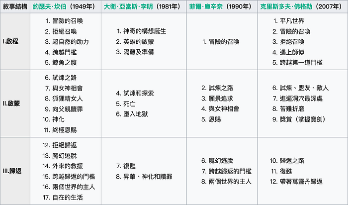
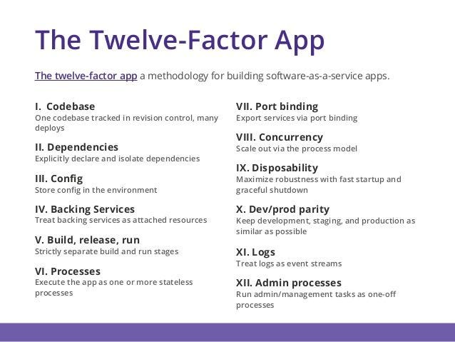
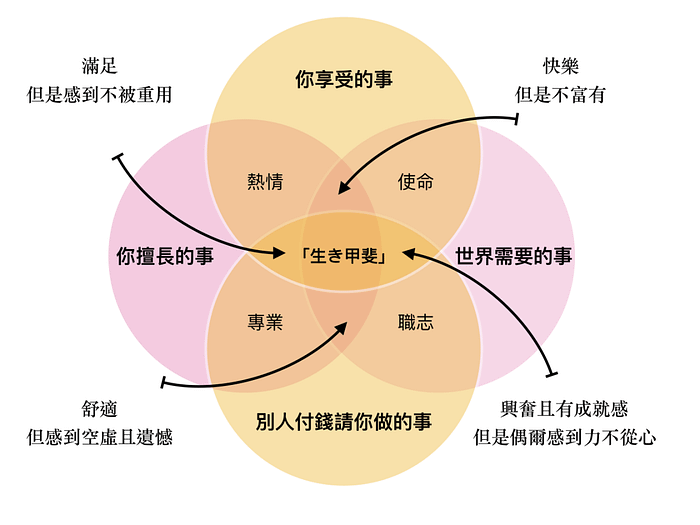

## 文摘

### 《千面英雄》

作者 Joseph Campbell 是美國著名的神話研究學者。他創造了一系列影響力極大的神話學巨作，其中《千面英雄》被好萊塢列為必讀書目，是眾多影視作品的靈感之源。以《星際大戰》導演 George Lucas 為代表的好萊塢導演，還有作家、藝術家和遊戲編劇們把它奉為神書。

通過《千面英雄》這本書，Joseph Campbell 提出了一個叫做「單一神話」的觀點。他認為古往今來的英雄在不同的時空背景下有著不同的面孔，這個英雄可以是耶穌、穆罕默德、佛陀，也可以是每個希望在人生旅程中接受考驗的獨立個體。

而英雄的成長都遵循著同樣的模式，需要經歷三個階段，包括啟程、啟蒙和回歸。Joseph Campbell 把這個模式總結為一套「[英雄之旅](https://zh.wikipedia.org/wiki/%E8%8B%B1%E9%9B%84%E6%97%85%E7%A8%8B)」模型。

這讓我想起軟體工程師在建構 [SaaS](https://zh.wikipedia.org/wiki/%E8%BD%AF%E4%BB%B6%E5%8D%B3%E6%9C%8D%E5%8A%A1)（軟體即服務）的時候，也有一套被遵循的套路 — — [The Twelve-Factor App](https://12factor.net/)。

《千面英雄》除了是對這個世界有史以來的神話故事的總結。也是一套管理人生和講故事的原則。許多人把它當作一種人生指南，用來在實際的人生旅途當中預測不可避免的高低起伏，確保任何時候都保有戰勝困境的英雄之心。

比起「英雄之旅」，或許唐鳳從 Git 總結出來的「工程師之旅」更深得我心：

1. 面對問題，首先 Fetch（接受它）
2. 接下來，要跟自己的想法 Merge（面對它），解決可能產生的衝突
3. 解決衝突之後，才能 Commit（處理它）
4. 最後 Push（放下它），一旦 Release 之後，它就不是你的了

## 本周圖片

### 生き甲斐

有時候，仰望星空，我們都會思考，自己努力工作，是為了什麼？

是為了賺更多的錢？還是為了幫助更多的人？又或者是為了過上一個美好的生活？

日文「[生き甲斐](https://ja.wikipedia.org/wiki/%E7%94%9F%E3%81%8D%E7%94%B2%E6%96%90)」的意思，英文可以解讀為 The Reason for Living，而中文則是「生命的意義」。

眾所皆知，日本人的平均壽命在世界上名列前茅。而其中一個主要原因，就是「生き甲斐」這個概念貫穿了他們每一個人的思想，使他們每一天都感覺自己的生活充滿了價值。

那我們又要怎樣找到自己的「生き甲斐」呢？

**一、你享受的事**

你喜歡做的事情是什麼？你的興趣是什麼？

如果做的是自己熱愛的事情，能量就會源源不絕，工作效率也會更高。

好好的想一想，是什麼事情讓你在做的當下，會感受到快樂、愉悅、成就感，甚至感覺到時間快速飛逝（神馳、心流狀態）。

或許可以從興趣入手，應該多多嘗試，可能不會一下子就找到你真正熱愛的事情，但至少你會知道什麼是你不想要的。

**二、世界需要的事**

你想要看到這個世界、這個社會的改變是什麼？

像是你有某方面的知識或能力，你想要傳播給更多的人，讓他們的生活變得更好。

只要是一切為了別人去做的事情都可以。

因為這些事，會讓你感覺到自己的重要性，並且更加有動力的生活下去。

**三、別人付錢請你做的事**

有錢不一定買得到快樂，但沒錢一定不會很快樂。

如果你一直會為了生存而煩惱，你怎樣還能有快樂的生活呢？

所以，能夠賺錢的事，也是「生き甲斐」重要的一部份。

**四、你擅長的事**

不是在特定領域的能力，而是可轉移的技能。是在不同工作中都可以用上的能力，而且是可以不斷累積的。

如果你還不知道自己在行的能力是什麼，網路上也有很多能力測驗讓你參考，或是可以問問身邊的家人和朋友，相信他們會比你更了解你自己。

透過這 4 個交疊圈組成，可以讓你知道自己目前是處在一個怎麼樣的處境。並且告訴你，在你身上有那一個部分是必須做出改變的。

如果你想要讓你的人生充滿意義（生き甲斐），時時刻刻都精彩快樂的話，你要做的事就是那些你熱愛的、並且會越來越擅長的事情，以及那些可以賺錢和世界需要的事情。

## 本周金句

> 為什麼艾西莫夫老了還有大量收入，其他大多數人就沒有呢？原因是普通人的收入，來自出賣自己的時間，老了不工作，自然就沒收入了。但是，艾西莫夫的收入來自於他的書，這些著作一再重版，為他帶來了一年比一年多的版稅收入。

> 這件事的啟示就是，如果退休以後，還想有穩定的收入保障，最好的方式就是你必須擁有資產。版權就是一種產生收入的資產。其他類型的資產包括股權、房地產、自然資源、知識產權等等。總之，年輕時就必須明確，不能僅僅依靠出賣自己的時間換取收入，因為時間是一種線性資源。想要更多的收入，只能出賣更多的時間，這對你不利。你的工作目標不應完全是高收入，更重要的是必須積累資產。

> 你不應該進入那種行業，做了兩年的人可以和那些已經做了二十年的人，具有一樣的工作效率。

> 你的目標應該是，為你的現狀：財產、銷售額、影響力等等⋯⋯添加一個零。

> ―― 阮一峰《[每周分享第 45 期](http://www.ruanyifeng.com/blog/2019/03/weekly-issue-45.html)》
