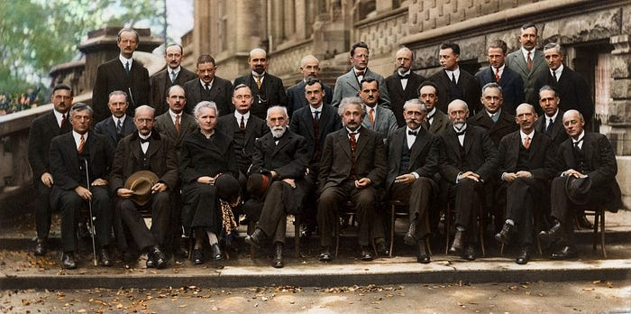
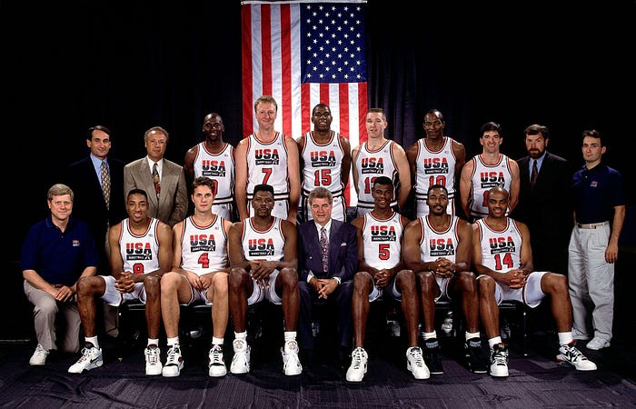
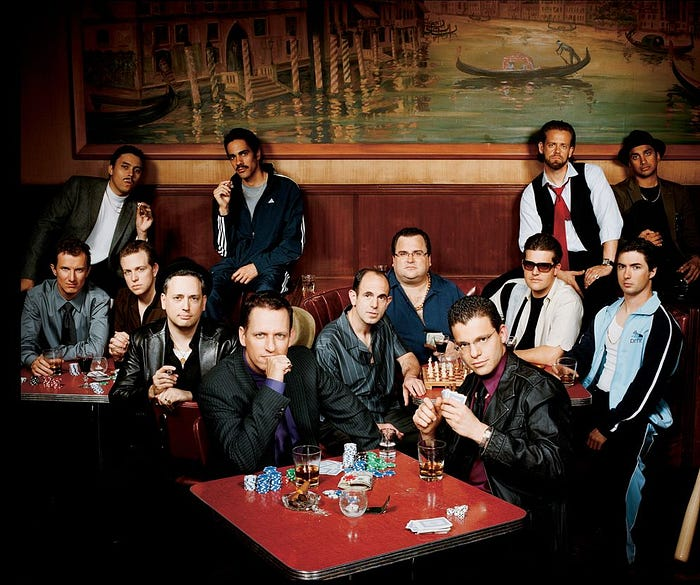
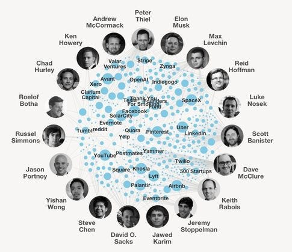

下圖是 [Reddit](https://zh.wikipedia.org/wiki/Reddit) 論壇上的一位[大神](https://www.reddit.com/r/pics/comments/z7a7c/einstein_bohr_curie_more_at_solvay_conference/)，把近一世紀前的「[第五次索爾維會議](https://zh.wikipedia.org/wiki/%E7%B4%A2%E5%B0%94%E7%BB%B4%E4%BC%9A%E8%AE%AE)」黑白照片給上色後的結果。

[索爾維會議](https://zh.wikipedia.org/wiki/%E7%B4%A2%E5%B0%94%E7%BB%B4%E4%BC%9A%E8%AE%AE)的全名是「索爾維國際物理學化學研究會」，是由企業家[索爾維](https://zh.wikipedia.org/wiki/%E6%AC%A7%E5%86%85%E6%96%AF%E7%89%B9%C2%B7%E7%B4%A2%E5%B0%94%E7%BB%B4)於 1912 年在比利時布魯塞爾創辦的一個學會。通過邀請世界著名的物理學家和化學家對前沿問題進行討論的會議。每三年舉辦一次。在物理學的發展史上占有重要地位。

當中最著名的一次索爾維會議是 1927 年召開的第五次索爾維會議。此次會議主題為「電子和光子」，世界上最主要的物理學家聚在一起討論量子理論。

這次會議上最令後世津津樂道的故事，當屬[愛因斯坦](https://zh.wikipedia.org/zh-tw/%E9%98%BF%E5%B0%94%E4%BC%AF%E7%89%B9%C2%B7%E7%88%B1%E5%9B%A0%E6%96%AF%E5%9D%A6)和[波耳](https://zh.wikipedia.org/wiki/%E5%B0%BC%E5%B0%94%E6%96%AF%C2%B7%E7%8E%BB%E5%B0%94)針對「[不確定性原理](https://zh.wikipedia.org/wiki/%E4%B8%8D%E7%A1%AE%E5%AE%9A%E6%80%A7%E5%8E%9F%E7%90%86)」的鬥嘴橋段：

> 愛因斯坦：「波耳，上帝從不擲骰子」
> 波耳：「愛因斯坦，不要告訴上帝應該怎麼做」

參加這次「第五次索爾維會議」的 29 人中，有 17 人最後獲得了諾貝爾獎。

這讓我想起 1992 年奧運會的籃球項目，美國隊第一次由 NBA 球星出征，號召了籃球世界最強的 12 個人，組成了這支籃球史上最傳奇的「[夢幻隊](https://zh.wikipedia.org/wiki/1992%E5%B9%B4%E5%A4%8F%E5%AD%A3%E5%A5%A7%E6%9E%97%E5%8C%B9%E5%85%8B%E9%81%8B%E5%8B%95%E6%9C%83%E7%BE%8E%E5%9C%8B%E7%94%B7%E5%AD%90%E7%B1%83%E7%90%83%E9%9A%8A)」(Dream Team) 。

好奇之下，想說 IT 界有沒有類似的群星合照？（例如 [Linus](https://zh.wikipedia.org/wiki/%E6%9E%97%E7%BA%B3%E6%96%AF%C2%B7%E6%89%98%E7%93%A6%E5%85%B9)、[John Carmack](https://zh.wikipedia.org/wiki/%E7%B4%84%E7%BF%B0%C2%B7%E5%8D%A1%E9%A6%AC%E5%85%8B)、[Jeff Dean](https://zh.wikipedia.org/wiki/%E5%82%91%E5%A4%AB%C2%B7%E8%BF%AA%E6%81%A9) 等等⋯⋯）

查了一下，雖然算不上電腦科學家（敲程式的都不喜歡拍照？），但大概也是比較有名的合照，他們就是「[PayPal 黑手黨](https://zh.wikipedia.org/wiki/PayPal%E9%BB%91%E6%89%8B%E9%BB%A8)」。

PayPal 黑手黨（PayPal Mafia）是指一群前 [PayPal](https://zh.wikipedia.org/zh-tw/PayPal) 員工。他們在離開 PayPal 再次創業建立的企業包括 Tesla、LinkedIn、YouTube 和 Yelp。其中的三個成員，包括[馬斯克](https://zh.wikipedia.org/wiki/%E4%BC%8A%E9%9A%86%C2%B7%E9%A9%AC%E6%96%AF%E5%85%8B)後來都成為了億萬富翁。

PayPal 黑手黨是 2001 年網際網路泡沫破滅後，面向消費者網際網路公司重新崛起的代表。

他們成功的背後，除了在 PayPal 時期的學習、矽谷的環境，以及各自技能的多樣性之外，最主要的原因在於他們擁有「[八叛徒](https://zh.wikipedia.org/wiki/%E5%85%AB%E5%8F%9B%E9%80%86)」的矽谷基因。離開 PayPal 後，在激烈競爭的環境下，儘管經歷挫折，仍然維持強烈且持久的情誼，互相支援和信任，一起共同奮鬥。

在矽谷還沒有誕生之前，全美國（或全世界）的叛逆者們都喜歡往矽谷地區跑，因為那裡遠離美國東部的政治、文化和金融中心，更遠離歐洲。

不喜歡美國傳統文化的人就跑到舊金山灣區（當時還不叫矽谷），通過文藝的形式（[嬉皮](https://zh.wikipedia.org/wiki/%E5%AC%89%E7%9A%AE%E5%A3%AB)），或者政治的形式（抗議）來實現他們改造世界的夢想。

這些充滿怪想法中的一些人是搞技術的，天天琢磨著顛覆現有產業，最終成功創辦出了一間又一間小公司。

科技實際上只是這些想改變世界的叛逆者們的工具而已。
