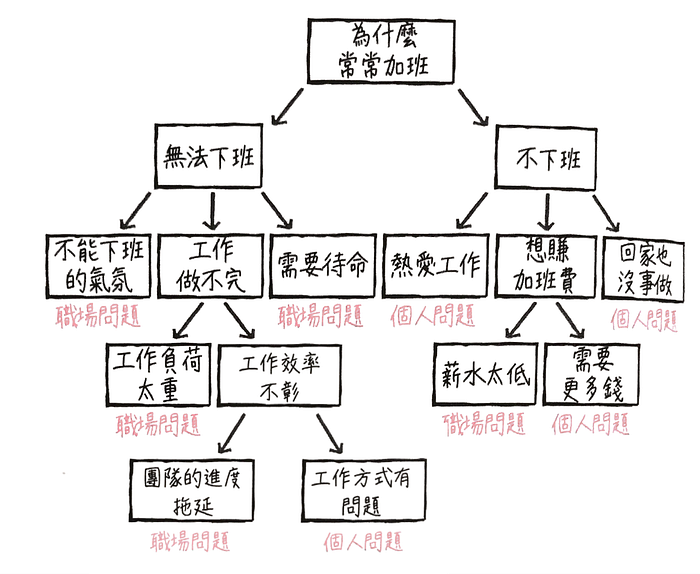
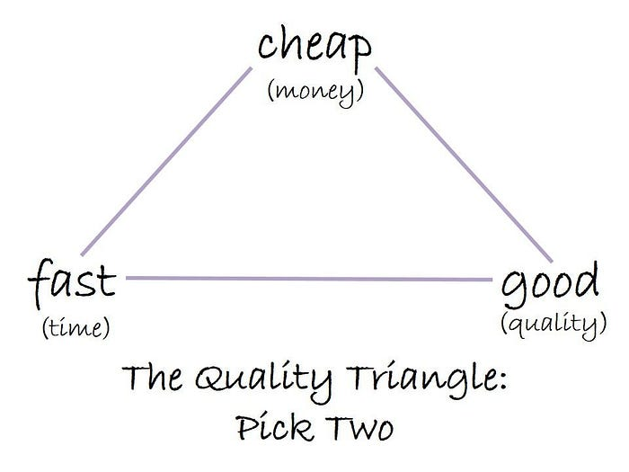
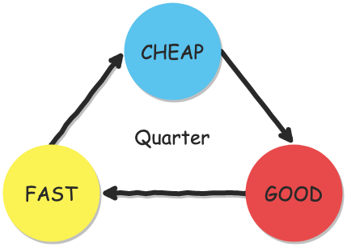
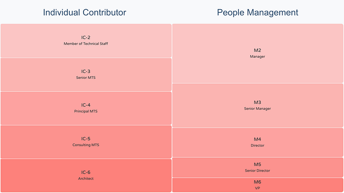
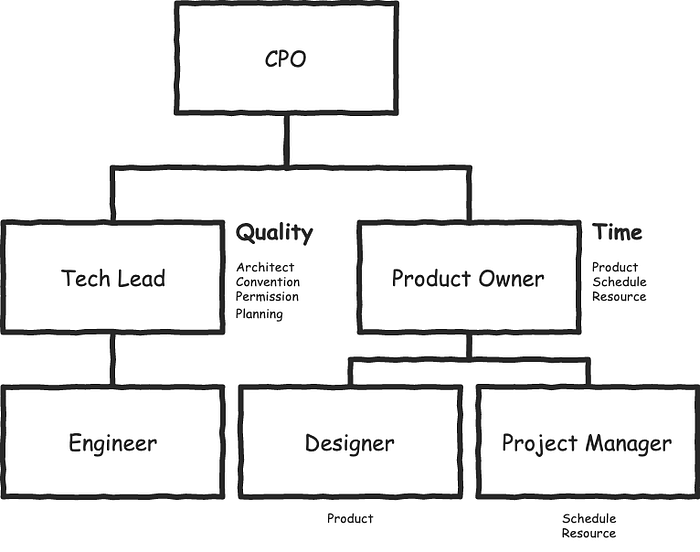
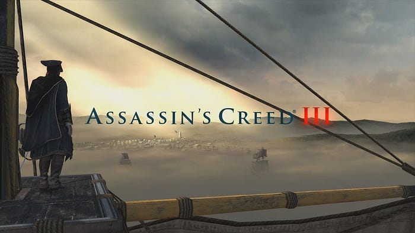

前陣子在書店架上看見一本書，書名是《最後下班的人，先離職》。

雖然標題有點殺人，但是翻了幾頁之後，還是勾起了我出社會之後第一份工作的一些回憶，那段總是最後一個關辦公室燈火的日子，雖然最後不是因為這個理由離職，但現在回想起來，真的不健康。

換了一份工作之後，開始注重起「時間管理」，學習如何在有限的時間內，完成無限的任務。但是最近，有位同事過不了這個檻，離職了。

所以想藉著這篇文章，討論什麼樣的組織架構、人力配置、合作方式，才適合快速擴張中的新創公司。

## 為什麼常常加班？

大部分的人認為，超時加班是公司或管理階層該解決的問題，但員工其實也是當事者之一。

要解決這個問題，就必須先掌握「為什麼常常加班？」的本質原因。

加班的理由通常可分成兩大項，首先是因為某些緣故，導致想下班也「無法下班」，其次是其實可以下班，卻「不下班」。

先就「無法下班」來思考。一般而言，會造成這種現象的理由可能包括「不能下班的氣氛」（例如最近很火的 [996](https://zh.wikipedia.org/wiki/996%E5%B7%A5%E4%BD%9C%E5%88%B6)）、「工作做不完」、「需要待命」。

其中「工作做不完」這點似乎還能繼續探討背後的原因。比如「工作負荷太重」，任務多到在上班時間內做不完。另一個原因可能是工作量正常，但是「工作效率不彰」所導致，可能是「團隊的進度拖延」，也可能是個人的「工作方式有問題」。

接著針對「不下班」的問題，把所有想得到的理由全部列出來。「熱愛工作」、「想賺加班費」、「回家也沒事做」。這三個原因之中的「想賺加班費」，有可能是因為「薪水太低」，或是薪水不錯，但「需要更多錢」這兩個理由。

總結所有原因或理由整理之後可以發現，在各種常常加班的原因之中，摻雜著「職場問題」與「個人問題」。

---

本文**不探討**諸如「熱愛工作」之類的個人問題（熱愛工作你還會離職？）。

焦點放在職場問題：

* 不能下班的氣氛
* 需要待命
* 工作負荷太重
* 團隊的進度拖延
* 薪水太低

## 三角貿易

三角貿易（英文：triangle trade）起源於 16 世紀的歐洲。最著名的是歐洲，西非以及美洲之間的大西洋三角貿易：

* 歐洲 → 西非：酒精、軍火、紡織品等工業製品
* 西非 → 美洲：奴隸
* 美洲 → 歐洲：貴金屬、礦石、蔗糖、菸草、咖啡、可可、糧食等農產品及原材料

回來看 KPI 這件事，一間公司的績效量化指標通常也可以歸類為三種，剛好對應專案管理難題的金三角：

* 品質 = 要好
* 時程 ＝ 要快
* 營收 = 要便宜（營收升高，相對成本就降低）

因此，我建議可以將團隊分為三個 team：

* Cheap Team → 負責替公司帶來營收（money）
* Good Team → 負責解決產品品質問題（quality）
* Fast Team → 負責加速公司發展（time）

Cheap Team 負責事項：

* 公司長期目標（Roadmap）的新功能（Feature）開發

Good Team 負責事項：

* 來自產品本身的需求（例如：客服回報的 Bug）
* 撰寫 Cheap Team 的測試案例
* 重構技術債

Fast Team 負責事項：

* 其它額外的需求（例如：資料查詢、埋追蹤事件、主機掛了）
* DevOps，將日常瑣碎的事務自動化
* 基建設施（Infrastructure）
* 活動網頁

這樣的分配可能會造成「被分配在某個 team 的人沒有成就感」的問題，所以可以根據團隊的特性調整，例如每一季輪調一次，這樣一來可以解決倦怠感，二來透過輪流，不熟悉相關事務的人可以去問最熟的人向他學習，達到溝通交流的目的，也解決「這個業務只有他會，所以每次都找他」的問題。

另外，這個機制也可以解決「需要待命」的問題，例如 Fast Team 要在主機掛掉的時候馬上反應處理，如果每次都是同一批人，那累積久了，他就是下一個離職的那個人。

如果有的人只喜歡做某件事，例如 DevOps，不喜歡做新功能，那也可以不參與輪調機制，但必須專注該項業務，否則可能會造成「團隊的進度拖延」問題。

---

解決了「需要待命」和「團隊的進度拖延」的問題之後，接下來看「薪水太低」與「工作負荷太重」的問題。

加薪一般來說有兩種方法：

1. 增加底薪
2. 增加獎金的抽成比例

而這兩種方法的都需要靠「晉升」才能辦到。

目前比較主流的晉升體系是「雙通道」，根據員工的適才適性，分成兩種管道：

1. 專業方向的 Individual Contributor，簡稱 IC
2. 管理方向的 People Management，簡稱 M

以 Oracle 這間公司為例，IC-3 的資深工程師可以往 IC-6 的架構師發展，M2 的 Manager 可以往 M6 的 VP 努力前進。

這一切看起來都很美好，喜歡搞技術的，可以持續專研精進自己；擅長與人溝通、協調資源能力強的人，可以往管理職發展。

但是亞洲的職場環境，通常鼓勵員工往管理職發展，一來獎金分配的比例比較高，二來職稱也比較好看（經理、總裁、總監聽起來比工程師、架構師還高大尚）。

導致許多 IC 紛紛往 M 發展，造成原本個性不適合管理人的員工遭遇「彼得原理」，結果就是：

1. 擠擠一堆 M 在那出一張嘴，沒人做事的窘境
2. 一切自己來，最後出現「工作負荷太重」的問題

而要解決這兩點問題，只有走上「淘汰」或「離職」兩條路，造成管理職位出現空缺需要填補，然後還是回到鼓勵大家應該往管理職發展的惡性循環。最後出現類似「〇〇歲還是工程師沒升管理職，這個人是不是有什麼問題」之類的價值觀。

我不否認管理職的重要性，但是領導能力強的人本來就很稀缺，如果職場的制度是鼓勵你往管理晉升，而不是留住有貢獻價值的人，當一個不適合 M 職能的 IC 站上 M，有可能賠了夫人又折兵。

## 雙首長制

每逢選舉時日，這個國家的在野黨候選人就會提出要廢除「[雙首長制](https://zh.wikipedia.org/wiki/%E5%8D%8A%E6%80%BB%E7%BB%9F%E5%88%B6)」，主張改成「[總統制](https://zh.wikipedia.org/wiki/%E6%80%BB%E7%BB%9F%E5%88%B6)」或「[內閣制](https://zh.wikipedia.org/wiki/%E8%AD%B0%E6%9C%83%E5%88%B6)」。但是政黨輪替之後往往就不了了之，因為當總統實在太爽了，位於行政及立法之上，可以不受立法限制。

扯遠了⋯⋯，關於雙首長制的更多缺點，請參見「[維基百科](https://zh.wikipedia.org/wiki/%E5%8D%8A%E6%80%BB%E7%BB%9F%E5%88%B6)」。

如果說「三角貿易」解決的是來自 PO 右側，屬於外部需求的「工作負荷太重」問題，那麼接下來要提到的「雙首長制」組織架構，是我認為可以解決 PO 左側，屬於來自工程師給予的「工作負荷太重」的一種方法。

以 CPO 為首，產品開發團隊主要由 PO 和 Tech Lead 帶領，分別負責產品時程與品質的管理，一個專注人、一個專注事。

PO 的負責範圍：

* 產品設計（掌握使用者要什麼）
* 時程管理（確保任務是在前進的）
* 資源協調（溝通、排除任何會阻礙前進的問題）

Tech Lead 的負責範圍：

* 架構選型
* 風格一致
* 權限控管
* 任務規劃

如果找不到合適的 PO，也可以先從 Designer 搭配 Project Manager 開始，一個負責產品設計，一個管理時程和協調資源。

至於這裡不設立 CTO 的原因，我認為以台灣產業短視近利的尿性來看，還是以 CPO 為主會比較務實。如果是新創團隊，那麼迭代的腳步更快，CTO 與 CPO 並存什麼的更是天方夜譚。我曾經在《[殺雞用牛刀](https://blog.amowu.com/posts/2019-01-21-weekly-006/)》這篇文章探討過 Google 的工程導向文化和 Facebook 產品導向文化，且先不說台灣，可能大部分灣區的新創初期都是在燒錢，很少有時間給你搞技術，隨便一句「先求有再求好」就可以讓你掉棒，至於是不是之後真的會求好，亦或是繼續再求有，就不得而知了，因為很少有新創可以活過五年的。

---

總結一下，離職的原因千百種，其中較常見的理由是「常常加班」。加班的原因主要可以歸納為「個人問題」與「職場問題」兩種類型，本文主要探討幾種職場問題，以及解決方法。

透過「三角貿易」的概念，將團隊劃分成負責加速的 Fast Team，負責品質的 Good Team，以及負責營收的 Cheap Team，解決「要快、要好、要便宜」的三角難題。

Cheap Team 專心開發能為公司帶來營收的新功能，其它額外需求交給 Good Team 和 Good Team 去折騰，避免有團隊成員開發到一半被抓去做其它事的窘境，解決了「團隊的進度拖延」問題。

其中最容易發生「需要待命」的任務限縮在 Fast Team，讓外部人員知道碰到緊急狀況要直接找誰負責，解決 PO「工作負荷太重」的問題。另外透過每一季輪班的機制，避免壓力都扛在幾個人身上，也解決 Engineer「需要待命」的問題。

最後是在 CPO 負責的產品團隊底下，設立了 Tech Lead 和 Product Owner 並行的「雙首長制」，Tech Lead 負責維護開發品質，適合讓喜歡專研技術的 IC 當作晉升目標；Product Owner 負責管理資源和確保產品走在時程上，適合擅長溝通協調的人發展。晉升體系如果完善，就有了明確的努力方向，因為「薪水太低」而離職的人或許也會降低。

至於因為「不能下班的氣氛」而加班的人，我認為還是儘早離職比較好。或許如

阮一峰在他的[文章](http://www.ruanyifeng.com/blog/2019/05/weekly-issue-55.html)中提到的：「程序員要做的不是反對 996，而是提倡遠程辦公。」

## 自由與秩序該如何取捨？

最近在玩《刺客教條》這款遊戲，裡面刺客對抗聖殿騎士的故事不禁讓我有所感悟。

上個世紀，集權專制帶來的慘痛教訓，如今這個世界上的大部分人，似乎都知道絕對秩序的壞處。追求自由，已成了我們這個時代最大的政治正確。

但是，沒有秩序的自由毫無意義，追求片面的自由與追求絕對的秩序同樣危險。

專案的管理方法不斷地推陳出新（Waterfall、Agile、Scrum、Kanban、KPI、OKR），但是團隊的運行卻不總是那麼順利。會不會其實問題是出在人本身而不是管理方法？

