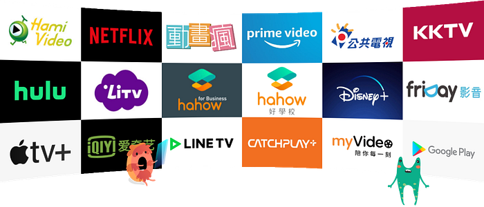
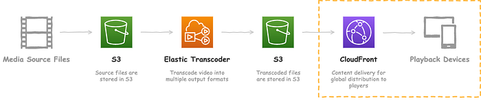
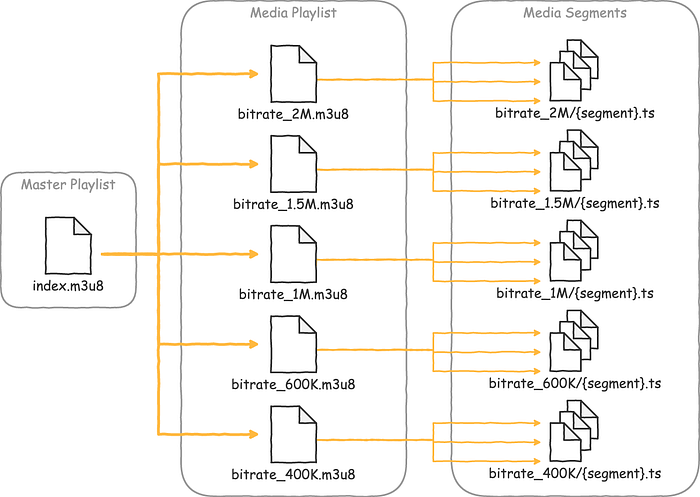
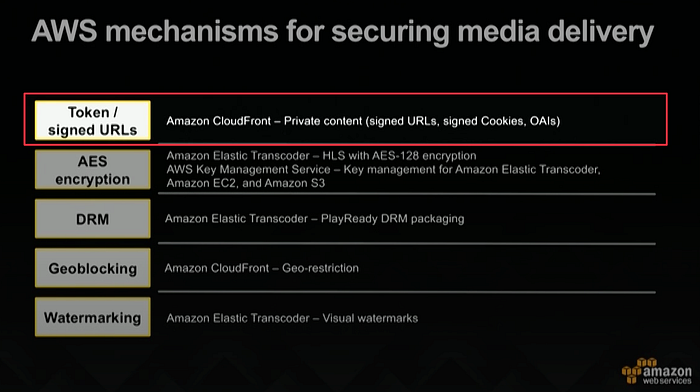
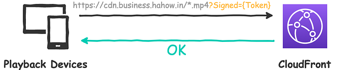
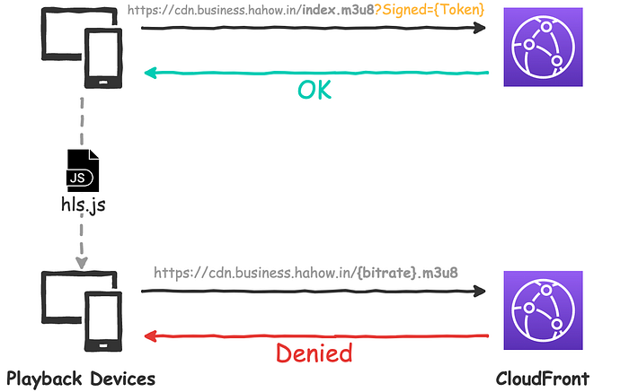
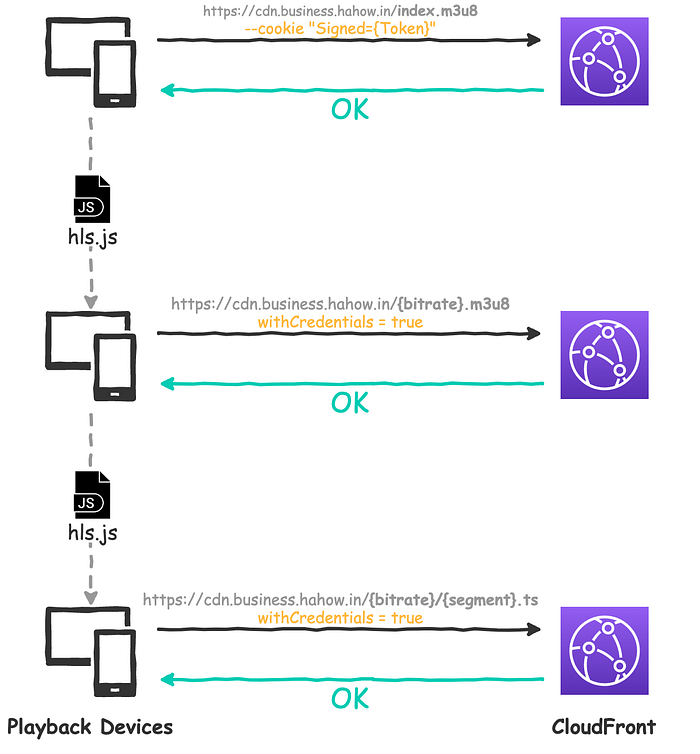
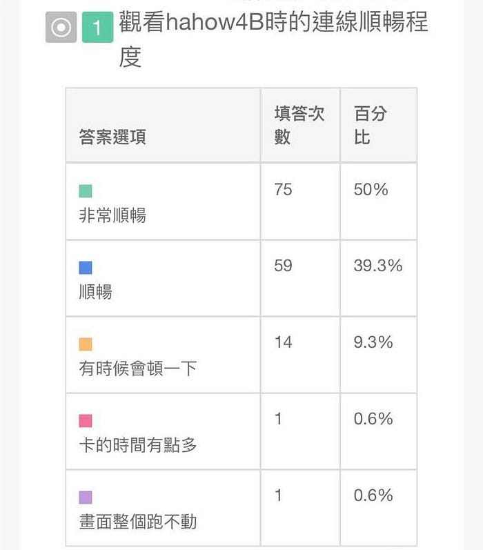
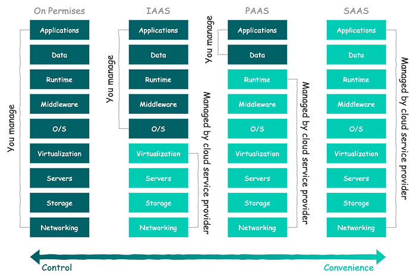

近來因疫情關係，不少 OTT 與線上教育等影音串流平台的流量急劇上升，本篇文章以 Hahow 為例，帶你了解隨選視訊背後的原理以及如何保護數位內容。

這篇文章會介紹 Hahow for Business 是如何透過 AWS CloudFront 的 Signed Cookies 機制來保護 HLS 格式的串流影片。

## 大綱

* 前言
* 什麼是 VOD？
* 什麼是 HLS？
* 如何保護串流內容？
* 什麼是 Signed URLs／Cookies？
* 結論

## 前言

六月初，[Hahow for Business](https://business.hahow.in/) 上線了一個新功能：**影片播放器開始提供不同解析度來源的切換選項**。

其中「自動」的選項，可以根據使用者當前的網速，自動切換適配的解析度。


恰巧，Hahow for Business 自去年六月正式啟動以來，也剛好滿一年。

最初，為了能夠儘快投入市場試水溫，產品開發時程相對吃緊，很多東西都是先求有再求好，所以勢必會留下一些技術債，例如 **VOD** 就是其中之一。

延伸閱讀：

[為何選擇成為一個 Product Owner？](https://citysite1025.medium.com/%E7%82%BA%E4%BD%95%E9%81%B8%E6%93%87%E6%88%90%E7%82%BA%E4%B8%80%E5%80%8B-product-owner-85afa9a4e8fb)

## 什麼是 VOD？

在 Media Streaming（媒體串流）的世界裡，有兩種不同的實作類型：

1. On-Demand Streaming（隨需串流、隨選、點播）
2. Live Streaming（即時串流、直播）

引述自 [AWS 官方的說明](https://aws.amazon.com/tw/cloudfront/streaming/)：

> 使用隨需串流時，影片內容會存放在 Amazon S3 中。**觀眾可以選擇在任何時候觀看影片**，因此稱為「隨需」串流。

> 在即時串流的情況下，您的內容可能是**即時活動**或**全年無休**即時頻道交付。前者的例子包括串流體育賽事、頒獎典禮、重大發表和其他高收視率即時活動的廣播公司和內容整合公司。後者的例子包括希望可在不使用第三方分發平台的情況下，封裝線性即時頻道並透過網際網路直接交付給觀眾的工作室、廣播公司和付費電視服務營運商。

由於 Hahow for Business 的串流媒介是影片（Video），串流類型是 On-Demand Streaming，故稱作 Video on Demand（簡稱 VOD）。

這也是各大 OTT 平台（例如：Netflix、KKTV、愛奇藝等）主要的串流類型。

其它像 Twitch、17 之類的直播平台，就屬於第二種類型。當然，也有兩種類型都提供的平台，例如 YouTube。



Hahow for Business 的 VOD infrastructure 建置在 AWS 上，架構大致如下：


*圖中虛線內容是本文介紹重點*

先快速帶過幾個關鍵服務：

1. 將影片原始檔上傳至 S3 Bucket
2. 透過 Elastic Transcoder 轉檔成指定格式
3. 轉完的影片檔輸出至 S3 Bucket
4. 將輸出的影片部署至 CloudFront（CDN）
5. 客戶端隨需播放影片

這篇文章不會著墨於怎麼架設 AWS 的 VOD，網路上有許多教學文章，也可以查看官方文件。

---

最一開始，我們只有在 Elastic Transcoder 上輸出 1080p MP4 格式的影片。

這會導致兩個問題：「**貴**」與「**慢**」。

對內，串流的檔案越大，需要付出的流量費用就越高。對於口袋不夠深的新創來說，這可能因為商業成本的考量而影響未來的工程決策。

對外，1080p 大小的 MP4 如果在網路環境較差的情況下，影片容易卡在讀取的環節，嚴重影響使用者體驗。

基於上述原因，我們決定將串流的格式從 MP4 換成目前主流的 HLS。

## 什麼是 HLS？

在提到 HLS 之前，先解釋一下什麼是 ABS（自適性串流）：

> 此技術根據即時檢測用戶的頻寬和 CPU 使用率，調整影片流的品質。

> 這需要使用一種可以將單一影片源輸出為多位元速率的編碼器。播放器客戶端依賴可用資源在不同位元速率的流之間切換。結果就是：更少快取、更快的開始播放、為低階和高階連結都提供良好的體驗。 — — 《[自適性串流 — 維基百科](https://zh.wikipedia.org/wiki/%E8%87%AA%E9%81%A9%E6%80%A7%E4%B8%B2%E6%B5%81)》

然後回來看 HLS 的介紹：

> HTTP Live Streaming（縮寫是 HLS）是由蘋果公司提出基於 HTTP 的流媒體網絡傳輸協議。

> 它的工作原理是把整個流分成一個個小的基於 HTTP 的文件來下載，每次只下載一些。當媒體流正在播放時，客戶端可以選擇從許多不同的備用源中以不同的速率下載同樣的資源，允許流媒體會話適應不同的數據速率。在開始一個流媒體會話時，客戶端會下載一個包含元數據的擴充 M3U（m3u8）播放列表文件，用於尋找可用的媒體流。 — — 《[HTTP Live Streaming — 維基百科](https://zh.wikipedia.org/wiki/HTTP_Live_Streaming)》

把它畫成圖之後，感覺大致如下：



HLS 使用副檔名為 m3u8 的檔案作為索引，檔案切片格式為 TS。支援的客戶端包括 iPhone 和 Android 等裝置。至於不支援的瀏覽器，則是可以透過 [hls.js](https://github.com/video-dev/hls.js/) 之類的 library 來實現。同時，HLS 也能夠被用在直播形式。

其它 ABS 還有諸如 Microsoft 的 Smooth Streaming、Adobe 的 HDS 以及 Google 的 MPEG-DASH。

---

使用 Elastic Transcoder 的好處就是，這些主流的轉檔格式，AWS 都已經幫大家建立好 [Presets](https://docs.aws.amazon.com/elastictranscoder/latest/developerguide/system-presets.html) 供直接使用。

原本以為只要將 1080p MP4 的 Preset 修改成 HLS 的 Preset，就可以收工打卡下班了。結果，並沒有想像中這麼簡單。

在測試過程中，我們碰到了 MP4 和 HLS 在內容保護機制上，處理方式不同的問題。

## 如何保護串流內容？

下圖是擷取自 [AWS security media delivery](https://youtu.be/zzeho2uLpHM)，有關「媒體交付安全性」的其中一張投影片：

](./image5.png)
*來源 [https://youtu.be/zzeho2uLpHM](https://youtu.be/zzeho2uLpHM)*

裡面介紹了幾種 AWS 提供的串流內容保護方式，彼此可共存不互斥。由下至上分別是：

* Watermarking
* Geoblocking
* DRM
* AES encryption
* Token / signed URLs

## Watermarking（浮水印）

[Elastic Transcoder 支援在影片轉檔階段，直接將指定圖片（例如公司 logo）印在影格上](https://docs.aws.amazon.com/zh_tw/elastictranscoder/latest/developerguide/watermarks.html)。壞處是可能會遮擋住教學內容（例如 Photoshop 的操作介面）。另一種比較簡單的做法是透過 HTML + CSS，直接在播放器上印出圖片，好處是可受程式控制（例如：位置、透明度等），壞處是幾乎沒有保護效果。

## Geoblocking（鎖地區）

[CloudFront 提供地理限制／封鎖（Geo-restriction）的功能](https://docs.aws.amazon.com/zh_tw/AmazonCloudFront/latest/DeveloperGuide/georestrictions.html)。透過第三方的 GeoIP 資料庫來判斷使用者的國家／地區，限制資源的存取，準確性約 99.8%。這也是國外 OTT 經常實作的機制，缺點是可以透過 VPN 繞過去。

## DRM

DRM 是 Digital Rights Management（數位版權管理），實作起來最複雜，但因為保護效果最好，所以也是目前大部分 OTT 的主流機制。

運作原理的部分，因為不是本文重點，就不多贅述。詳見 Elastic Transcoder 的《[數位版權管理](https://docs.aws.amazon.com/zh_tw/elastictranscoder/latest/developerguide/drm.html)》。

需要注意的是，任何保護機制都是防君子不防小人，沒有絕對的安全，只有破解困難程度的差別。

延伸閱讀：

[不是說DRM保護技術很厲害？盜版網站上那些影片，是如何從 Netflix 這類影音網站上把影片抓下來的？](https://www.techbang.com/posts/71460-doesnt-that-mean-drm-protection-technology-is-great-how-do-those-films-on-pirated-websites-get-them-out-of-movies-on-movie-sites-like-netflix)

## AES Encryption

[使用 Elastic Transcoder 搭配 AWS KMS（Key Management Service）來加密串流媒體檔案的片段，並在播放時進行解密。](https://docs.aws.amazon.com/zh_tw/elastictranscoder/latest/developerguide/content-protection.html)

延伸閱讀：

[一次搞懂密碼學中的三兄弟 — Encode、Encrypt 跟 Hash](https://medium.com/starbugs/what-are-encoding-encrypt-and-hashing-4b03d40e7b0c)

## Token / Signed URLs

最後一個，也是 Hahow for Business 目前主要的實作方式 — — Signed URLs 和 Signed Cookies，接下來就重點介紹。



## 什麼是 Signed URLs／Cookies？

[CloudFront 提供兩種方法訪問 S3 的 Private Content](https://docs.aws.amazon.com/zh_cn/AmazonCloudFront/latest/DeveloperGuide/PrivateContent.html)：

1. Signed URLs
2. Signed Cookies

第一種是 Signed URLs，它的原理是：後端（Backend）透過 CloudFront 金鑰，向 CloudFront API 請求訪問某筆資源，然後返回一組帶有 Token 參數的網址，具時效性。

以 Ruby 為例（Hahow for Business 的後端是 Ruby on Rails），假如我們想訪問 `url=https://cdn.business.hahow.in/foo.mp4` 的檔案，程式碼大致如下：

```ruby
signer = Aws::CloudFront::UrlSigner.new(
  key_pair_id: "cf-keypair-id",
  private_key_path: "./cf_private_key.pem"
)
signed_url = signer.signed_url(url,
  expires: 1.hour.after
)
```

這時候得到的 `signed_url` 大概會長這樣：

```
https://cdn.business.hahow.in/foo.mp4?Expires=...&Signature=...&Key-Pair-Id=...
```

接著，前端就可以使用這組 Signed URL 去訪問資源了，如下圖：



一般來說，如果訪問的是**單筆資源**，例如這個例子中的 MP4，那麼用 Signed URLs 就可以。

但如果要訪問 HLS 這類**多筆資源**，Signed URLs 就會碰到問題。

如下圖所示，雖然一開始的 Master Playlist（詳見前面的 HLS 圖）還可以透過 Signed URL 訪問，但由於接下來前端會解析索引裡面的其它連結（m3u8 或 ts）然後直接送出請求，但因為不是 Signed URL，導致訪問會被 CloudFront 拒絕。



雖然期間也找到幾種解法，例如這篇「[使用 Lambda 替所有連結都簽名](https://qiita.com/kinocoffeeblack/items/e1ece9d47ea948ef6708)」的奇耙技巧⋯⋯。

但最後還是決定改用 Signed Cookies。

---

事實上，官方文件也是這麼建議的：

> 在以下案例使用已簽章的 URL：

> ⋯（略）

> 在以下案例使用已簽章的 Cookie：

> **您想要提供對多個限制檔案的存取，例如，HLS 格式視訊的所有檔案或網站中訂閱者區域的所有檔案。**

> ⋯（略）

> — — 《[在已簽章的 URL 和已簽章的 Cookie 之間進行選擇](https://docs.aws.amazon.com/zh_tw/AmazonCloudFront/latest/DeveloperGuide/private-content-choosing-signed-urls-cookies.html)》

Signed Cookies 跟 Signed URLs 原理類似，都是後端透過 CloudFront API 取得 Token，**差別在於 Signed Cookies 可以同時指定多筆資源**，然後返回一組具時效性的 Cookies 儲存在客戶端上。如果接下來請求的 m3u8 或 ts 在允許範圍內，那麼只要帶上這組 Cookies 就都可以順利訪問。

同樣以 Ruby 為例，假如想訪問 `url=https://cdn.business.hahow.in/{video-id}/index.m3u8`，程式碼大概會長這樣：

```ruby
signer = Aws::CloudFront::CookieSigner.new(
  key_pair_id: "cf-keypair-id",
  private_key_path: "./cf_private_key.pem"
)
signed_cookies = signer.signed_cookie("https://cdn.business.hahow.in",
  policy: policy.to_json
)
```

需要注意的是，與 `signed_url()` API 不同，`signed_cookie()` 第一個參數傳的不是資源的完整 URL，而是 Origin（`https://cdn.business.hahow.in`）。

取而代之的是，在參數 `policy` 指定相關資源的 URL（wildcard 形式）以及時效：

```ruby
def policy
  {
    'Statement' => [
      {
        'Resource' => "https://cdn.business.hahow.in/{video-id}/*",
        'Condition' => {
          "DateLessThan":
            {
              'AWS:EpochTime' => 1.hour.from_now.to_i
            }
        }
      }
    ]
  }
end
```

這樣即便前端解析索引之後的連結是 `https://cdn.business.hahow.in/{video-id}/{bitrate}.m3u8` 或是 `https://cdn.business.hahow.in/{video-id}/{bitrate}/{segment}.ts`，只要請求帶上 `sigend_cookies` 都能順利訪問。



其中，由於我們使用了 Cookie 機制，如果前端要把請求帶上 Cookie 發送，記得在 AJAX 中打開 `withCredentials` 屬性。

```javascript
const xhr = new XMLHttpRequest();

xhr.withCredentials = true;
```

如果前端使用的是 [hls.js](https://github.com/video-dev/hls.js)，則可直接透過 [xhrSetup](https://github.com/video-dev/hls.js/blob/master/docs/API.md) API 簡單地實現這件事。

否則，即便 CloudFront 返回且儲存 Signed Cookies，瀏覽器也不會發送。

另外，需要注意的是，如果要發送 Cookie，Server 回應 Header 的 `Access-Control-Allow-Origin` 就不能設為 `*`（[可以在 S3 的 CORS 設定](https://docs.aws.amazon.com/zh_tw/AmazonS3/latest/dev/cors.html)），必須指定明確、與請求網頁一致的 Origin。

```xml
<CORSRule>
    <AllowedOrigin>https://business.hahow.in</AllowedOrigin>
    ...
</CORSRule>
```

同時，Cookie 依然遵循同源政策（Same-origin Policy），只有用 Server Domain 設置的 Cookie 才會發送，其它 Domain 的 Cookie 並不會發送。

也就是說，如果我們設置 Cookie 的 domain 是 `.business.hahow.in`，但是訪問資源的連結是 `*.cloudfront.net`，那麼 Cookie 就無法被發送。所以 Hahow for Business 也趁著這次更新順便把 CloudFront 的 CNAME 掛上 `cdn.business.hahow.in`。

延伸閱讀：

* [浏览器同源政策及其规避方法](https://www.ruanyifeng.com/blog/2016/04/same-origin-policy.html)
* [跨域资源共享 CORS 详解](http://www.ruanyifeng.com/blog/2016/04/cors.html)

## 成果

回到最初我們想要解決的兩大問題：「貴」與「慢」。

好巧不巧，就在 HLS 上線之後沒多久，我們的其中一間企業客戶，就突擊來了個動員壓測，好在事後的問卷調查取得了 89% 以上「順暢」的成績。



至於帳單的部分，相比前一個月的金額，CloudFront 的流量費用大幅下降了 68%。


整體來說，這次的改動算是達成了目標，既「開源」又「節流」，一舉數得。


## 結論

總結一下本文的重點：

1. 首先，介紹了兩種串流類型，分別是 On-Demand Streaming（點播）和 Live Streaming（直播），Hahow for Business 屬於前者的 Video on Demand（隨選影片），簡稱 VOD。
2. VOD 的格式千百種，其中 HLS 相較傳統 MP4 的優勢在於，HLS 的檔案被切分成許多片段，不需要一次載完整部影片才開始播放。並且會根據使用者的網速，切換至適合的解析度來源，提高使用者的觀看體驗。
3. 接著，介紹了幾種保護串流內容的方法，分別有：浮水印、鎖地區、DRM、加密，以及 Hahow for Business 在使用的 Signed URLs 和 Signed Cookies。
4. 最後，解釋了 Signed URLs 和 Signed Cookies 的原理以及使用場景，前者適合 MP4 等單筆資源，後者則是適用於 HLS 這類多筆資源。

## 後記

當然，Hahow for Business 的 VOD 還有許多可以精進的地方，例如：

* 實作更加安全的 DRM 機制
* 遷移至 [AWS Elemental MediaConvert](https://aws.amazon.com/tw/mediaconvert/) 系列（取代 Elastic Transcoder）
* S3 & CloudFront 的備援方案等⋯

文末，筆者想拋出一個議題與大家一起思考。

可能會有人好奇，Hahow for Business 的 VOD 為什麼不直接用 SaaS？

這其實也是技術團隊在做技術選型時，常碰到的決策問題：

**Self-hosted Service** vs **Managed Service** vs **SaaS**



延伸閱讀：

[SaaS/Managed Services & Self-Hosted 衍伸思考](https://blog.davidh83110.com/%E6%8A%80%E8%A1%93%E7%B0%A1%E4%BB%8B/2020/03/05/saas-self-hosted.html)

目前 [Hahow](https://hahow.in/)（for Consumer）的 VOD 就是使用 [Vimeo](https://vimeo.com/) 這個 SaaS，雖然好用，但也存在一些問題。

舉幾個過去我們碰到的例子：

* Vimeo 提供的播放器無法實現「劇院模式（視窗全螢幕）」，後來改用開源播放器 + Vimeo API 解決
* 影片卡頓問題長期佔據客單榜首，後來 Vimeo 將 CDN 換成 Akamai 之後才有改善
* 服務掛掉也無能為力，以至於必須準備另一個更貴的 SaaS 備用方案 [Wistia](https://wistia.com/)

這讓我想起曾經在 [Star Rocket Blog](https://blog.starrocket.io/posts/newsletter-2020-04-15/) 看到的一段話：

> 隨著 SaaS 的興起，許多在產品開發及營運上所需的工具，舉凡資料庫管理、專案管理軟體、CRM 等，其實都能在網路上找到多個能直接付費使用的外部服務。但這麼做雖然能大幅省去開發新工具的時間與人力，但也同時得承受像是外部服務突然終止、費用水漲船高、服務的功能沒有隨著公司的成長與時俱進等各種風險。

> 曾在 Uber、Stripe 擔任資深工程師、現任冥想 app Calm 的 CTO Will Larson，在本文中分享他會如何從風險、價值與成本這三個角度去思考「自行開發 vs. 付費購買」的問題。他也表示：「**作為一間科技公司，若在你的核心競爭力以外利用到這些外部服務，那通常能為公司帶來極高的價值；否則它們往往只會拖慢公司的發展。**」

> — — 《[Build versus buy](https://lethain.com/build-vs-buy/)》

這也是筆者喜歡和面試者討論的議題，沒有絕對的答案，大家不妨也可以思考看看～

最後，Hahow 正在招募「[資深後端工程師](https://hahow.breezy.hr/p/0af680796203-zi-shen-hou-duan-gong-cheng-shi-senior-backend-engineer-b2b-ruby-on-rails)」，歡迎有興趣的朋友加入我們！


